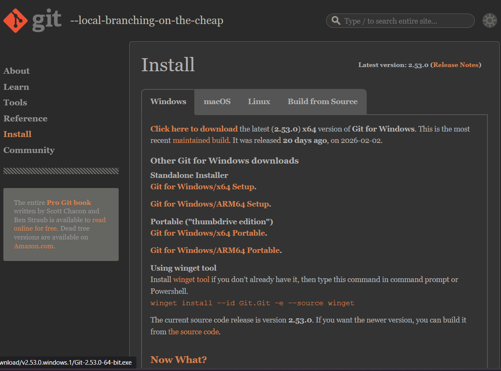
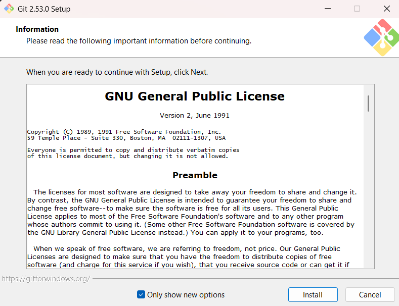
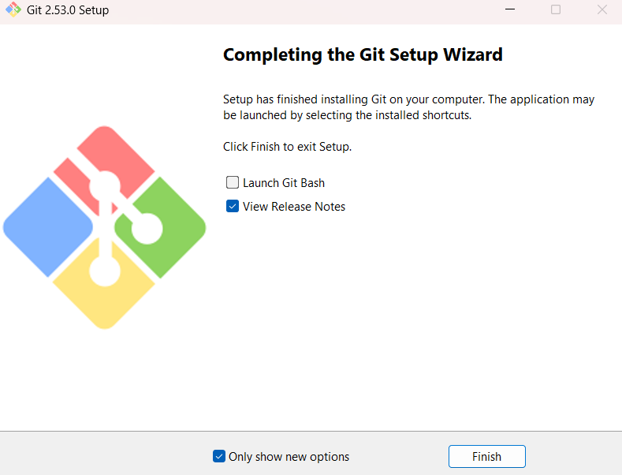
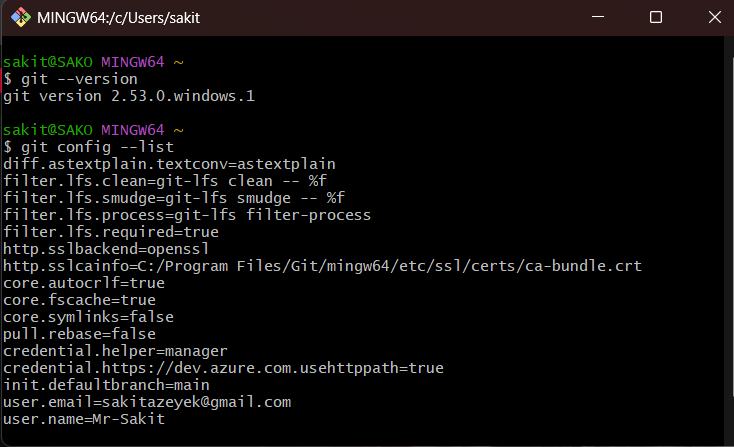

# Git Installation
 
 ### 1. Visit the offical Git website to downlaod
 
 

### 2. I choose "Git for Windows/x64 Setup" 

### 3. After downloading the setup file , click on it to the installation

### 4. This screenshot shows the completion of the setup process

### 5. We can verify the installation using the "git --version" command and "git config --list" shows us our credentials.

