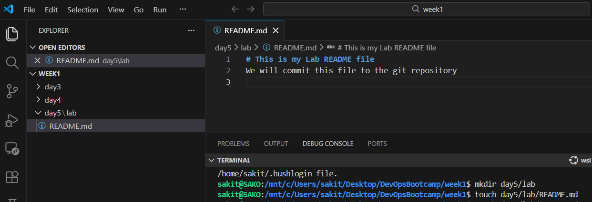
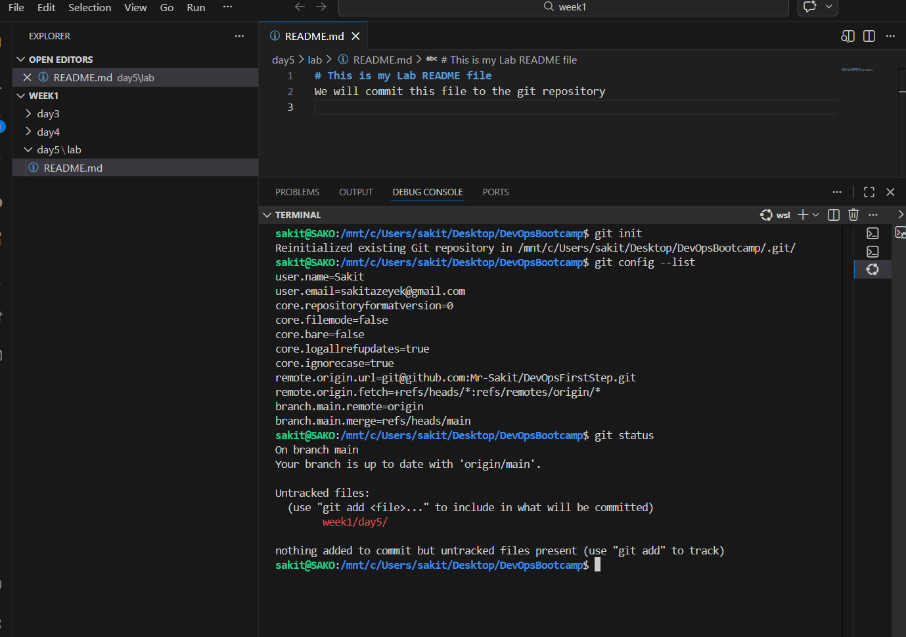
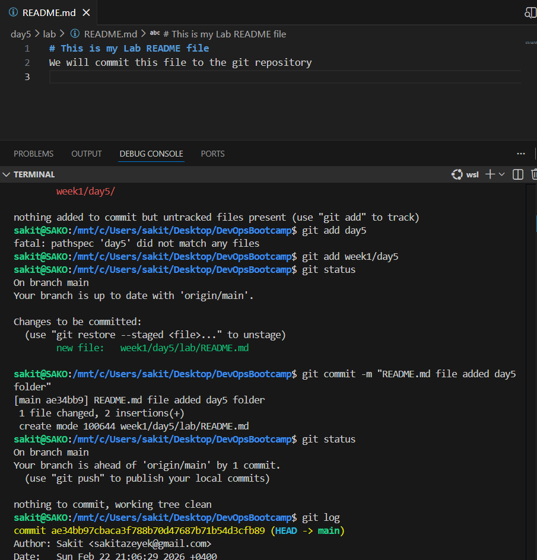

# This is my Lab README file
We will commit this file to the git repository

# Lab's tasks

## _1._

 I created a day5/lab folder and a README.md file inside it._

## _2._
I added it to the repository with `git init`. Since I had previously added the directory to git, it "already exists"_

We can view Git Global configurations with `git config --list`

We can get information about the current status of files and directories with `git status`.

## _3._

We can add the unadded directory (week1/day5) with `git add`

`git status` green color indicates that the directory and files have been added to the local repository.

We can register the local repository with `git commit -m`.

`git log` We can get detailed information about the commits made

**`git push origin main`**- We use this command to upload from Local to Global