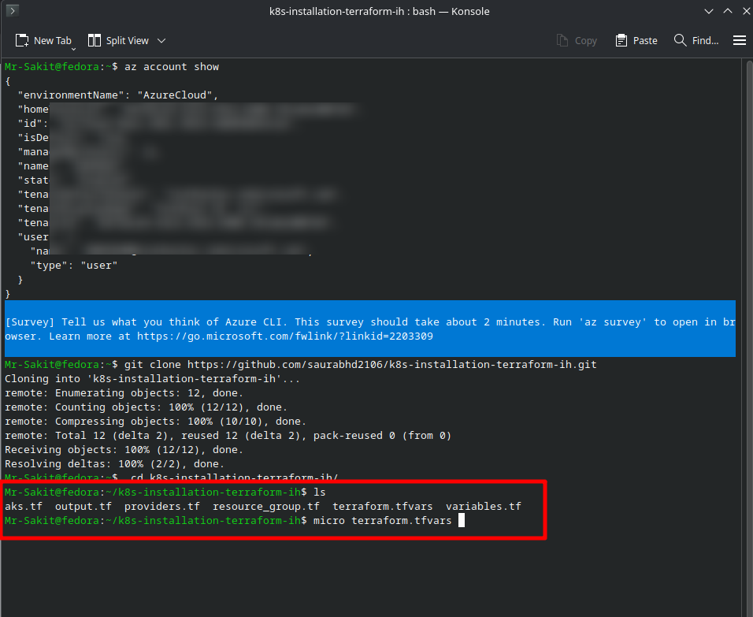
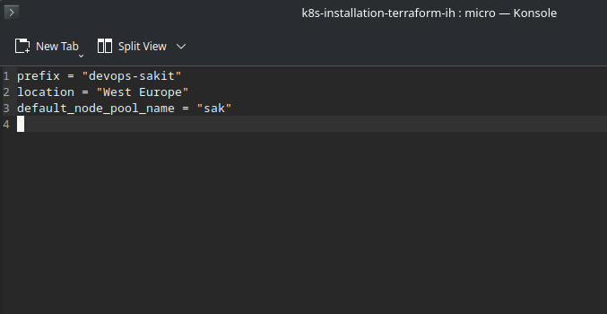
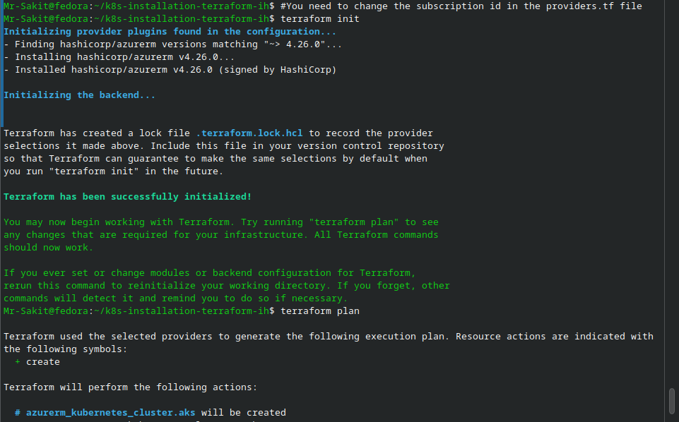
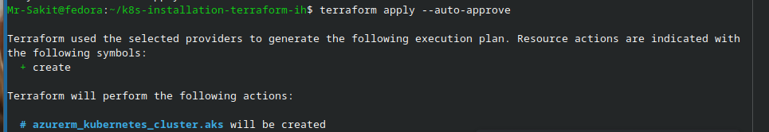
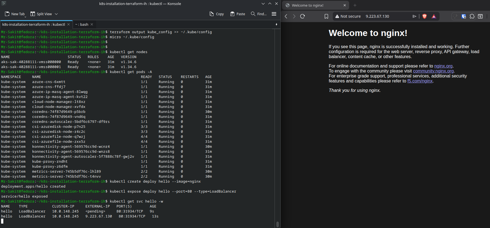

# Provision an AKS (Azure Kubernetes Service) Cluster with Terraform

## 📋 Overview

This lab walks through provisioning a **production-ready (but minimal) AKS cluster** on Azure using Terraform. The workflow covers Azure CLI authentication, cloning a pre-built Terraform repository, customizing variables, deploying the cluster, configuring `kubeconfig`, and validating the running cluster by deploying an NGINX test workload.

> [!NOTE]
> AKS is Azure's managed Kubernetes offering. Terraform lets you define the cluster as code — repeatable, version-controlled, and teardown-safe. A **system-assigned managed identity** is used instead of a service principal, simplifying credential management.

---

## 🎯 Objectives

- Authenticate Terraform to Azure via Azure CLI
- Model an AKS cluster declaratively with Terraform
- Customize cluster parameters through `terraform.tfvars`
- Generate and configure `kubeconfig` for cluster access
- Validate cluster health and deploy a test workload
- Cleanly destroy the environment after validation

---

## 🔧 Prerequisites

| Requirement | Details |
|---|---|
| **Terraform** | v1.5+ recommended |
| **Azure CLI** | Installed and logged in (`az login`) |
| **kubectl** | Any recent version |
| **Azure Subscription** | With Contributor/Owner permissions to create resources |

---

## 📝 Lab Steps

### Step 1: Authenticate to Azure

Verify your Azure CLI session and subscription:

```bash
az account show
```



Terraform re-uses your Azure CLI credentials automatically — no service principal is needed for this lab.

> [!TIP]
> If you're logged into multiple subscriptions, use `az account set --subscription <ID>` to target the correct one before running Terraform.

---

### Step 2: Clone the Code Repository

Clone the pre-built Terraform configuration:

```bash
git clone https://github.com/saurabhd2106/k8s-installation-terraform-ih.git
cd k8s-installation-terraform-ih
```

The repository contains the following Terraform files:

```
k8s-installation-terraform-ih/
├── aks.tf               ← AKS cluster resource definition
├── output.tf            ← Output values (kubeconfig, etc.)
├── providers.tf         ← Azure provider configuration
├── resource_group.tf    ← Resource group definition
├── terraform.tfvars     ← Variable values to customize
└── variables.tf         ← Variable declarations
```

---

### Step 3: Update Variables

Edit `terraform.tfvars` to customize the deployment:

```hcl
prefix             = "devops-sakit"
location           = "West Europe"
default_node_pool_name = "sak"
```



> [!IMPORTANT]
> You also need to update the **subscription ID** in the `providers.tf` file to match your Azure subscription.

---

### Step 4: Initialize and Apply

Initialize Terraform to download the Azure provider:

```bash
terraform init
```

Review the execution plan:

```bash
terraform plan
```



Apply the configuration to provision the AKS cluster:

```bash
terraform apply --auto-approve
```



> [!NOTE]
> AKS cluster provisioning typically takes **8–12 minutes**. Terraform will show progress as Azure creates the control plane and node pool.

---

### Step 5: Configure kubeconfig

Extract the kubeconfig from Terraform output and write it to `~/.kube/config`:

```bash
terraform output kube_config >> ~/.kube/config
```

Open the file and **remove** the `<<EOT` and `EOT` markers from the first and last lines:

```bash
micro ~/.kube/config
```

Verify cluster access:

```bash
kubectl get nodes
```

---

### Step 6: Validate the Cluster

Check node status and system pods:

```bash
kubectl get nodes
kubectl get pods -A
```

Deploy a test NGINX workload and expose it via a LoadBalancer:

```bash
kubectl create deploy hello --image=nginx
kubectl expose deploy hello --port=80 --type=LoadBalancer
kubectl get svc hello -w
```



The `hello` service received external IP **9.223.67.130**, and the NGINX welcome page was successfully accessible in the browser.

---

## 🏗️ Architecture

```
┌─────────────────────────────────────────────────────────────────┐
│                     Local Machine (Fedora)                      │
│                                                                 │
│  k8s-installation-terraform-ih/                                 │
│  ├── aks.tf / providers.tf / variables.tf / ...                │
│  └── terraform.tfvars  ← prefix, location, pool name           │
│              │                                                  │
│         terraform apply                                         │
│              │                                                  │
│              ▼                                                  │
│  ┌─────────────────────────────────────────────────────┐       │
│  │              Azure (West Europe)                     │       │
│  │                                                      │       │
│  │  ┌──────────────────────────────────────────┐       │       │
│  │  │     AKS Cluster (devops-sakit)           │       │       │
│  │  │                                          │       │       │
│  │  │  ┌──────────────┐  ┌──────────────┐     │       │       │
│  │  │  │  Node 1       │  │  Node 2       │     │       │       │
│  │  │  │  vmss000000   │  │  vmss000001   │     │       │       │
│  │  │  │  Ready ✅     │  │  Ready ✅     │     │       │       │
│  │  │  └──────────────┘  └──────────────┘     │       │       │
│  │  │                                          │       │       │
│  │  │  hello deploy → LoadBalancer             │       │       │
│  │  │  External IP: 9.223.67.130 ✅            │       │       │
│  │  └──────────────────────────────────────────┘       │       │
│  └─────────────────────────────────────────────────────┘       │
└─────────────────────────────────────────────────────────────────┘
```

---

## 🔥 Troubleshooting

| Issue | Solution |
|---|---|
| **Authorization failed / insufficient privileges** | Verify correct subscription: `az account show`. Ensure Contributor/Owner role. |
| **Provider version errors** | Run `terraform init -upgrade` |
| **No external IP on LoadBalancer** | Wait a few minutes; check `kubectl describe svc hello` for events |
| **kubectl can't connect** | Verify `KUBECONFIG` path; check `kubectl config get-contexts` |
| **EOT markers in kubeconfig** | Manually remove `<<EOT` and `EOT` from `~/.kube/config` |

---

## 📊 Summary

| Task | Command / Action | Status |
|---|---|---|
| Authenticate to Azure | `az account show` | ✅ |
| Clone Terraform repo | `git clone` k8s-installation-terraform-ih | ✅ |
| Customize variables | Edit `terraform.tfvars` (prefix, location, pool name) | ✅ |
| Initialize Terraform | `terraform init` → azurerm v4.26.0 | ✅ |
| Provision AKS cluster | `terraform apply --auto-approve` | ✅ |
| Configure kubeconfig | `terraform output kube_config >> ~/.kube/config` | ✅ |
| Validate nodes | `kubectl get nodes` → 2 nodes Ready | ✅ |
| Test workload | `kubectl create deploy hello` → NGINX accessible at external IP | ✅ |

---

## 💡 Key Takeaways

1. **Terraform + AKS = Infrastructure as Code** — the entire cluster is defined declaratively, making it reproducible and version-controlled
2. **Azure CLI auth is sufficient for labs** — no service principal setup needed when Terraform can inherit CLI credentials
3. **`terraform.tfvars` centralizes customization** — prefix, location, and pool settings are cleanly separated from resource definitions
4. **kubeconfig requires post-processing** — Terraform outputs the config with `<<EOT` / `EOT` markers that must be removed manually
5. **System pods validate cluster health** — `kubectl get pods -A` shows all control plane components (CoreDNS, kube-proxy, metrics-server, etc.) running
6. **LoadBalancer services get Azure public IPs** — AKS integrates with Azure Load Balancer automatically, providing external access to services
7. **Always `terraform destroy` after labs** — AKS clusters incur costs; clean up when done
