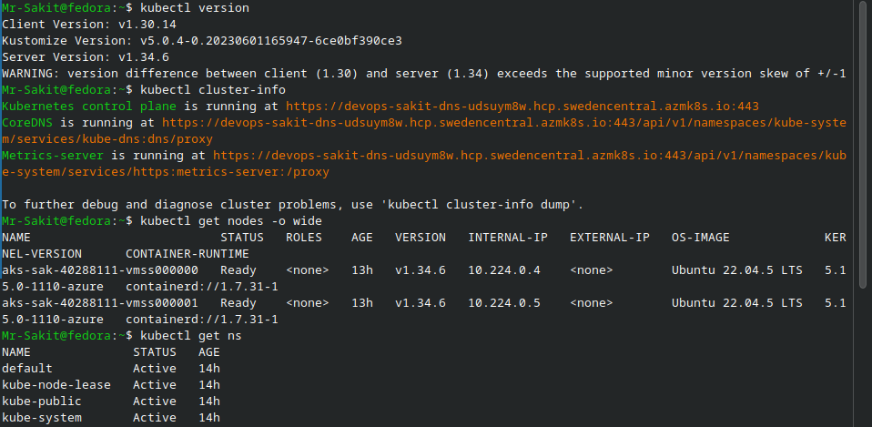
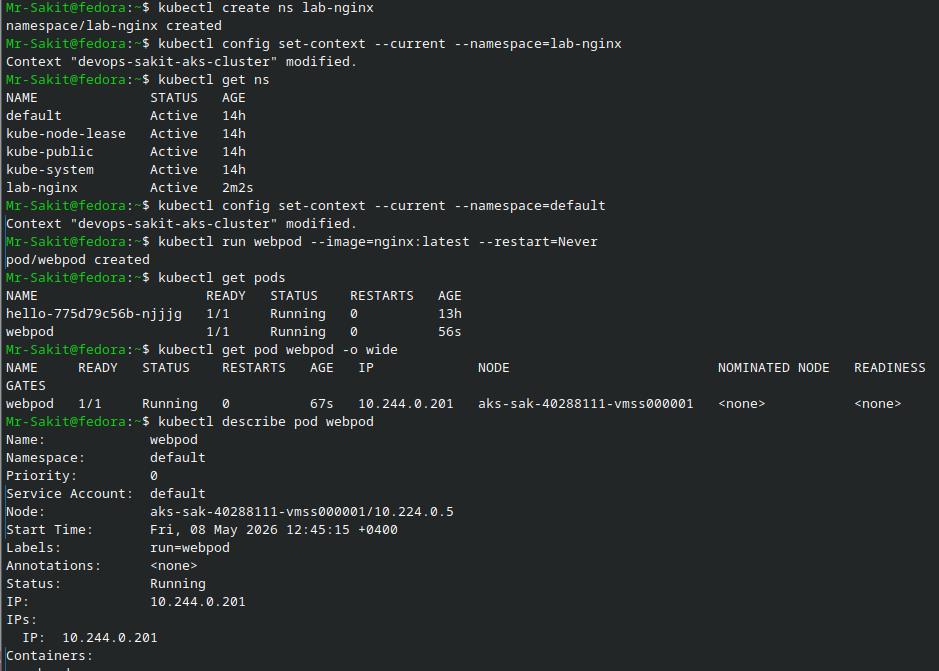
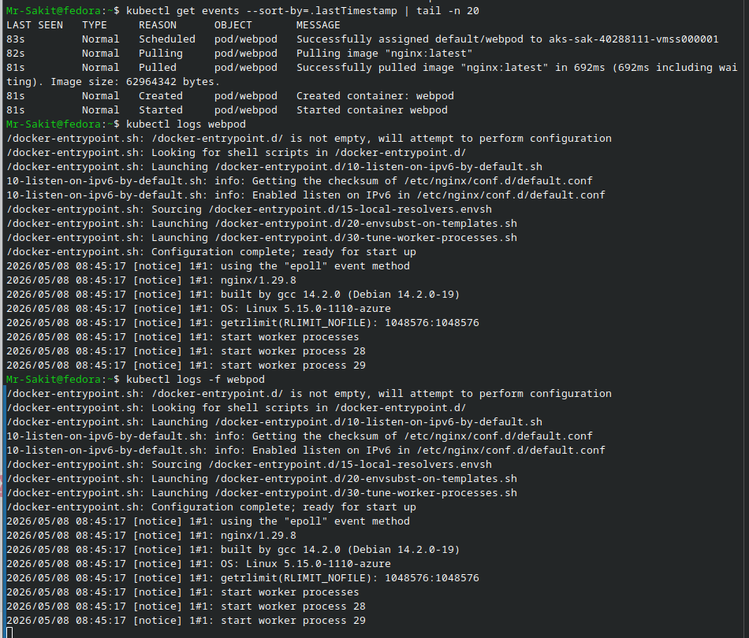
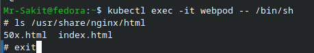
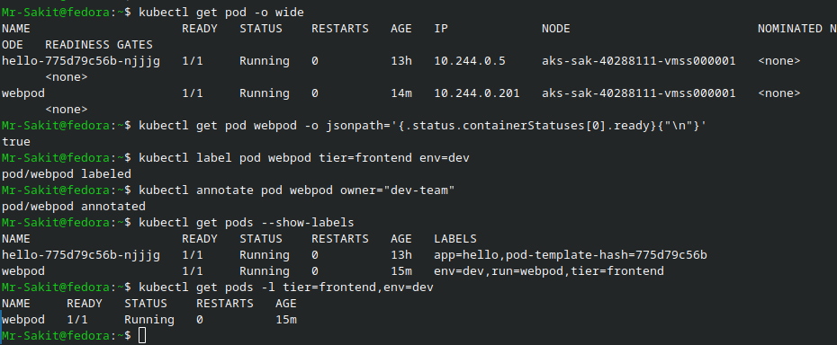
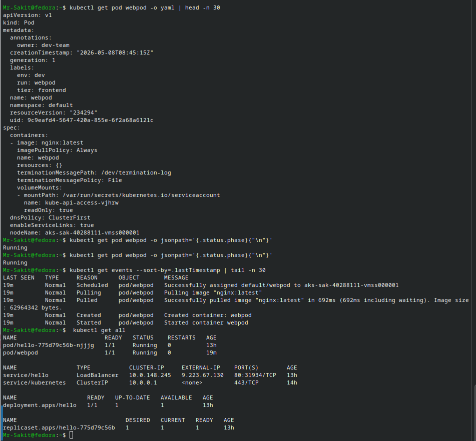

# Get Hands-On with kubectl and Launch Your First Pod

## 📋 Overview

This lab covers essential `kubectl` commands for interacting with a Kubernetes cluster. Starting from cluster health checks, the lab progresses through creating namespaces, launching a standalone NGINX Pod, inspecting logs, executing into containers, and using power features like labels, annotations, JSONPath queries, and raw YAML output.

> [!NOTE]
> `kubectl` is the primary CLI tool for Kubernetes. Every operation — from deploying applications to debugging failures — flows through it. Mastering these commands is foundational for any Kubernetes workflow.

---

## 🎯 Objectives

- Verify cluster health and explore nodes, namespaces, and resources
- Create and switch between **namespaces** for workload isolation
- Create, inspect, and manage a **Pod** using the NGINX container image
- View logs and exec into running containers
- Use **labels**, **annotations**, and **JSONPath** for advanced resource management
- Extract raw YAML/JSON output for scripting and debugging

---

## 🔧 Prerequisites

| Requirement | Details |
|---|---|
| **Kubernetes Cluster** | A running cluster (AKS, minikube, kind, k3s, or Docker Desktop) |
| **kubectl** | Installed and pointed to your cluster's kubeconfig |
| **Cluster Access** | At least one `Ready` node visible via `kubectl get nodes` |

---

## 📝 Lab Steps

### Section A: Quick Cluster Health Check

Verify the cluster is operational:

```bash
kubectl version
kubectl cluster-info
kubectl get nodes -o wide
kubectl get ns
```



| Component | Details |
|---|---|
| **Client Version** | v1.30.14 |
| **Server Version** | v1.34.6 |
| **Nodes** | 2× `aks-sak-40288111-vmss*` — both `Ready` |
| **OS** | Ubuntu 22.04.5 LTS |
| **Container Runtime** | containerd://1.7.31-1 |

> [!TIP]
> If you see a version skew warning between client and server, it's generally safe as long as the difference is within ±1 minor version. Update kubectl if the gap is larger.

---

### Section B: Create a Playground Namespace

Isolate lab resources in a dedicated namespace:

```bash
kubectl create ns lab-nginx
kubectl config set-context --current --namespace=lab-nginx
kubectl get ns
```

- `kubectl create ns lab-nginx` — Creates a new namespace
- `kubectl config set-context --current --namespace=lab-nginx` — Sets the default namespace for your current context

Switch back to default when needed:

```bash
kubectl config set-context --current --namespace=default
```



> [!TIP]
> Check your active namespace anytime: `kubectl config view --minify -o jsonpath='{..namespace}{"\n"}'`

---

### Section C: Create Your First Pod (NGINX)

Launch a standalone NGINX Pod:

```bash
kubectl run webpod --image=nginx:latest --restart=Never
```

The `--restart=Never` flag creates a **standalone Pod** (no Deployment or ReplicaSet wrapper).

Verify the Pod:

```bash
kubectl get pods
kubectl get pod webpod -o wide
kubectl describe pod webpod
kubectl get events --sort-by=.lastTimestamp | tail -n 20
```


| Field | Value |
|---|---|
| **Pod Name** | webpod |
| **Status** | Running |
| **IP** | 10.244.0.201 |
| **Node** | aks-sak-40288111-vmss000001 |
| **Start Time** | Fri, 08 May 2026 12:45:15 +0400 |

Common Pod statuses to watch for:

| Status | Meaning |
|---|---|
| `ContainerCreating` | Pulling image / setting up |
| `Running` | Pod is ready |
| `ImagePullBackOff` | Check image name or network |

---

### Section D: Logs, Shell Access, and Events

**View Pod logs:**

```bash
kubectl logs webpod
kubectl logs -f webpod
```

- `kubectl logs webpod` — Shows current logs (prints and exits)
- `kubectl logs -f webpod` — Streams logs live (follow mode, Ctrl+C to stop)



> [!NOTE]
> For Pods with multiple containers, add `-c <container-name>` to target a specific container's logs.

**Exec into the container:**

```bash
kubectl exec -it webpod -- /bin/sh
```

```
# ls /usr/share/nginx/html
50x.html  index.html
# exit
```



---

### Section E: Useful kubectl Power Moves

**Wide listing & readiness info:**

```bash
kubectl get pod -o wide
kubectl get pod webpod -o jsonpath='{.status.containerStatuses[0].ready}{"\n"}'
```

**Labels & annotations:**

```bash
kubectl label pod webpod tier=frontend env=dev
kubectl annotate pod webpod owner="dev-team"
kubectl get pods --show-labels
kubectl get pods -l tier=frontend,env=dev
```



**Explain any resource (inline docs):**

```bash
kubectl explain pod
kubectl explain pod.spec.containers
```

> [!TIP]
> Add `--recursive` to see all nested fields: `kubectl explain pod.spec.containers --recursive`

**Raw YAML/JSON output (for scripting):**

```bash
kubectl get pod webpod -o yaml | head -n 30
kubectl get pod webpod -o jsonpath='{.status.phase}{"\n"}'
```

**Events & resource overview:**

```bash
kubectl get events --sort-by=.lastTimestamp | tail -n 30
kubectl get all
```



---

## 🏗️ Architecture

```
┌──────────────────────────────────────────────────────────────────┐
│                  AKS Cluster (devops-sakit)                      │
│                                                                  │
│  Namespaces:                                                     │
│  ├── default        ← webpod runs here                           │
│  ├── lab-nginx      ← playground namespace (created & tested)    │
│  ├── kube-system    ← system pods (CoreDNS, kube-proxy, etc.)    │
│  └── kube-public                                                 │
│                                                                  │
│  ┌──────────────────────┐    ┌──────────────────────┐           │
│  │  Node: vmss000000     │    │  Node: vmss000001     │           │
│  │  Ready ✅             │    │  Ready ✅             │           │
│  │                       │    │                       │           │
│  │  hello-775d79c56b-*   │    │  webpod               │           │
│  │  (from Lab 1)         │    │  nginx:latest          │           │
│  │                       │    │  IP: 10.244.0.201     │           │
│  │                       │    │  Status: Running ✅   │           │
│  └──────────────────────┘    └──────────────────────┘           │
└──────────────────────────────────────────────────────────────────┘
```

---

## 📊 Summary

| Task | Command / Action | Status |
|---|---|---|
| Cluster health check | `kubectl version`, `cluster-info`, `get nodes` | ✅ |
| Create namespace | `kubectl create ns lab-nginx` | ✅ |
| Switch namespace | `kubectl config set-context --current --namespace=...` | ✅ |
| Create NGINX Pod | `kubectl run webpod --image=nginx:latest --restart=Never` | ✅ |
| Inspect Pod | `get pods`, `describe pod`, `get events` | ✅ |
| View logs | `kubectl logs webpod` / `kubectl logs -f webpod` | ✅ |
| Exec into container | `kubectl exec -it webpod -- /bin/sh` | ✅ |
| Labels & annotations | `label pod`, `annotate pod`, `--show-labels` | ✅ |
| JSONPath queries | Readiness check, phase extraction | ✅ |
| Raw YAML output | `kubectl get pod webpod -o yaml` | ✅ |
| Resource overview | `kubectl get all` — pods, services, deployments, replicasets | ✅ |

---

## 📚 kubectl Quick Reference

| Command | Purpose |
|---|---|
| `kubectl get pods -o wide` | List pods with node, IP, and image details |
| `kubectl describe pod <name>` | Full human-readable report with events |
| `kubectl logs <pod>` | View container logs |
| `kubectl logs -f <pod>` | Stream logs in real time |
| `kubectl exec -it <pod> -- /bin/sh` | Open interactive shell in container |
| `kubectl label pod <pod> key=value` | Add/update labels |
| `kubectl annotate pod <pod> key=value` | Add/update annotations |
| `kubectl get pods -l key=value` | Filter pods by label selector |
| `kubectl explain <resource>` | View API docs for any resource |
| `kubectl get <resource> -o yaml` | Output resource as YAML |
| `kubectl get <resource> -o jsonpath='{...}'` | Extract specific fields |

---

## 💡 Key Takeaways

1. **Namespaces provide isolation** — use them to organize workloads per team, environment, or lab exercise
2. **`--restart=Never` creates standalone Pods** — useful for testing, but production workloads should use Deployments for self-healing
3. **`kubectl describe` is your debugging superpower** — events at the bottom reveal scheduling, pulling, and startup issues
4. **Labels are for selection, annotations are for metadata** — labels power `kubectl get -l` filtering and service selectors; annotations store arbitrary info
5. **JSONPath extracts specific fields** — far more scriptable than parsing `kubectl get` table output
6. **`kubectl explain` replaces Googling** — instant inline docs for any resource field, right from your terminal
7. **`kubectl get all` gives a cluster snapshot** — shows pods, services, deployments, and replicasets in one view
