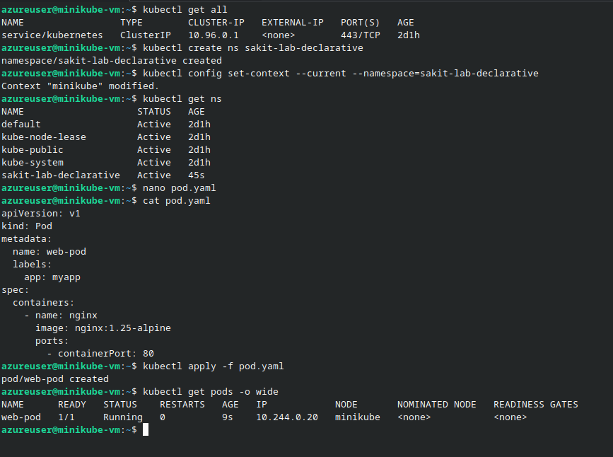
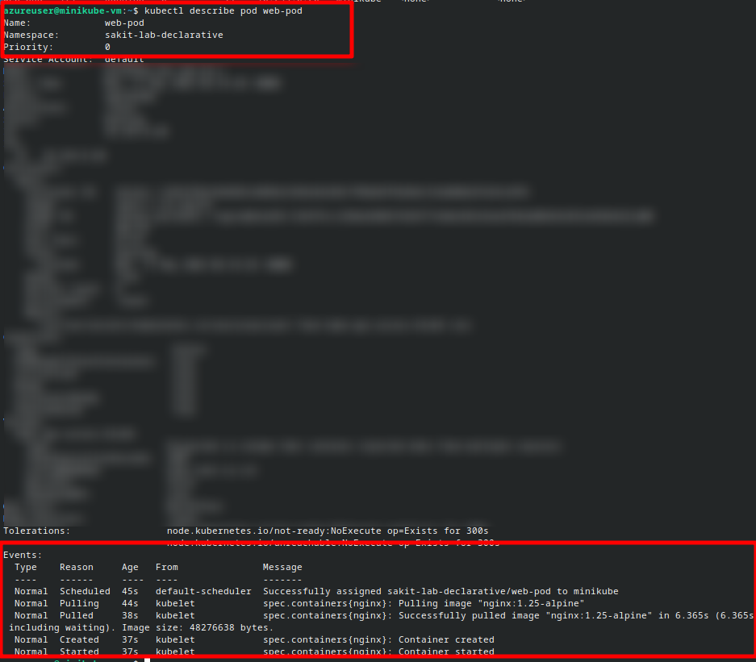
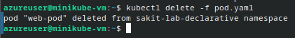
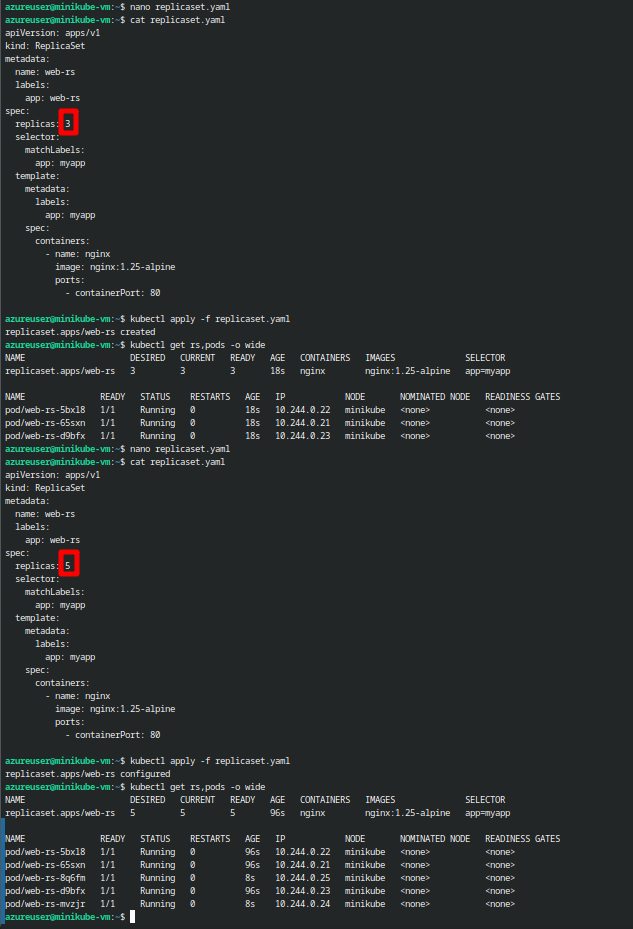
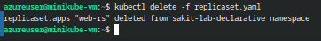
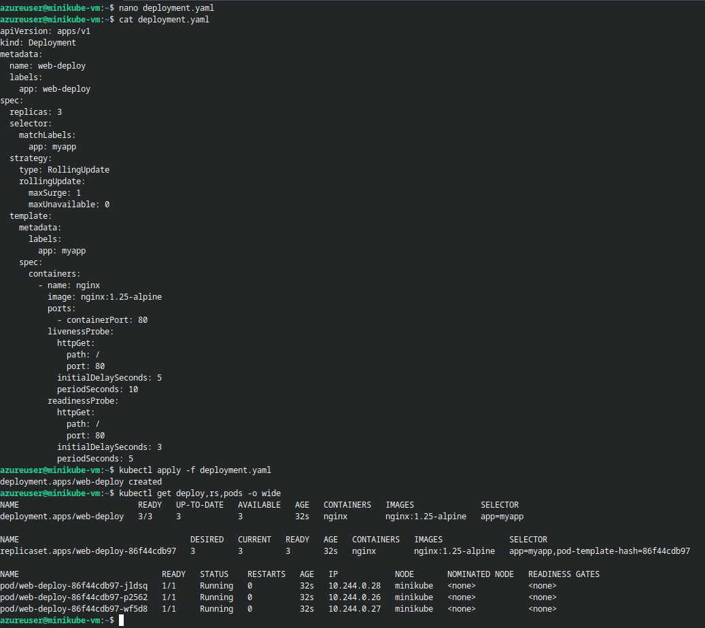
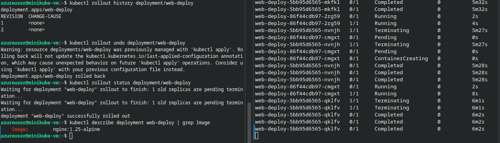
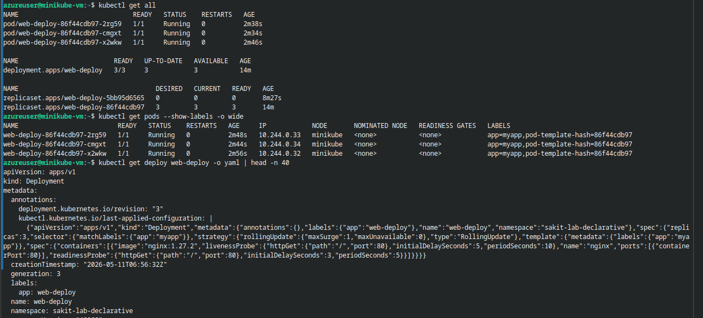
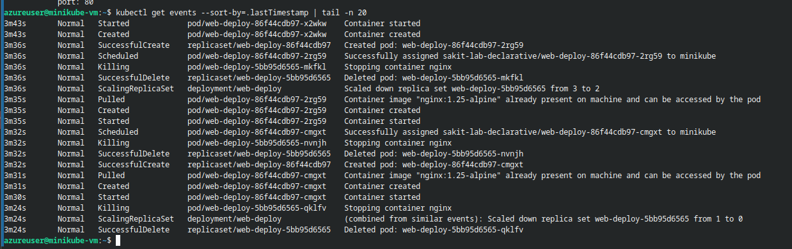
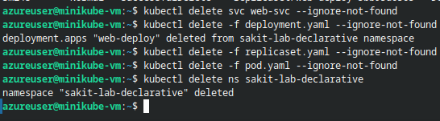

# Declarative Kubernetes: Pods → ReplicaSets → Deployments

## 📋 Overview

This lab progresses through the Kubernetes workload hierarchy — from raw **Pods** to **ReplicaSets** to **Deployments** — using declarative YAML manifests. Each level adds a layer of reliability: Pods run containers, ReplicaSets keep a desired number of Pods alive, and Deployments orchestrate rolling updates and rollbacks on top of ReplicaSets.

> [!NOTE]
> In production, you almost never create Pods or ReplicaSets directly. **Deployments** are the standard controller — they manage ReplicaSets, which in turn manage Pods. This lab builds up from the bottom so you understand *why* each layer exists.

---

## 🎯 Objectives

- Define and apply **Pod**, **ReplicaSet**, and **Deployment** manifests declaratively
- Scale replicas by editing YAML and re-applying
- Perform a **rolling update** and observe the rollout progression
- Execute a **rollback** to a previous revision
- Practice common `kubectl` commands for inspection and troubleshooting

---

## 🔧 Prerequisites

| Requirement | Details |
|---|---|
| **Kubernetes Cluster** | A running cluster (minikube, kind, k3s, AKS, etc.) |
| **kubectl** | Installed and pointed at your cluster |
| **Cluster Access** | At least one `Ready` node |

---

## 📝 Lab Steps

### Step 0: Create a Tidy Playground

Isolate all lab resources in a dedicated namespace:

```bash
kubectl create ns sakit-lab-declarative
kubectl config set-context --current --namespace=sakit-lab-declarative
kubectl get ns
```



---

### Step 1: Pod (YAML-First)

Create `pod.yaml`:

```yaml
apiVersion: v1
kind: Pod
metadata:
  name: web-pod
  labels:
    app: myapp
spec:
  containers:
    - name: nginx
      image: nginx:1.25-alpine
      ports:
        - containerPort: 80
```

Apply and verify:

```bash
kubectl apply -f pod.yaml
kubectl get pods -o wide
```


Inspect the Pod in detail:

```bash
kubectl describe pod web-pod
```



Clean up the Pod before moving to higher-level controllers:

```bash
kubectl delete -f pod.yaml
```



> [!IMPORTANT]
> A standalone Pod has **no self-healing**. If it crashes or is deleted, nothing recreates it. That's why we need ReplicaSets and Deployments.

---

### Step 2: ReplicaSet (Keeps Pods Alive)

Create `replicaset.yaml`:

```yaml
apiVersion: apps/v1
kind: ReplicaSet
metadata:
  name: web-rs
  labels:
    app: web-rs
spec:
  replicas: 3
  selector:
    matchLabels:
      app: myapp
  template:
    metadata:
      labels:
        app: myapp
    spec:
      containers:
        - name: nginx
          image: nginx:1.25-alpine
          ports:
            - containerPort: 80
```

Apply and explore:

```bash
kubectl apply -f replicaset.yaml
kubectl get rs,pods -o wide
```

The ReplicaSet creates 3 Pod replicas automatically:

| Pod | Ready | Status | IP |
|---|---|---|---|
| web-rs-5bx18 | 1/1 | Running | 10.244.0.22 |
| web-rs-65sxn | 1/1 | Running | 10.244.0.21 |
| web-rs-d9bfx | 1/1 | Running | 10.244.0.23 |

**Scale declaratively** — edit `replicas: 3` → `replicas: 5` in the YAML and re-apply:

```bash
nano replicaset.yaml   # change replicas: 3 → 5
kubectl apply -f replicaset.yaml
kubectl get rs,pods -o wide
```



Tear down the ReplicaSet and its Pods:

```bash
kubectl delete -f replicaset.yaml
```



> [!NOTE]
> ReplicaSets ensure the **desired count** of Pods is always running. If a Pod dies, the ReplicaSet creates a new one. However, ReplicaSets **don't support rolling updates** — that's where Deployments come in.

---

### Step 3: Deployment (The Real-World Way)

Create `deployment.yaml`:

```yaml
apiVersion: apps/v1
kind: Deployment
metadata:
  name: web-deploy
  labels:
    app: web-deploy
spec:
  replicas: 3
  selector:
    matchLabels:
      app: myapp
  strategy:
    type: RollingUpdate
    rollingUpdate:
      maxSurge: 1
      maxUnavailable: 0
  template:
    metadata:
      labels:
        app: myapp
    spec:
      containers:
        - name: nginx
          image: nginx:1.25-alpine
          ports:
            - containerPort: 80
          livenessProbe:
            httpGet:
              path: /
              port: 80
            initialDelaySeconds: 5
            periodSeconds: 10
          readinessProbe:
            httpGet:
              path: /
              port: 80
            initialDelaySeconds: 3
            periodSeconds: 5
```

Apply and verify the full hierarchy:

```bash
kubectl apply -f deployment.yaml
kubectl get deploy,rs,pods -o wide
```



The Deployment creates a ReplicaSet (`web-deploy-86f44cdb97`), which in turn creates 3 Pods — all running on the minikube node.

> [!TIP]
> The `strategy` block controls how updates happen:
> - `maxSurge: 1` — allow 1 extra Pod during updates
> - `maxUnavailable: 0` — never have fewer than `replicas` running Pods

---

### Step 4: Rolling Update (Declarative Change)

Update `deployment.yaml` to use a newer image — change `nginx:1.25-alpine` → `nginx:1.27.2`:

```yaml
      containers:
        - name: nginx
          image: nginx:1.27.2    # was nginx:1.25-alpine
```

Apply and watch the rollout in real time:

```bash
kubectl apply -f deployment.yaml
kubectl get pods -w
kubectl get deploy,rs,pods -o wide
```


The rolling update creates a **new ReplicaSet** (`web-deploy-5bb95d6565`) and gradually shifts traffic:

| ReplicaSet | Image | Desired | Ready |
|---|---|---|---|
| web-deploy-5bb95d6565 (new) | nginx:1.27.2 | scaling up | 0→3 |
| web-deploy-86f44cdb97 (old) | nginx:1.25-alpine | scaling down | 3→0 |

---

### Step 5: History & Rollback

Check rollout history:

```bash
kubectl rollout history deployment/web-deploy
```

```
REVISION  CHANGE-CAUSE
1         <none>
2         <none>
```

Rollback to the previous revision:

```bash
kubectl rollout undo deployment/web-deploy
kubectl rollout status deployment/web-deploy
```



Verify the rollback restored the original image:

```bash
kubectl describe deployment web-deploy | grep Image
```

```
Image:      nginx:1.25-alpine
```

The deployment is back to `nginx:1.25-alpine` ✅

---

### Step 6: Inspect the Final State

View all resources, labels, and events:

```bash
kubectl get all
kubectl get pods --show-labels -o wide
kubectl get deploy web-deploy -o yaml | head -n 40
kubectl get events --sort-by=.lastTimestamp | tail -n 20
```





---

### Step 7: Cleanup

Remove all lab resources:

```bash
kubectl delete svc web-svc --ignore-not-found
kubectl delete -f deployment.yaml --ignore-not-found
kubectl delete -f replicaset.yaml --ignore-not-found
kubectl delete -f pod.yaml --ignore-not-found
kubectl delete ns sakit-lab-declarative
```



---

## 🏗️ Architecture

```
┌──────────────────────────────────────────────────────────────────┐
│                    Kubernetes Cluster (minikube)                  │
│                                                                  │
│  Namespace: sakit-lab-declarative                                │
│                                                                  │
│  ┌────────────────────────────────────────────────────────┐     │
│  │  Deployment: web-deploy                                 │     │
│  │  strategy: RollingUpdate (maxSurge:1, maxUnavail:0)    │     │
│  │                                                         │     │
│  │  ┌──────────────────────────────────────────────┐      │     │
│  │  │  ReplicaSet: web-deploy-86f44cdb97            │      │     │
│  │  │  image: nginx:1.25-alpine  |  replicas: 3     │      │     │
│  │  │                                                │      │     │
│  │  │  ┌──────────┐ ┌──────────┐ ┌──────────┐      │      │     │
│  │  │  │  Pod 1    │ │  Pod 2    │ │  Pod 3    │      │      │     │
│  │  │  │  Running  │ │  Running  │ │  Running  │      │      │     │
│  │  │  │  ✅       │ │  ✅       │ │  ✅       │      │      │     │
│  │  │  └──────────┘ └──────────┘ └──────────┘      │      │     │
│  │  └──────────────────────────────────────────────┘      │     │
│  └────────────────────────────────────────────────────────┘     │
│                                                                  │
│  Workload Hierarchy:                                             │
│  Pod (no self-heal) → ReplicaSet (replica count) → Deployment   │
│                                            (rolling updates +    │
│                                             rollback)            │
└──────────────────────────────────────────────────────────────────┘
```

---

## 🔥 Troubleshooting

| Issue | Solution |
|---|---|
| **Rollout stuck** | `kubectl describe deploy web-deploy` — check Events; ensure readiness probe succeeds |
| **Service has no endpoints** | Verify Pods are Ready and labels match selector: `kubectl get pods --show-labels` |
| **ImagePullBackOff** | Check image tag and network egress |
| **Pods in CrashLoopBackOff** | Check `kubectl logs <pod>` for application errors |
| **Rollback not working** | Verify revision history: `kubectl rollout history deployment/<name>` |

---

## 📊 Summary

| Task | Command / Action | Status |
|---|---|---|
| Create namespace | `kubectl create ns sakit-lab-declarative` | ✅ |
| Deploy Pod (YAML) | `kubectl apply -f pod.yaml` → web-pod Running | ✅ |
| Delete standalone Pod | `kubectl delete -f pod.yaml` | ✅ |
| Deploy ReplicaSet | `kubectl apply -f replicaset.yaml` → 3 replicas | ✅ |
| Scale ReplicaSet | Edit `replicas: 3 → 5`, re-apply → 5 pods | ✅ |
| Deploy Deployment | `kubectl apply -f deployment.yaml` → 3 pods with probes | ✅ |
| Rolling update | Change image `1.25-alpine → 1.27.2`, apply | ✅ |
| Watch rollout | `kubectl get pods -w` — gradual pod replacement | ✅ |
| Rollback | `kubectl rollout undo` → back to `nginx:1.25-alpine` | ✅ |
| Cleanup | Delete all resources and namespace | ✅ |

---

## 📚 Common kubectl Commands Reference

| Command | Purpose |
|---|---|
| `kubectl apply -f <file>` | Create or update resources from YAML |
| `kubectl delete -f <file>` | Delete resources defined in YAML |
| `kubectl get deploy,rs,pods -o wide` | View full workload hierarchy |
| `kubectl rollout status deployment/<name>` | Watch rollout progress |
| `kubectl rollout history deployment/<name>` | View revision history |
| `kubectl rollout undo deployment/<name>` | Rollback to previous revision |
| `kubectl describe deploy <name>` | Detailed deployment info with events |
| `kubectl get events --sort-by=.lastTimestamp` | View recent cluster events |

---

## 💡 Key Takeaways

1. **Pod → ReplicaSet → Deployment** is the workload hierarchy — each layer adds reliability on top of the previous one
2. **Pods alone have no self-healing** — if a Pod dies, nothing recreates it. ReplicaSets fix this.
3. **ReplicaSets maintain replica count** but don't support rolling updates — Deployments add that capability
4. **Deployments are the standard for production** — they manage ReplicaSets and provide rolling updates + rollback
5. **`RollingUpdate` strategy is the default** — `maxSurge` and `maxUnavailable` control the update pace
6. **Liveness and readiness probes are critical** — they prevent traffic from reaching unhealthy containers and auto-restart failed ones
7. **Declarative is better than imperative** — editing YAML and running `kubectl apply` is reproducible, version-controllable, and auditable
8. **Rollbacks are instant** — `kubectl rollout undo` reverts to the previous ReplicaSet, which Kubernetes keeps around by default
9. **Always use namespaces for isolation** — keeps lab resources separate and makes cleanup easy with `kubectl delete ns`
