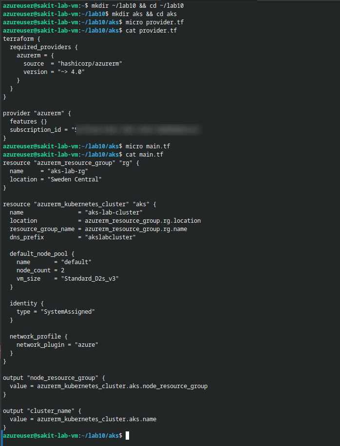
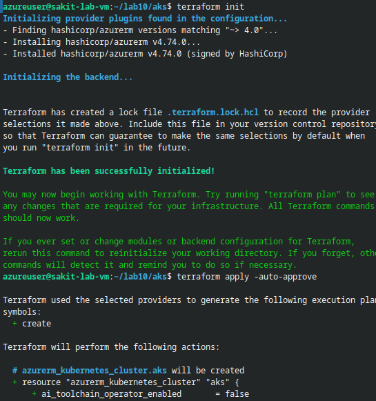
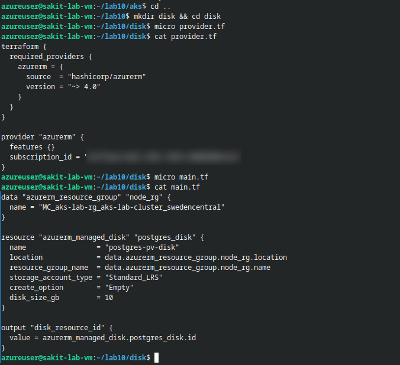
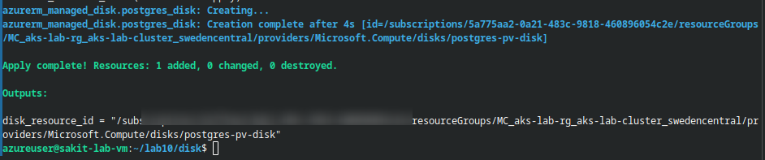
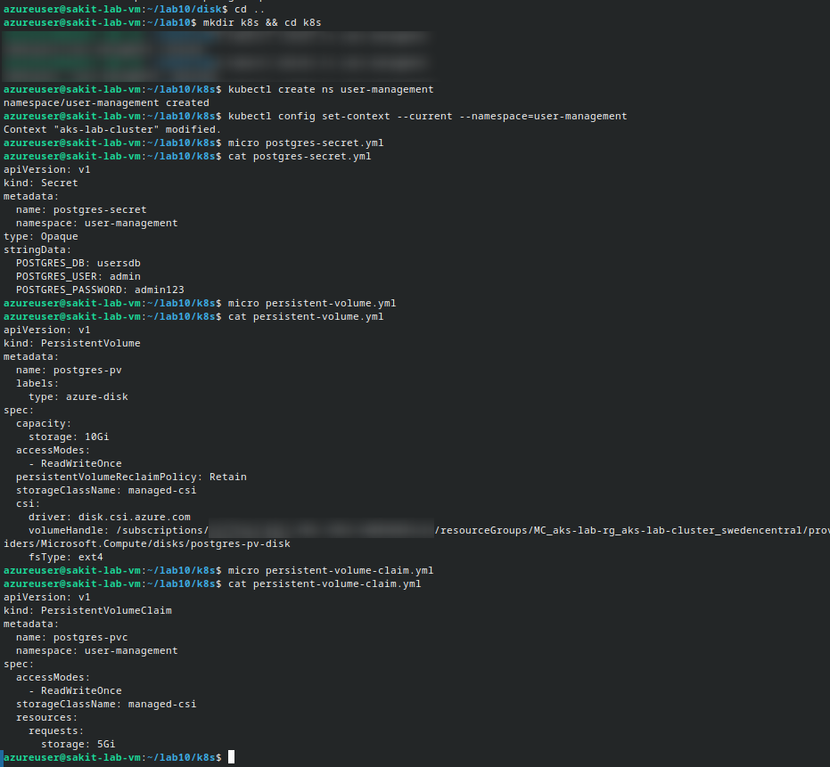
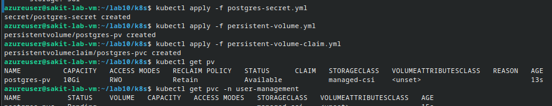
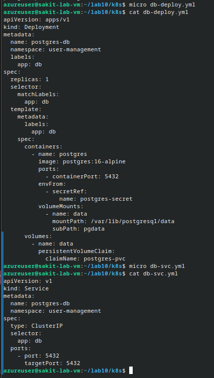
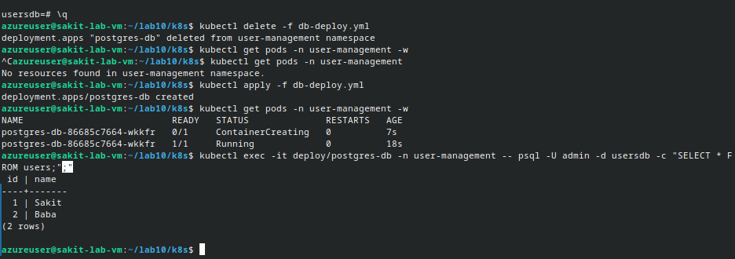

# Persist Your Data with PV & PVC on AKS

## 📋 Overview

This lab attaches **persistent storage** to a PostgreSQL database running on AKS. Without persistent storage, every Pod restart wipes the database — a non-starter for any real workload. Here, we provision an **Azure Managed Disk** with Terraform, wire it into Kubernetes through a **PersistentVolume (PV)** and **PersistentVolumeClaim (PVC)**, mount it in the Postgres Deployment, and prove that data survives Pod deletion.

> [!IMPORTANT]
> **Critical requirement:** The Azure Managed Disk **must** be created in the AKS **node resource group** (the auto-generated `MC_...` resource group). Disks created in an external resource group cannot be attached by the AKS CSI driver and will cause `FailedAttachVolume` errors.

---

## 🎯 Objectives

- Provision an **AKS cluster** using Terraform (resource group, cluster, node pool)
- Create an **Azure Managed Disk** in the AKS node resource group (`MC_...`)
- Define a **PersistentVolume (PV)** referencing the disk via the Azure Disk CSI driver
- Bind a **PersistentVolumeClaim (PVC)** to the PV
- Deploy **PostgreSQL** with the PVC mounted for durable data storage
- **Prove persistence** — delete and recreate the database Pod, verify data survives

---

## 🔧 Prerequisites

| Requirement | Details |
|---|---|
| **Azure Subscription** | Active subscription with permissions to create resources |
| **Azure CLI** | Installed and authenticated (`az login`) |
| **Terraform** | v1.0+ installed |
| **kubectl** | Installed and configured |
| **Helm** | Installed (Ingress controller from previous lab) |
| **Previous Lab Resources** | Namespace `user-management`, API + Frontend + Ingress manifests |

---

## 🏗️ Architecture

```
┌───────────────────────────────────────────────────────────────────────────┐
│                         Azure Cloud                                       │
│                                                                           │
│  Resource Group: aks-lab-rg                                               │
│  ┌─────────────────────────────────────────────────────────────────────┐  │
│  │  AKS Cluster: aks-lab-cluster                                       │  │
│  │  Kubernetes v1.34.7  ·  2 nodes (Standard_D2s_v3)                  │  │
│  │                                                                     │  │
│  │  Namespace: user-management                                         │  │
│  │  ┌──────────────────────────────────────────────────────────────┐  │  │
│  │  │                                                              │  │  │
│  │  │  ┌──────────────────┐    ┌─────────────┐    ┌────────────┐ │  │  │
│  │  │  │  Deployment:     │    │  Service:    │    │   PVC:     │ │  │  │
│  │  │  │  postgres-db     │◄───│  postgres-db │    │ postgres-  │ │  │  │
│  │  │  │  (postgres:16)   │    │  ClusterIP   │    │ pvc (5Gi)  │ │  │  │
│  │  │  │                  │    │  :5432       │    └─────┬──────┘ │  │  │
│  │  │  │  volumeMount:    │    └─────────────┘          │        │  │  │
│  │  │  │  /var/lib/        │                             │        │  │  │
│  │  │  │  postgresql/data │─ ─ ─ ─ ─ ─ ─ ─ ─ ─ ─ ─ ─ ─┘        │  │  │
│  │  │  └──────────────────┘                                      │  │  │
│  │  └──────────────────────────────────────────────────────────────┘  │  │
│  └─────────────────────────────────────────────────────────────────────┘  │
│                                                                           │
│  Node Resource Group: MC_aks-lab-rg_aks-lab-cluster_swedencentral        │
│  ┌─────────────────────────────────────────────────────────────────────┐  │
│  │                                                                     │  │
│  │  ┌────────────────────────┐     ┌───────────────────────────────┐  │  │
│  │  │  PV: postgres-pv       │────▶│  Azure Managed Disk:          │  │  │
│  │  │  10Gi · RWO · Retain   │     │  postgres-pv-disk (10 GB)     │  │  │
│  │  │  driver:               │     │  Standard_LRS · ext4          │  │  │
│  │  │  disk.csi.azure.com   │     └───────────────────────────────┘  │  │
│  │  └────────────────────────┘                                        │  │
│  └─────────────────────────────────────────────────────────────────────┘  │
└───────────────────────────────────────────────────────────────────────────┘
```

---

## 📝 Lab Steps

### Step 0: (Optional) Clean Slate in the Namespace

If you have leftover resources from a previous lab, clean them up first:

```bash
# Skip if your namespace is already clean
kubectl delete all --all -n user-management --ignore-not-found
```

Make sure the namespace exists (create if needed):

```bash
kubectl get ns user-management || kubectl create ns user-management
```

---

### Step 1: Provision the AKS Cluster with Terraform

Create a working directory for the AKS Terraform configuration:

```bash
mkdir ~/lab10 && cd ~/lab10
mkdir aks && cd aks
```

#### provider.tf

```hcl
terraform {
  required_providers {
    azurerm = {
      source  = "hashicorp/azurerm"
      version = "~> 4.0"
    }
  }
}

provider "azurerm" {
  features {}
  subscription_id = "<YOUR_SUBSCRIPTION_ID>"
}
```

#### main.tf

```hcl
resource "azurerm_resource_group" "rg" {
  name     = "aks-lab-rg"
  location = "Sweden Central"
}

resource "azurerm_kubernetes_cluster" "aks" {
  name                = "aks-lab-cluster"
  location            = azurerm_resource_group.rg.location
  resource_group_name = azurerm_resource_group.rg.name
  dns_prefix          = "akslabcluster"

  default_node_pool {
    name       = "default"
    node_count = 2
    vm_size    = "Standard_D2s_v3"
  }

  identity {
    type = "SystemAssigned"
  }

  network_profile {
    network_plugin = "azure"
  }
}

output "node_resource_group" {
  value = azurerm_kubernetes_cluster.aks.node_resource_group
}

output "cluster_name" {
  value = azurerm_kubernetes_cluster.aks.name
}
```



Apply the Terraform configuration:

```bash
terraform init
terraform plan
terraform apply -auto-approve
```

After apply completes, note the outputs:

```
cluster_name = "aks-lab-cluster"
node_resource_group = "MC_aks-lab-rg_aks-lab-cluster_swedencentral"
```

Connect kubectl to the new cluster:

```bash
az aks get-credentials --resource-group aks-lab-rg --name aks-lab-cluster
kubectl get nodes
```



> [!NOTE]
> The `node_resource_group` output (`MC_aks-lab-rg_aks-lab-cluster_swedencentral`) is critical — this is where the Managed Disk **must** be created. Copy this value for the next step.

---

### Step 2: Provision an Azure Managed Disk with Terraform

Create a separate Terraform directory for the disk:

```bash
cd ~/lab10
mkdir disk && cd disk
```

> [!CAUTION]
> The disk **must** be created in the AKS node resource group (`MC_...`). If you create it in a different resource group, the AKS CSI driver will **fail to attach** the disk to the node, resulting in `FailedAttachVolume` errors and the Pod will be stuck in `Pending` state forever.

#### provider.tf

```hcl
terraform {
  required_providers {
    azurerm = {
      source  = "hashicorp/azurerm"
      version = "~> 4.0"
    }
  }
}

provider "azurerm" {
  features {}
  subscription_id = "<YOUR_SUBSCRIPTION_ID>"
}
```

#### main.tf

```hcl
data "azurerm_resource_group" "node_rg" {
  name = "MC_aks-lab-rg_aks-lab-cluster_swedencentral"
}

resource "azurerm_managed_disk" "postgres_disk" {
  name                 = "postgres-pv-disk"
  location             = data.azurerm_resource_group.node_rg.location
  resource_group_name  = data.azurerm_resource_group.node_rg.name
  storage_account_type = "Standard_LRS"
  create_option        = "Empty"
  disk_size_gb         = 10
}

output "disk_resource_id" {
  value = azurerm_managed_disk.postgres_disk.id
}
```

> [!TIP]
> Notice we use a `data` source to reference the **existing** `MC_...` resource group rather than creating a new one. This ensures the disk lands in the correct resource group that AKS already has permissions to manage.



Apply:

```bash
terraform init
terraform plan
terraform apply -auto-approve
```

Copy the `disk_resource_id` from the output — you'll paste it into the PV manifest next:

```
disk_resource_id = "/subscriptions/<SUB_ID>/resourceGroups/MC_aks-lab-rg_aks-lab-cluster_swedencentral/providers/Microsoft.Compute/disks/postgres-pv-disk"
```



---

### Step 3: Create Kubernetes Namespace and Secret

Switch to a Kubernetes manifests directory:

```bash
cd ~/lab10
mkdir k8s && cd k8s
```

Create the namespace and set the context:

```bash
kubectl create ns user-management
kubectl config set-context --current --namespace=user-management
```

#### postgres-secret.yml

```yaml
apiVersion: v1
kind: Secret
metadata:
  name: postgres-secret
  namespace: user-management
type: Opaque
stringData:
  POSTGRES_DB: usersdb
  POSTGRES_USER: admin
  POSTGRES_PASSWORD: admin123
```

```bash
kubectl apply -f postgres-secret.yml
```

---

### Step 4: Create the PersistentVolume and PersistentVolumeClaim

We use a **static PV** that references the existing Azure Managed Disk via the Azure Disk CSI driver.

#### persistent-volume.yml

```yaml
apiVersion: v1
kind: PersistentVolume
metadata:
  name: postgres-pv
  labels:
    type: azure-disk
spec:
  capacity:
    storage: 10Gi
  accessModes:
    - ReadWriteOnce
  persistentVolumeReclaimPolicy: Retain
  storageClassName: managed-csi
  csi:
    driver: disk.csi.azure.com
    volumeHandle: /subscriptions/<SUB_ID>/resourceGroups/MC_aks-lab-rg_aks-lab-cluster_swedencentral/providers/Microsoft.Compute/disks/postgres-pv-disk
    fsType: ext4
```

> [!IMPORTANT]
> Replace the `volumeHandle` value with the exact `disk_resource_id` from your Terraform output. This must match character-for-character.

#### persistent-volume-claim.yml

```yaml
apiVersion: v1
kind: PersistentVolumeClaim
metadata:
  name: postgres-pvc
  namespace: user-management
spec:
  accessModes:
    - ReadWriteOnce
  storageClassName: managed-csi
  resources:
    requests:
      storage: 5Gi
```



Apply and verify:

```bash
kubectl apply -f postgres-secret.yml
kubectl apply -f persistent-volume.yml
kubectl apply -f persistent-volume-claim.yml

kubectl get pv
kubectl get pvc -n user-management
```



> [!NOTE]
> The PV will initially show `Available` status. Once the Postgres Pod starts and claims the PVC, both PV and PVC will transition to `Bound` status.

---

### Step 5: Deploy PostgreSQL with the PVC Mount

#### db-deploy.yml

```yaml
apiVersion: apps/v1
kind: Deployment
metadata:
  name: postgres-db
  namespace: user-management
  labels:
    app: db
spec:
  replicas: 1
  selector:
    matchLabels:
      app: db
  template:
    metadata:
      labels:
        app: db
    spec:
      containers:
        - name: postgres
          image: postgres:16-alpine
          ports:
            - containerPort: 5432
          envFrom:
            - secretRef:
                name: postgres-secret
          volumeMounts:
            - name: data
              mountPath: /var/lib/postgresql/data
              subPath: pgdata
      volumes:
        - name: data
          persistentVolumeClaim:
            claimName: postgres-pvc
```

> [!TIP]
> The `subPath: pgdata` is critical. Postgres expects to initialize an empty directory. Without `subPath`, the `lost+found` directory from the ext4 filesystem on the Azure Disk would cause Postgres to refuse to start.

#### db-svc.yml

```yaml
apiVersion: v1
kind: Service
metadata:
  name: postgres-db
  namespace: user-management
spec:
  type: ClusterIP
  selector:
    app: db
  ports:
    - port: 5432
      targetPort: 5432
```



Apply and watch the Pod start:

```bash
kubectl apply -f db-deploy.yml
kubectl apply -f db-svc.yml
kubectl get pods -n user-management -w
```

Wait for the Pod to reach `1/1 Running` status, then verify the PV/PVC binding:

```bash
kubectl get pv
kubectl get pvc -n user-management
```


Both PV and PVC now show **Bound** status ✅

---

### Step 6: Bring Up API, Frontend, and Ingress (From Previous Lab)

Apply your previously created manifests:

```bash
# Backend (API)
kubectl apply -f api-deploy.yml
kubectl apply -f backend-clusterip.yml

# Ingress controller (skip if already installed)
# helm repo add ingress-nginx https://kubernetes.github.io/ingress-nginx
# helm repo update
# helm install nginx-ingress ingress-nginx/ingress-nginx \
#   --namespace ingress-nginx --create-namespace \
#   --set controller.ingressClassResource.name=nginx \
#   --set controller.ingressClassResource.controllerValue=k8s.io/ingress-nginx \
#   --set controller.service.type=LoadBalancer

# Update UI config and restart frontend
kubectl apply -f ui-configmap.yml
kubectl rollout restart deploy/frontend-deploy -n user-management

# Frontend + Services + Ingress rules
kubectl apply -f frontend-deploy.yml
kubectl apply -f frontend-clusterip.yml
kubectl apply -f app-ingress.yml
```

Quick health check:

```bash
kubectl get deploy,rs,pods,svc -n user-management -o wide
kubectl get ingress -n user-management
```

Open your app:

```
http://<INGRESS_IP>/
http://<INGRESS_IP>/backend/health
```

---

### Step 7: Prove Persistence 🔬

This is the most important step — proving that data survives Pod deletion.

**1. Create some test data** via the UI or API:

```bash
http://<INGRESS_IP>/backend/api/user
```

**2. Delete the Postgres Deployment** (the Pod and its container go away):

```bash
kubectl delete -f db-deploy.yml
```

While the database is down, API calls will return 500 (DB unreachable). This is expected.

**3. Verify no Pods remain:**

```bash
kubectl get pods -n user-management
# No resources found in user-management namespace.
```

**4. Recreate the DB Deployment** (same PVC/PV):

```bash
kubectl apply -f db-deploy.yml
kubectl get pods -n user-management -w
```

**5. Query the database — data is still there!**

```bash
kubectl exec -it deploy/postgres-db -n user-management -- \
  psql -U admin -d usersdb -c "SELECT * FROM users;"
```

```
 id | name
----+-------
  1 | Sakit
  2 | Baba
(2 rows)
```



**Data survived** because it lived on the Azure Managed Disk, not in the ephemeral container filesystem ✅

---

## 🔥 Troubleshooting

| Issue | Solution |
|---|---|
| **Disk in wrong resource group** | The disk **must** be in the `MC_...` node resource group. Recreate it there. |
| **PVC not Bound** | Ensure `storageClassName` in PVC matches the PV's `storageClassName` (both `managed-csi`) |
| **`FailedAttachVolume`** | Disk is in an external RG, or AKS kubelet identity lacks `Contributor` on the disk's RG |
| **`volumeHandle` mismatch** | Must be the exact `disk_resource_id` from Terraform output — no typos |
| **Pod Pending / Volume Node Affinity** | If the disk is zonal, the Pod must schedule on a node in the same zone |
| **Attach permission errors** | Grant the AKS kubelet identity `Contributor` on the disk's resource group |
| **Postgres won't start after mount** | Use `subPath: pgdata` in `volumeMounts` and set `PGDATA=/var/lib/postgresql/data/pgdata` |
| **Ingress 404s after restart** | Re-check `ui-configmap.yml` API_URL (include trailing `/backend/`) and rollout restart the frontend |

---

## 📊 Summary

| Task | Command / Action | Status |
|---|---|---|
| Provision AKS cluster | `terraform apply` → 2-node cluster in Sweden Central | ✅ |
| Get kubectl credentials | `az aks get-credentials` → context merged | ✅ |
| Create Azure Managed Disk | `terraform apply` → `postgres-pv-disk` in `MC_...` RG | ✅ |
| Create namespace | `kubectl create ns user-management` | ✅ |
| Create Postgres secret | `kubectl apply -f postgres-secret.yml` | ✅ |
| Create PV (static) | `kubectl apply -f persistent-volume.yml` → 10Gi, CSI driver | ✅ |
| Create PVC | `kubectl apply -f persistent-volume-claim.yml` → Bound | ✅ |
| Deploy Postgres with PVC | `kubectl apply -f db-deploy.yml` → Running with mount | ✅ |
| Create DB Service | `kubectl apply -f db-svc.yml` → ClusterIP :5432 | ✅ |
| Deploy API + Frontend | Apply previous lab manifests | ✅ |
| **Prove persistence** | Delete → recreate Pod → data still there (Sakit, Baba) | ✅ |

---

## 💡 Key Takeaways

1. **Azure Managed Disks must be in the `MC_...` resource group** — this is the AKS-managed node resource group. The CSI driver cannot attach disks from external resource groups.
2. **Static PVs give full control** — you manually provision the disk and point the PV to it via `volumeHandle`, unlike dynamic provisioning where Kubernetes creates the disk automatically.
3. **`storageClassName` must match** between PV and PVC (`managed-csi`) for binding to succeed.
4. **`subPath` prevents Postgres init failures** — without it, the `lost+found` directory from ext4 formatting confuses Postgres.
5. **`persistentVolumeReclaimPolicy: Retain`** ensures the disk is preserved even if the PV is deleted — critical for production databases.
6. **Data lives on the disk, not the container** — deleting the Pod/Deployment doesn't touch the Azure Managed Disk. The new Pod re-attaches and reads the same data.
7. **RBAC matters** — the AKS kubelet identity needs `Contributor` access to the resource group containing the disk in order to attach/detach it.
8. **Terraform data sources** are ideal for referencing existing infrastructure (like the `MC_...` resource group) without managing its lifecycle.
