# Deploy a Three-Tier App on Azure Kubernetes Service (AKS)

## 📋 Overview

This lab deploys a real-world **three-tier application** — PostgreSQL (database) → Node.js API (backend) → NGINX-served static site (frontend) — onto an AKS cluster. Each tier is containerized, pushed to Docker Hub, and deployed with Kubernetes manifests. The frontend and backend are exposed externally via **LoadBalancer** Services, while the database remains internal via **ClusterIP**.

> [!NOTE]
> This lab uses the [usermanagement-lab-ih](https://github.com/saurabhd2106/usermanagement-lab-ih.git) repository as the application source. You'll build Docker images, push them to your registry, and deploy them to AKS.

---

## 🎯 Objectives

- Clone the application repo and understand the three-tier structure
- Build and push **Docker images** for the frontend (NGINX) and backend (Node.js)
- Deploy **PostgreSQL** with a Secret, PVC, and ClusterIP Service
- Deploy the **Node.js API** with a LoadBalancer Service (2 replicas, health probes)
- Deploy the **NGINX frontend** with a ConfigMap for runtime API URL injection
- Validate the full stack end-to-end via browser and CLI

---

## 🔧 Prerequisites

| Requirement | Details |
|---|---|
| **AKS Cluster** | Running cluster with kubectl configured |
| **Docker** | Installed and logged into Docker Hub (or ACR) |
| **Azure CLI** | Installed and authenticated |
| **kubectl** | Configured for your AKS cluster |
| **Git** | Installed locally |

---

## 🏗️ Architecture

```
┌──────────────────────────────────────────────────────────────────────────┐
│                        AKS Cluster                                        │
│                                                                          │
│  Namespace: user-management                                              │
│                                                                          │
│  ┌─────────────────┐   ┌─────────────────┐   ┌──────────────────────┐  │
│  │   Frontend       │   │   Backend        │   │   Database           │  │
│  │   (NGINX)        │   │   (Node.js)      │   │   (PostgreSQL)       │  │
│  │   1 replica      │   │   2 replicas     │   │   1 replica          │  │
│  │                  │   │                  │   │                      │  │
│  │  ConfigMap:      │   │  env:            │   │  Secret:             │  │
│  │  config.json     │──▶│  DB_SERVER,      │──▶│  POSTGRES_USER,      │  │
│  │  (API_URL)       │   │  DB_PORT,        │   │  POSTGRES_PASSWORD,  │  │
│  │                  │   │  DB_USER, etc.   │   │  POSTGRES_DB         │  │
│  └────────┬─────────┘   └────────┬─────────┘   └──────────┬───────────┘  │
│           │                      │                         │              │
│  ┌────────▼─────────┐   ┌────────▼─────────┐   ┌──────────▼───────────┐  │
│  │  lb-frontend-    │   │  lb-backend-     │   │  postgres-db         │  │
│  │  service         │   │  service         │   │  (ClusterIP)         │  │
│  │  (LoadBalancer)  │   │  (LoadBalancer)  │   │  :5432               │  │
│  │  :80 → :80       │   │  :80 → :3000     │   │  Internal only       │  │
│  └────────┬─────────┘   └────────┬─────────┘   └──────────────────────┘  │
│           │                      │                                        │
└───────────┼──────────────────────┼────────────────────────────────────────┘
            │                      │
     ┌──────▼──────┐       ┌───────▼──────┐
     │  Public IP   │       │  Public IP   │
     │ 135.116.48.  │       │  9.223.175.  │
     │     214      │       │     89       │
     └─────────────┘       └──────────────┘
```

---

## 📝 Lab Steps

### Step 1: Get the Code

Clone the application repository:

```bash
git clone https://github.com/saurabhd2106/usermanagement-lab-ih.git
cd usermanagement-lab-ih
ls
```

```
README.md  api  ui
```

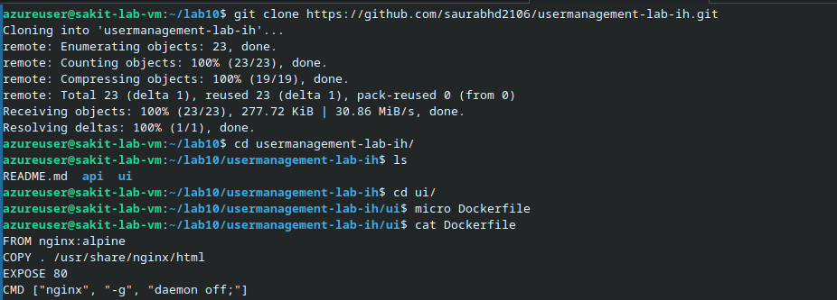

---

### Step 2: Build & Push Container Images

#### 2.1 Frontend (NGINX)

Create `ui/Dockerfile`:

```dockerfile
FROM nginx:alpine
COPY . /usr/share/nginx/html
EXPOSE 80
CMD ["nginx", "-g", "daemon off;"]
```

Build and push:

```bash
cd ui
docker build --platform linux/amd64 -t mrquiet24/frontend-user-management:latest .
docker login -u mrquiet24
docker push mrquiet24/frontend-user-management:latest
cd ..
```

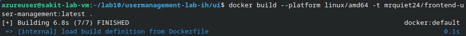

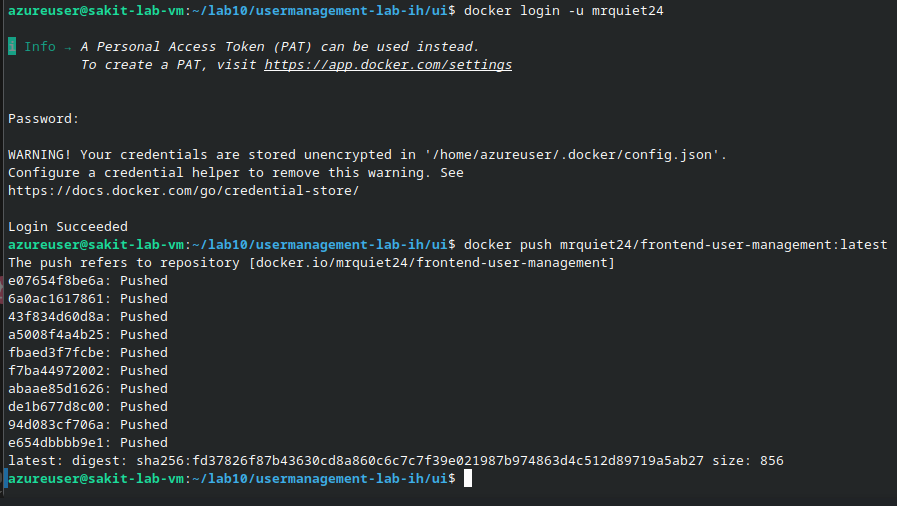

#### 2.2 Backend (Node.js)

Create `api/Dockerfile`:

```dockerfile
FROM node:20-alpine
WORKDIR /usr/src/app
COPY package*.json ./
RUN npm ci --omit=dev
COPY . .
EXPOSE 3000
CMD ["npm", "start"]
```

Build and push:

```bash
cd api
docker build --platform linux/amd64 -t mrquiet24/backend-user-management:latest .
docker push mrquiet24/backend-user-management:latest
cd ..
```

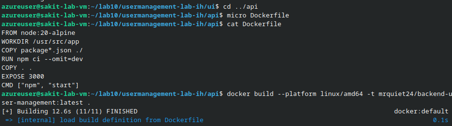

---

### Step 3: Create Kubernetes Manifests

Create a working directory for manifests:

```bash
mkdir k8s && cd k8s
```

---

### Step 4: Database Tier — PostgreSQL (Internal Only)

#### 4.1 Namespace (namespace.yml)

```yaml
apiVersion: v1
kind: Namespace
metadata:
  name: user-management
```

```bash
kubectl apply -f namespace.yml
```

#### 4.2 DB Secret (db-secret.yml)

```yaml
apiVersion: v1
kind: Secret
metadata:
  name: postgres-secret
  namespace: user-management
type: Opaque
stringData:
  POSTGRES_USER: postgres
  POSTGRES_PASSWORD: admin123
  POSTGRES_DB: postgres_db
```

#### 4.3 DB PVC (db-pvc.yml)

```yaml
apiVersion: v1
kind: PersistentVolumeClaim
metadata:
  name: postgres-pvc
  namespace: user-management
spec:
  accessModes: ["ReadWriteOnce"]
  resources:
    requests:
      storage: 5Gi
```

#### 4.4 DB Deployment (db-deploy.yml)

```yaml
apiVersion: apps/v1
kind: Deployment
metadata:
  name: postgres-db
  namespace: user-management
  labels:
    app: db
spec:
  replicas: 1
  selector:
    matchLabels:
      app: db
  template:
    metadata:
      labels:
        app: db
    spec:
      containers:
        - name: postgres
          image: postgres:16-alpine
          ports:
            - containerPort: 5432
          envFrom:
            - secretRef:
                name: postgres-secret
          volumeMounts:
            - name: data
              mountPath: /var/lib/postgresql/data
              subPath: pgdata
      volumes:
        - name: data
          persistentVolumeClaim:
            claimName: postgres-pvc
```

#### 4.5 DB Service — ClusterIP (db-svc.yml)

```yaml
apiVersion: v1
kind: Service
metadata:
  name: postgres-db
  namespace: user-management
spec:
  type: ClusterIP
  selector:
    app: db
  ports:
    - port: 5432
      targetPort: 5432
```

Apply all DB resources:

```bash
kubectl apply -f db-secret.yml
kubectl apply -f db-pvc.yml
kubectl apply -f db-deploy.yml
kubectl apply -f db-svc.yml
kubectl rollout status deploy/postgres-db -n user-management
```

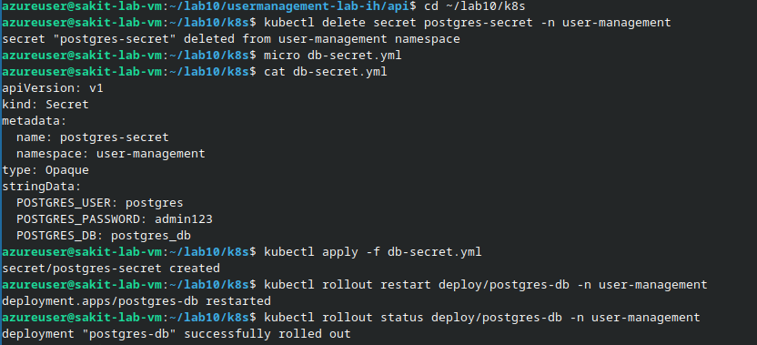

> [!IMPORTANT]
> The database uses a **ClusterIP** Service — it is only accessible from within the cluster. Never expose your database directly to the internet.

---

### Step 5: API Tier — Node.js (Public via LoadBalancer)

#### 5.1 API Deployment (api-deploy.yml)

```yaml
apiVersion: apps/v1
kind: Deployment
metadata:
  name: backend-deploy
  namespace: user-management
  labels:
    app: backend-app
spec:
  replicas: 2
  selector:
    matchLabels:
      app: backend-app
  template:
    metadata:
      labels:
        app: backend-app
    spec:
      containers:
        - name: backend-app
          image: mrquiet24/backend-user-management:latest
          ports:
            - containerPort: 3000
          env:
            - name: DB_SERVER
              value: "postgres-db"
            - name: DB_PORT
              value: "5432"
            - name: DB_USER
              valueFrom:
                secretKeyRef:
                  name: postgres-secret
                  key: POSTGRES_USER
            - name: DB_PASSWORD
              valueFrom:
                secretKeyRef:
                  name: postgres-secret
                  key: POSTGRES_PASSWORD
            - name: DB_NAME
              valueFrom:
                secretKeyRef:
                  name: postgres-secret
                  key: POSTGRES_DB
          readinessProbe:
            httpGet: { path: /health, port: 3000 }
            initialDelaySeconds: 5
            periodSeconds: 5
          livenessProbe:
            httpGet: { path: /health, port: 3000 }
            initialDelaySeconds: 10
            periodSeconds: 10
          resources:
            requests: { cpu: "100m", memory: "128Mi" }
            limits:   { cpu: "500m", memory: "256Mi" }
```

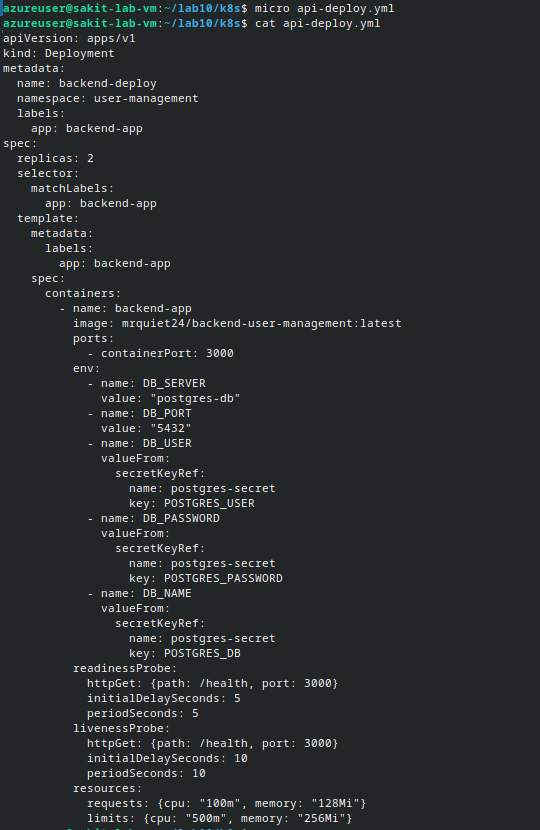

> [!TIP]
> The API connects to PostgreSQL using the internal DNS name `postgres-db` (the ClusterIP Service name). Kubernetes DNS resolves this automatically within the namespace.

#### 5.2 API Service — LoadBalancer (api-svc-lb.yml)

```yaml
apiVersion: v1
kind: Service
metadata:
  name: lb-backend-service
  namespace: user-management
spec:
  type: LoadBalancer
  selector:
    app: backend-app
  ports:
    - port: 80
      targetPort: 3000
```

Apply and verify:

```bash
kubectl apply -f api-deploy.yml
kubectl apply -f api-svc-lb.yml
kubectl rollout status deploy/backend-deploy -n user-management
```

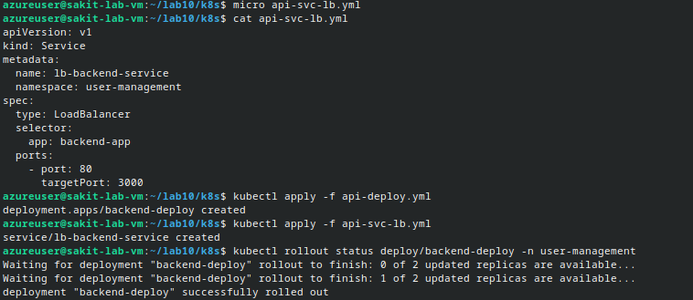

Get the API external IP and test:

```bash
kubectl get svc lb-backend-service -n user-management
curl -I http://<API_IP>/health
```

```
HTTP/1.1 200 OK
X-Powered-By: Express
Access-Control-Allow-Origin: *
```

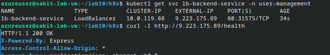

---

### Step 6: UI Tier — NGINX (Public via LoadBalancer) + ConfigMap

#### 6.1 UI ConfigMap (ui-configmap.yml)

The UI reads the API URL from `config.json`. We inject it at runtime via a ConfigMap:

```yaml
apiVersion: v1
kind: ConfigMap
metadata:
  name: frontend-configmap
  namespace: user-management
data:
  config.json: |
    {
      "API_URL": "http://9.223.175.89/"
    }
```

> [!WARNING]
> Replace the `API_URL` value with the **actual EXTERNAL-IP** of your `lb-backend-service`. If this doesn't match, the UI will fail to call the API.

#### 6.2 UI Deployment (ui-deploy.yml)

```yaml
apiVersion: apps/v1
kind: Deployment
metadata:
  name: frontend-deploy
  namespace: user-management
  labels:
    app: frontend-app
spec:
  replicas: 1
  selector:
    matchLabels:
      app: frontend-app
  template:
    metadata:
      labels:
        app: frontend-app
    spec:
      volumes:
        - name: ui-config
          configMap:
            name: frontend-configmap
            items:
              - key: config.json
                path: config.json
      containers:
        - name: frontend-app
          image: mrquiet24/frontend-user-management:latest
          ports:
            - containerPort: 80
          volumeMounts:
            - name: ui-config
              mountPath: /usr/share/nginx/html/config.json
              subPath: config.json
              readOnly: true
          readinessProbe:
            httpGet: { path: /, port: 80 }
            initialDelaySeconds: 3
            periodSeconds: 5
          livenessProbe:
            httpGet: { path: /, port: 80 }
            initialDelaySeconds: 10
            periodSeconds: 10
```

#### 6.3 UI Service — LoadBalancer (ui-svc-lb.yml)

```yaml
apiVersion: v1
kind: Service
metadata:
  name: lb-frontend-service
  namespace: user-management
spec:
  type: LoadBalancer
  selector:
    app: frontend-app
  ports:
    - port: 80
      targetPort: 80
```

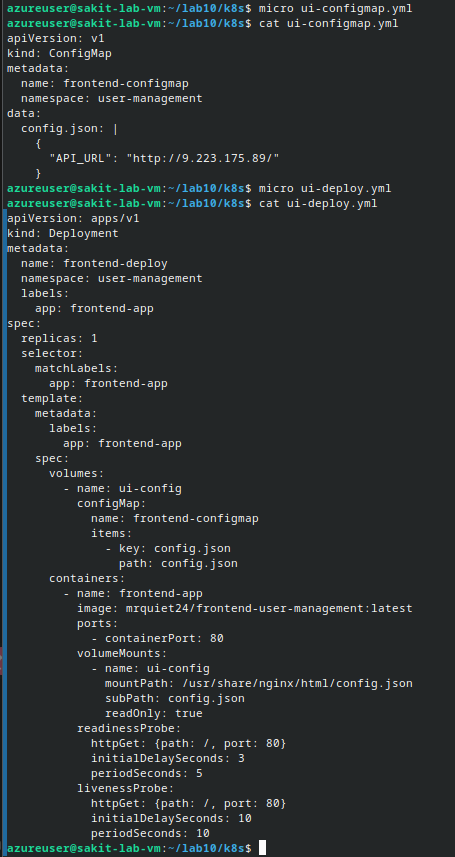

Apply all UI resources:

```bash
kubectl apply -f ui-configmap.yml
kubectl apply -f ui-deploy.yml
kubectl apply -f ui-svc-lb.yml
kubectl rollout status deploy/frontend-deploy -n user-management
```

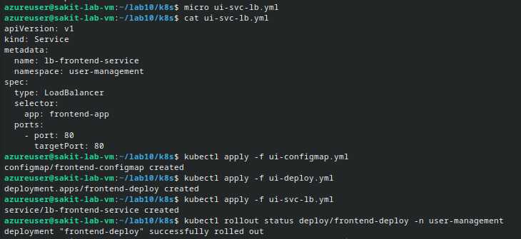

Get the Frontend external IP:

```bash
kubectl get svc lb-frontend-service -n user-management
```

---

### Step 7: Verify End-to-End

Check all resources are healthy:

```bash
kubectl get deploy,rs,pods,svc -n user-management
```

| Resource | Ready/Status | External IP |
|---|---|---|
| `backend-deploy` | 2/2 | — |
| `frontend-deploy` | 1/1 | — |
| `postgres-db` | 1/1 | — |
| `lb-backend-service` | LoadBalancer | 9.223.175.89 |
| `lb-frontend-service` | LoadBalancer | 135.116.48.214 |
| `postgres-db` (svc) | ClusterIP | internal |

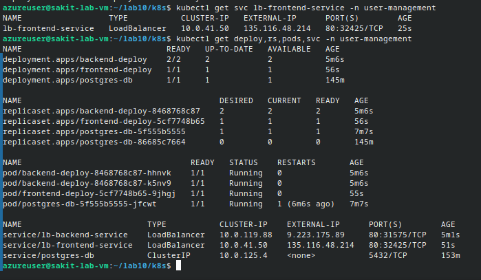

Open the app in the browser:

```
http://135.116.48.214/
```

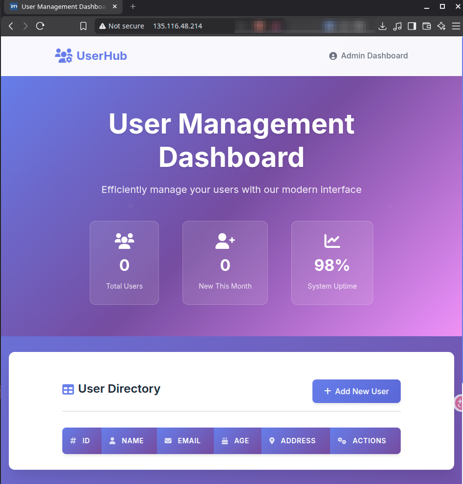

Test CRUD — add a user:

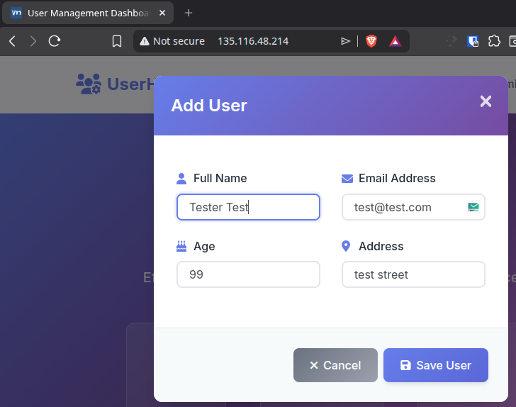

Verify the user was created:

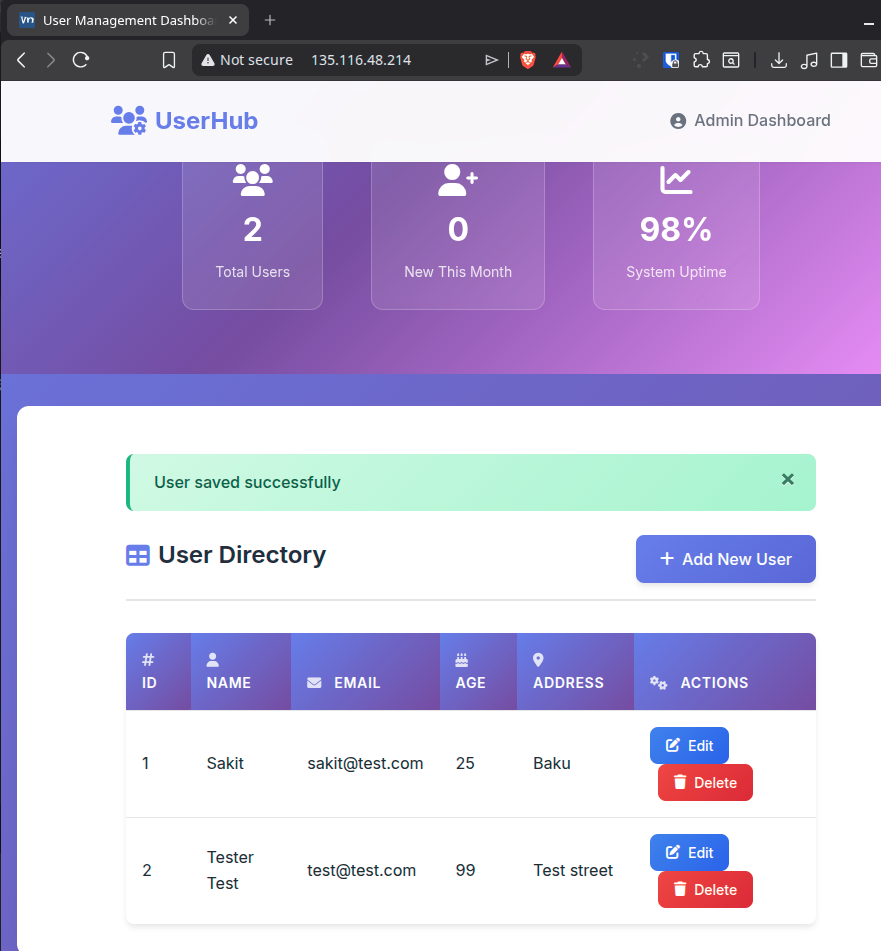

---

## 🔥 Troubleshooting

| Issue | Solution |
|---|---|
| **UI shows but API calls fail** | Check `API_URL` in `ui-configmap.yml` matches the API LB external IP; restart frontend: `kubectl rollout restart deploy/frontend-deploy -n user-management` |
| **EXTERNAL-IP is `<pending>`** | Wait 1-2 minutes. Check events: `kubectl get events -n user-management` |
| **Service has no endpoints** | Labels mismatch — verify with `kubectl get pods --show-labels -n user-management` |
| **ImagePullBackOff** | Check Docker Hub username and image tag. Ensure the image is public or imagePullSecrets are configured |
| **DB connection refused** | Verify `DB_SERVER` value matches the ClusterIP Service name (`postgres-db`) |
| **CrashLoopBackOff on API** | Check logs: `kubectl logs deploy/backend-deploy -n user-management` |

---

## 📊 Summary

| Task | Command / Action | Status |
|---|---|---|
| Clone app repo | `git clone` usermanagement-lab-ih | ✅ |
| Build frontend image | `docker build` → `mrquiet24/frontend-user-management` | ✅ |
| Build backend image | `docker build` → `mrquiet24/backend-user-management` | ✅ |
| Push images to Docker Hub | `docker push` both images | ✅ |
| Create namespace | `kubectl apply -f namespace.yml` | ✅ |
| Deploy PostgreSQL | Secret + PVC + Deployment + ClusterIP Service | ✅ |
| Deploy Node.js API | Deployment (2 replicas) + LoadBalancer → 9.223.175.89 | ✅ |
| Deploy NGINX Frontend | ConfigMap + Deployment + LoadBalancer → 135.116.48.214 | ✅ |
| End-to-end verification | Browser CRUD test — users created and displayed | ✅ |

---

## 💡 Key Takeaways

1. **Three-tier architecture** separates concerns — each tier can scale, update, and fail independently
2. **ClusterIP for databases** — never expose databases to the internet; use internal-only services
3. **ConfigMaps for runtime config** — injecting `config.json` via a volume mount lets you change the API URL without rebuilding the image
4. **Secrets for credentials** — use `stringData` for readability but Kubernetes stores them base64-encoded
5. **Health probes are essential** — readiness probes prevent traffic to unready pods; liveness probes restart crashed containers
6. **LoadBalancer per service is expensive** — each one provisions a cloud load balancer with a public IP. Lab 9 replaces this with Ingress.
7. **`subPath` on volume mounts** — mounts a single file from a ConfigMap without overwriting the entire directory
8. **Resource limits** protect the cluster — always set CPU/memory requests and limits on production workloads
