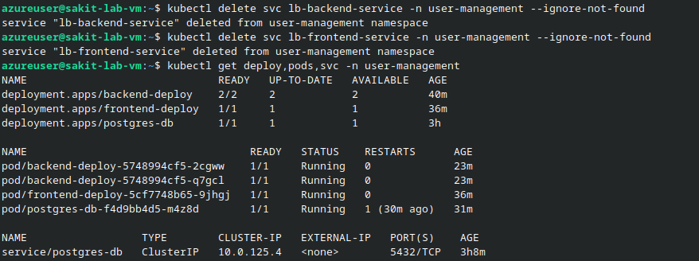
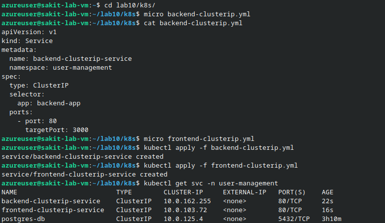
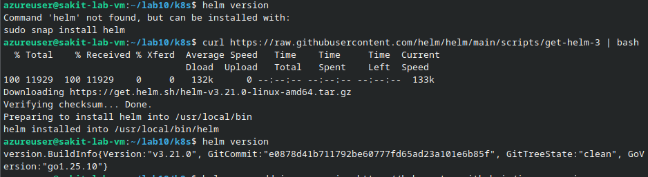
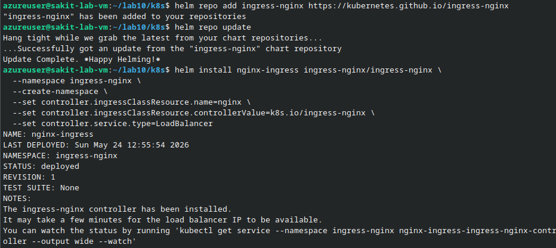
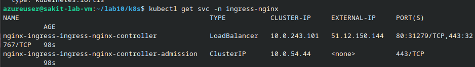
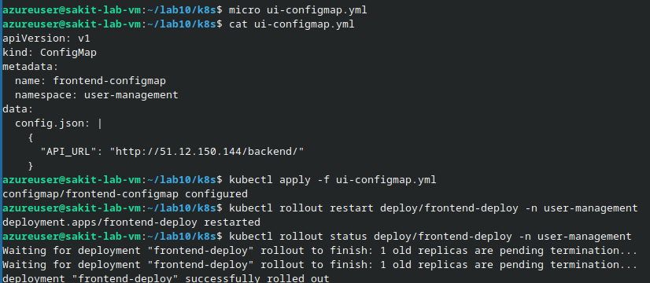
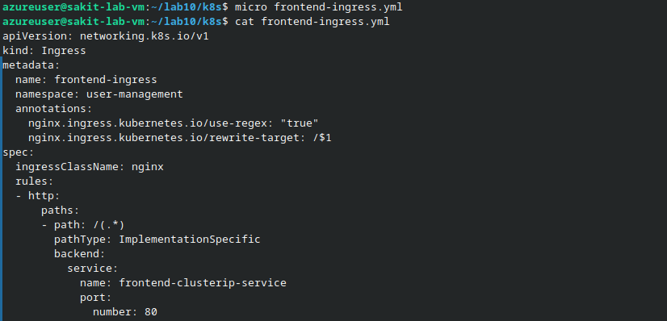
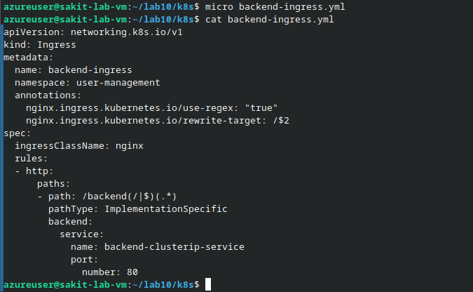
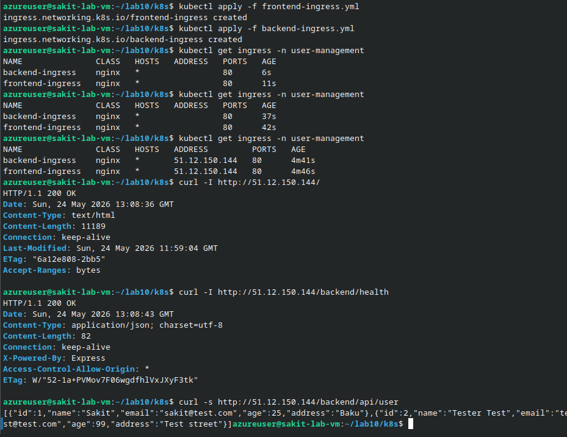

# Expose the Three-Tier App with a Single Ingress (AKS)

## 📋 Overview

In the previous lab (Lab 8), you exposed the frontend and backend through **two separate LoadBalancer** Services — each provisioning its own Azure Load Balancer and public IP. That works, but it's expensive at scale. In this lab, you replace those two LoadBalancers with a **single NGINX Ingress Controller** that routes traffic by path:

- `/` → Frontend (ClusterIP)
- `/backend/...` → Backend API (ClusterIP)

This reduces cost to a single public IP while keeping full routing flexibility.

> [!NOTE]
> This lab is a **continuation** of Lab 8. Your AKS cluster, namespace `user-management`, and the three-tier app (PostgreSQL + API + Frontend) should already be running.

---

## 🎯 Objectives

- Delete the existing LoadBalancer Services and replace them with ClusterIP Services
- Install the **NGINX Ingress Controller** via Helm
- Create **Ingress rules** with regex-based path routing and URL rewriting
- Update the frontend ConfigMap to use the Ingress IP for API calls
- Validate full end-to-end routing through a single public IP

---

## 🔧 Prerequisites

| Requirement | Details |
|---|---|
| **AKS Cluster** | Running with kubectl configured |
| **Lab 8 completed** | `user-management` namespace with postgres-db, backend-deploy, frontend-deploy |
| **Helm** | Will be installed in this lab if not present |

---

## 🏗️ Architecture

```
                            ┌───────────────┐
                            │   Browser /   │
                            │    Client     │
                            └───────┬───────┘
                                    │
                            ┌───────▼───────┐
                            │  Public IP     │
                            │ 51.12.150.144  │
                            └───────┬───────┘
                                    │
┌───────────────────────────────────┼──────────────────────────────────────┐
│  AKS Cluster                     │                                       │
│                                  │                                       │
│  Namespace: ingress-nginx   ┌────▼──────────────────────────┐           │
│                             │  NGINX Ingress Controller      │           │
│                             │  (LoadBalancer — single LB)    │           │
│                             └────┬───────────────┬───────────┘           │
│                                  │               │                       │
│  Namespace: user-management      │               │                       │
│                                  │               │                       │
│  Path: /(.*)                     │     Path: /backend(/|$)(.*)           │
│  rewrite: /$1                    │     rewrite: /$2                      │
│                                  │               │                       │
│  ┌───────────────────────┐  ┌────▼───┐   ┌──────▼──────────────────┐   │
│  │  frontend-deploy      │◀─┤frontend│   │backend-clusterip-service│   │
│  │  (NGINX, 1 replica)   │  │cluster-│   │(ClusterIP :80→:3000)   │   │
│  │                       │  │ip-svc  │   └──────┬──────────────────┘   │
│  │  ConfigMap:           │  │(:80)   │          │                      │
│  │  API_URL →            │  └────────┘   ┌──────▼──────────────────┐   │
│  │  http://INGRESS_IP/   │               │  backend-deploy         │   │
│  │  backend/             │               │  (Node.js, 2 replicas)  │   │
│  └───────────────────────┘               └──────┬──────────────────┘   │
│                                                  │                      │
│                                           ┌──────▼──────────────────┐   │
│                                           │  postgres-db            │   │
│                                           │  (ClusterIP :5432)      │   │
│                                           │  Internal only          │   │
│                                           └─────────────────────────┘   │
└──────────────────────────────────────────────────────────────────────────┘
```

**Before (Lab 8):** 2 LoadBalancers = 2 public IPs = 2× cost  
**After (Lab 9):** 1 Ingress Controller = 1 public IP = path-based routing ✅

---

## 📝 Lab Steps

### Step 0: Clean Up Previous LoadBalancers

Remove the two LoadBalancer services from Lab 8:

```bash
kubectl delete svc lb-backend-service -n user-management --ignore-not-found
kubectl delete svc lb-frontend-service -n user-management --ignore-not-found
```

Verify that Deployments and Pods are still healthy (only the `postgres-db` ClusterIP should remain):

```bash
kubectl get deploy,pods,svc -n user-management -o wide
```



---

### Step 1: Create ClusterIP Services for Frontend & Backend

#### 1.1 Backend ClusterIP (backend-clusterip.yml)

```yaml
apiVersion: v1
kind: Service
metadata:
  name: backend-clusterip-service
  namespace: user-management
spec:
  type: ClusterIP
  selector:
    app: backend-app
  ports:
    - port: 80
      targetPort: 3000
```

#### 1.2 Frontend ClusterIP (frontend-clusterip.yml)

```yaml
apiVersion: v1
kind: Service
metadata:
  name: frontend-clusterip-service
  namespace: user-management
spec:
  type: ClusterIP
  selector:
    app: frontend-app
  ports:
    - port: 80
      targetPort: 80
```

Apply and confirm:

```bash
kubectl apply -f backend-clusterip.yml
kubectl apply -f frontend-clusterip.yml
kubectl get svc -n user-management
```

You should now have three ClusterIP services:

| Service | Type | Port |
|---|---|---|
| `backend-clusterip-service` | ClusterIP | 80/TCP |
| `frontend-clusterip-service` | ClusterIP | 80/TCP |
| `postgres-db` | ClusterIP | 5432/TCP |



---

### Step 2: Install NGINX Ingress Controller (Helm)

#### 2.1 Install Helm

```bash
curl https://raw.githubusercontent.com/helm/helm/main/scripts/get-helm-3 | bash
helm version
```



#### 2.2 Add Repo & Install Controller

```bash
helm repo add ingress-nginx https://kubernetes.github.io/ingress-nginx
helm repo update

helm install nginx-ingress ingress-nginx/ingress-nginx \
  --namespace ingress-nginx \
  --create-namespace \
  --set controller.ingressClassResource.name=nginx \
  --set controller.ingressClassResource.controllerValue=k8s.io/ingress-nginx \
  --set controller.service.type=LoadBalancer
```



Verify the controller is running and get the **Ingress external IP**:

```bash
kubectl get pods -n ingress-nginx
kubectl get svc -n ingress-nginx
```

```
NAME                                        TYPE           EXTERNAL-IP      PORT(S)
nginx-ingress-ingress-nginx-controller      LoadBalancer   51.12.150.144    80:31279/TCP,443:32767/TCP
```



> [!IMPORTANT]
> Note the `EXTERNAL-IP` — this is your single Ingress public IP (`51.12.150.144`). All traffic will flow through this IP.

---

### Step 3: Update Frontend ConfigMap

Point the UI to the new backend path through the Ingress:

#### ui-configmap.yml (updated)

```yaml
apiVersion: v1
kind: ConfigMap
metadata:
  name: frontend-configmap
  namespace: user-management
data:
  config.json: |
    {
      "API_URL": "http://51.12.150.144/backend/"
    }
```

> [!WARNING]
> The `API_URL` must include the **trailing slash** after `/backend/`. Without it, the path rewrite won't work correctly and API calls will 404.

Apply and restart the frontend to pick up the new config:

```bash
kubectl apply -f ui-configmap.yml
kubectl rollout restart deploy/frontend-deploy -n user-management
kubectl rollout status deploy/frontend-deploy -n user-management
```



---

### Step 4: Create the Ingress Rules

We use two Ingress resources with regex-based path matching and URL rewriting.

#### frontend-ingress.yml

```yaml
apiVersion: networking.k8s.io/v1
kind: Ingress
metadata:
  name: frontend-ingress
  namespace: user-management
  annotations:
    nginx.ingress.kubernetes.io/use-regex: "true"
    nginx.ingress.kubernetes.io/rewrite-target: /$1
spec:
  ingressClassName: nginx
  rules:
  - http:
      paths:
      - path: /(.*)
        pathType: ImplementationSpecific
        backend:
          service:
            name: frontend-clusterip-service
            port:
              number: 80
```



#### backend-ingress.yml

```yaml
apiVersion: networking.k8s.io/v1
kind: Ingress
metadata:
  name: backend-ingress
  namespace: user-management
  annotations:
    nginx.ingress.kubernetes.io/use-regex: "true"
    nginx.ingress.kubernetes.io/rewrite-target: /$2
spec:
  ingressClassName: nginx
  rules:
  - http:
      paths:
      - path: /backend(/|$)(.*)
        pathType: ImplementationSpecific
        backend:
          service:
            name: backend-clusterip-service
            port:
              number: 80
```



> [!TIP]
> **How the rewrite works:**
> - A request to `/backend/api/user` matches `/backend(/|$)(.*)` where `$2` = `api/user`
> - The rewrite target `/$2` sends `/api/user` to the backend service
> - This strips the `/backend` prefix so the API receives clean paths

Apply and verify:

```bash
kubectl apply -f frontend-ingress.yml
kubectl apply -f backend-ingress.yml
kubectl get ingress -n user-management
```

Wait for the ADDRESS to populate (1-5 minutes):

```
NAME               CLASS   HOSTS   ADDRESS          PORTS   AGE
backend-ingress    nginx   *       51.12.150.144    80      4m41s
frontend-ingress   nginx   *       51.12.150.144    80      4m46s
```

---

### Step 5: Test End-to-End

#### 5.1 Frontend via Ingress

```bash
curl -I http://51.12.150.144/
```

```
HTTP/1.1 200 OK
Content-Type: text/html
```

#### 5.2 Backend via Ingress

```bash
curl -I http://51.12.150.144/backend/health
curl -s http://51.12.150.144/backend/api/user
```

```
HTTP/1.1 200 OK
Content-Type: application/json; charset=utf-8

[{"id":1,"name":"Sakit","email":"sakit@test.com","age":25,"address":"Baku"},
 {"id":2,"name":"Tester Test","email":"test@test.com","age":99,"address":"Test street"}]
```



#### 5.3 Browser Test

Open `http://51.12.150.144/` in your browser and verify the UI can load users and perform CRUD operations through the Ingress.

---

## 🔥 Troubleshooting

| Issue | Solution |
|---|---|
| **EXTERNAL-IP is `<pending>`** | Wait 1-2 minutes. Check: `kubectl get events -n ingress-nginx --sort-by=.lastTimestamp` |
| **`/backend/...` returns 404** | Verify regex annotations and paths match exactly; `rewrite-target` should be `/$2` |
| **Frontend can't reach API** | Check `API_URL` is `http://<INGRESS_IP>/backend/` (note trailing slash), then restart frontend |
| **Service has no endpoints** | Labels must match — verify: `kubectl get pods --show-labels -n user-management` |
| **Ingress not getting ADDRESS** | Ensure `ingressClassName: nginx` matches the installed controller class |
| **Want a hostname instead of IP?** | Create a DNS A-record pointing to the Ingress IP, then add a `host:` rule in the Ingress |

---

## 📊 Summary

| Task | Command / Action | Status |
|---|---|---|
| Delete LoadBalancer services | `kubectl delete svc lb-backend-service lb-frontend-service` | ✅ |
| Create Backend ClusterIP | `kubectl apply -f backend-clusterip.yml` | ✅ |
| Create Frontend ClusterIP | `kubectl apply -f frontend-clusterip.yml` | ✅ |
| Install Helm | `curl get-helm-3 \| bash` → v3.21.0 | ✅ |
| Install NGINX Ingress | `helm install nginx-ingress` → 51.12.150.144 | ✅ |
| Update ConfigMap | `API_URL` → `http://51.12.150.144/backend/` | ✅ |
| Create frontend Ingress | `/(.*)` → `frontend-clusterip-service` | ✅ |
| Create backend Ingress | `/backend(/\|$)(.*)` → `backend-clusterip-service` | ✅ |
| Verify frontend | `curl -I http://51.12.150.144/` → 200 OK | ✅ |
| Verify backend | `curl http://51.12.150.144/backend/api/user` → JSON data | ✅ |

---

## 💡 Key Takeaways

1. **One Ingress Controller replaces multiple LoadBalancers** — significant cost savings in production (one public IP instead of N)
2. **Path-based routing** allows multiple services to share a single entry point — `/` for frontend, `/backend/...` for API
3. **Regex + rewrite annotations** strip path prefixes so backend services receive clean URLs (e.g., `/backend/api/user` → `/api/user`)
4. **ClusterIP is the default and preferred Service type** — only the Ingress Controller needs a LoadBalancer
5. **ConfigMap updates require Pod restart** — after changing `API_URL`, always `rollout restart` the frontend deployment
6. **Ingress resources are namespace-scoped** — they must be in the same namespace as the services they route to
7. **Helm simplifies controller installation** — the NGINX Ingress Controller Helm chart handles all the controller Deployment, Service, RBAC, and IngressClass setup
8. **The trailing slash matters** — `API_URL` must end with `/backend/` (not `/backend`) for proper path resolution
