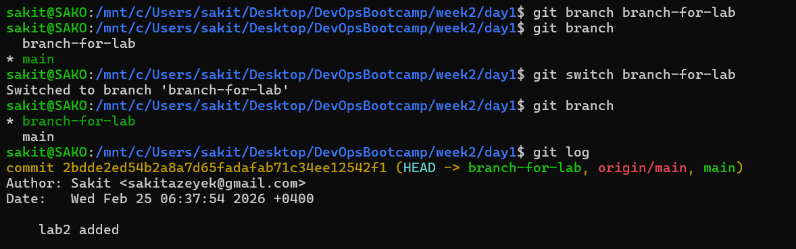
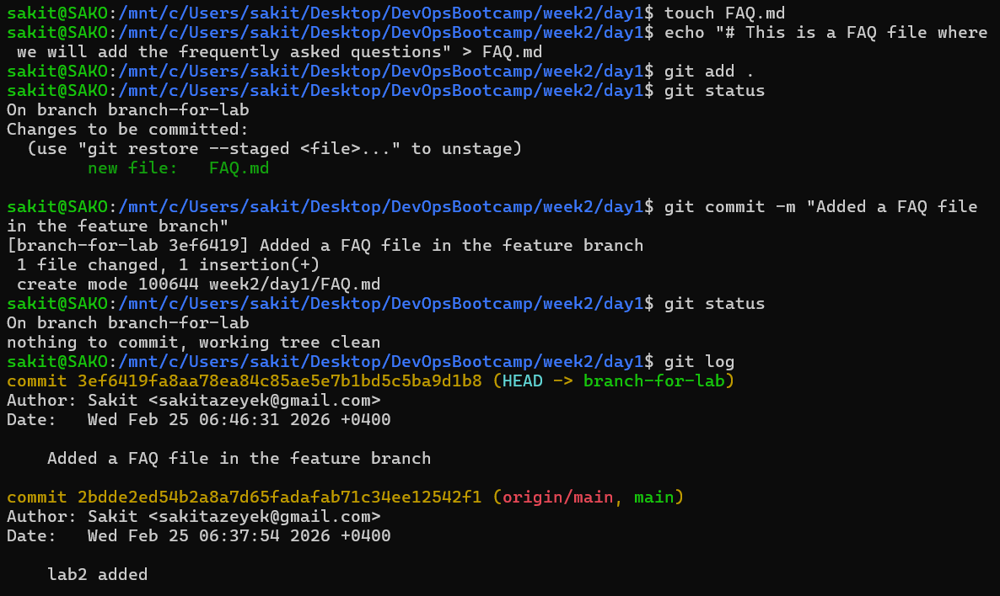
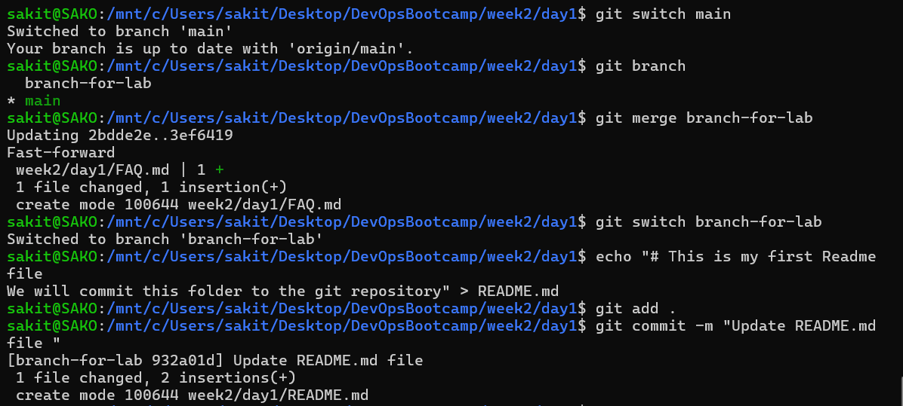
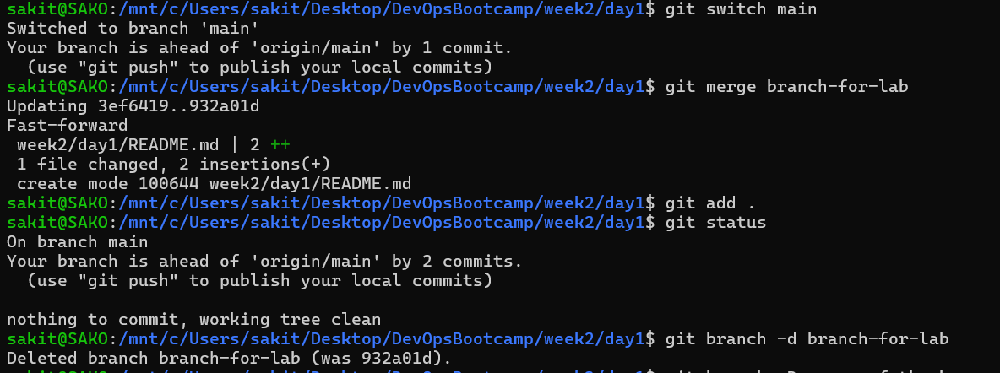

# Lab 1 - Working with Git Branches

In this lab, Git branch operations were practiced: creating branches, switching between branches, committing files, merging branches, and deleting branches.

---

## 📌 Step 1 — Creating and Switching to a Branch

A new branch called `branch-for-lab` was created and switched to. The existing commit history was checked using `git log`.

**Commands executed:**
```bash
git branch branch-for-lab       # Create a new branch
git branch                      # List all branches
git switch branch-for-lab       # Switch to the new branch
git branch                      # Verify the active branch
git log                         # View commit history
```

**Result:** The `branch-for-lab` branch was successfully created and switched to using `git switch`. The `git log` output shows that the `HEAD` pointer is now pointing to the `branch-for-lab` branch.



---

## 📌 Step 2 — Creating a File and Committing on the Feature Branch

A `FAQ.md` file was created on the `branch-for-lab` branch, content was written to it, it was added to the staging area, and then committed.

**Commands executed:**
```bash
touch FAQ.md                                                  # Create a new file
echo "# This is a FAQ file where we will add the frequently asked questions" > FAQ.md  # Write content to the file
git add .                                                     # Add files to the staging area
git status                                                    # Check the status
git commit -m "Added a FAQ file in the feature branch"        # Commit the changes
git status                                                    # Verify the working tree is clean
git log                                                       # View commit history
```

**Result:** The `FAQ.md` file was successfully created and committed. The `git log` shows that the new commit exists only on `branch-for-lab`, while the `main` branch still points to the previous commit.



---

## 📌 Step 3 — Switching to Main and First Merge

Switched back to the `main` branch and merged `branch-for-lab` into `main`. Then switched back to `branch-for-lab` and updated the `README.md` file.

**Commands executed:**
```bash
git switch main                          # Switch to main branch
git branch                               # Verify the active branch
git merge branch-for-lab                 # Merge branch-for-lab into main
git switch branch-for-lab                # Switch back to the feature branch
echo "# This is my first Readme file
We will commit this folder to the git repository" > README.md   # Create README.md
git add .                                # Add changes to staging
git commit -m "Update README.md file"    # Commit the changes
```

**Result:** The first merge was performed as a "Fast-forward" — since there were no additional commits on `main`, the pointer was simply moved forward. This means `FAQ.md` was successfully added to the `main` branch. Afterwards, a `README.md` file was created and committed on `branch-for-lab`.



---

## 📌 Step 4 — Second Merge and Deleting the Branch

Switched to `main` again, merged `branch-for-lab`, and then deleted the branch since it was no longer needed.

**Commands executed:**
```bash
git switch main                          # Switch to main branch
git merge branch-for-lab                 # Second merge — bring in README.md changes
git add .                                # Add changes to staging
git status                               # Check the status
git branch -d branch-for-lab             # Delete the feature branch
```

**Result:** The second merge was also a "Fast-forward", and the `README.md` file was added to the `main` branch. `git status` showed that `main` is ahead of `origin/main` by 2 commits. Finally, `branch-for-lab` was successfully deleted with `git branch -d`, since all its changes had already been merged.



---

## 🧠 Key Takeaways

| Command | Function |
|---------|----------|
| `git branch <name>` | Create a new branch |
| `git switch <name>` | Switch between branches |
| `git branch` | List all branches |
| `git add .` | Add changes to the staging area |
| `git commit -m "message"` | Commit changes |
| `git merge <branch>` | Merge a branch into the current branch |
| `git branch -d <name>` | Delete a merged branch |
| `git log` | View commit history |
| `git status` | Check the repository status |
