# Lab 2 - Collaborating Code with a Remote Repository in GitHub

In this lab, the full workflow of collaborating with a remote GitHub repository was practiced: creating a repository on GitHub, generating a Personal Access Token (PAT), initializing a local repository, pushing code to the remote, and pulling changes.

---

## 📌 Step 1 — Creating a New Repository on GitHub

A new public repository called `RepoForCollaborating` was created on GitHub by clicking the green **"New"** button on the dashboard.

**Configuration:**
- **Owner:** Mr-Sakit
- **Repository name:** RepoForCollaborating
- **Description:** "This repo is to practice collaborating"
- **Visibility:** Public
- **README / .gitignore / License:** None (empty repository)

**Result:** The repository was successfully created. GitHub displayed the quick setup page with the remote URL: `https://github.com/Mr-Sakit/RepoForCollaborating.git` and instructions for pushing from the command line.

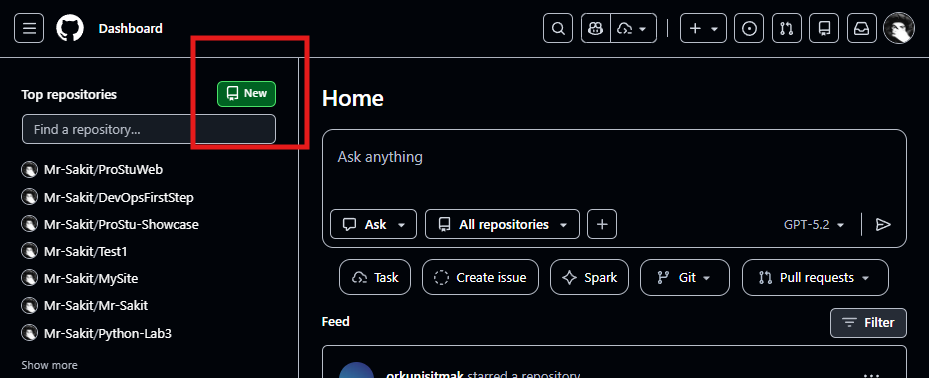
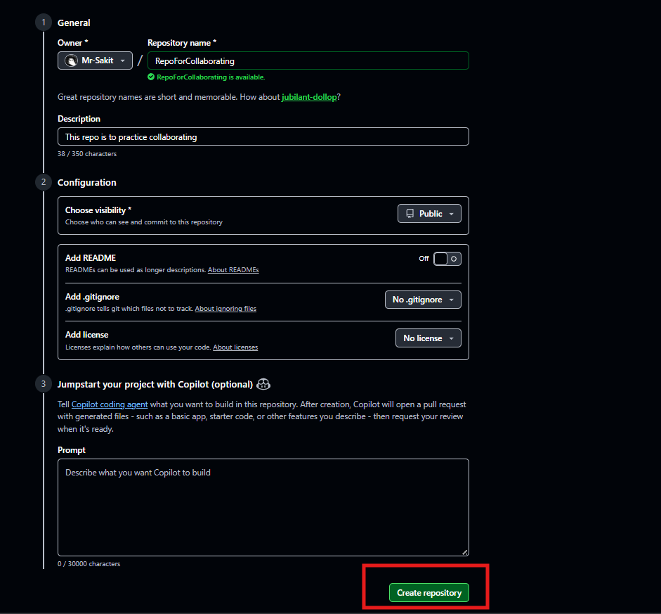
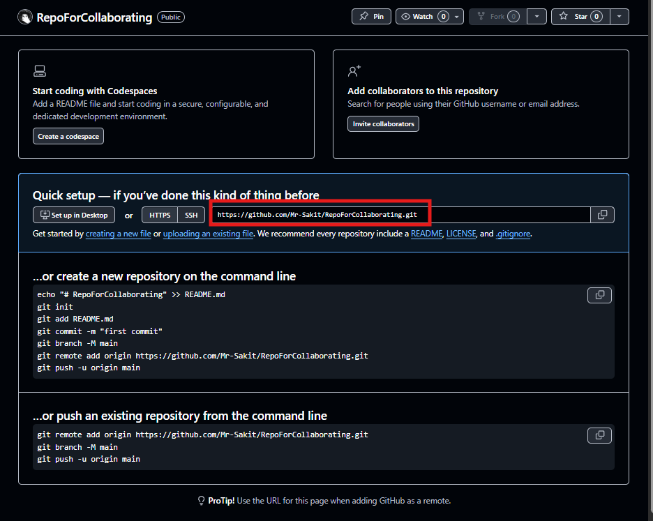

---

## 📌 Step 2 — Generating a Fine-Grained Personal Access Token (PAT)

To authenticate Git operations over HTTPS, a Fine-grained Personal Access Token was created through GitHub Settings.

**Navigation path:**
1. Profile icon → **Settings**
2. Scroll down to **Developer settings**
3. **Personal access tokens** → **Fine-grained tokens**
4. Click **"Generate new token"**

**Token configuration:**
- **Token name:** `collaborating-practice`
- **Expiration:** 30 days (Mar 27, 2026)
- **Resource owner:** Mr-Sakit
- **Repository access:** All repositories
- **Permissions (8 selected):** Actions, Administration, Code scanning alerts, Commit statuses, Contents — all set to **Read and write**

**Result:** The token was generated successfully. GitHub displayed a warning to copy the token immediately, as it won't be shown again. The token starts with `github_pat_11E...`.

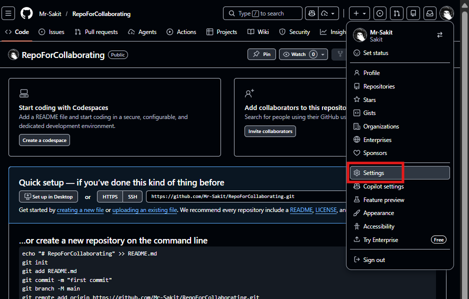
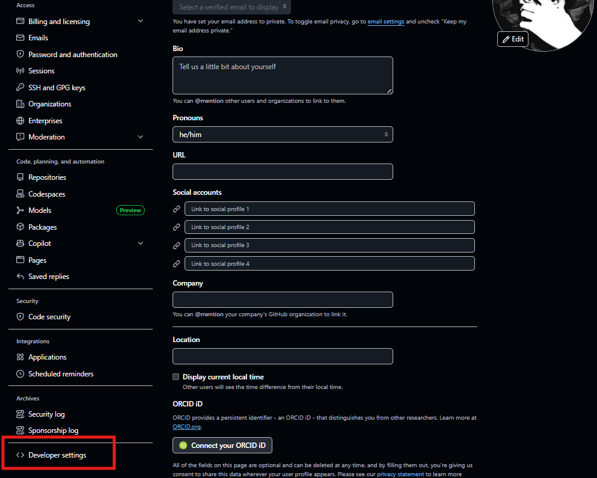
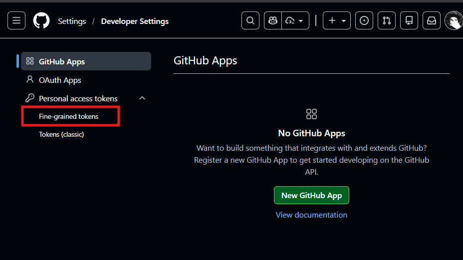
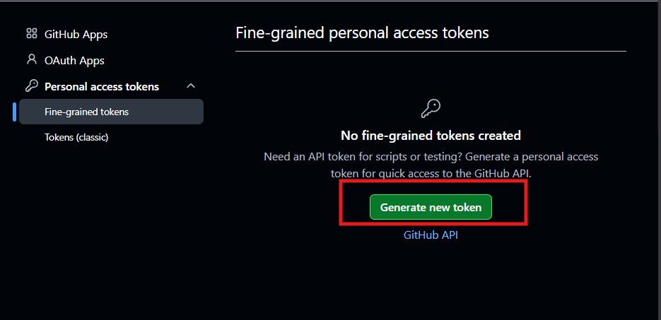
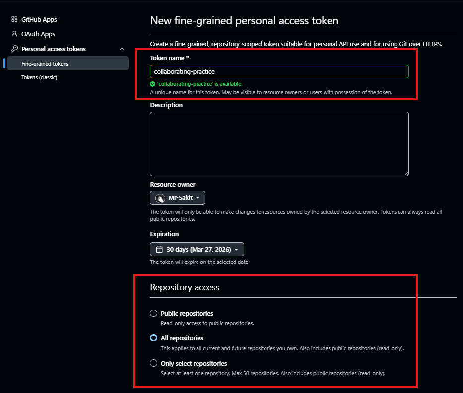
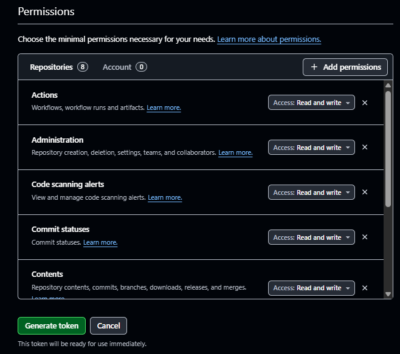
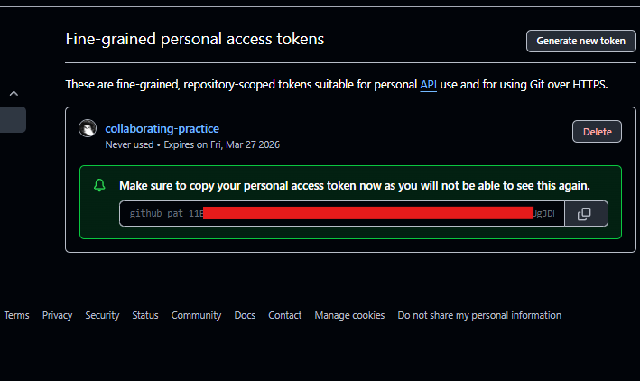

---

## 📌 Step 3 — Initializing Local Repository and Pushing to Remote

A local Git repository was initialized in the `lab2` directory, a `README.md` file was created, and the code was pushed to the remote repository.

**Commands executed:**
```bash
git init                                    # Initialize a new local repository
git remote add origin https://github.com/Mr-Sakit/RepoForCollaborating.git  # Add remote (HTTPS)
echo "Example" > README.md                 # Create a README file
git add README.md                           # Stage the file
git push --set-upstream origin main         # Attempt push (failed — no commits yet)
git commit -m "Example Commit"              # Commit the changes
git push --set-upstream origin main         # Attempt push (failed — password auth not supported)
```

**Errors encountered and resolved:**
1. **`error: src refspec main does not match any`** — Push failed because there were no commits yet.
2. **`fatal: Authentication failed`** — Password authentication is no longer supported by GitHub. The remote URL was changed from HTTPS to SSH:
```bash
git remote set-url origin git@github.com:Mr-Sakit/RepoForCollaborating.git  # Switch to SSH
git push --set-upstream origin main         # Successful push
```

**Result:** The push was successful. The `main` branch was set up to track `origin/main`. `git status` confirmed: "On branch main, up to date with 'origin/main', working tree clean."

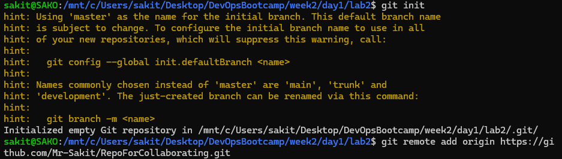
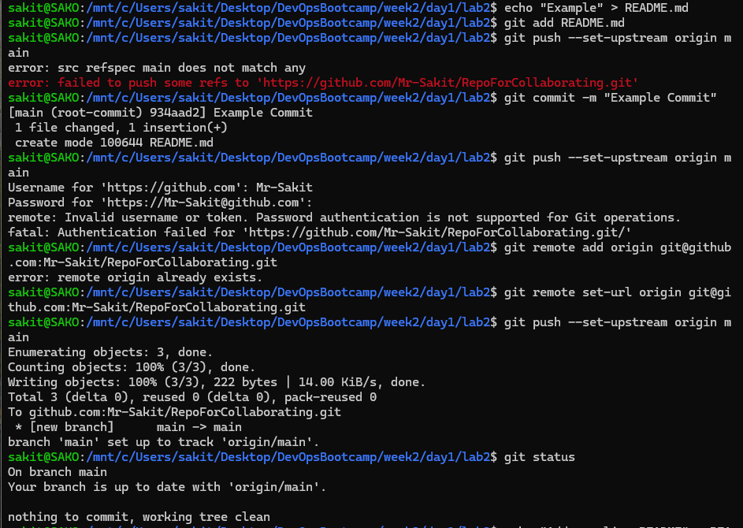

---

## 📌 Step 4 — Fetching and Pulling Changes from Remote

After pushing, various commands were used to sync the local repository with the remote, and a local file edit was verified.

**Commands executed:**
```bash
echo "Add new line README" > README.md      # Modify the file locally
git status                                   # Shows modified: README.md
git fetch origin                             # Fetch remote refs without merging
git log --oneline --graph --all              # View commit graph
git pull origin master                       # Attempt pull from 'master' (failed — branch is 'main')
git pull origin main                         # Pull from 'main' — already up to date
cat README.md                                # View file contents
git status                                   # Show modified file status
git fetch origin                             # Fetch again
git log --oneline --graph --all              # Check commit graph
git pull origin main                         # Pull again — already up to date
cat README.md                                # View file — now shows line added via VS Code
```

**Key observations:**
- `git pull origin master` failed with `fatal: couldn't find remote ref master` because the branch is named `main`, not `master`.
- After editing the file in VS Code and adding "This line added on VS Code", `cat README.md` displayed both the original and new content.
- `git fetch` retrieves changes from the remote without merging, while `git pull` fetches and merges in one step.

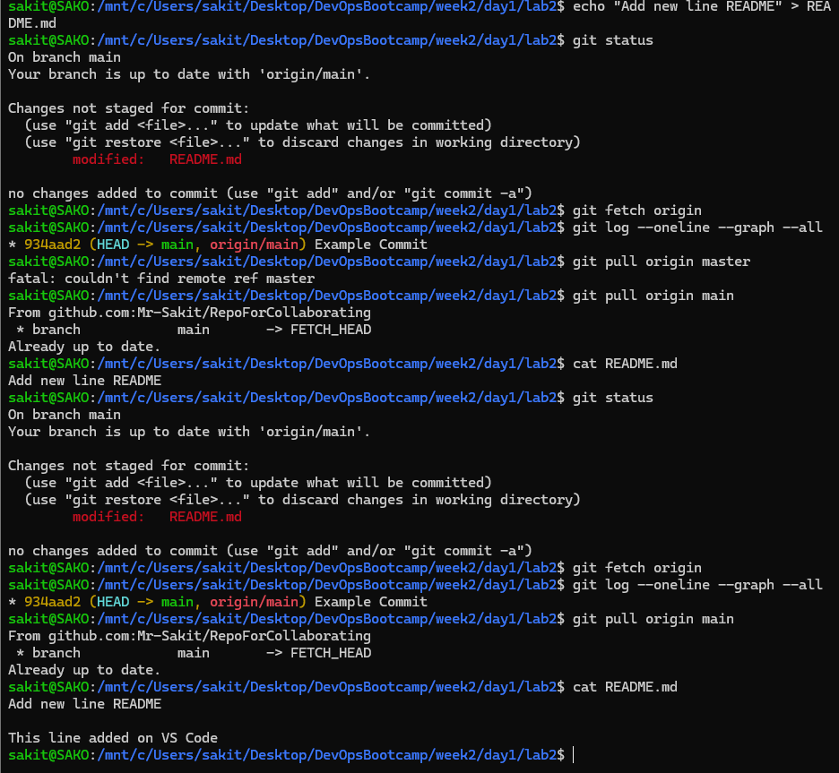

---

## 🧠 Key Takeaways

| Command | Function |
|---------|----------|
| `git init` | Initialize a new local Git repository |
| `git remote add origin <url>` | Link a remote repository |
| `git remote set-url origin <url>` | Change the remote URL (e.g., HTTPS → SSH) |
| `git push --set-upstream origin main` | Push and set upstream tracking branch |
| `git fetch origin` | Download remote changes without merging |
| `git pull origin main` | Fetch and merge remote changes |
| `git log --oneline --graph --all` | View a compact commit graph |
| `cat <file>` | Display file contents in the terminal |
| `git status` | Check repository status |

### 🔑 Authentication Note
GitHub no longer supports password authentication for Git operations. Use one of:
- **Personal Access Token (PAT)** — generated via Settings → Developer Settings → Fine-grained tokens
- **SSH keys** — using `git@github.com:` URL format instead of `https://`
