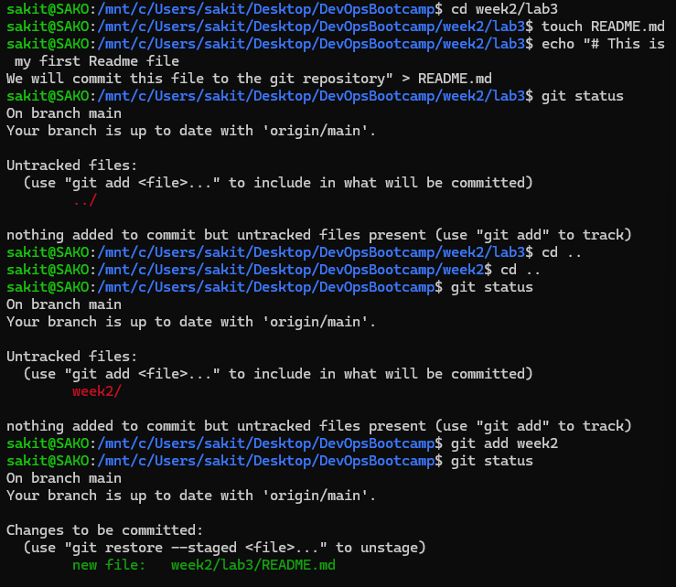
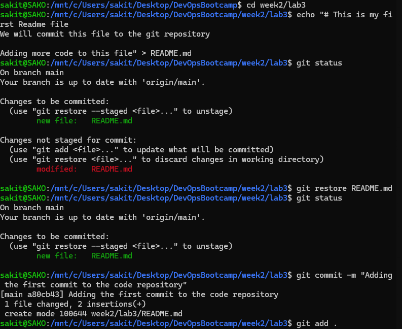
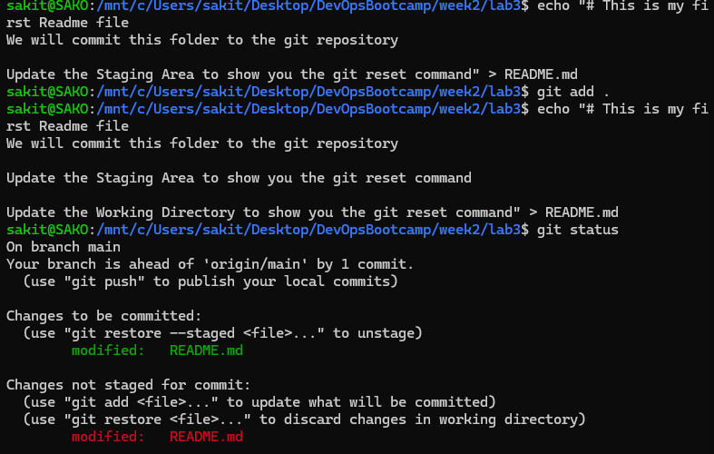
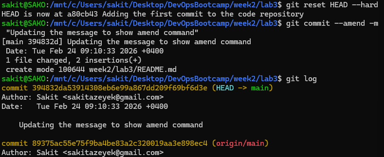

## Screenshot 1: 

In this section, you are managing the directory structure and moving files into the Git staging area.

`cd week2/lab3`: Navigates into the specific lab directory.

`touch README.md`: Creates an empty file named README.md.

`echo "..." > README.md`: Adds content to the README file via the terminal.

`git status`: Checks the state of the working directory. It initially shows week2/ as an untracked directory.

`git add week2`: Moves the contents of the week2 folder into the Staging Area.

## Screenshot 2: 

`git restore README.md`: Discards unstaged changes in the working directory, reverting the file to its last staged state.

`git commit -m "..."`: Saves the staged snapshot to the project history with a descriptive message. This creates a new commit hash (a80cb43).

## Screenshot 3: 

`echo "..." > README.md` & `git add .`: Updates the file and stages it.

Second `echo` command: Modifies the file again after the previous staging, resulting in a "modified" status in both the Staged and Unstaged categories when running git status.

## Screenshot 4: 

`git reset HEAD --hard`: A powerful command that resets the current branch, staging area, and working directory to the last commit, permanently deleting any uncommitted changes.

`git commit --amend -m "..."`: Replaces the last commit with a new one. 

`git log`: Displays the commit history, showing the newly amended commit at the top of the list.

