# Lab 1 - Provision a Linux VM on Azure

In this lab, a Linux Virtual Machine (Ubuntu Server 22.04 LTS) was provisioned on Microsoft Azure. The full workflow covered creating a Resource Group, configuring VM settings, deploying the VM, connecting via SSH, and stopping the VM.

---

## 📌 Step 1 — Navigating to Resource Groups in Azure Portal

The Azure Portal was opened and **Resource groups** was selected from the left sidebar to view existing resource groups.

**Existing resource groups:**
- NetworkWatcherRG
- rg-lab-azurevm
- rg-lab-azurewm
- ubuntuLab_group

All under subscription **IDDAB2G**, located in **East US**.

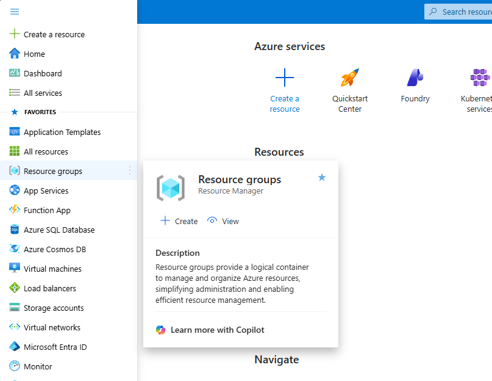
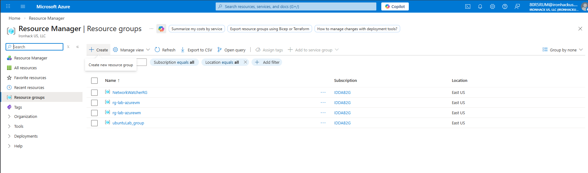

---

## 📌 Step 2 — Creating a New Resource Group

A new Resource Group was created to hold all resources for this lab.

**Configuration:**
| Setting | Value |
|---------|-------|
| Subscription | IDDAB2G |
| Resource group name | `rg-lab-azurevm-sakit` |
| Region | (US) East US |

**Result:** The resource group was reviewed and created successfully.

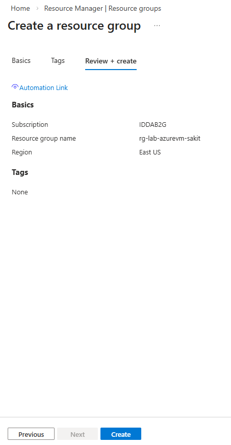
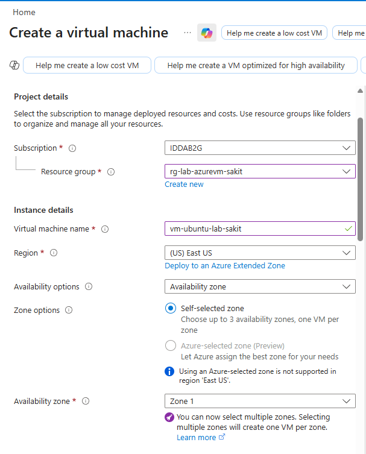

---

## 📌 Step 3 — Searching for Virtual Machines

In the Azure Portal search bar, "virt" was typed, and **Virtual machines** was selected from the search results under Services.


---

## 📌 Step 4 — Creating a Virtual Machine

From the Virtual Machines page, **+ Create** → **Virtual machine** was selected to begin the VM creation wizard.

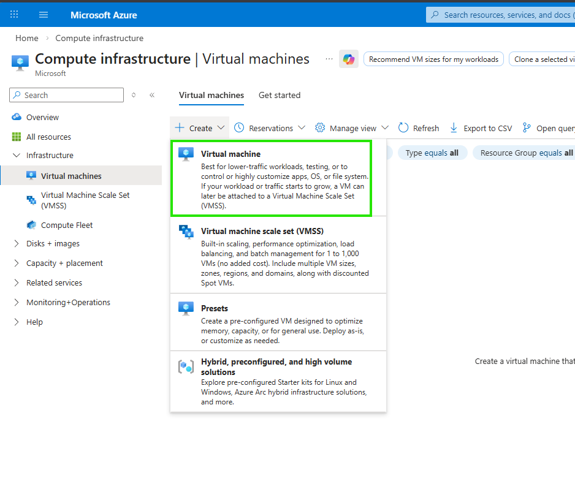


---

## 📌 Step 5 — Configuring VM Settings

### Basics Tab — Image & Size

| Setting | Value |
|---------|-------|
| Security type | Standard |
| Image | **Ubuntu Server 22.04 LTS - x64 Gen2** |
| VM architecture | x64 |
| Size | **Standard_D2s_v3** — 2 vCPUs, 8 GiB memory |

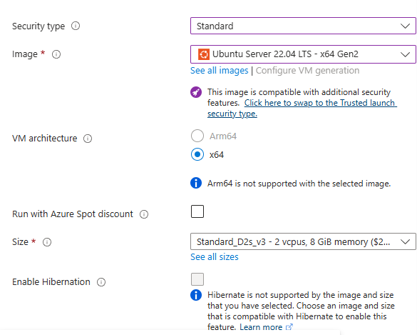

### Basics Tab — Administrator Account & Inbound Ports

| Setting | Value |
|---------|-------|
| Authentication type | **SSH public key** |
| Username | `mr-sakit` |
| SSH public key source | Generate new key pair |
| SSH Key Type | RSA SSH Format |
| Key pair name | `sakit_key` |
| Public inbound ports | Allow selected ports |
| Select inbound ports | **SSH (22)** |


### Disks Tab

| Setting | Value |
|---------|-------|
| OS disk size | Image default (30 GiB) |
| OS disk type | **Standard SSD (locally-redundant storage)** |
| Delete with VM | ✅ Enabled |
| Key management | Platform-managed key |

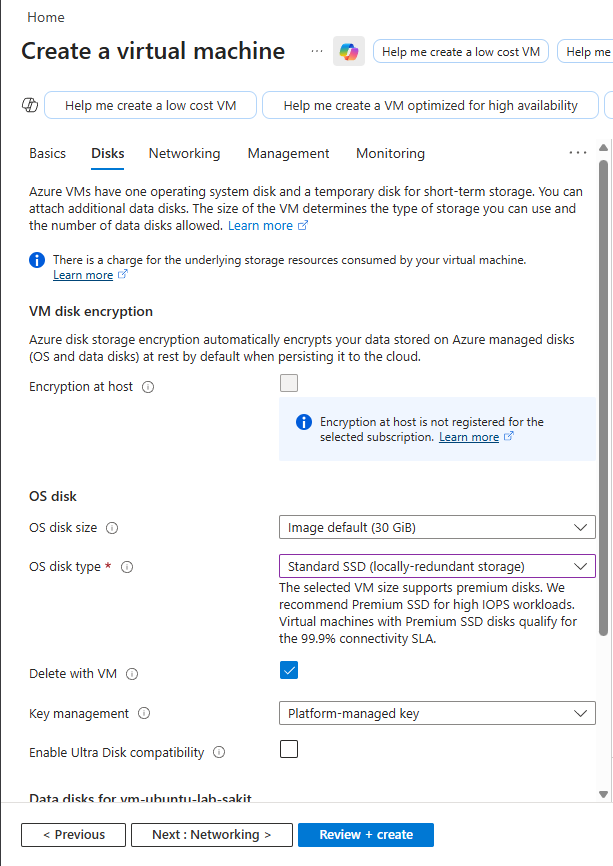

### Networking Tab

| Setting | Value |
|---------|-------|
| Virtual network | (New) vnet-eastus-2 (rg-lab-azurevm-sakit) |
| Subnet | (New) snet-eastus-1 — 172.19.0.0/24 (256 addresses) |
| Public IP | (New) vm-ubuntu-lab-sakit-ip |
| NIC network security group | Basic |
| Public inbound ports | Allow selected ports |
| Select inbound ports | **SSH (22)** |

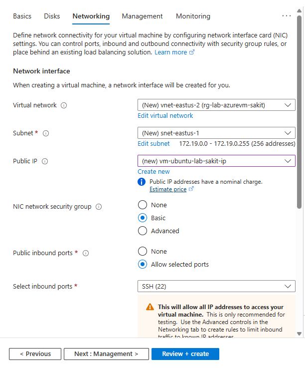

### Management Tab

| Setting | Value |
|---------|-------|
| Microsoft Defender for Cloud | Basic (free) |
| Auto-shutdown | Enabled |
| Shutdown time | 11:00:00 PM |
| Time zone | (UTC) Coordinated Universal Time |
| Notification before shutdown | ✅ Enabled |
| Estimated monthly cost | **$208.27** |


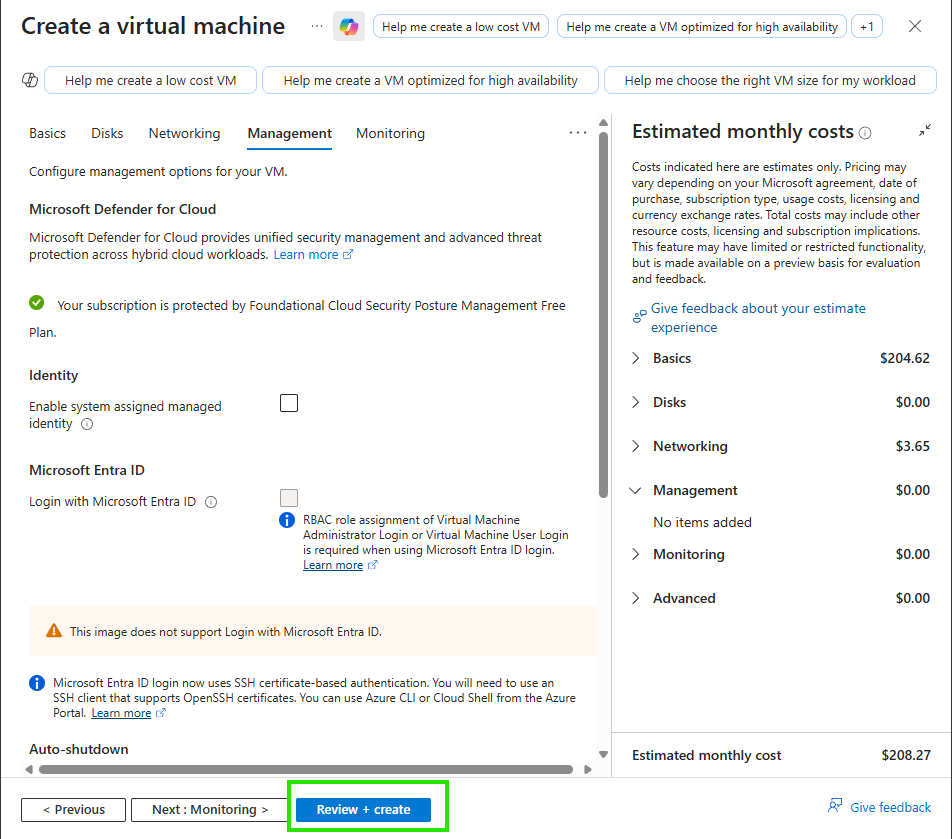

---

## 📌 Step 6 — Review + Create and Deployment

The VM configuration was validated. **"Validation passed"** was displayed, confirming all settings were correct. The **Create** button was clicked.

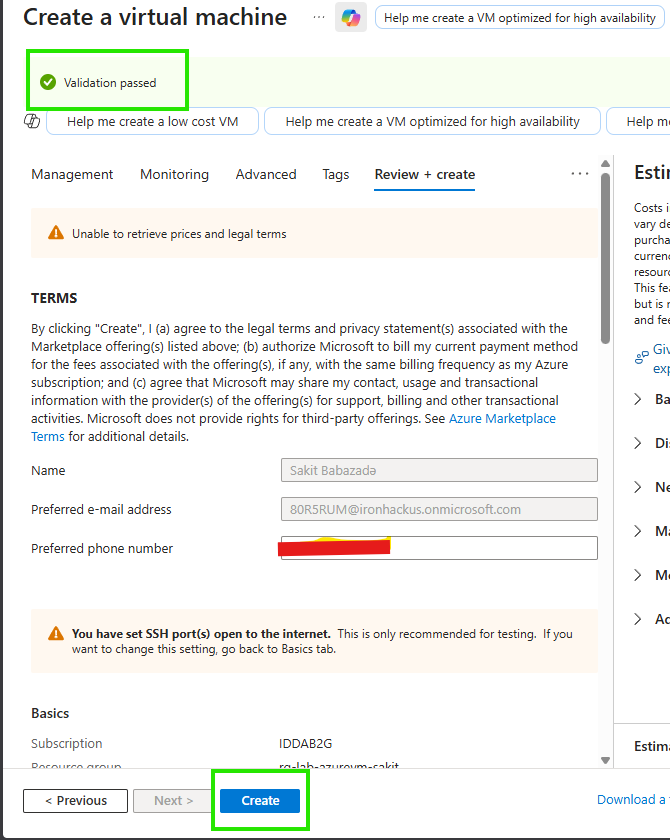

A dialog appeared to **Generate new key pair** — the SSH private key (`sakit_key.pem`) was downloaded and the resource was created.


### Deployment Progress

The deployment started and showed multiple resources being created:
- `rg-lab-azurevm-sakit` (Virtual Machine)
- `rg-lab-azurevm-sakit841` (Network)
- `network-interface-associ...` (Network Interface)
- `rg-lab-azurevm-sakit-ip` (Public IP)
- `rg-lab-azurevm-sakit-ns...` (Network Security Group)


### Deployment Complete

**"Deployment succeeded"** — the VM was successfully deployed to resource group `rg-lab-azurevm-sakit`.

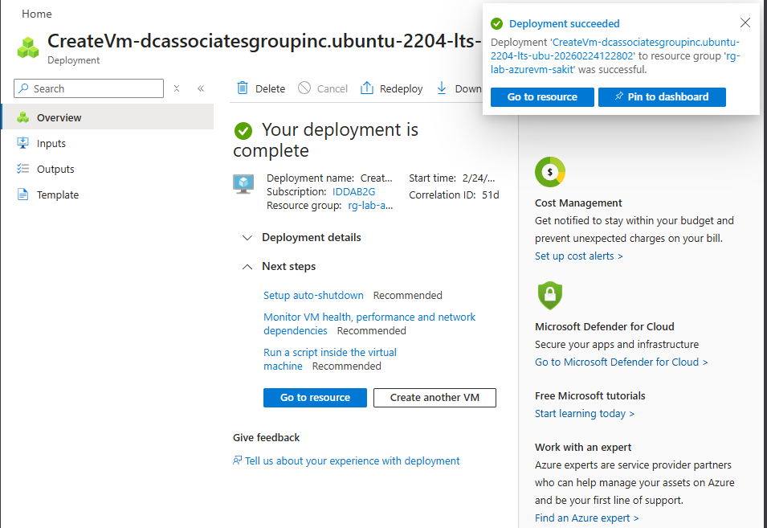

---

## 📌 Step 7 — Verifying the VM

After clicking **"Go to resource"**, the VM overview page was displayed with key information:

| Property | Value |
|----------|-------|
| Resource group | rg-lab-azurevm-sakit |
| Status | **Running** |
| Location | Poland Central (Zone 1) |
| Operating system | Linux (ubuntu 22.04) |
| Size | Standard D2s v3 (2 vCPUs, 8 GiB memory) |
| Public IP | **134.112.24.54** |
| Time created | 2/24/2026, 8:32 AM UTC |


---

## 📌 Step 8 — Connecting via SSH

The downloaded SSH private key was used to connect to the VM from the terminal.

**Commands executed:**
```bash
cd ~                                          # Navigate to home directory
cd /mnt/c/Users/sakit/Downloads               # Go to Downloads folder
chmod 400 sakit_key.pem                       # Set correct permissions on private key
ssh -i sakit_key.pem mr-sakit@134.112.24.54   # Connect to VM via SSH
```

**Result:** Successfully connected to the Ubuntu 22.04.5 LTS VM. The system information showed:
- System load: 0.0
- Memory usage: 4%
- Disk usage: 7.1% of 28.89GB
- 0 updates available

The terminal prompt changed to `mr-sakit@rg-lab-azurevm-sakit:~$`, confirming a successful SSH connection.


---

## 📌 Step 9 — Disconnecting and Stopping the VM

The SSH connection was closed, and the VM was stopped from the Azure Portal to avoid unnecessary costs.

**Terminal output:**
```
Connection to 134.112.24.54 closed by remote host.
Connection to 134.112.24.54 closed.
```

The **Stop** button was highlighted in the Azure Portal VM overview page.

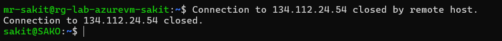


---

## 🧠 Key Takeaways

| Concept | Description |
|---------|-------------|
| **Resource Group** | A logical container that holds related Azure resources |
| **Virtual Machine** | A compute resource running a guest OS on Azure infrastructure |
| **SSH Key Pair** | Public/private key authentication for secure remote access |
| **NSG (Network Security Group)** | Firewall rules controlling inbound/outbound traffic |
| **Public IP** | An IP address accessible from the internet for SSH access |
| `chmod 400` | Sets file permissions to read-only for the owner (required for SSH keys) |
| `ssh -i <key> user@ip` | Connects to a remote server using a specific private key |

### 💡 Best Practices
- Always **stop or deallocate** VMs when not in use to avoid unnecessary costs
- Use **SSH keys** instead of passwords for authentication
- Enable **auto-shutdown** to prevent forgetting to turn off VMs
- Set **inbound port rules** to only allow necessary ports (e.g., SSH port 22)