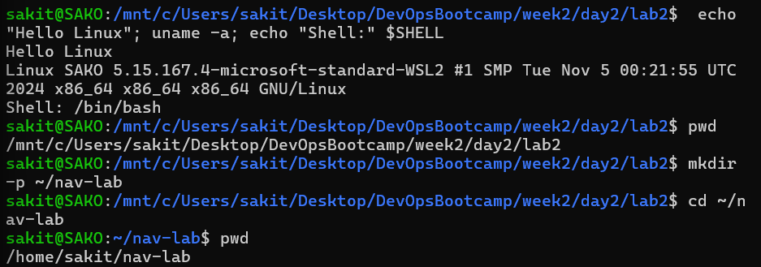
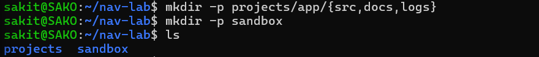
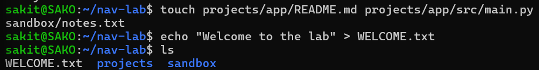
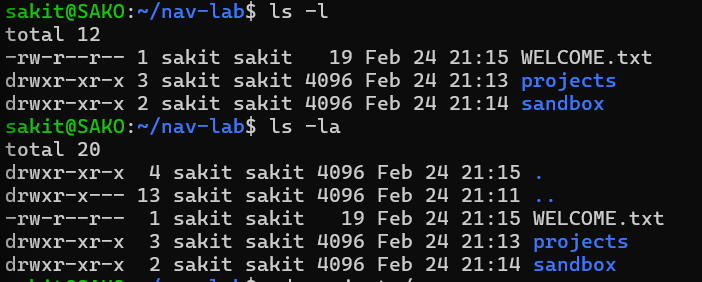
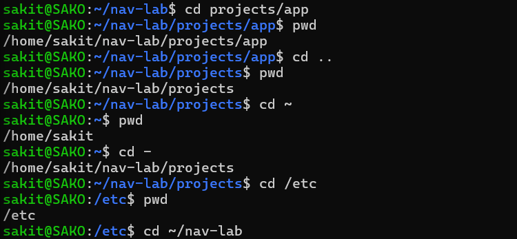
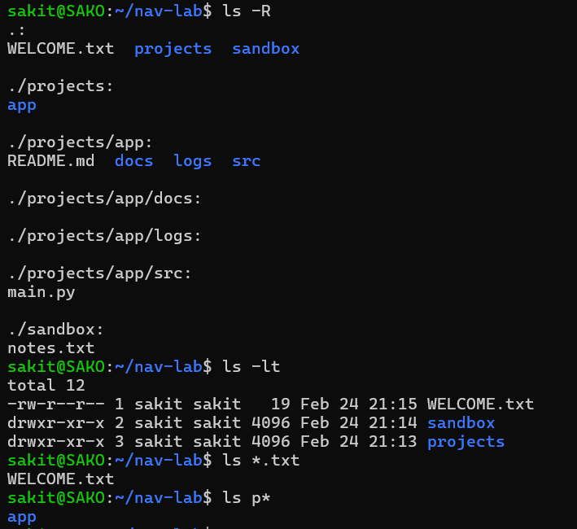
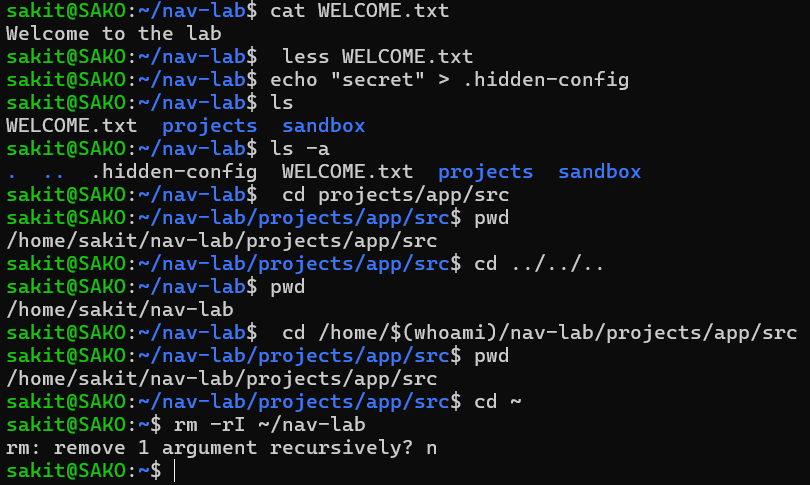

# Lab 2 - Basic Navigation Commands in Linux

In this lab, essential Linux navigation commands were practiced: navigating the file system, creating directories and files, listing contents with various options, viewing file contents, working with hidden files, and using path shortcuts.

---

## 📌 Step 1 — System Information and Initial Setup

Basic system information was displayed, and a working directory (`nav-lab`) was created in the home folder.

**Commands executed:**
```bash
echo "Hello Linux"; uname -a; echo "Shell:" $SHELL    # Print message, system info, and shell type
pwd                                                     # Print current working directory
mkdir -p ~/nav-lab                                      # Create nav-lab directory in home
cd ~/nav-lab                                            # Navigate to nav-lab
pwd                                                     # Confirm location
```

**Result:**
- `echo` printed "Hello Linux"
- `uname -a` showed: `Linux SAKO 5.15.167.4-microsoft-standard-WSL2` (running on WSL2)
- Shell: `/bin/bash`
- Current directory confirmed as `/home/sakit/nav-lab`



---

## 📌 Step 2 — Creating Directory Structure

A project directory structure was created using `mkdir -p` for nested directories and brace expansion.

**Commands executed:**
```bash
mkdir -p projects/app/{src,docs,logs}     # Create nested directory structure
mkdir -p sandbox                           # Create sandbox directory
ls                                         # List contents
```

**Result:** Two top-level directories were created: `projects` and `sandbox`. Inside `projects/app/`, three subdirectories (`src`, `docs`, `logs`) were created in one command using brace expansion `{src,docs,logs}`.



---

## 📌 Step 3 — Creating Files

Multiple files were created using `touch` and `echo`.

**Commands executed:**
```bash
touch projects/app/README.md projects/app/src/main.py sandbox/notes.txt   # Create multiple files
echo "Welcome to the lab" > WELCOME.txt                                    # Create file with content
ls                                                                          # List contents
```

**Result:** Files were created across different directories in one command. `echo` with `>` redirection created `WELCOME.txt` with the text "Welcome to the lab". `ls` showed: `WELCOME.txt`, `projects`, `sandbox`.



---

## 📌 Step 4 — Listing Files with Options (`ls -l`, `ls -la`)

Different `ls` options were used to view file details and hidden files.

**Commands executed:**
```bash
ls -l       # Long listing format — shows permissions, owner, size, date
ls -la      # Long listing including hidden files (. and ..)
```

**Result:**
- `ls -l` displayed file permissions, owner (`sakit`), group, size, modification date, and name
- `ls -la` additionally showed hidden entries: `.` (current directory) and `..` (parent directory)
- `WELCOME.txt` has permissions `-rw-r--r--` (read-only for group and others)



---

## 📌 Step 5 — Navigating with `cd`, `cd ..`, `cd ~`, and `cd -`

Various navigation shortcuts were practiced to move between directories.

**Commands executed:**
```bash
cd projects/app          # Navigate to projects/app (relative path)
pwd                      # /home/sakit/nav-lab/projects/app
cd ..                    # Go up one level
pwd                      # /home/sakit/nav-lab/projects
cd ~                     # Go to home directory
pwd                      # /home/sakit
cd -                     # Go back to previous directory
pwd                      # /home/sakit/nav-lab/projects
cd /etc                  # Navigate using absolute path
pwd                      # /etc
cd ~/nav-lab             # Return to nav-lab using ~ shortcut
```

**Result:**
- `cd ..` moves one directory up
- `cd ~` goes to the home directory (`/home/sakit`)
- `cd -` toggles back to the previous directory
- Absolute paths (e.g., `/etc`) can be used to navigate anywhere



---

## 📌 Step 6 — Recursive Listing, Sorting, and Wildcards

Advanced `ls` options and glob patterns were used to filter and sort file listings.

**Commands executed:**
```bash
ls -R        # Recursive listing — shows all subdirectories and their contents
ls -lt       # Long listing sorted by modification time (newest first)
ls *.txt     # List only .txt files using wildcard
ls p*        # List items starting with 'p'
```

**Result:**
- `ls -R` showed the full directory tree:
  ```
  .: WELCOME.txt  projects  sandbox
  ./projects: app
  ./projects/app: README.md  docs  logs  src
  ./projects/app/src: main.py
  ./sandbox: notes.txt
  ```
- `ls -lt` sorted by time: `WELCOME.txt` (newest), `sandbox`, `projects`
- `ls *.txt` matched only `WELCOME.txt`
- `ls p*` matched the `projects` directory, showing its contents (`app`)



---

## 📌 Step 7 — Viewing Files, Hidden Files, Advanced Navigation, and Cleanup

File viewing commands, hidden files, dynamic paths, and recursive deletion were practiced.

**Commands executed:**
```bash
cat WELCOME.txt                                      # Display file contents
less WELCOME.txt                                     # View file in a pager (scrollable)
echo "secret" > .hidden-config                       # Create a hidden file
ls                                                   # Hidden file not shown
ls -a                                                # Shows hidden files (. .. .hidden-config)
cd projects/app/src                                  # Navigate to src
pwd                                                  # /home/sakit/nav-lab/projects/app/src
cd ../../..                                          # Go up 3 levels
pwd                                                  # /home/sakit/nav-lab
cd /home/$(whoami)/nav-lab/projects/app/src          # Navigate using $(whoami) command substitution
pwd                                                  # /home/sakit/nav-lab/projects/app/src
cd ~                                                 # Go to home
rm -rI ~/nav-lab                                     # Attempt recursive delete with confirmation
```

**Result:**
- `cat` printed file contents directly in the terminal
- `less` opened the file in an interactive pager
- Files starting with `.` are hidden — `ls` doesn't show them, but `ls -a` does
- `cd ../../..` navigates up 3 levels at once
- `$(whoami)` dynamically inserts the current username (`sakit`) into the path
- `rm -rI` prompted for confirmation: "remove 1 argument recursively?" — answered `n` to cancel



---

## 🧠 Key Takeaways

| Command | Function |
|---------|----------|
| `echo` | Print text to the terminal |
| `uname -a` | Display system information |
| `pwd` | Print current working directory |
| `mkdir -p` | Create directories (including parent directories) |
| `cd <path>` | Change directory |
| `cd ..` | Go up one level |
| `cd ~` | Go to home directory |
| `cd -` | Toggle to previous directory |
| `touch <file>` | Create empty files |
| `echo "text" > file` | Create a file with content (overwrites) |
| `ls` | List directory contents |
| `ls -l` | Long format (permissions, size, date) |
| `ls -la` | Long format including hidden files |
| `ls -R` | Recursive listing of all subdirectories |
| `ls -lt` | Long format sorted by modification time |
| `ls *.txt` | Wildcard — match files ending with `.txt` |
| `cat <file>` | Display file contents |
| `less <file>` | View file in a scrollable pager |
| `$(whoami)` | Command substitution — inserts current username |
| `rm -rI` | Recursive delete with confirmation prompt |
