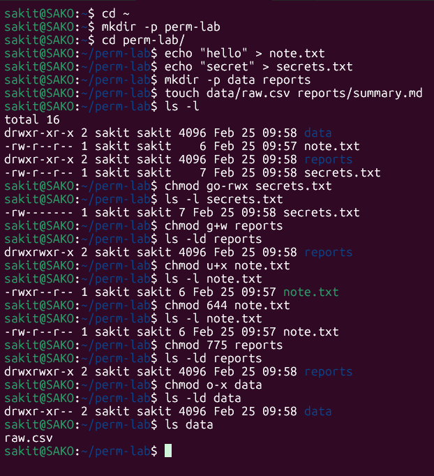

# Lab 1 - File Permissions in Linux

In this lab, Linux file permission management was practiced using both symbolic and numeric (octal) `chmod` modes. A working directory was set up with files and directories, and various permission changes were applied and verified.

---

## 📌 Step 1 — Setting Up the Lab Environment

A working directory (`perm-lab`) was created with sample files and directories.

**Commands executed:**
```bash
cd ~                                    # Go to home directory
mkdir -p perm-lab                       # Create lab directory
cd perm-lab/                            # Enter the directory
echo "hello" > note.txt                 # Create note.txt with content
echo "secret" > secrets.txt             # Create secrets.txt with content
mkdir -p data reports                   # Create two subdirectories
touch data/raw.csv reports/summary.md   # Create files inside subdirectories
ls -l                                   # View file permissions
```

**Result:** Initial permissions:
| Type | Permissions | Name |
|------|-------------|------|
| dir | `drwxr-xr-x` | data |
| file | `-rw-r--r--` | note.txt |
| dir | `drwxr-xr-x` | reports |
| file | `-rw-r--r--` | secrets.txt |

---

## 📌 Step 2 — Symbolic Mode: Removing Permissions (`go-rwx`)

All permissions for **group** and **others** were removed from `secrets.txt`.

```bash
chmod go-rwx secrets.txt      # Remove all permissions for group and others
ls -l secrets.txt             # Verify
```

**Result:** `-rw------- 1 sakit sakit 7 ... secrets.txt`
- Only the owner can read and write. Group and others have **no access**.

---

## 📌 Step 3 — Symbolic Mode: Adding Group Write (`g+w`)

Write permission was added for the **group** on the `reports` directory.

```bash
chmod g+w reports         # Add group write permission
ls -ld reports            # Verify directory permissions
```

**Result:** `drwxrwxr-x 2 sakit sakit ... reports`
- Group now has **write** permission in addition to read and execute.

---

## 📌 Step 4 — Symbolic Mode: Adding User Execute (`u+x`)

Execute permission was added for the **owner** on `note.txt`.

```bash
chmod u+x note.txt        # Add execute permission for owner
ls -l note.txt            # Verify
```

**Result:** `-rwxr--r-- 1 sakit sakit 6 ... note.txt`
- Owner now has **read, write, and execute** permissions.

---

## 📌 Step 5 — Numeric Mode: Setting `644` (rw-r--r--)

Permissions were set back to the default `644` using octal notation.

```bash
chmod 644 note.txt        # Set permissions to rw-r--r--
ls -l note.txt            # Verify
```

**Result:** `-rw-r--r-- 1 sakit sakit 6 ... note.txt`
- Owner: read + write | Group: read | Others: read

---

## 📌 Step 6 — Numeric Mode: Setting `775` (rwxrwxr-x)

Full permissions were given to owner and group, with read+execute for others.

```bash
chmod 775 reports         # Set permissions to rwxrwxr-x
ls -ld reports            # Verify
```

**Result:** `drwxrwxr-x 2 sakit sakit ... reports`
- Owner & Group: read + write + execute | Others: read + execute

---

## 📌 Step 7 — Symbolic Mode: Removing Others' Execute (`o-x`)

Execute permission was removed for **others** on the `data` directory.

```bash
chmod o-x data            # Remove execute permission for others
ls -ld data               # Verify
```

**Result:** `drwxr-xr-- 2 sakit sakit ... data`
- Others can read but **cannot enter** the directory (no execute).

Despite this, `ls data` still listed `raw.csv` — because the **owner** ran the command and has full permissions.



---

## 🧠 Key Takeaways

### Symbolic Mode
| Notation | Meaning |
|----------|---------|
| `u` | User (owner) |
| `g` | Group |
| `o` | Others |
| `+` | Add permission |
| `-` | Remove permission |
| `r` | Read |
| `w` | Write |
| `x` | Execute |

### Numeric (Octal) Mode
| Number | Permission |
|--------|------------|
| `7` | rwx (read + write + execute) |
| `6` | rw- (read + write) |
| `5` | r-x (read + execute) |
| `4` | r-- (read only) |
| `0` | --- (no permission) |

### Common Permission Patterns
| Octal | Symbolic | Use Case |
|-------|----------|----------|
| `644` | `-rw-r--r--` | Default for files |
| `755` | `-rwxr-xr-x` | Executable files / directories |
| `775` | `-rwxrwxr-x` | Shared group directories |
| `700` | `-rwx------` | Private files/directories |
| `600` | `-rw-------` | Sensitive files (e.g., SSH keys) |
