# Project 1: Architect & Deploy a Secure, Scalable 3-Tier Web App on Azure

## 📋 Overview

This project demonstrates the end-to-end deployment of a **secure, scalable three-tier e-commerce web application** on **Microsoft Azure**. The application is built with a **React frontend**, a **Node.js/Express backend**, and an **Azure SQL Database**, all deployed as containerized services on **Azure App Service** and secured behind an **Azure Application Gateway** with path-based routing. The infrastructure leverages **Virtual Network (VNet) integration**, **private endpoints**, **Network Security Groups (NSGs)**, **custom autoscaling**, and **metric-based alerting** to ensure enterprise-grade security and scalability.

---

## 🎯 Objectives

- Deploy a three-tier e-commerce application on Azure cloud infrastructure
- Containerize frontend and backend services using **Docker** and publish to **Docker Hub**
- Deploy containers to **Azure App Service** (Web App for Containers)
- Provision **Azure SQL Database** for persistent data storage
- Configure **Azure Virtual Network (VNet)** with dedicated subnets for network isolation
- Secure services using **Private Endpoints** and **Network Security Groups (NSGs)**
- Set up **Azure Application Gateway** with path-based routing for traffic management
- Implement **custom autoscaling** rules based on CPU metrics
- Configure **metric-based alert rules** for proactive monitoring

---

## 🔧 Prerequisites

| Requirement | Details |
|---|---|
| **Azure Subscription** | Active Azure account with sufficient permissions |
| **Docker** | Installed locally for building container images |
| **Docker Hub** | Account for publishing container images |
| **Node.js 18+** | For local development and testing |
| **Azure CLI** | For managing Azure resources (optional) |
| **Git** | For version control |

---

## 🏗️ Architecture

The application follows a classic three-tier architecture deployed on Azure:

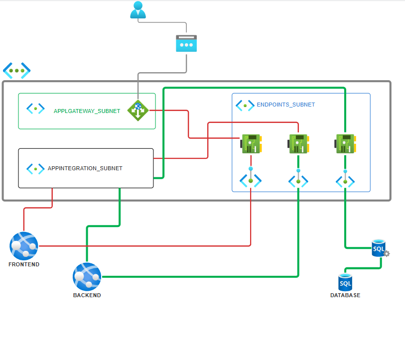

### Architecture Components

| Tier | Service | Azure Resource | Description |
|---|---|---|---|
| **Presentation** | Frontend (React) | Azure App Service | Containerized React app serving the UI |
| **Application** | Backend (Node.js) | Azure App Service | Containerized Express.js API server |
| **Data** | Database (SQL) | Azure SQL Database | Managed SQL database for persistent storage |
| **Networking** | Application Gateway | Azure Application Gateway | L7 load balancer with path-based routing |
| **Security** | VNet + NSGs + Private Endpoints | Azure Virtual Network | Network isolation and access control |

### Full Azure Resource Visualization

> **Note:** The resource visualization above shows all deployed Azure resources and their interconnections within the **GROUP7_APP** resource group.

---

## 📝 Deployment Steps

### Step 1: Virtual Network (VNet) Configuration

An Azure Virtual Network named **AppNetwork** was created to provide network isolation for all application components. Three dedicated subnets were configured:

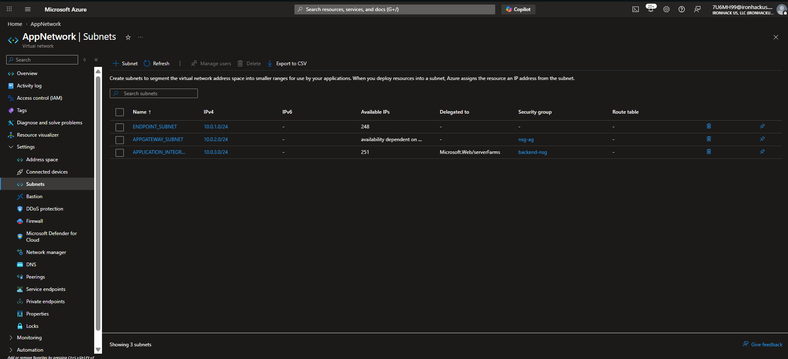

| Subnet Name | IPv4 CIDR | Purpose | Security Group |
|---|---|---|---|
| **ENDPOINT_SUBNET** | `10.0.1.0/24` | Hosts private endpoints for secure connectivity | — |
| **APPGATEWAY_SUBNET** | `10.0.2.0/24` | Dedicated subnet for Application Gateway | `nsg-ag` |
| **APPLICATION_INTEGRATION** | `10.0.3.0/24` | VNet integration for App Service outbound traffic | `backend-nsg` |

> **Note:** The `APPLICATION_INTEGRATION` subnet is delegated to `Microsoft.Web/serverFarms`, enabling App Service VNet integration for outbound connectivity.

---

### Step 2: Private Endpoints

Private Endpoints were configured within the **ENDPOINT_SUBNET** to ensure that backend services communicate over the Azure backbone network, not the public internet:

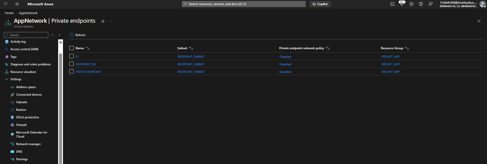

| Endpoint Name | Subnet | Resource Group |
|---|---|---|
| **E1** | ENDPOINT_SUBNET | GROUP7_APP |
| **ENDPOINT_DB** | ENDPOINT_SUBNET | GROUP7_APP |
| **FRONT-ENDPOINT** | ENDPOINT_SUBNET | GROUP7_APP |

> **Note:** Private DNS zones (`privatelink.azurewebsites.net`, `privatelink.database.windows.net`) were configured to resolve private endpoint FQDNs to their private IP addresses within the VNet.

---

### Step 3: Backend App Service Deployment

The backend API was deployed as a containerized service on **Azure App Service** using a Docker image from Docker Hub.

#### 3a. Backend Overview

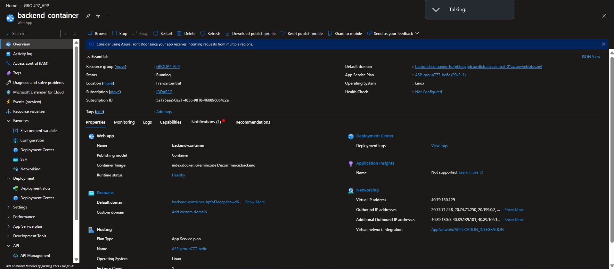

| Property | Value |
|---|---|
| **Name** | `backend-container` |
| **Resource Group** | GROUP7_APP |
| **Status** | ✅ Running |
| **Location** | France Central |
| **Operating System** | Linux |
| **Publishing Model** | Container |
| **Container Image** | `index.docker.io/emincode1/ecommerce:backend` |
| **Runtime Status** | Healthy |
| **App Service Plan** | ASP-group777-be6c (P0v3: 1) |
| **VNet Integration** | AppNetwork/APPLICATION_INTEGRATION |

#### 3b. Backend Environment Variables

The backend service was configured with the following environment variables:

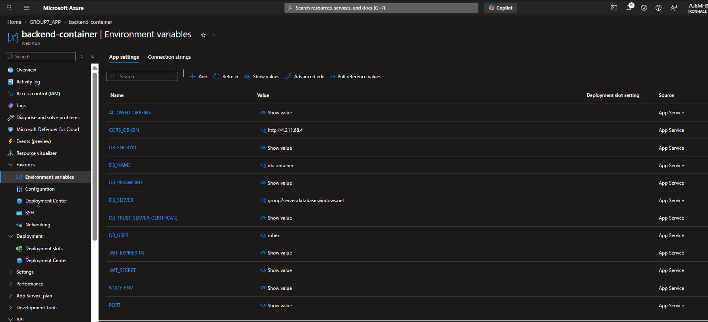

| Variable | Value | Purpose |
|---|---|---|
| `ALLOWED_ORIGINS` | *(hidden)* | CORS allowed origins |
| `CORS_ORIGIN` | `http://4.211.68.4` | Application Gateway public IP |
| `DB_ENCRYPT` | *(hidden)* | Database encryption flag |
| `DB_NAME` | `dbcontainer` | Azure SQL Database name |
| `DB_PASSWORD` | *(hidden)* | Database password |
| `DB_SERVER` | `group7server.database.windows.net` | Azure SQL server FQDN |
| `DB_TRUST_SERVER_CERTIFICATE` | *(hidden)* | TLS certificate trust setting |
| `DB_USER` | `rubex` | Database username |
| `JWT_EXPIRES_IN` | *(hidden)* | JWT token expiration |
| `JWT_SECRET` | *(hidden)* | JWT signing secret |
| `NODE_ENV` | *(hidden)* | Node environment |
| `PORT` | *(hidden)* | Server port |

#### 3c. Backend Deployment Center

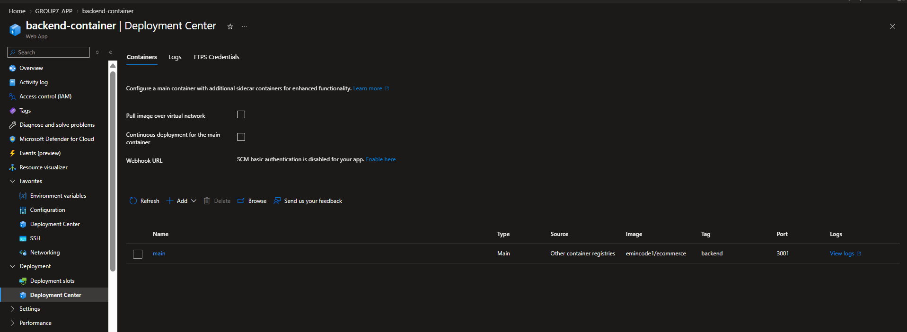

| Property | Value |
|---|---|
| **Container Name** | main |
| **Source** | Other container registries |
| **Image** | `emincode1/ecommerce` |
| **Tag** | `backend` |
| **Port** | 3001 |

#### 3d. Backend Networking

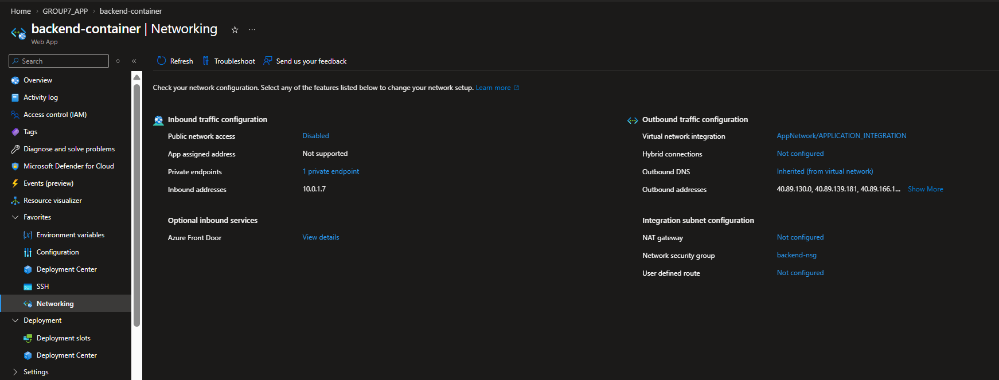

| Configuration | Value |
|---|---|
| **Public Network Access** | ❌ Disabled |
| **Private Endpoints** | 1 private endpoint |
| **Inbound Address** | `10.0.1.7` |
| **VNet Integration** | AppNetwork/APPLICATION_INTEGRATION |
| **Network Security Group** | `backend-nsg` |
| **Outbound DNS** | Inherited (from virtual network) |

> **Note:** Public network access is disabled — the backend is only accessible through the private endpoint and the Application Gateway, ensuring that the API cannot be reached directly from the internet.

#### 3e. Backend Log Stream

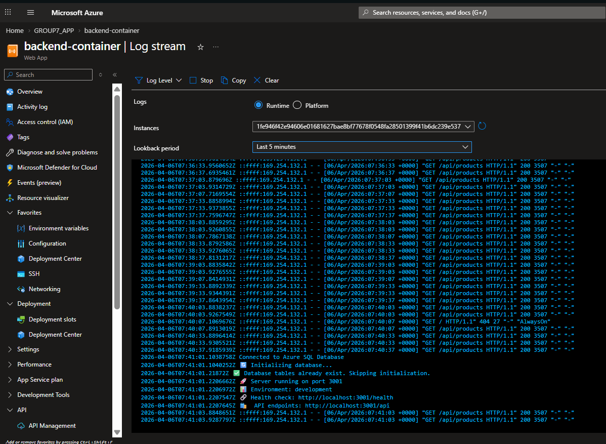

The backend log stream confirms successful operation:
- ✅ Connected to Azure SQL Database
- ✅ Database tables already exist — skipping initialization
- ✅ Server running on port 3001
- ✅ Environment: development
- ✅ Health check: `http://localhost:3001/health`
- ✅ API endpoints: `http://localhost:3001/api`
- ✅ Serving `GET /api/products` requests with HTTP 200 responses

---

### Step 4: Frontend App Service Deployment

The frontend was deployed as a containerized React application on Azure App Service.

#### 4a. Frontend Overview

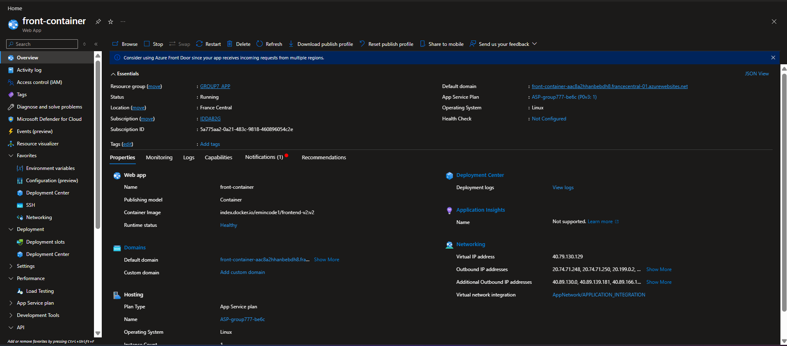

| Property | Value |
|---|---|
| **Name** | `front-container` |
| **Resource Group** | GROUP7_APP |
| **Status** | ✅ Running |
| **Location** | France Central |
| **Operating System** | Linux |
| **Publishing Model** | Container |
| **Container Image** | `index.docker.io/emincode1/frontend-v2v2` |
| **Runtime Status** | Healthy |
| **App Service Plan** | ASP-group777-be6c (P0v3: 1) |
| **VNet Integration** | AppNetwork/APPLICATION_INTEGRATION |

#### 4b. Frontend Environment Variables

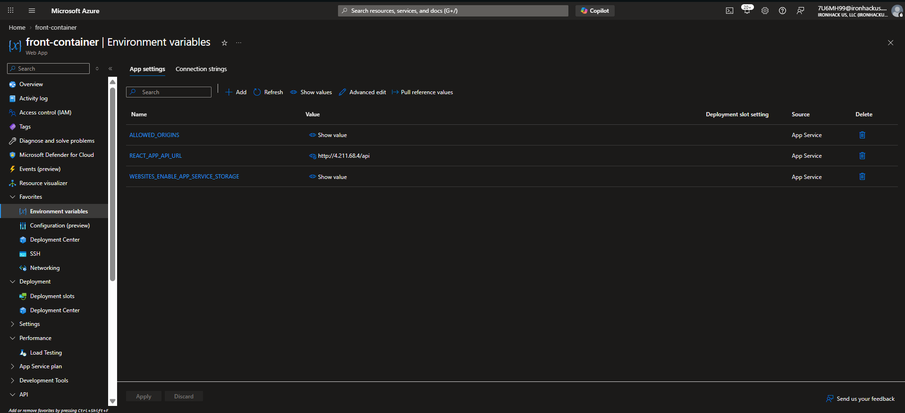

| Variable | Value | Purpose |
|---|---|---|
| `ALLOWED_ORIGINS` | *(hidden)* | CORS allowed origins |
| `REACT_APP_API_URL` | `http://4.211.68.4/api` | Backend API URL (via App Gateway) |
| `WEBSITES_ENABLE_APP_SERVICE_STORAGE` | *(hidden)* | App Service storage setting |

#### 4c. Frontend Networking

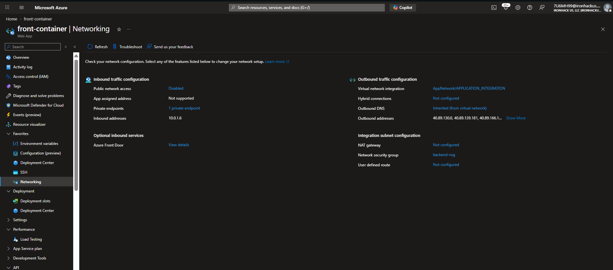

| Configuration | Value |
|---|---|
| **Public Network Access** | ❌ Disabled |
| **Private Endpoints** | 1 private endpoint |
| **Inbound Address** | `10.0.1.6` |
| **VNet Integration** | AppNetwork/APPLICATION_INTEGRATION |
| **Network Security Group** | `backend-nsg` |

#### 4d. Frontend Configuration

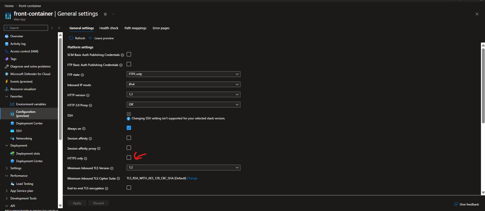

| Setting | Value |
|---|---|
| **FTP State** | FTPS only |
| **HTTP Version** | 1.1 |
| **Always On** | ✅ Enabled |
| **Minimum TLS Version** | 1.2 |
| **Minimum TLS Cipher Suite** | TLS_RSA_WITH_AES_128_CBC_SHA (Default) |

#### 4e. Frontend Log Stream

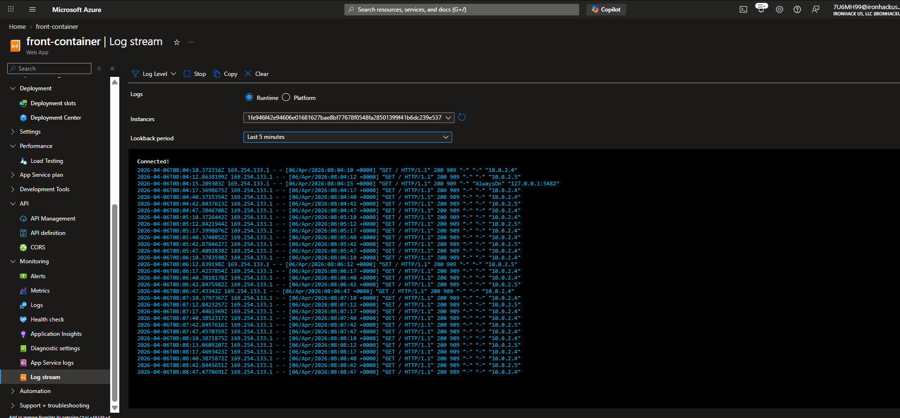

The frontend log stream shows healthy operation with consistent `GET / HTTP/1.1 200` responses from the Application Gateway health probes.

---

### Step 5: Azure SQL Database

The data tier uses **Azure SQL Database** with the server **group7server** and database **dbcontainer**.

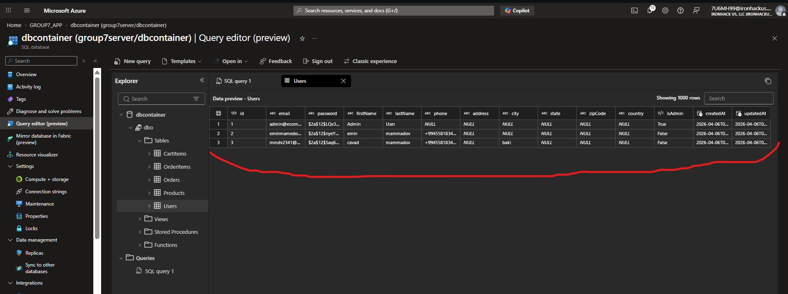

**Database Schema (Tables):**

| Table | Description |
|---|---|
| **CartItems** | Shopping cart items per user |
| **OrderItems** | Individual items within orders |
| **Orders** | Order management and tracking |
| **Products** | Product catalog |
| **Users** | User authentication and profile data |

The query editor screenshot shows sample user data in the **Users** table, confirming that the database is operational and connected to the application:

| id | email | firstName | lastName | isAdmin |
|---|---|---|---|---|
| 1 | admin@ecom... | Admin | User | True |
| 2 | eminmamedo... | emin | mammadov | False |
| 3 | mmdv2341@... | cavad | mammadov | False |

---

### Step 6: Application Gateway Configuration

An **Azure Application Gateway** named **AG_APP** was configured as the single entry point for all traffic, providing L7 load balancing and path-based routing.

#### 6a. Application Gateway Overview

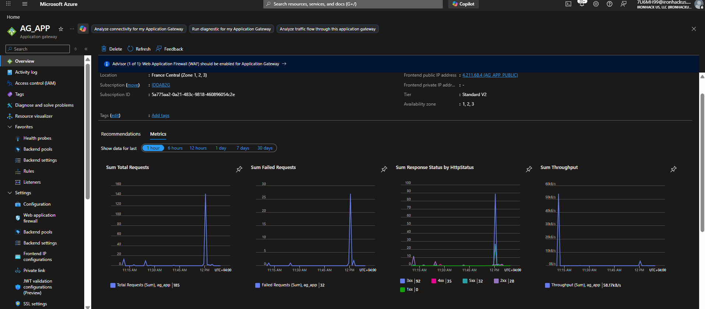

| Property | Value |
|---|---|
| **Name** | AG_APP |
| **Location** | France Central (Zone 1, 2, 3) |
| **Frontend Public IP** | `4.211.68.4` (AG_APP_PUBLIC) |
| **Tier** | Standard V2 |
| **Availability Zones** | 1, 2, 3 |
| **Total Requests (1h)** | ~185 |
| **Failed Requests (1h)** | ~32 |
| **Throughput** | ~58.17 kB/s |

#### 6b. Backend Pools & Health

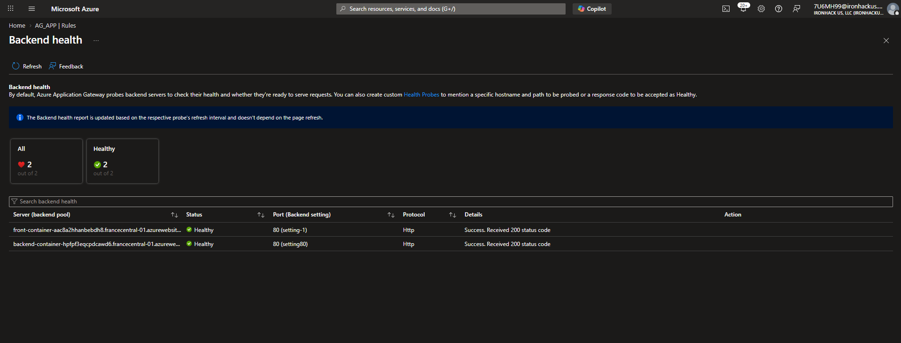

| Server (Backend Pool) | Status | Port (Backend Setting) | Protocol | Details |
|---|---|---|---|---|
| `front-container-aac8a2hhanbebdh8.francecentral-01.azurewebsit...` | ✅ Healthy | 80 (setting-1) | HTTP | Success. Received 200 status code |
| `backend-container-hpfpf3eqcpdcawd6.francecentral-01.azurewe...` | ✅ Healthy | 80 (setting80) | HTTP | Success. Received 200 status code |

#### 6c. Routing Rules (Path-Based)

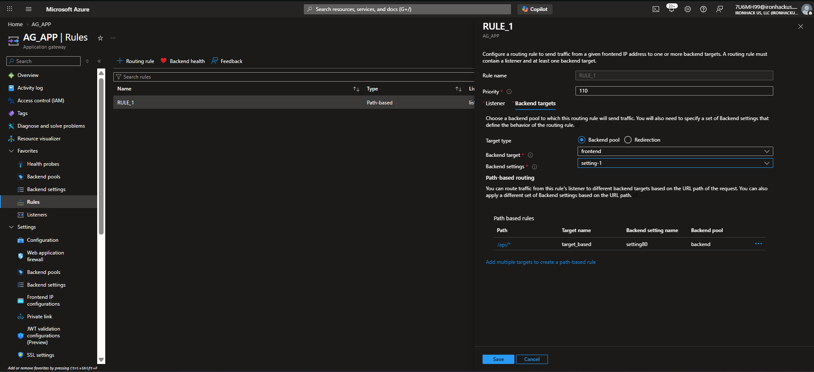

| Rule | Priority | Type | Default Backend Pool | Default Backend Setting |
|---|---|---|---|---|
| **RULE_1** | 110 | Path-based | `frontend` | `setting-1` |

**Path-Based Routing:**

| Path | Target Name | Backend Setting | Backend Pool |
|---|---|---|---|
| `/api/*` | `target_based` | `setting80` | `backend` |

> **Note:** All requests to `/api/*` are routed to the backend pool, while all other requests are served by the frontend pool. This enables a single public IP to serve both the frontend and backend.

#### 6d. Health Probes

**Backend Health Probe:**

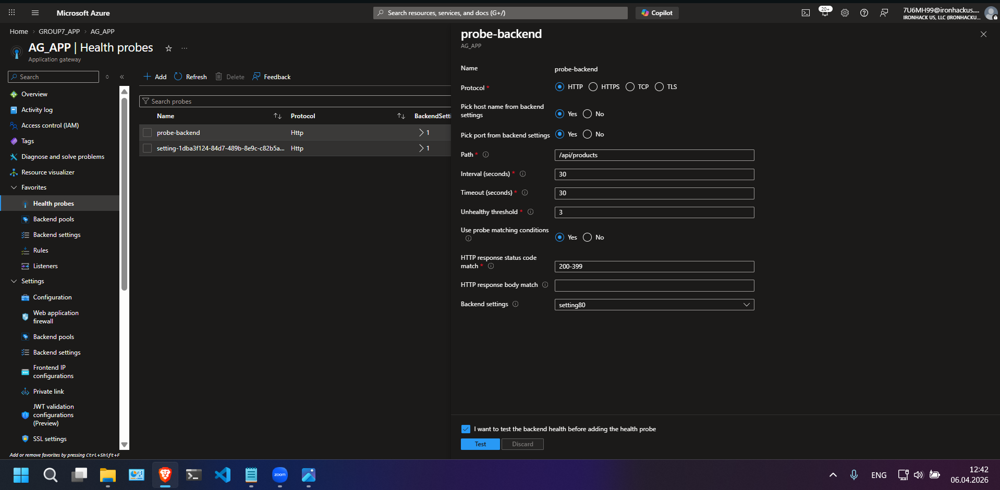

| Setting | Value |
|---|---|
| **Name** | `probe-backend` |
| **Protocol** | HTTP |
| **Path** | `/api/products` |
| **Interval** | 30 seconds |
| **Timeout** | 30 seconds |
| **Unhealthy Threshold** | 3 |
| **Status Code Match** | 200-399 |
| **Backend Settings** | `setting80` |

**Frontend Health Probe:**

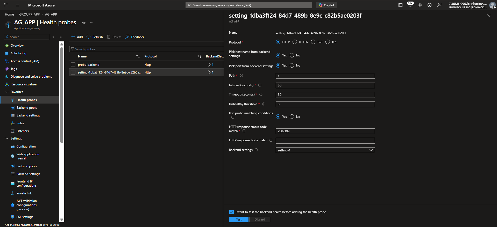

| Setting | Value |
|---|---|
| **Name** | `setting-1dba3f124-84d7-489b-8e9c-c82b5ae0203f` |
| **Protocol** | HTTP |
| **Path** | `/` |
| **Interval** | 30 seconds |
| **Timeout** | 30 seconds |
| **Unhealthy Threshold** | 3 |
| **Status Code Match** | 200-399 |
| **Backend Settings** | `setting-1` |

---

### Step 7: Autoscaling Configuration

Custom autoscaling rules were configured on the App Service Plan (**ASP-group777-be6c**) to handle traffic spikes automatically.

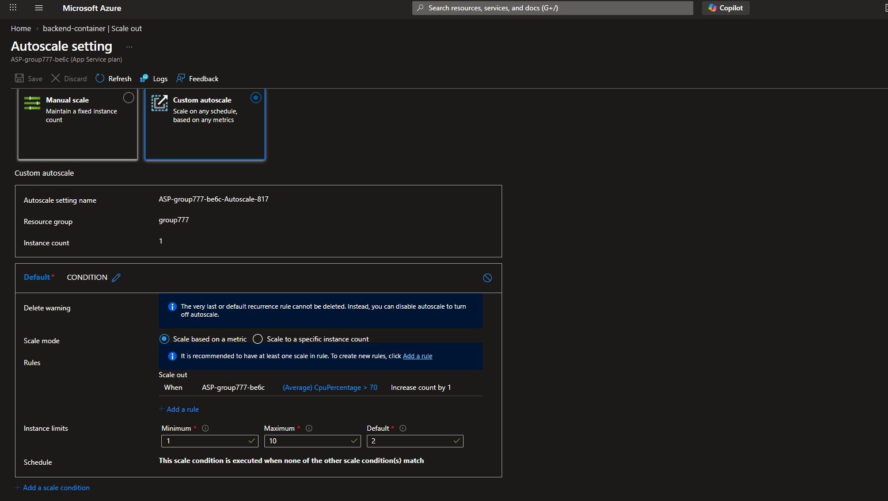

| Setting | Value |
|---|---|
| **Autoscale Setting Name** | ASP-group777-be6c-Autoscale-817 |
| **Scale Mode** | Custom autoscale (metric-based) |
| **Scale-Out Rule** | When **Average CpuPercentage > 70** → Increase count by 1 |
| **Instance Limits — Minimum** | 1 |
| **Instance Limits — Maximum** | 10 |
| **Instance Limits — Default** | 2 |

> **Note:** The autoscaling rule monitors CPU percentage on the App Service Plan. When the average CPU exceeds 70%, a new instance is provisioned (up to a maximum of 10 instances), ensuring the application can handle increased load.

---

### Step 8: Alert Rules

Metric-based alert rules were configured to provide proactive monitoring and rapid incident response.

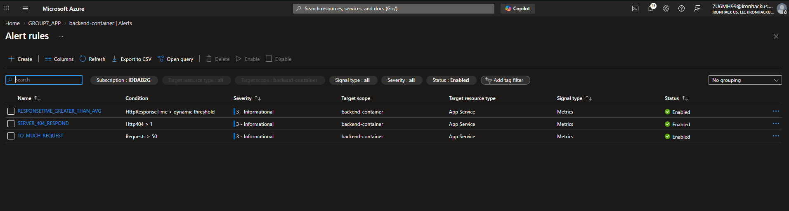

| Alert Name | Condition | Severity | Target Scope | Signal Type | Status |
|---|---|---|---|---|---|
| **RESPONSETIME_GREATER_THAN_AVG** | HttpResponseTime > dynamic threshold | 3 - Informational | backend-container | Metrics | ✅ Enabled |
| **SERVER_404_RESPOND** | Http404 > 1 | 3 - Informational | backend-container | Metrics | ✅ Enabled |
| **TO_MUCH_REQUEST** | Requests > 50 | 3 - Informational | backend-container | Metrics | ✅ Enabled |

> **Note:** An **Action Group** named `group-7` was configured to handle alert notifications, ensuring the team is notified when any of these threshold conditions are met.

---

## 🌐 Live Application Screenshots

### Homepage

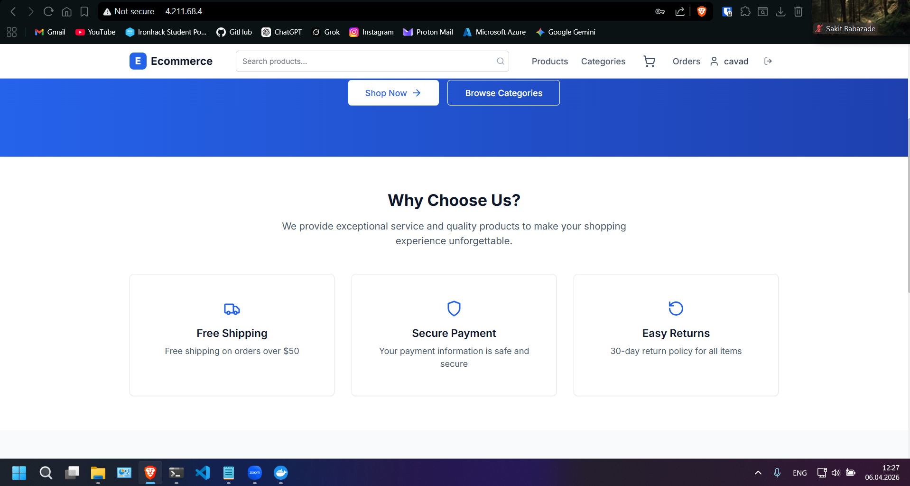

The homepage features a modern e-commerce interface with:
- Navigation bar with Products, Categories, Cart, and User menu
- Hero section with "Shop Now" and "Browse Categories" CTAs
- "Why Choose Us?" section highlighting Free Shipping, Secure Payment, and Easy Returns

### Products Page

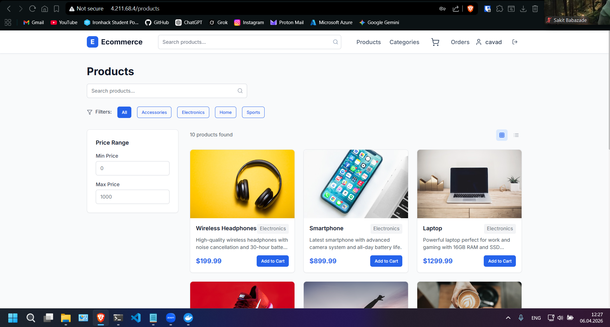

The products page includes:
- Search functionality and category filters (All, Accessories, Electronics, Home, Sports)
- Price range filter (Min/Max)
- Product cards with images, descriptions, prices, and "Add to Cart" buttons
- Grid/list view toggle

### Login Page

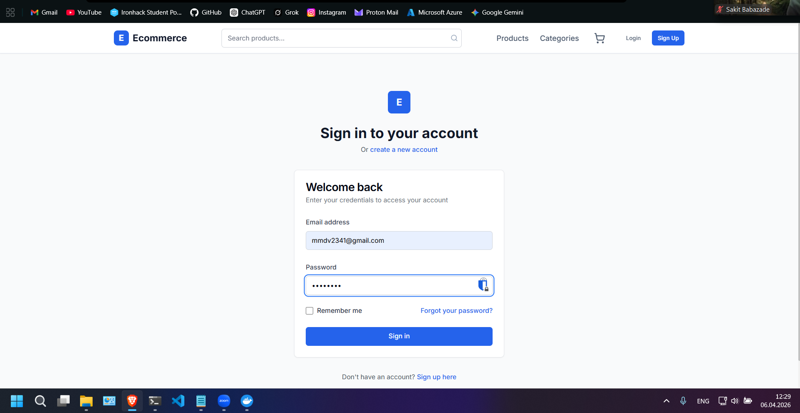

The authentication page provides:
- Email/password login form
- "Remember me" and "Forgot your password?" options
- "Create a new account" link for registration

### Login Success

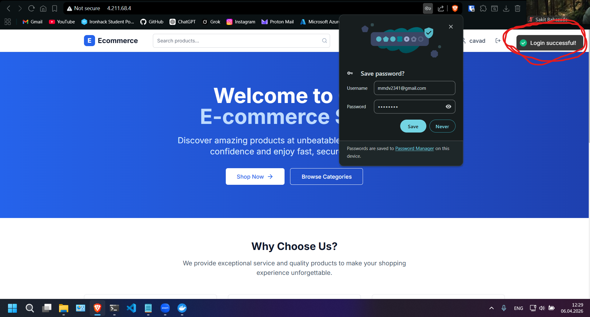

After successful authentication, a green "Login successful!" toast notification confirms the user is logged in, and the user's name appears in the navigation bar.

### Shopping Cart

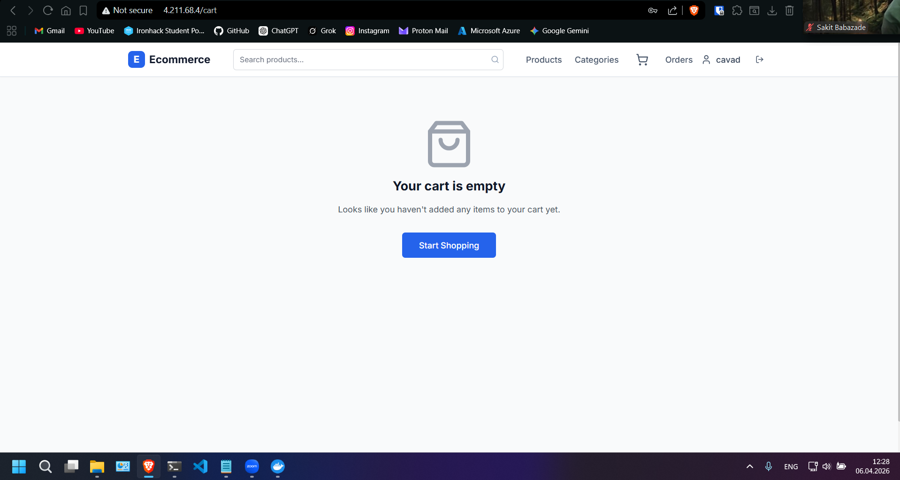

The cart page displays the user's cart status and a "Start Shopping" CTA when empty.

---

## 🔒 Security Features

| Feature | Implementation |
|---|---|
| **Network Isolation** | VNet with 3 dedicated subnets (endpoints, gateway, app integration) |
| **Private Endpoints** | Frontend, Backend, and Database accessible only via private IPs |
| **NSGs** | `nsg-ag` for Application Gateway, `backend-nsg` for App Services |
| **No Public Access** | App Services have public network access disabled |
| **TLS 1.2** | Minimum inbound TLS version enforced |
| **FTPS Only** | FTP access restricted to FTPS |
| **JWT Authentication** | Application-level auth with JWT tokens |
| **Password Hashing** | bcrypt for secure password storage |
| **Private DNS Zones** | `privatelink.azurewebsites.net` and `privatelink.database.windows.net` |

---

## 📊 Summary

| Task | Azure Service / Resource | Status |
|---|---|---|
| Create Virtual Network with 3 subnets | Azure VNet (AppNetwork) | ✅ |
| Configure Private Endpoints | VNet Private Endpoints (E1, ENDPOINT_DB, FRONT-ENDPOINT) | ✅ |
| Deploy Backend container | Azure App Service (backend-container) | ✅ |
| Deploy Frontend container | Azure App Service (front-container) | ✅ |
| Provision SQL Database | Azure SQL Database (group7server/dbcontainer) | ✅ |
| Configure Application Gateway | Azure Application Gateway (AG_APP) | ✅ |
| Set up path-based routing | App Gateway Rule (RULE_1: `/api/*` → backend) | ✅ |
| Configure health probes | Backend probe (`/api/products`), Frontend probe (`/`) | ✅ |
| Set up autoscaling | Custom autoscale (CPU > 70% → scale out, max 10) | ✅ |
| Configure alert rules | 3 metric alerts (Response time, 404s, Request count) | ✅ |
| Disable public access | App Services accessible only via Private Endpoints | ✅ |
| Verify application | E-commerce app functional via App Gateway IP (4.211.68.4) | ✅ |

---

## 💡 Key Takeaways

1. **Azure App Service with Containers** provides a managed platform for deploying Docker containers without managing the underlying infrastructure, while still allowing fine-grained configuration of environment variables, networking, and scaling
2. **Virtual Network integration** with dedicated subnets ensures network isolation between tiers — the Application Gateway subnet, endpoint subnet, and application integration subnet each serve a distinct purpose
3. **Private Endpoints** eliminate public internet exposure for backend services — the frontend and backend App Services are only reachable through their private IP addresses within the VNet
4. **Azure Application Gateway** with path-based routing enables a single public IP to serve both frontend and API traffic — requests to `/api/*` are routed to the backend pool, while all other traffic goes to the frontend pool
5. **Custom autoscaling** based on CPU metrics ensures the application scales automatically under load (1–10 instances), providing both cost efficiency during low traffic and resilience during spikes
6. **Metric-based alert rules** provide proactive monitoring — alerts for response time anomalies, 404 errors, and high request counts enable rapid incident response
7. **Private DNS zones** (`privatelink.azurewebsites.net`, `privatelink.database.windows.net`) resolve service FQDNs to private IPs within the VNet, ensuring all inter-service traffic stays on the Azure backbone network
8. **NSGs** (`nsg-ag`, `backend-nsg`) provide an additional layer of network security by controlling inbound and outbound traffic at the subnet level
