# Lab 1: Create Your First GitHub Actions Workflow

## 📋 Overview

This lab provides a step-by-step guide to creating your first **GitHub Actions workflow**. It walks through the entire process — from creating a new repository on GitHub, adding a simple CI workflow using the built-in template, understanding the YAML syntax, cloning the repository locally, and modifying the workflow. The lab also introduces more advanced workflow concepts such as **Matrix Builds** (running jobs across multiple OS/Node.js version combinations) and **Scheduled Workflows** (cron-based triggers with manual input parameters).

---

## 🎯 Objectives

- Create a new GitHub repository with a README file
- Navigate the GitHub Actions tab and configure a simple workflow
- Understand GitHub Actions workflow YAML syntax (triggers, jobs, steps)
- Clone the repository locally and modify workflows
- Create a Matrix Build workflow to test across multiple OS and Node.js versions
- Create a Scheduled & Manual workflow with cron syntax and user inputs
- Run and inspect workflow executions via the Actions tab

---

## 🔧 Prerequisites

| Requirement | Details |
|---|---|
| **Git** | Installed on the local machine |
| **Text Editor** | Visual Studio Code (recommended) |
| **GitHub Account** | Valid credentials with repository creation access |
| **Terminal** | Bash/Zsh terminal with Git CLI access |

---

## 📝 Lab Steps

### Step 1: Create a New Code Repository

Log in to your GitHub account and create a new repository. Enable the "Add README" option and add a text message to it:

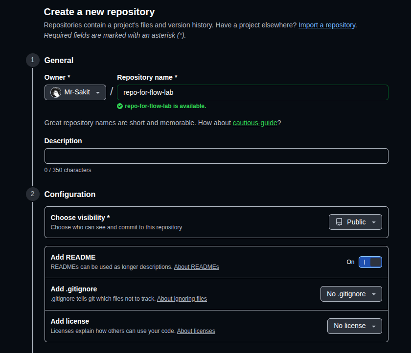

The repository is created with a `README.md` file and is ready for workflow configuration:

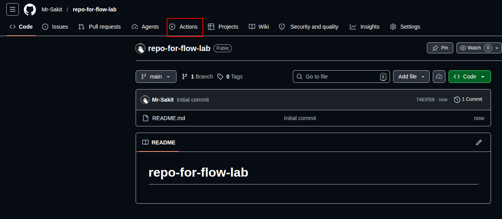

> **Note:** The repository name used in this lab is `repo-for-flow-lab`. It is set to **Public** visibility with a README file initialized.

---

### Step 2: Add a New GitHub Actions Workflow

Navigate to the **Actions** tab from the top of the repository page. Select the **"Simple workflow"** template and click **Configure**:

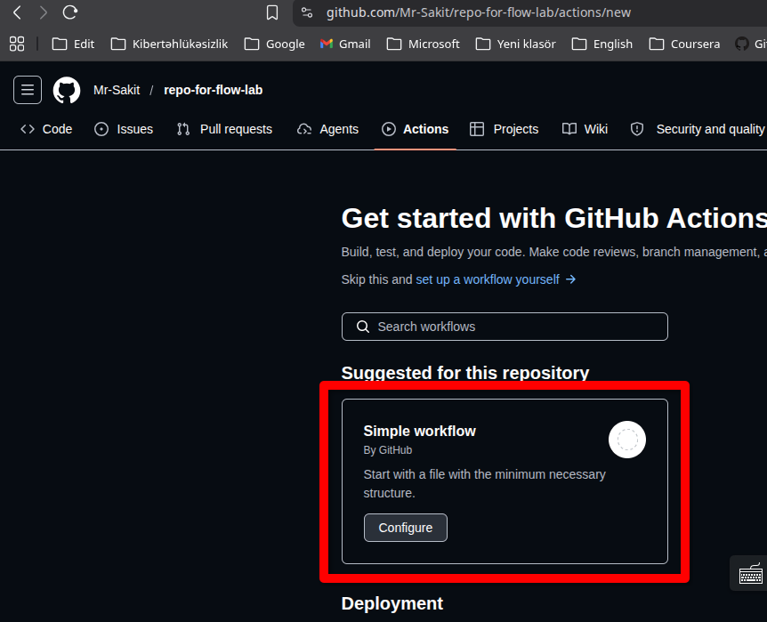

This opens an editor with a pre-populated YAML workflow file (`blank.yml`):

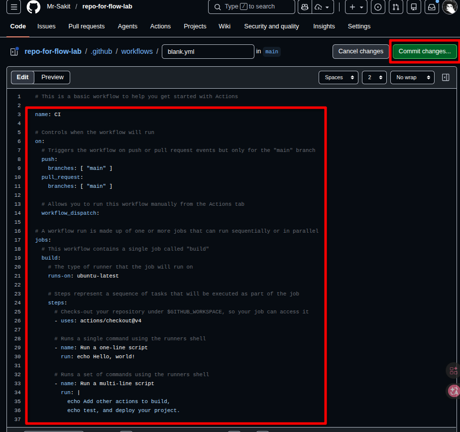

**Understanding the Workflow Code:**

```yaml
name: CI

on:
  push:
    branches: [ "main" ]
  pull_request:
    branches: [ "main" ]
  workflow_dispatch:

jobs:
  build:
    runs-on: ubuntu-latest

    steps:
      - uses: actions/checkout@v4

      - name: Run a one-line script
        run: echo Hello, world!

      - name: Run a multi-line script
        run: |
          echo Add other actions to build,
          echo test, and deploy your project.
```

**Code Breakdown:**

| Section | Description |
|---|---|
| `name: CI` | Names the workflow "CI" (visible in the Actions tab) |
| `on: push` | Triggers on pushes to the `main` branch |
| `on: pull_request` | Triggers on pull requests targeting `main` |
| `on: workflow_dispatch` | Allows manual triggering from the GitHub UI |
| `runs-on: ubuntu-latest` | Runs the job on an Ubuntu Linux runner |
| `actions/checkout@v4` | Checks out the repository code for subsequent steps |
| `Run a one-line script` | Prints "Hello, world!" to the console |
| `Run a multi-line script` | Prints two lines of text to the console |

Click **Commit Changes** and add a commit message. This creates the `.github/workflows` folder — the default location for all GitHub Actions workflows.

---

### Step 3: Verify the Workflow Execution

Since the trigger includes a `push` event on the `main` branch, committing the workflow file automatically triggers its execution. Navigate to the **Actions** tab to see the workflow run:

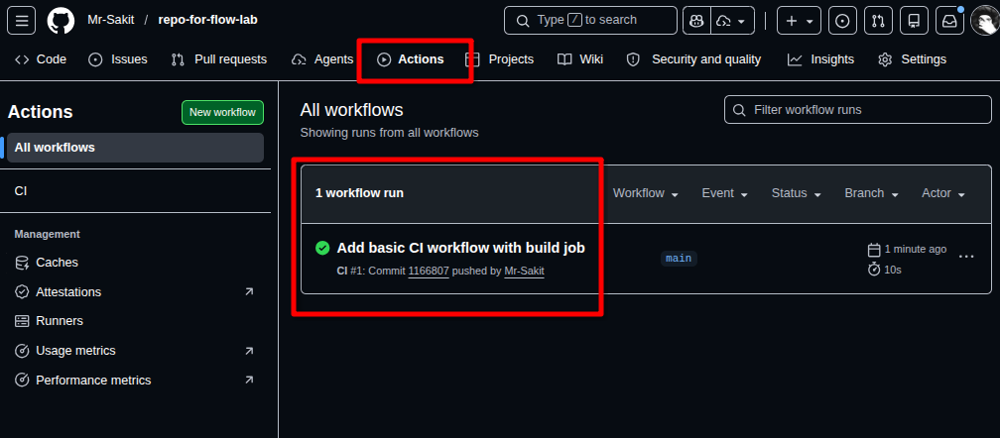

The green checkmark next to **"build"** indicates a successful job completion. Click on the job execution to view the detailed logs:

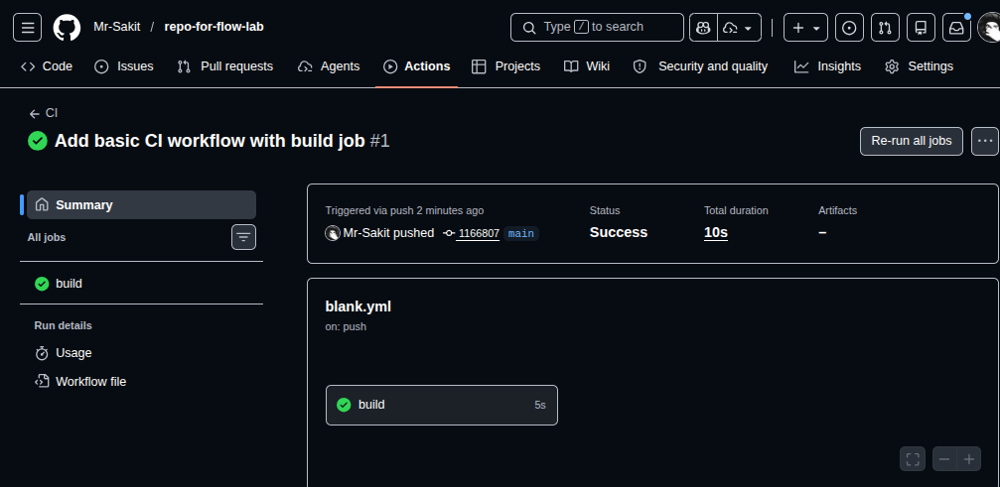

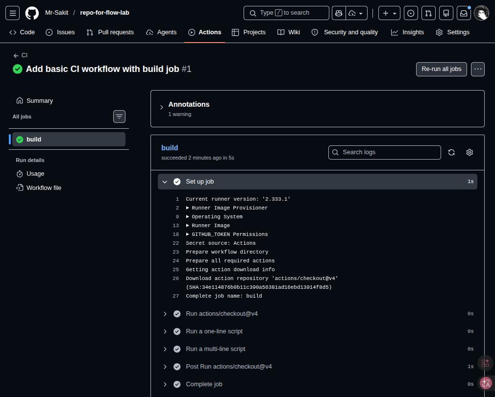

The logs show each step executed successfully:
- ✅ Set up job
- ✅ Run actions/checkout@v4
- ✅ Run a one-line script
- ✅ Run a multi-line script
- ✅ Complete job

> **Tip:** Logs are extremely helpful for debugging issues and errors in your workflows.

---

### Step 3: Clone the Repository and Modify the Workflow

Clone the repository locally to make further changes:

```bash
git clone https://github.com/Mr-Sakit/repo-for-flow-lab
cd repo-for-flow-lab
```

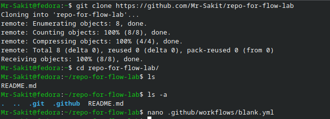

Notice the `.github/workflows` folder — this is where all workflow pipeline files reside.

Update the workflow triggers to only `workflow_dispatch` (manual triggers) to avoid running too many workflows automatically:

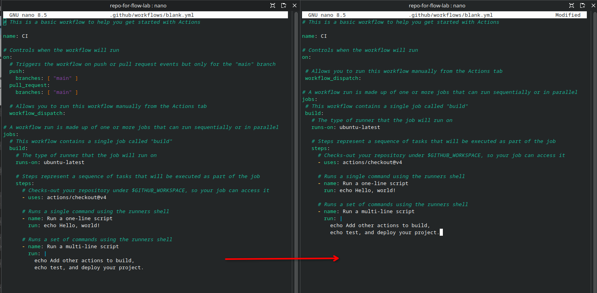

Commit and push the changes:

```bash
git add .
git commit -m "blank.yml modified"
git push origin main
```

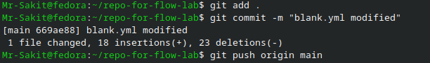

---

### Step 4: Matrix Builds

A **matrix strategy** lets you use variables in a single job definition to automatically create multiple job runs based on the combinations of the variables. This is perfect for testing code across multiple Node.js versions and operating systems.

Create a new workflow file `workflow ci-matrix.yml` with the following code:

```yaml
name: Matrix Build
on:
    workflow_dispatch:

jobs:
  build:
    runs-on: ${{ matrix.os }}
    strategy:
      matrix:
        os: [ubuntu-latest, windows-latest]
        node: [18, 20]
    steps:
      - uses: actions/checkout@v4

      - name: Setup Node ${{ matrix.node }}
        uses: actions/setup-node@v4
        with:
          node-version: ${{ matrix.node }}

      - name: Print environment
        run: |
          node -v
          echo "OS: $RUNNER_OS"
```

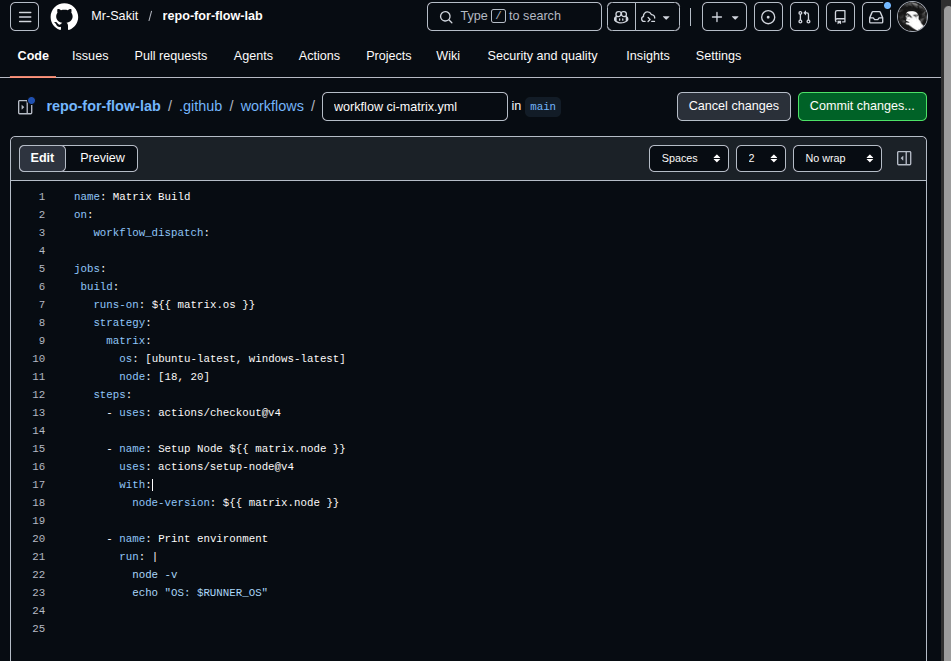

Commit and push the code. Navigate to the **Actions** tab and select the **Matrix Build** workflow. Click **Run workflow** on the `main` branch:

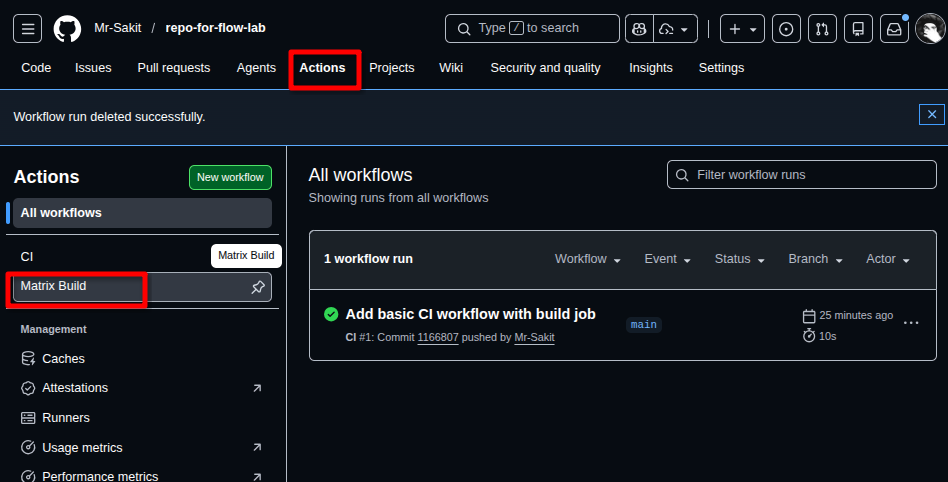

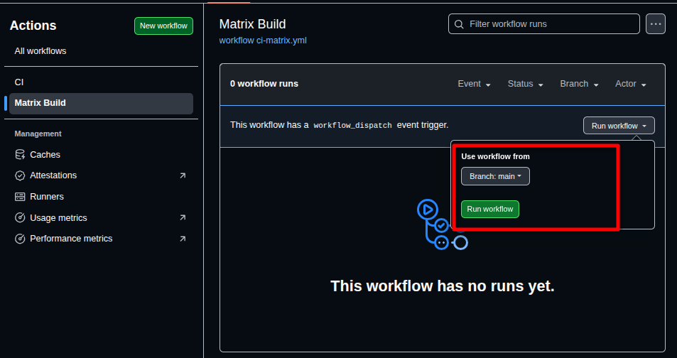

Four parallel pipelines are created — one for each combination of OS and Node.js version:

- Node 18 on Ubuntu
- Node 20 on Ubuntu
- Node 18 on Windows
- Node 20 on Windows

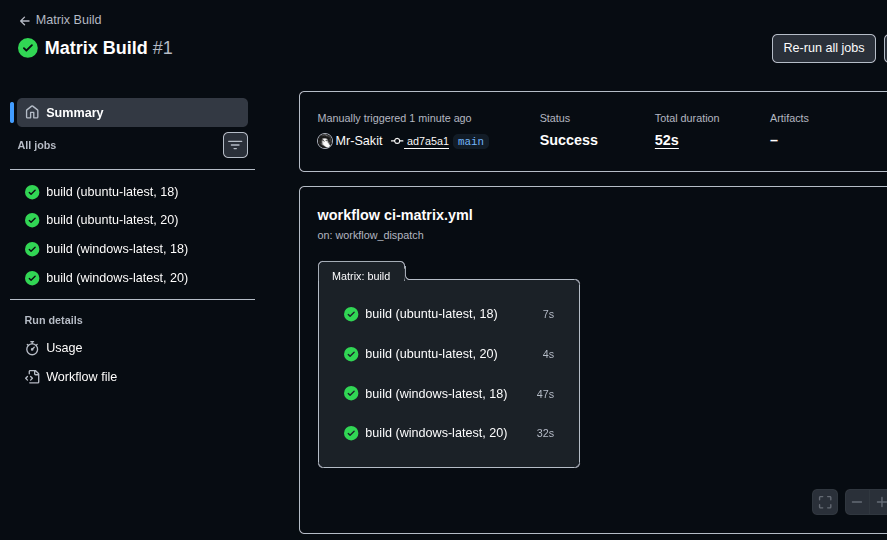

✅ **Result:** All four matrix jobs completed successfully:

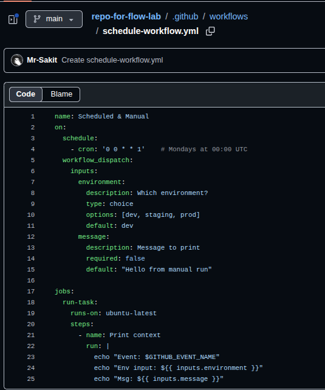

> **Want to learn more?** Visit [Running variations of Jobs](https://docs.github.com/en/actions/using-jobs/using-a-matrix-for-your-jobs) in the GitHub documentation.

---

### Step 5: Scheduled & Manual Workflow

GitHub Actions supports **cron syntax** for scheduling jobs and can accept **user inputs** for manual triggers. Create a new workflow file `schedule-workflow.yml`:

```yaml
name: Scheduled & Manual
on:
    schedule:
        - cron: '0 0 * * 1'    # Mondays at 00:00 UTC
    workflow_dispatch:
      inputs:
        environment:
            description: Which environment?
            type: choice
            options: [dev, staging, prod]
            default: dev
        message:
            description: Message to print
            required: false
            default: "Hello from manual run"

jobs:
  run-task:
    runs-on: ubuntu-latest
    steps:
      - name: Print context
        run: |
          echo "Event: $GITHUB_EVENT_NAME"
          echo "Env input: ${{ inputs.environment }}"
          echo "Msg: ${{ inputs.message }}"
```

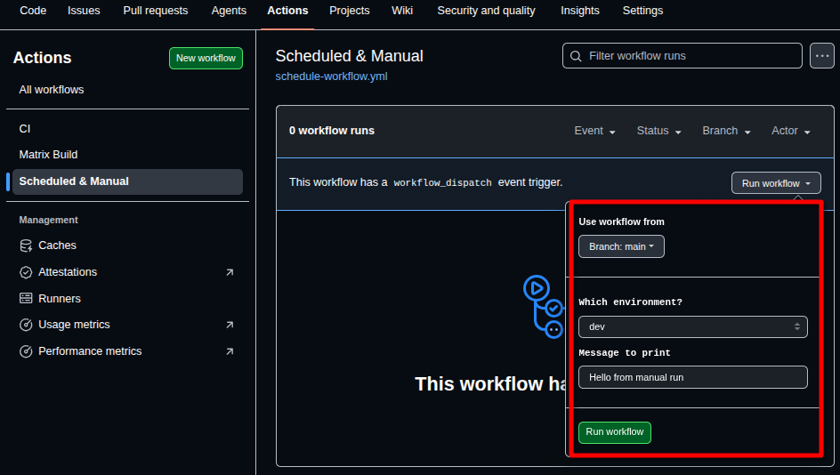

**What does this workflow do?**

| Feature | Description |
|---|---|
| **Schedule trigger** | Runs every Monday at 00:00 UTC using cron syntax |
| **Manual trigger** | Accepts `environment` (choice) and `message` (text) inputs |
| **Job** | Runs on Ubuntu and prints the event name, environment, and message |

Commit and push the changes. Navigate to the Actions tab, select **Scheduled & Manual**, and click **Run workflow** to execute it manually with custom inputs.

---

## 📊 Summary

| Task | Command / Action | Status |
|---|---|---|
| Create GitHub repository | GitHub UI → New repository | ✅ |
| Add simple CI workflow | Actions tab → Simple workflow → Configure | ✅ |
| Verify workflow execution | Actions tab → View logs | ✅ |
| Clone and modify workflow | `git clone` → Edit `blank.yml` → Push | ✅ |
| Create Matrix Build workflow | `workflow ci-matrix.yml` with OS/Node matrix | ✅ |
| Run Matrix Build | Actions tab → Run workflow (4 parallel jobs) | ✅ |
| Create Scheduled workflow | `schedule-workflow.yml` with cron + inputs | ✅ |

---

## 💡 Key Takeaways

1. **GitHub Actions workflows** are defined in YAML files inside the `.github/workflows` directory
2. **Triggers** (`on`) control when workflows run — common options include `push`, `pull_request`, `workflow_dispatch`, and `schedule`
3. **Jobs** run on GitHub-hosted runners (Ubuntu, Windows, macOS) and contain a sequence of **steps**
4. **Matrix strategies** enable testing across multiple versions and platforms with a single job definition
5. **Cron-based scheduling** allows automated, time-based workflow execution
6. **Manual triggers** (`workflow_dispatch`) with `inputs` allow users to provide parameters before running the workflow
7. **Workflow logs** in the Actions tab are essential for debugging and verifying job execution
