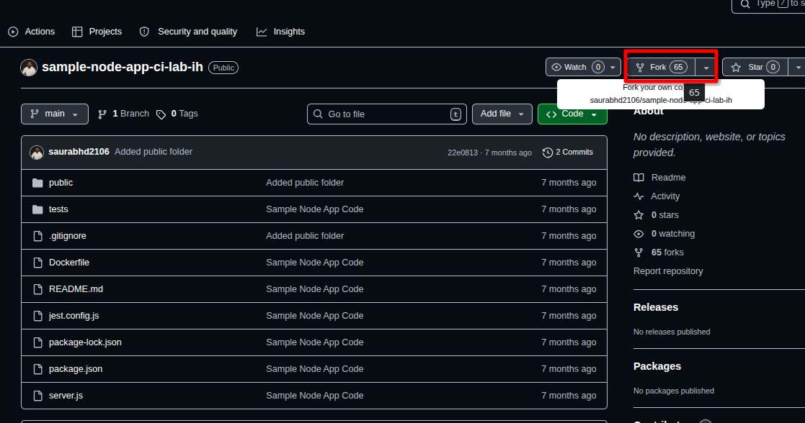
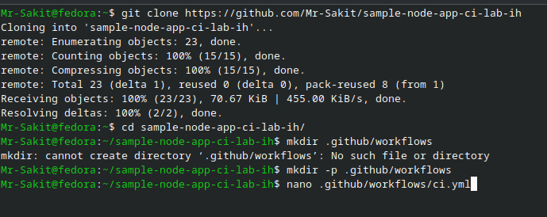
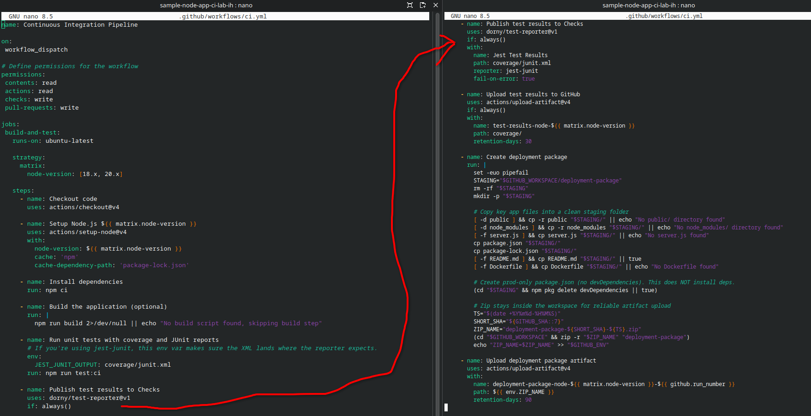
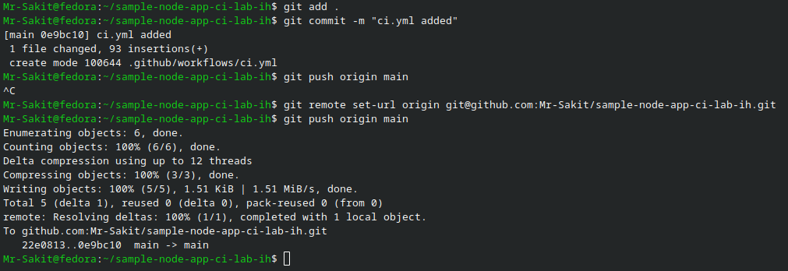
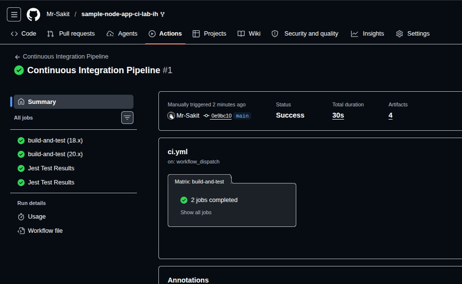
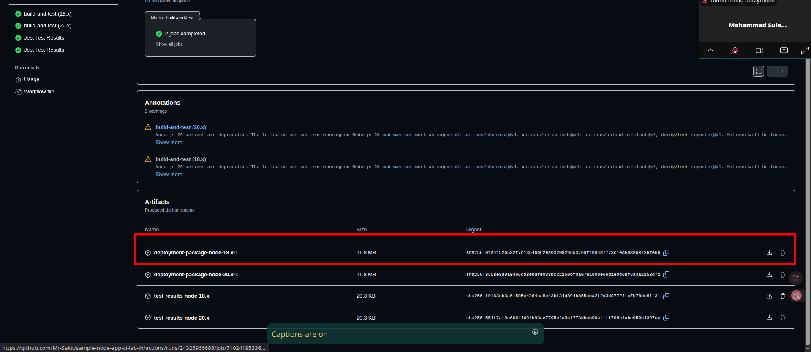
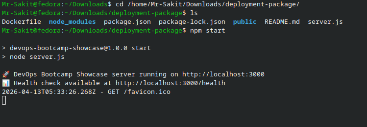
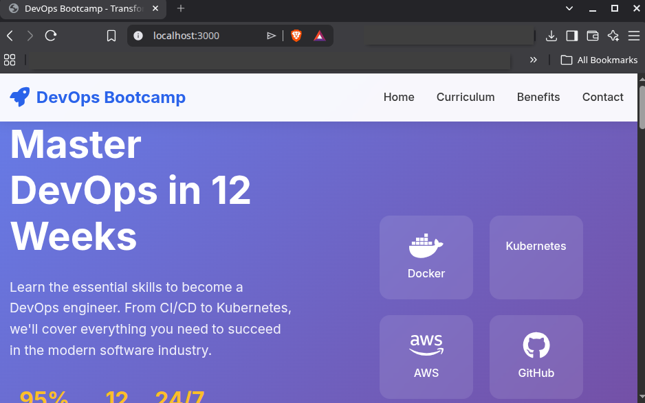

# Lab 1: Continuous Integration (Node.js App) — Build, Test and Publish Artefact

## 📋 Overview

This lab demonstrates how to create a **Continuous Integration (CI) pipeline** using GitHub Actions to automate the build, test, and artifact publishing process for a **Node.js application**. The pipeline uses a matrix strategy to test across multiple Node.js versions (18.x and 20.x), runs Jest-based unit tests with coverage and JUnit reporting, publishes test results to GitHub Checks, and creates a deployment package (ZIP) as a downloadable artifact. The application is a DevOps Bootcamp Showcase web app built with Node.js and Express.

---

## 🎯 Objectives

- Understand what Continuous Integration (CI) is and why it's useful for software projects
- Fork and clone a sample Node.js application repository
- Create a GitHub Actions workflow (YAML file) to automate building and testing
- Use matrix strategy to test across Node.js 18.x and 20.x
- Generate JUnit test reports and publish them to GitHub Checks
- Upload test results and deployment packages as GitHub artifacts
- Download and run the built artifact locally to verify it works

---

## 🔧 Prerequisites

| Requirement | Details |
|---|---|
| **GitHub Account** | Valid credentials with repository access |
| **Git** | Installed on the local machine |
| **Node.js** | Installed for local testing (optional) |
| **Terminal** | Bash/Zsh terminal with Git CLI access |

---

## 📝 Lab Steps

### Step 1: Fork and Clone the Application Repository

Fork the sample Node.js application from the original repository: [Sample Node.js Application](https://github.com/saurabhd2106/sample-node-app-ci-lab-ih)



Clone the forked repository locally:

```bash
git clone https://github.com/Mr-Sakit/sample-node-app-ci-lab-ih
cd sample-node-app-ci-lab-ih
```



> **Note:** The repository contains a Node.js/Express application with Jest testing framework, a Dockerfile, and a public directory with frontend assets.

---

### Step 2: Create the GitHub Actions Workflow

Create the `.github/workflows` directory structure and add the CI workflow file:

```bash
mkdir -p .github/workflows
nano .github/workflows/ci.yml
```

Add the following CI pipeline code:

```yaml
name: Continuous Integration Pipeline

on:
  workflow_dispatch

# Define permissions for the workflow
permissions:
  contents: read
  actions: read
  checks: write
  pull-requests: write

jobs:
  build-and-test:
    runs-on: ubuntu-latest

    strategy:
      matrix:
        node-version: [18.x, 20.x]

    steps:
      - name: Checkout code
        uses: actions/checkout@v4

      - name: Setup Node.js ${{ matrix.node-version }}
        uses: actions/setup-node@v4
        with:
          node-version: ${{ matrix.node-version }}
          cache: 'npm'
          cache-dependency-path: 'package-lock.json'

      - name: Install dependencies
        run: npm ci

      - name: Build the application (optional)
        run: |
          npm run build 2>/dev/null || echo "No build script found, skipping build step"

      - name: Run unit tests with coverage and JUnit reports
        env:
          JEST_JUNIT_OUTPUT: coverage/junit.xml
        run: npm run test:ci

      - name: Publish test results to Checks
        uses: dorny/test-reporter@v1
        if: always()
        with:
          name: Jest Test Results
          path: coverage/junit.xml
          reporter: jest-junit
          fail-on-error: true

      - name: Upload test results to GitHub
        uses: actions/upload-artifact@v4
        if: always()
        with:
          name: test-results-node-${{ matrix.node-version }}
          path: coverage/
          retention-days: 30

      - name: Create deployment package
        run: |
          set -euo pipefail
          STAGING="$GITHUB_WORKSPACE/deployment-package"
          rm -rf "$STAGING"
          mkdir -p "$STAGING"
          # Copy key app files into a clean staging folder
          [ -d public ] && cp -r public "$STAGING/" || echo "No public/ directory found"
          [ -d node_modules ] && cp -r node_modules "$STAGING/" || echo "No node_modules/ directory found"
          [ -f server.js ] && cp server.js "$STAGING/" || echo "No server.js found"
          cp package.json "$STAGING/"
          cp package-lock.json "$STAGING/"
          [ -f README.md ] && cp README.md "$STAGING/" || true
          [ -f Dockerfile ] && cp Dockerfile "$STAGING/" || echo "No Dockerfile found"
          # Create prod-only package.json (no devDependencies)
          (cd "$STAGING" && npm pkg delete devDependencies || true)
          # Zip stays inside the workspace for reliable artifact upload
          TS="$(date +%Y%m%d-%H%M%S)"
          SHORT_SHA="${GITHUB_SHA::7}"
          ZIP_NAME="deployment-package-${SHORT_SHA}-${TS}.zip"
          (cd "$GITHUB_WORKSPACE" && zip -r "$ZIP_NAME" "deployment-package")
          echo "ZIP_NAME=$ZIP_NAME" >> "$GITHUB_ENV"

      - name: Upload deployment package artifact
        uses: actions/upload-artifact@v4
        with:
          name: deployment-package-node-${{ matrix.node-version }}-${{ github.run_number }}
          path: ${{ env.ZIP_NAME }}
          retention-days: 90
```



---

### Step 3: Understand the Pipeline Code

**Triggers & Permissions:**

| Config | Description |
|---|---|
| `workflow_dispatch` | Manual trigger from the Actions tab |
| `contents: read` | Read access to repository code |
| `checks: write` | Write test/check results back to the PR |
| `pull-requests: write` | Post test summaries on pull requests |

**Pipeline Steps Breakdown:**

| Step | Purpose |
|---|---|
| **Checkout code** | Pulls the repository code into the runner |
| **Setup Node.js** | Installs the requested Node.js version with npm cache enabled |
| **Install dependencies** | `npm ci` performs a clean, reproducible install from `package-lock.json` |
| **Build (optional)** | Tries `npm run build`; gracefully skips if no build script exists |
| **Run unit tests** | Executes Jest tests with coverage and JUnit XML output at `coverage/junit.xml` |
| **Publish test results** | Uses `dorny/test-reporter` to post a test summary on the GitHub Checks tab |
| **Upload test results** | Saves the `coverage/` folder as a downloadable artifact (retained 30 days) |
| **Create deployment package** | Copies essential files, removes devDependencies, and creates a versioned ZIP |
| **Upload deployment ZIP** | Uploads the ZIP as a downloadable artifact (retained 90 days) |

**Why these choices?**

- **Matrix (18.x & 20.x):** Ensures compatibility across LTS and current Node.js versions
- **npm cache:** Speeds up builds on repeated runs
- **npm ci:** Provides reproducible, clean installs for CI environments
- **JUnit XML + test-reporter:** Clean PR test summaries without digging through logs
- **Artifacts:** Keeps evidence (coverage) and a ready-to-ship deployment ZIP

---

### Step 4: Push the Code and Trigger the Pipeline

Commit and push the workflow to the repository:

```bash
git add .
git commit -m "ci.yml added"
git push origin main
```



Navigate to the **Actions** tab on GitHub and manually trigger the workflow. The pipeline executes two parallel jobs (Node 18.x and Node 20.x):



✅ **Result:** Both matrix jobs completed successfully with **4 artifacts** produced:

- `deployment-package-node-18.x-1` (11.8 MB)
- `deployment-package-node-20.x-1` (11.8 MB)
- `test-results-node-18.x` (20.3 KB)
- `test-results-node-20.x` (20.3 KB)



---

### Step 5: Download and Run the Application Locally

Download the deployment artifact from the Actions tab. Extract and run the application:

```bash
cd deployment-package/
npm start
```



The application starts and is accessible at `http://localhost:3000`:



✅ **Result:** The DevOps Bootcamp Showcase web application is running successfully from the published artifact.

---

## 🏗️ CI Pipeline Architecture

```
┌──────────────────────────────────────────────────────┐
│            Continuous Integration Pipeline            │
│                                                      │
│  Trigger: workflow_dispatch (Manual)                 │
│                                                      │
│  ┌─────────────────┐    ┌─────────────────┐         │
│  │ build-and-test   │    │ build-and-test   │         │
│  │ (Node 18.x)      │    │ (Node 20.x)      │         │
│  │                   │    │                   │         │
│  │ 1. Checkout       │    │ 1. Checkout       │         │
│  │ 2. Setup Node     │    │ 2. Setup Node     │         │
│  │ 3. npm ci         │    │ 3. npm ci         │         │
│  │ 4. Build          │    │ 4. Build          │         │
│  │ 5. Test + JUnit   │    │ 5. Test + JUnit   │         │
│  │ 6. Publish Report │    │ 6. Publish Report │         │
│  │ 7. Upload Results │    │ 7. Upload Results │         │
│  │ 8. Create ZIP     │    │ 8. Create ZIP     │         │
│  │ 9. Upload ZIP     │    │ 9. Upload ZIP     │         │
│  └─────────────────┘    └─────────────────┘         │
│                                                      │
│  Artifacts: test-results + deployment-package (ZIP)  │
└──────────────────────────────────────────────────────┘
```

---

## 📊 Summary

| Task | Command / Action | Status |
|---|---|---|
| Fork sample Node.js app | GitHub UI → Fork | ✅ |
| Clone repository | `git clone ...sample-node-app-ci-lab-ih` | ✅ |
| Create CI workflow | `.github/workflows/ci.yml` | ✅ |
| Push code to GitHub | `git add . && git commit && git push` | ✅ |
| Run CI pipeline | Actions tab → Run workflow | ✅ |
| Verify matrix jobs (Node 18.x & 20.x) | Actions tab → 2 parallel jobs | ✅ |
| Download artifacts | Actions tab → Download ZIP | ✅ |
| Run application locally | `npm start` → `http://localhost:3000` | ✅ |

---

## 💡 Key Takeaways

1. **Continuous Integration (CI)** automates the process of building, testing, and packaging code on every change
2. **Matrix strategies** enable testing across multiple runtime versions (Node 18.x, 20.x) in parallel
3. **`npm ci`** provides reproducible installs using `package-lock.json`, ideal for CI environments
4. **JUnit XML reports** with `dorny/test-reporter` provide clear test summaries directly on pull requests
5. **GitHub Artifacts** allow you to store and download build outputs (test results, deployment packages)
6. **Deployment packages** with versioned ZIP files (including short SHA and timestamp) provide traceability
7. **Graceful build steps** (using `|| echo` fallbacks) prevent pipeline failures for optional scripts
8. Always **verify artifacts locally** by downloading and running the application to ensure the build is valid
