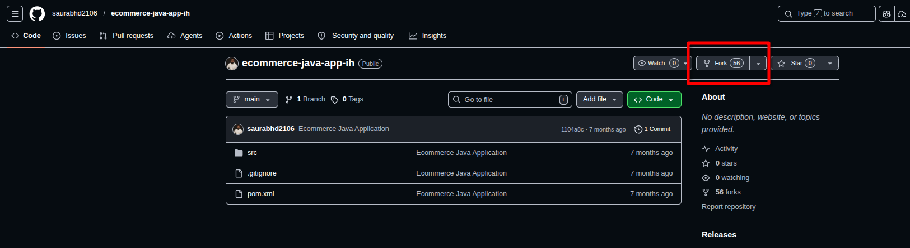
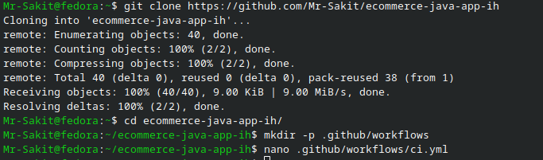
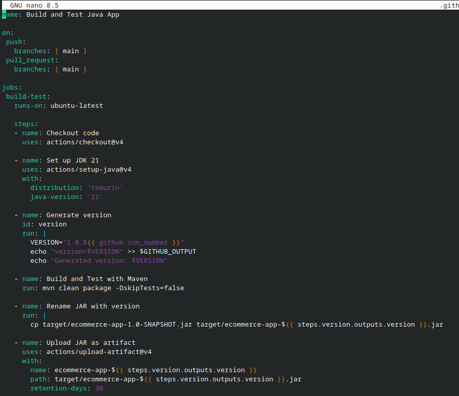
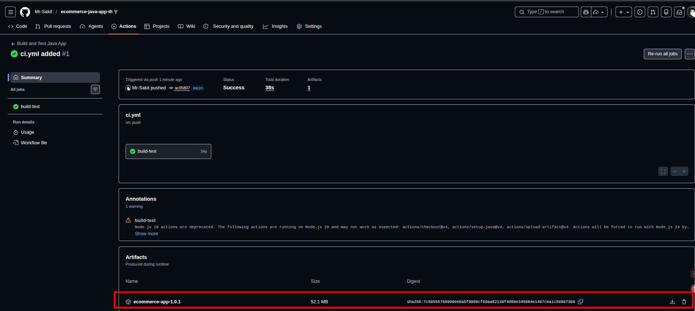
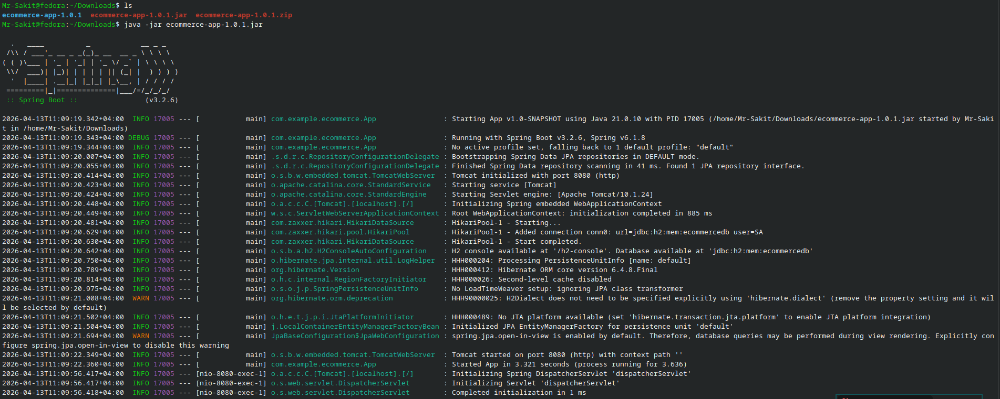
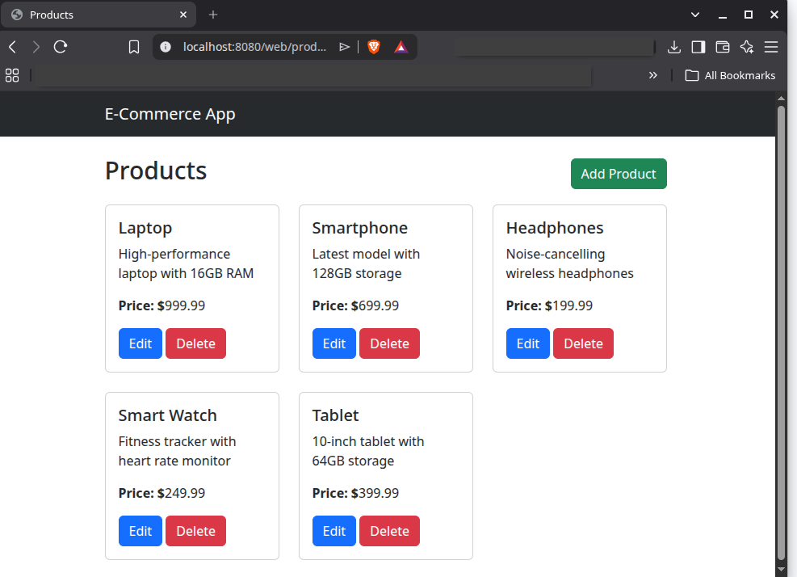

# Lab 2: Build, Test and Publish Maven Java Application

## 📋 Overview

This lab demonstrates how to create a **GitHub Actions CI pipeline** to build, test, and publish artifacts for a **Java Spring Boot application** using **Maven** as the package manager. The pipeline checks out the code, sets up JDK 21 (Temurin distribution), generates a semantic version based on the workflow run number, builds the application with `mvn clean package`, renames the resulting JAR file with the version, and uploads it as a downloadable GitHub artifact. The sample application is an **E-Commerce** web app built with Java Spring Boot and JDK 21.

---

## 🎯 Objectives

- Fork and clone a sample Java Spring Boot application repository
- Create a GitHub Actions workflow to automate building and testing
- Set up JDK 21 (Temurin) in the CI environment
- Generate a dynamic version number using the GitHub run number
- Build and test the application with Maven (`mvn clean package`)
- Rename the JAR artifact with the generated version
- Upload the versioned JAR as a GitHub artifact
- Download and run the artifact locally to verify it works

---

## 🔧 Prerequisites

| Requirement | Details |
|---|---|
| **GitHub Account** | Valid credentials with repository access |
| **Git** | Installed on the local machine |
| **Terminal** | Bash/Zsh terminal with Git CLI access |
| **Text Editor** | Visual Studio Code (recommended) |
| **Java JDK 21** | Required for local artifact verification (optional) |

---

## 📝 Lab Steps

### Step 1: Fork and Clone the Code Repository

Fork the sample Java application from GitHub: [Sample Java Application (ecommerce-java-app-ih)](https://github.com/saurabhd2106/ecommerce-java-app-ih)



Clone the forked repository locally:

```bash
git clone https://github.com/Mr-Sakit/ecommerce-java-app-ih
cd ecommerce-java-app-ih
```



> **Note:** The repository contains a Java Spring Boot application with `src/` source code directory and a `pom.xml` Maven configuration file.

---

### Step 2: Create the GitHub Actions Workflow

Create the `.github/workflows` directory and add the CI workflow file:

```bash
mkdir -p .github/workflows
nano .github/workflows/ci.yml
```

Add the following CI pipeline code:

```yaml
name: Build and Test Java App

on:
  push:
    branches: [ main ]
  pull_request:
    branches: [ main ]

jobs:
  build-test:
    runs-on: ubuntu-latest

    steps:
      - name: Checkout code
        uses: actions/checkout@v4

      - name: Set up JDK 21
        uses: actions/setup-java@v4
        with:
          distribution: 'temurin'
          java-version: '21'

      - name: Generate version
        id: version
        run: |
          VERSION="1.0.${{ github.run_number }}"
          echo "version=$VERSION" >> $GITHUB_OUTPUT
          echo "Generated version: $VERSION"

      - name: Build and Test with Maven
        run: mvn clean package -DskipTests=false

      - name: Rename JAR with version
        run: |
          cp target/ecommerce-app-1.0-SNAPSHOT.jar target/ecommerce-app-${{ steps.version.outputs.version }}.jar

      - name: Upload JAR as artifact
        uses: actions/upload-artifact@v4
        with:
          name: ecommerce-app-${{ steps.version.outputs.version }}
          path: target/ecommerce-app-${{ steps.version.outputs.version }}.jar
          retention-days: 30
```



---

### Step 3: Understand the Pipeline Code

**Pipeline Steps Breakdown:**

| Step | Purpose |
|---|---|
| **Checkout code** | Pulls the repository code into the runner using `actions/checkout@v4` |
| **Set up JDK 21** | Installs JDK version 21 using the Temurin distribution via `actions/setup-java@v4` |
| **Generate version** | Creates a semantic version like `1.0.1`, `1.0.2`, etc. using the workflow run number |
| **Build & Test** | Runs `mvn clean package -DskipTests=false` to compile, test, and package the application |
| **Rename JAR** | Renames the generated JAR file from `ecommerce-app-1.0-SNAPSHOT.jar` to include the version |
| **Upload artifact** | Uploads the versioned JAR file as a downloadable GitHub artifact (retained 30 days) |

**Triggers:**

| Trigger | Description |
|---|---|
| `on: push` | Executes the workflow automatically when code is pushed to the `main` branch |
| `on: pull_request` | Executes the workflow when a pull request targets the `main` branch |

> **Why Temurin?** Eclipse Temurin is a popular, production-ready OpenJDK distribution that is well-supported in CI/CD environments.

---

### Step 4: Push the Code to GitHub

Push the workflow file to the forked repository:

```bash
git add .
git commit -m "ci.yml added"
git push origin main
```

Since the trigger includes `push` events on the `main` branch, the workflow executes automatically.

---

### Step 5: Inspect the GitHub Actions Workflow

Navigate to the **Actions** tab on the GitHub repository. The workflow execution appears automatically:



✅ **Result:** The pipeline completed successfully with:
- **Status:** Success
- **Total duration:** 38s
- **Artifacts:** 1 (ecommerce-app-1.0.1 — 52.1 MB)

The versioned JAR artifact `ecommerce-app-1.0.1` is available for download from the **Artifacts** section.

---

### Step 6: Download and Run the Application Locally

Download the artifact from the Actions tab. Extract and run the JAR file:

```bash
java -jar ecommerce-app-1.0.1.jar
```



The Spring Boot application starts successfully:
- Running with **Spring Boot v3.2.6** and **Java 21.0.10**
- Tomcat started on **port 8080**
- Application started in **3.321 seconds**

Open a browser and navigate to `http://localhost:8080` to see the E-Commerce application:



✅ **Result:** The E-Commerce application is running successfully, displaying products (Laptop, Smartphone, Headphones, Smart Watch, Tablet) with Edit and Delete functionality.

---

## 🏗️ CI Pipeline Architecture

```
┌──────────────────────────────────────────────────────┐
│          Build and Test Java App Pipeline             │
│                                                      │
│  Trigger: push / pull_request → main                 │
│                                                      │
│  ┌─────────────────────────────────────────┐         │
│  │           build-test (ubuntu-latest)     │         │
│  │                                         │         │
│  │  1. Checkout code                       │         │
│  │  2. Set up JDK 21 (Temurin)             │         │
│  │  3. Generate version (1.0.X)            │         │
│  │  4. mvn clean package -DskipTests=false │         │
│  │  5. Rename JAR with version             │         │
│  │  6. Upload JAR as artifact              │         │
│  └─────────────────────────────────────────┘         │
│                                                      │
│  Artifact: ecommerce-app-1.0.X.jar (52.1 MB)        │
└──────────────────────────────────────────────────────┘
```

---

## 📊 Summary

| Task | Command / Action | Status |
|---|---|---|
| Fork sample Java app | GitHub UI → Fork `ecommerce-java-app-ih` | ✅ |
| Clone repository | `git clone ...ecommerce-java-app-ih` | ✅ |
| Create CI workflow | `.github/workflows/ci.yml` | ✅ |
| Push workflow to GitHub | `git add . && git commit && git push` | ✅ |
| Pipeline execution | Triggered automatically on push to `main` | ✅ |
| Build & test with Maven | `mvn clean package -DskipTests=false` | ✅ |
| Artifact uploaded | `ecommerce-app-1.0.1` (52.1 MB JAR) | ✅ |
| Run application locally | `java -jar ecommerce-app-1.0.1.jar` | ✅ |
| Verify in browser | `http://localhost:8080` → E-Commerce App | ✅ |

---

## 💡 Key Takeaways

1. **GitHub Actions** seamlessly supports Java/Maven CI pipelines with `actions/setup-java`
2. **Temurin JDK 21** provides a reliable, production-grade Java runtime for CI environments
3. **Dynamic versioning** using `github.run_number` creates traceable, auto-incrementing version numbers (e.g., `1.0.1`, `1.0.2`)
4. **`mvn clean package`** compiles the source code, runs tests, and packages the application into a JAR file
5. **GitHub Artifacts** allow teams to download and deploy build outputs directly from the Actions tab
6. **Artifact retention** (30 days) ensures build outputs are available for verification and deployment
7. **Push-triggered pipelines** provide immediate feedback on code changes, catching build and test failures early
8. Always **verify artifacts locally** by downloading and running the JAR to ensure the build is valid and the application works correctly
