# Lab 1: Setup SonarQube

## 📋 Overview

This lab walks through setting up **SonarQube** — an open-source platform for continuous inspection of code quality — using **Docker Compose** on a Linux virtual machine. After deploying SonarQube with a PostgreSQL database, we create a local project, generate a scanner token, and manually scan a sample **Java (Maven)** application to identify security vulnerabilities, code smells, and other quality issues.

> [!NOTE]
> During the setup, the SonarQube container initially crashed due to a `read_only: true` setting in the `docker-compose.yml`. This issue and its fix are documented in the [Troubleshooting](#-troubleshooting) section.

---

## 🎯 Objectives

- Deploy SonarQube and PostgreSQL using Docker Compose
- Access and configure the SonarQube web interface
- Create a local project and generate an analysis token
- Install Java and Maven on the host machine
- Manually scan a Java application using the SonarQube Maven scanner
- Analyze the SonarQube quality report (Security, Reliability, Maintainability, Coverage, Duplications)

---

## 🔧 Prerequisites

| Requirement | Details |
|---|---|
| **Linux VM** | A virtual machine with terminal access |
| **Docker** | Docker Engine installed and running |
| **Docker Compose** | Docker Compose V2 installed |
| **Port 9000** | Open/accessible on the VM (firewall/NSG rule) |
| **Java JDK** | Required for Maven scanner execution |
| **Maven** | Required to compile and scan the Java project |

> [!IMPORTANT]
> Make sure Docker can be run without `sudo`. If not, add your user to the `docker` group:
> ```bash
> sudo usermod -aG docker $USER
> ```
> Then log out and log back in for the change to take effect.

---

## 📝 Lab Steps

### Step 1: Clone the SonarQube Setup Repository

Clone the repository that contains the Docker Compose configuration for SonarQube:

```bash
git clone https://github.com/saurabhd2106/sonarqube-setup-ih
cd sonarqube-setup-ih/
```

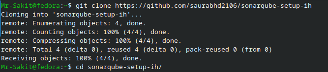

---

### Step 2: Deploy SonarQube with Docker Compose

Start the SonarQube and PostgreSQL containers in detached mode:

```bash
docker compose up -d
```

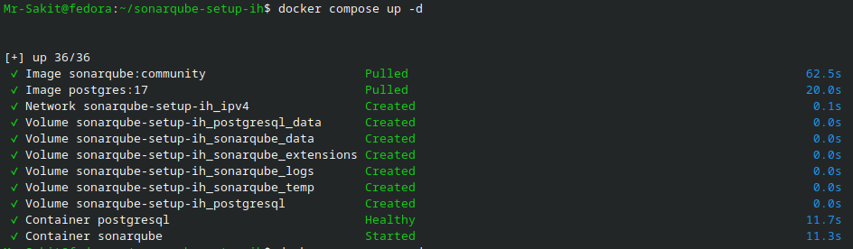

Docker Compose will pull two images and create the following resources:

| Resource | Type | Details |
|---|---|---|
| `sonarqube:community` | Image | SonarQube Community Edition |
| `postgres:17` | Image | PostgreSQL 17 database |
| `sonarqube-setup-ih_ipv4` | Network | Internal Docker network |
| `sonarqube-setup-ih_sonarqube_data` | Volume | SonarQube data persistence |
| `sonarqube-setup-ih_sonarqube_extensions` | Volume | SonarQube plugins/extensions |
| `sonarqube-setup-ih_sonarqube_logs` | Volume | SonarQube log files |
| `sonarqube-setup-ih_sonarqube_temp` | Volume | Temporary files |
| `sonarqube-setup-ih_postgresql_data` | Volume | PostgreSQL data persistence |

---

## 🔥 Troubleshooting

### ❌ Problem: SonarQube Container Crashes with `Read-only file system` Error

After running `docker compose up -d`, the SonarQube container exited immediately while the PostgreSQL container remained healthy:

```bash
ss -tulpn | grep :9000          # No output — port 9000 not listening
docker ps                       # Only postgresql is running
docker ps -a                    # sonarqube shows "Exited (0)"
docker compose logs sonarqube   # Shows the error
```

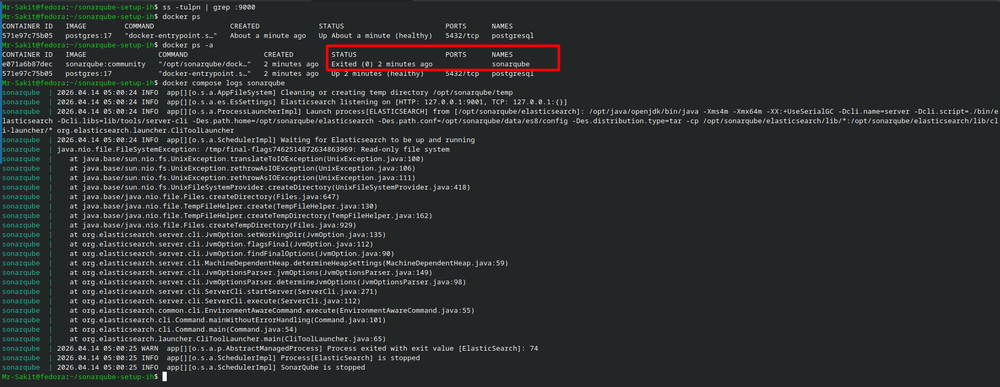

**Error Log:**
```
java.nio.file.FileSystemException: /tmp/final-flags...: Read-only file system
SonarQube is stopped
```

**Root Cause:** The `docker-compose.yml` had `read_only: true` set for the SonarQube service, preventing the container from writing to its temporary directories.

**Solution:** Edit the `docker-compose.yml` and change `read_only` from `true` to `false`:

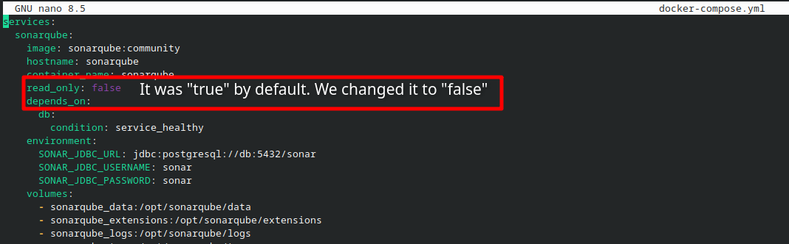

```yaml
services:
  sonarqube:
    image: sonarqube:community
    hostname: sonarqube
    container_name: sonarqube
    read_only: false    # Changed from "true" to "false"
    depends_on:
      db:
        condition: service_healthy
    environment:
      SONAR_JDBC_URL: jdbc:postgresql://db:5432/sonar
      SONAR_JDBC_USERNAME: sonar
      SONAR_JDBC_PASSWORD: sonar
    volumes:
      - sonarqube_data:/opt/sonarqube/data
      - sonarqube_extensions:/opt/sonarqube/extensions
      - sonarqube_logs:/opt/sonarqube/logs
```

Then tear down and recreate the containers:

```bash
docker compose down -v
docker compose up -d
docker ps
```

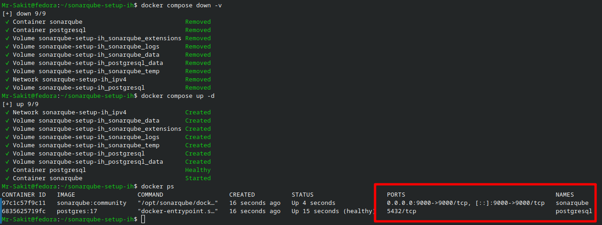

After the fix, both containers are running:
- **sonarqube** — `0.0.0.0:9000->9000/tcp`
- **postgresql** — `5432/tcp` (healthy)

---

### Step 3: Access the SonarQube Web Interface

Open a browser and navigate to `http://localhost:9000` (or `http://<VM-IP>:9000` if accessing remotely):

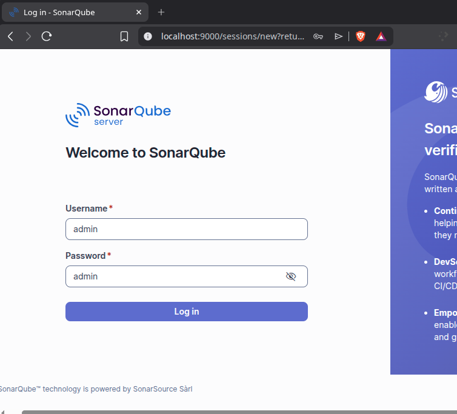

Log in with the default credentials:

| Field | Value |
|---|---|
| **Username** | `admin` |
| **Password** | `admin` |

After the first login, SonarQube will prompt you to change the admin password:

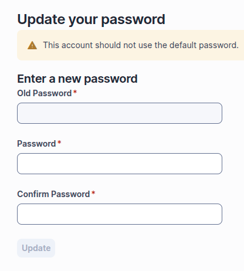

> [!WARNING]
> Change the default password immediately. Using default credentials in production is a security risk.

---

### Step 4: Create a Local Project in SonarQube

On the welcome page, choose how to create your project. Select **"Create a local project"**:

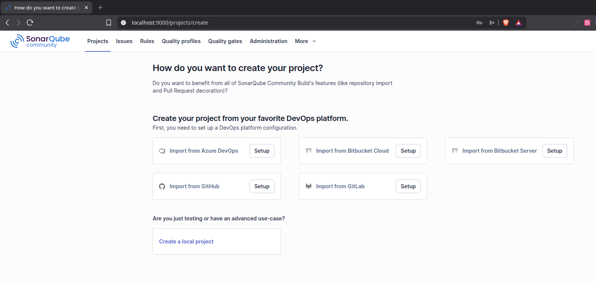

Fill in the project details:

| Field | Value |
|---|---|
| **Project display name** | `Sample Java Project` |
| **Project key** | `Sample-Java-Project` (auto-populated) |
| **Main branch name** | `main` |

Click **Next**.

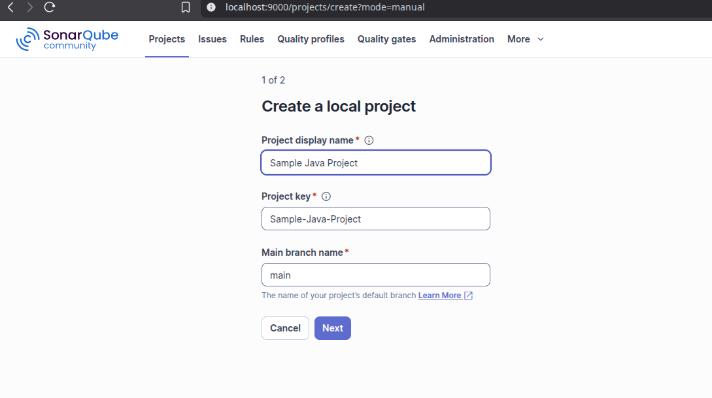

On the next screen, select **"Follows the instance's default"** for the new code definition and click **Create Project**:

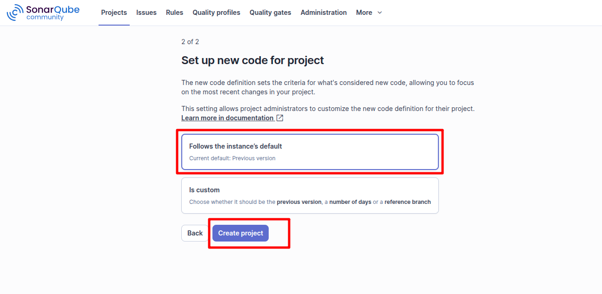

---

### Step 5: Configure Analysis Method

On the **Analysis Method** page, select **"Locally"** since we will run the scanner manually from the terminal:

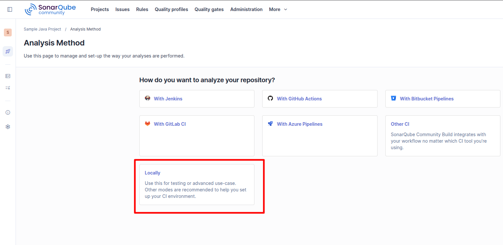

---

### Step 6: Generate a Project Token

Under **"Provide a token"**, enter a token name (e.g., `Analyze "Sample Java Project"`), set expiration to **30 days**, and click **Generate**:

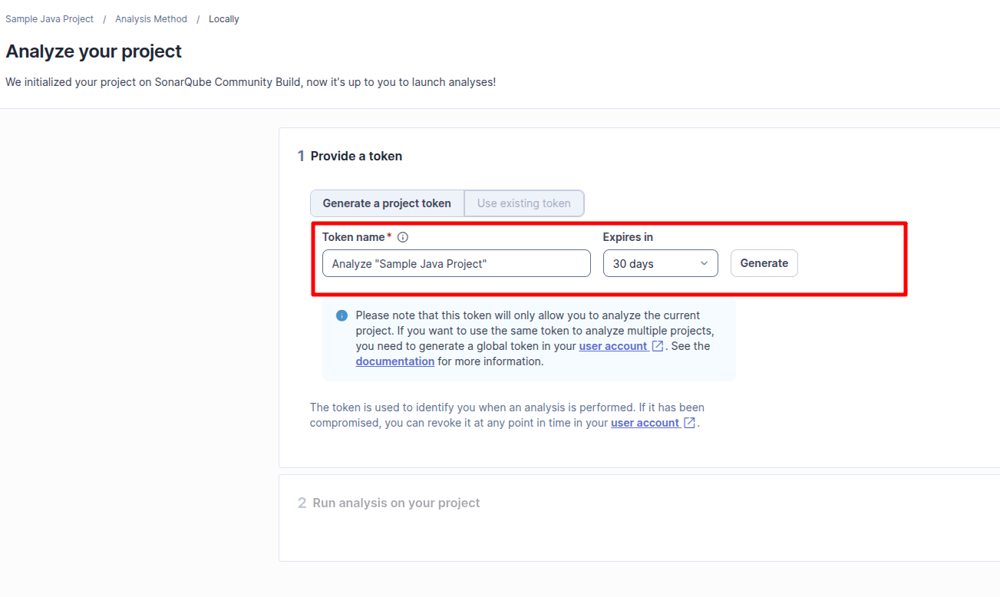

The token will be displayed. Click **Continue**:

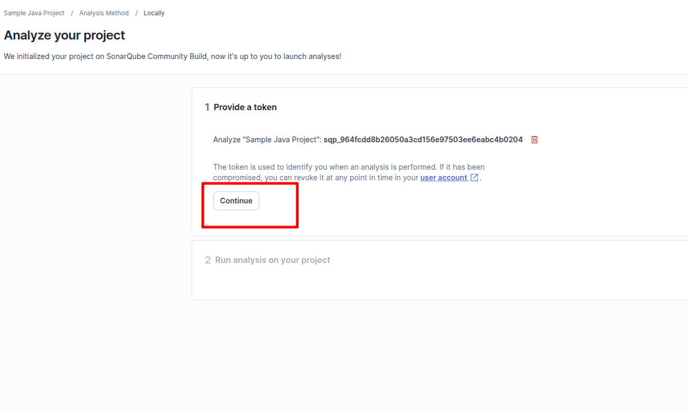

> [!WARNING]
> Copy the generated token and save it securely. You will need it for the Maven scanner command.

---

### Step 7: Get the Scanner Command

SonarQube will show the scanner command for your selected build tool. Select **Maven** and click **Copy** to copy the command:

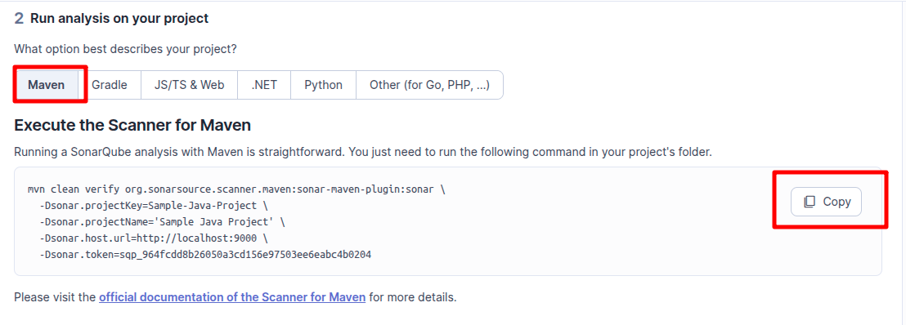

The command will look like:

```bash
mvn clean verify org.sonarsource.scanner.maven:sonar-maven-plugin:sonar \
  -Dsonar.projectKey=Sample-Java-Project \
  -Dsonar.projectName='Sample Java Project' \
  -Dsonar.host.url=http://localhost:9000 \
  -Dsonar.token=sqp_964fcdd8b26050a3cd156e97503ee6eabc4b0204
```

---

### Step 8: Clone the Java Application and Install Maven

Clone the sample ecommerce Java application and install Maven:

```bash
git clone https://github.com/saurabhd2106/ecommerce-java-app-27082025.git
cd ecommerce-java-app-27082025/

# Install Java and Maven (Fedora/RHEL)
sudo dnf check-update
sudo dnf install maven -y

# Verify installation
mvn -version
```

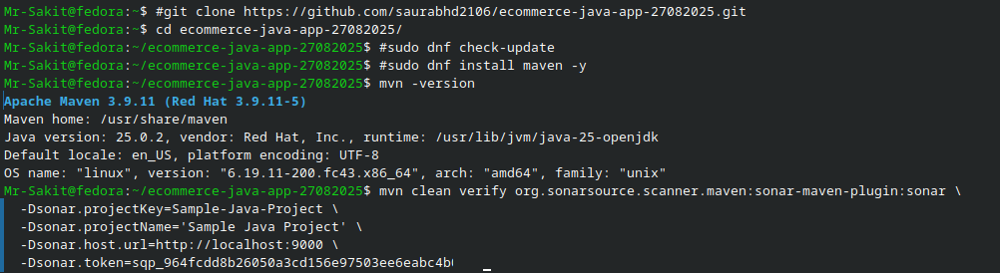

The output should show Maven and Java versions:
```
Apache Maven 3.9.11 (Red Hat 3.9.11-5)
Java version: 25.0.2, vendor: Red Hat, Inc.
```

---

### Step 9: Run the SonarQube Scanner

Execute the Maven scanner command (copied from Step 7) in the project directory:

```bash
mvn clean verify org.sonarsource.scanner.maven:sonar-maven-plugin:sonar \
  -Dsonar.projectKey=Sample-Java-Project \
  -Dsonar.projectName='Sample Java Project' \
  -Dsonar.host.url=http://localhost:9000 \
  -Dsonar.token=sqp_964fcdd8b26050a3cd156e97503ee6eabc4b0204
```


> [!IMPORTANT]
> Make sure to replace the token value with your own generated token from Step 6.

---

### Step 10: Analyze the SonarQube Report

Once the scan completes, navigate back to the SonarQube web interface. The project overview will display the analysis results:

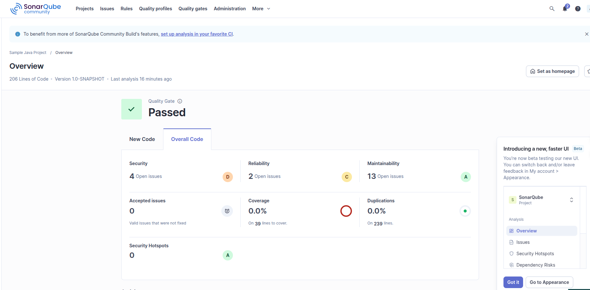

**SonarQube Quality Gate: ✅ Passed**

| Metric | Result | Rating |
|---|---|---|
| **Security** | 4 Open Issues | D |
| **Reliability** | 2 Open Issues | C |
| **Maintainability** | 13 Open Issues | A |
| **Coverage** | 0.0% | — |
| **Duplications** | 0.0% | ● |
| **Security Hotspots** | 0 | A |
| **Lines of Code** | 206 | — |
| **Version** | 1.0-SNAPSHOT | — |

> [!TIP]
> Navigate through the SonarQube dashboard sections — **Issues**, **Security Hotspots**, **Dependency Risks**, **Measures** — to explore detailed insights about the code quality.

---

## 🏗️ Architecture

```
┌──────────────────────────────────────────────────────┐
│              Linux VM (Docker Host)                   │
│                                                      │
│  ┌────────────────────────────────────────────┐      │
│  │         Docker Compose Stack                │      │
│  │                                            │      │
│  │  ┌──────────────────┐   ┌──────────────┐  │      │
│  │  │   SonarQube      │   │  PostgreSQL  │  │      │
│  │  │   :9000          │──►│  :5432       │  │      │
│  │  │   (Community)    │   │  (postgres:17)│  │      │
│  │  └──────────────────┘   └──────────────┘  │      │
│  │         ▲                                  │      │
│  └─────────┼──────────────────────────────────┘      │
│            │                                         │
│  ┌─────────┴──────────────────────────────────┐      │
│  │  Maven Scanner (CLI)                        │      │
│  │  mvn clean verify ... sonar-maven-plugin    │      │
│  │  Scans: ecommerce-java-app                  │      │
│  └─────────────────────────────────────────────┘      │
│                                                      │
│  Browser: http://localhost:9000                       │
└──────────────────────────────────────────────────────┘
```

---

## 📊 Summary

| Task | Command / Action | Status |
|---|---|---|
| Clone SonarQube setup repo | `git clone ...sonarqube-setup-ih` | ✅ |
| Fix `read_only` issue | Changed `true` to `false` in `docker-compose.yml` | ✅ |
| Deploy SonarQube + PostgreSQL | `docker compose up -d` | ✅ |
| Access SonarQube UI | `http://localhost:9000` | ✅ |
| Change admin password | First login prompt | ✅ |
| Create local project | `Sample Java Project` | ✅ |
| Generate analysis token | SonarQube UI → Provide a token | ✅ |
| Clone Java application | `git clone ...ecommerce-java-app-27082025` | ✅ |
| Install Maven | `sudo dnf install maven -y` | ✅ |
| Run Maven scanner | `mvn clean verify ... sonar-maven-plugin:sonar` | ✅ |
| Analyze quality report | Quality Gate: Passed ✅ | ✅ |

---

## 💡 Key Takeaways

1. **SonarQube** provides static code analysis for identifying security vulnerabilities, code smells, bugs, and maintainability issues
2. **Docker Compose** simplifies the deployment of SonarQube and its PostgreSQL backend with a single `docker compose up -d` command
3. **`read_only: true`** in `docker-compose.yml` can crash the SonarQube container — change it to `false` to allow the container to write to temporary directories
4. **Project Tokens** scope analysis access to specific projects; **Global Tokens** allow scanning multiple projects from the same account
5. **Maven Scanner** integrates directly with Maven builds via `sonar-maven-plugin`, enabling seamless code quality analysis as part of the build process
6. **Quality Gate** is the primary pass/fail mechanism in SonarQube — it evaluates thresholds across security, reliability, maintainability, coverage, and duplications
7. SonarQube reports are organized into **Security**, **Reliability**, **Maintainability**, **Coverage**, **Duplications**, and **Security Hotspots** — each with its own rating (A through E)
8. Always change the **default admin credentials** immediately after the first login for security
