# Lab 2: SonarQube Integration with Node.js Application

## 📋 Overview

This lab demonstrates how to integrate **SonarQube** — a popular open-source code quality and security analysis tool — into a **GitHub Actions CI pipeline** for a Node.js application. The pipeline automates building, testing (with Jest and JUnit reports), scanning the code via SonarQube for vulnerabilities and code smells, and publishing a deployment artifact. SonarQube runs on an **Azure VM** as a self-hosted instance, and secrets (`SONAR_TOKEN`, `SONAR_HOST_URL`) are stored securely in GitHub Environment Secrets.

> [!NOTE]
> This lab was completed with several real-world troubleshooting challenges along the way. Each problem encountered and its resolution is documented in the [Troubleshooting](#-troubleshooting--problems-encountered) section to help others who face similar issues.

---

## 🎯 Objectives

- Fork and clone a sample Node.js application repository
- Create a GitHub Actions CI workflow with SonarQube integration
- Configure a GitHub Environment (`dev`) with `SONAR_HOST_URL` and `SONAR_TOKEN` secrets
- Generate a SonarQube authentication token from the self-hosted SonarQube server
- Run the CI pipeline: build → test → SonarQube scan → publish artifact
- Troubleshoot and resolve real pipeline failures (missing scripts, deprecated env vars, missing secrets)
- Analyze the SonarQube quality report (Security, Reliability, Maintainability, Coverage, Duplications)

---

## 🔧 Prerequisites

| Requirement | Details |
|---|---|
| **GitHub Account** | Valid credentials with repository access |
| **Git** | Installed on the local machine |
| **SonarQube Server** | Up and running (self-hosted on Azure VM or SonarCloud) |
| **Terminal** | Bash/Zsh terminal with Git CLI access |
| **Node.js** | Installed for local testing (optional) |

> [!IMPORTANT]
> SonarQube must be set up and accessible before starting this lab. If you don't have a SonarQube setup, complete **Lab 1 (Setup SonarQube)** first.

---

## 📝 Lab Steps

### Step 1: Fork and Clone the Application Repository

Fork the sample Node.js application from: [sample-node-app-ih](https://github.com/saurabhd2106/sample-node-app-ih)

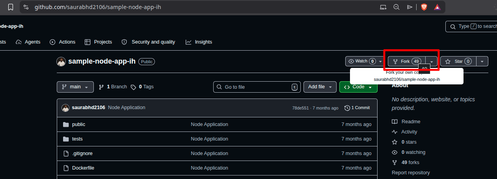

Clone the forked repository locally and create the workflow directory:

```bash
git clone https://github.com/Mr-Sakit/sample-node-app-ih
cd sample-node-app-ih
mkdir -p .github/workflows
nano .github/workflows/ci-sonar.yml
```

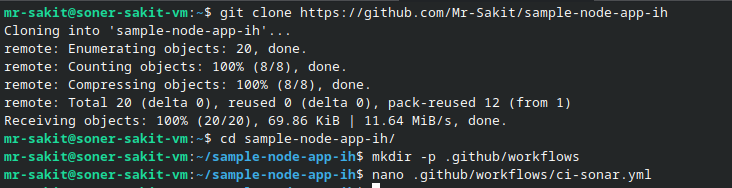

---

### Step 2: Create the CI Pipeline with SonarQube Integration

Add the following workflow code to `.github/workflows/ci-sonar.yml`:

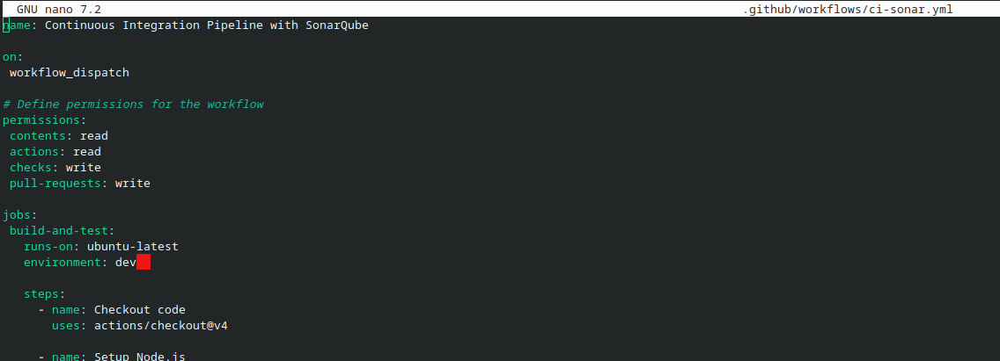

```yaml
name: Continuous Integration Pipeline with SonarQube

on:
  workflow_dispatch

# Define permissions for the workflow
permissions:
  contents: read
  actions: read
  checks: write
  pull-requests: write

jobs:
  build-and-test:
    runs-on: ubuntu-latest
    environment: dev

    steps:
      - name: Checkout code
        uses: actions/checkout@v4

      - name: Setup Node.js
        uses: actions/setup-node@v4
        with:
          node-version: '18.x'
          cache: 'npm'
          cache-dependency-path: 'package-lock.json'

      - name: Install dependencies
        run: npm ci

      - name: Build the application (optional)
        run: |
          npm run build 2>/dev/null || echo "No build script found, skipping build step"

      - name: Run unit tests with coverage and JUnit reports
        env:
          JEST_JUNIT_OUTPUT_DIR: coverage
          JEST_JUNIT_OUTPUT_NAME: junit.xml
        run: npm run test:ci

      - name: Publish test results to Checks
        uses: dorny/test-reporter@v1
        if: always()
        with:
          name: Jest Test Results
          path: coverage/junit.xml
          reporter: jest-junit
          fail-on-error: true

      - name: Upload test results to GitHub
        uses: actions/upload-artifact@v4
        if: always()
        with:
          name: test-results
          path: coverage/
          retention-days: 30

      - name: SonarQube Scan
        uses: SonarSource/sonarqube-scan-action@v0.0.0
        with:
          args: >
            -Dsonar.projectKey=sample-node-app-saurabh
            -Dsonar.sources=.
            -Dsonar.exclusions=node_modules/**,coverage/**,tests/**,**/*.test.js,**/*.spec.js
            -Dsonar.tests=tests/
        env:
          SONAR_TOKEN: ${{ secrets.SONAR_TOKEN }}
          SONAR_HOST_URL: ${{ secrets.SONAR_HOST_URL }}

      - name: Create deployment package
        run: |
          set -euo pipefail
          STAGING="$GITHUB_WORKSPACE/deployment-package"
          rm -rf "$STAGING"
          mkdir -p "$STAGING"
          [ -d public ] && cp -r public "$STAGING/" || echo "No public/ directory found"
          [ -d node_modules ] && cp -r node_modules "$STAGING/" || echo "No node_modules/ directory found"
          [ -f server.js ] && cp server.js "$STAGING/" || echo "No server.js found"
          cp package.json "$STAGING/"
          cp package-lock.json "$STAGING/"
          [ -f README.md ] && cp README.md "$STAGING/" || true
          [ -f Dockerfile ] && cp Dockerfile "$STAGING/" || echo "No Dockerfile found"
          (cd "$STAGING" && npm pkg delete devDependencies || true)
          TS="$(date +%Y%m%d-%H%M%S)"
          SHORT_SHA="${GITHUB_SHA::7}"
          ZIP_NAME="deployment-package-${SHORT_SHA}-${TS}.zip"
          (cd "$GITHUB_WORKSPACE" && zip -r "$ZIP_NAME" "deployment-package")
          echo "ZIP_NAME=$ZIP_NAME" >> "$GITHUB_ENV"

      - name: Upload deployment package artifact
        uses: actions/upload-artifact@v4
        with:
          name: deployment-package-${{ github.run_number }}
          path: ${{ env.ZIP_NAME }}
          retention-days: 90
```

**Pipeline Steps Breakdown:**

| Step | Purpose |
|---|---|
| **Checkout code** | Pulls the repository code into the runner |
| **Setup Node.js** | Installs Node.js 18.x with npm cache enabled |
| **Install dependencies** | `npm ci` for clean, reproducible installs |
| **Build (optional)** | Tries `npm run build`; gracefully skips if unavailable |
| **Run unit tests** | Executes Jest with coverage and JUnit XML output |
| **Publish test results** | Posts test summaries to GitHub Checks via `dorny/test-reporter` |
| **Upload test results** | Saves the `coverage/` folder as a downloadable artifact |
| **SonarQube Scan** | Analyzes code quality, security vulnerabilities, and coverage using `SONAR_TOKEN` and `SONAR_HOST_URL` secrets |
| **Create deployment package** | Copies essential files, removes devDependencies, creates a versioned ZIP |
| **Upload deployment ZIP** | Uploads the ZIP as a downloadable artifact |

---

### Step 3: Configure GitHub Environment Secrets

Navigate to **Settings → Environments** in the GitHub repository and click **New environment**:

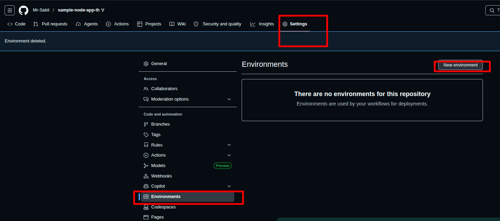

Enter `dev` as the environment name and click **Configure environment**:

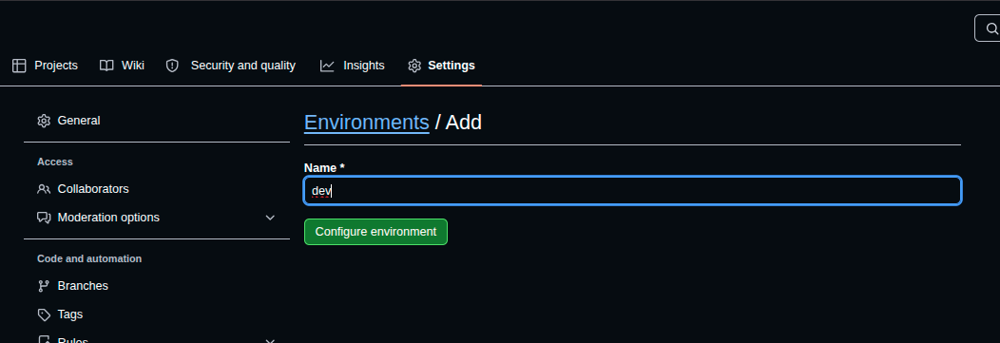

Scroll down to the **Environment secrets** section and click **Add environment secret**:

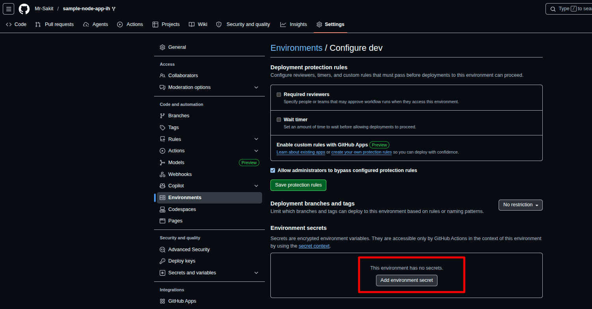

#### 3.1: Add `SONAR_HOST_URL` Secret

Add the SonarQube server URL (e.g., `http://<Azure-VM-IP>:9000`) as the `SONAR_HOST_URL` secret:

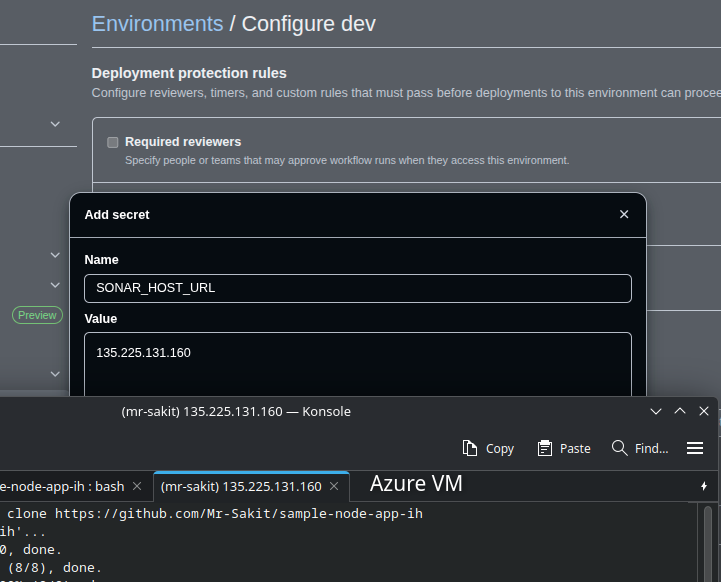

#### 3.2: Generate SonarQube Token

Log in to the SonarQube server. Click on the **User Icon → My Account → Security**. Enter a token name (e.g., `soner_token`), select **Global Analysis Token** as the type, set expiration to **30 days**, and click **Generate**:

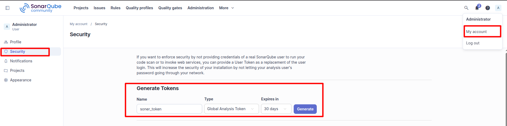

> [!WARNING]
> Make sure to copy the token immediately! It will **not** be shown again after this screen.

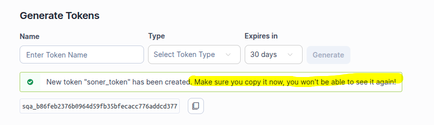

#### 3.3: Add `SONAR_TOKEN` Secret

Go back to GitHub → **Settings → Environments → dev → Add environment secret**. Add the copied SonarQube token as `SONAR_TOKEN`:

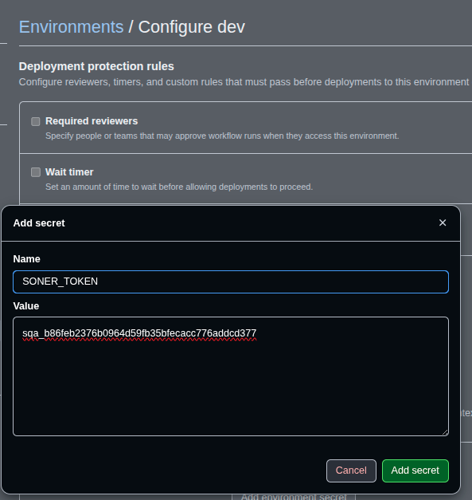

#### 3.4: Update `SONAR_HOST_URL` with Full URL

Update the `SONAR_HOST_URL` secret to include the full URL with protocol and port (e.g., `http://135.225.131.160:9000`):

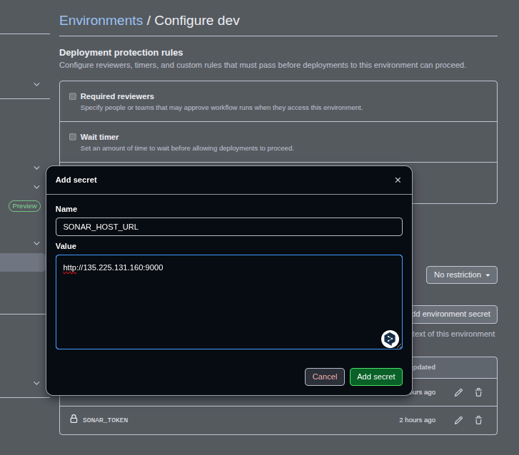

---

### Step 4: Run the Pipeline and Troubleshoot

Commit and push the workflow file to the repository, then trigger the pipeline manually from the **Actions** tab.

> [!CAUTION]
> The first attempts of this pipeline **failed** due to multiple issues. The troubleshooting process and fixes are documented below — this is a normal part of real-world CI/CD work!

---

## 🔥 Troubleshooting — Problems Encountered

### ❌ Problem 1: Missing `test:ci` Script

**Error:** The pipeline failed at the "Run unit tests with coverage and JUnit reports" step:

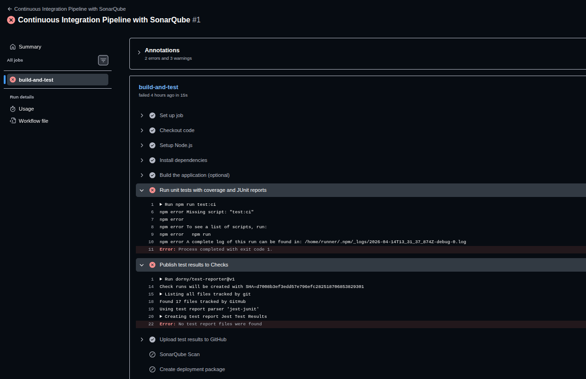

```
npm error Missing script: "test:ci"
```

**Root Cause:** The `package.json` in the forked repository did not have a `test:ci` script defined, and the `jest-junit` package was not listed as a devDependency.

**Solution:** Two changes were made to `package.json`:

1. Added the `test:ci` script:
```json
"test:ci": "jest --coverage --ci --reporters=default --reporters=jest-junit"
```

2. Added `jest-junit` as a devDependency:
```json
"jest-junit": "^16.0.0"
```

Then pulled the changes locally, installed packages, verified the script works, and pushed:

```bash
git pull origin copilot/fix-sonarqube-integration-issues
npm install
npm run test:ci
git checkout main
git merge copilot/fix-sonarqube-integration-issues
git push origin main
```

The changes were applied via a fix branch, then merged into `main`:

**Changes made to `package.json`:**

| Change | Detail |
|---|---|
| Added `test:ci` script | `"test:ci": "jest --coverage --ci --reporters=default --reporters=jest-junit"` |
| Added `jest-junit` devDependency | `"jest-junit": "^16.0.0"` |

After re-triggering the workflow, the `test:ci` script ran successfully — **3 test suites passed, 40 tests passed** with 73.01% coverage:

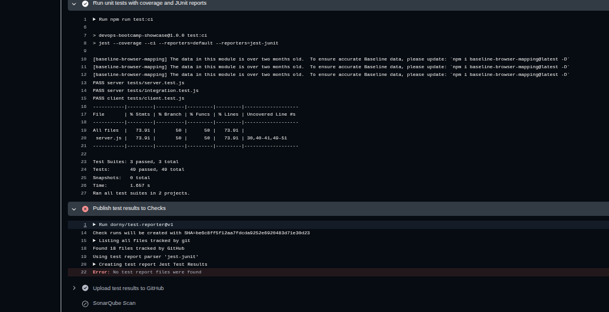

---

### ❌ Problem 2: `Publish test results to Checks` — No Test Report Files Found

**Error:** Even after tests passed, the "Publish test results to Checks" step failed:

```
Error: No test report files were found
```

**Root Cause:** The `Publish test results to Checks` step could not find the `coverage/junit.xml` file because the `JEST_JUNIT_OUTPUT` environment variable was **deprecated** in `jest-junit` v6+. In older versions, `JEST_JUNIT_OUTPUT: coverage/junit.xml` controlled the output path. However, in the newer version installed, this variable is ignored — it uses separate `JEST_JUNIT_OUTPUT_DIR` and `JEST_JUNIT_OUTPUT_NAME` variables instead. As a result, the `junit.xml` file was written to the root directory instead of `coverage/`, and `dorny/test-reporter` couldn't locate it.

**Solution:** Updated `.github/workflows/ci-sonar.yml` to use the new environment variable format:

```yaml
# Old (broken):
env:
  JEST_JUNIT_OUTPUT: coverage/junit.xml

# New (fixed):
env:
  JEST_JUNIT_OUTPUT_DIR: coverage
  JEST_JUNIT_OUTPUT_NAME: junit.xml
```

Once this change was applied, `coverage/junit.xml` was generated in the correct location and `dorny/test-reporter` was able to find and publish the test report successfully.

The diff in `.github/workflows/ci-sonar.yml`:

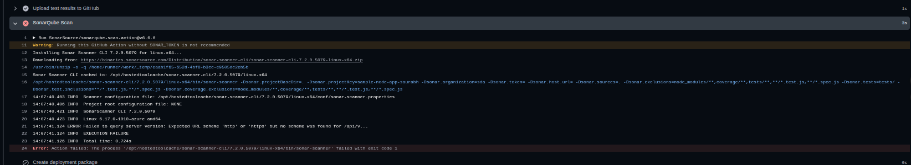

---

### ❌ Problem 3: SonarQube Scan — `Failed to query server version`

**Error:** The SonarQube Scan step failed with:

```
ERROR Failed to query server version: Expected URL scheme 'http' or 'https' but no scheme was found for /api/v...
```


**Root Cause:** The `SONAR_TOKEN` and `SONAR_HOST_URL` **secrets were not configured** in the GitHub repository's `dev` environment. The scanner received empty values — `-Dsonar.token=` and `-Dsonar.host.url=` — and failed because there was no URL scheme to connect to.

**Solution:** The problem was **not a code issue** — the workflow YAML was correctly written. The root cause was **missing GitHub Secrets**. Looking at the SonarQube Scan step output, the `-Dsonar.token=` and `-Dsonar.host.url=` values were both **empty**, meaning the secrets `SONAR_TOKEN` and `SONAR_HOST_URL` were not configured in the GitHub repository's `dev` environment (which is what line `environment: dev` in the workflow references).

The error log confirmed this:
```
-Dsonar.token=  -Dsonar.host.url=
ERROR Failed to query server version: Expected URL scheme 'http' or 'https' but no scheme was found for /api/v...
```

Additionally, the workflow had two other issues in the `args` block:

**Changes made to `.github/workflows/ci-sonar.yml`:**

| Change | Reason |
|---|---|
| **Removed** `-Dsonar.organization=sda` | This parameter is only for **SonarCloud**, not self-hosted SonarQube |
| **Removed** `-Dsonar.token=${{ secrets.SONAR_TOKEN }}` from `args` | Moved to the `env` block — the action reads `SONAR_TOKEN` from environment automatically |
| **Removed** `-Dsonar.host.url=${{ secrets.SONAR_HOST_URL }}` from `args` | Moved to the `env` block — the action reads `SONAR_HOST_URL` from environment automatically |

**GitHub Secrets that needed to be configured:**

Navigate to **GitHub → Settings → Environments → dev → Secrets → Add secret** and add:

| Secret Name | Value |
|---|---|
| `SONAR_HOST_URL` | `http://<Azure-VM-IP>:9000` (full URL with protocol and port) |
| `SONAR_TOKEN` | Token from SonarQube UI → My Account → Security → Generate Token |

> [!IMPORTANT]
> When using a self-hosted SonarQube instance (not SonarCloud), do **not** include `-Dsonar.organization` in the args. Also ensure the `SONAR_HOST_URL` includes the full URL with `http://` prefix and port number.

The diff showing the removal of `-Dsonar.organization`, `-Dsonar.token`, and `-Dsonar.host.url` from the args block:

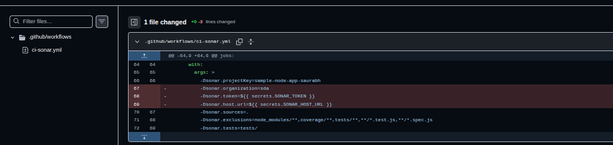

---

### ✅ Final Result: Pipeline Succeeded

After applying all three fixes, the pipeline ran successfully on attempt **#6**:

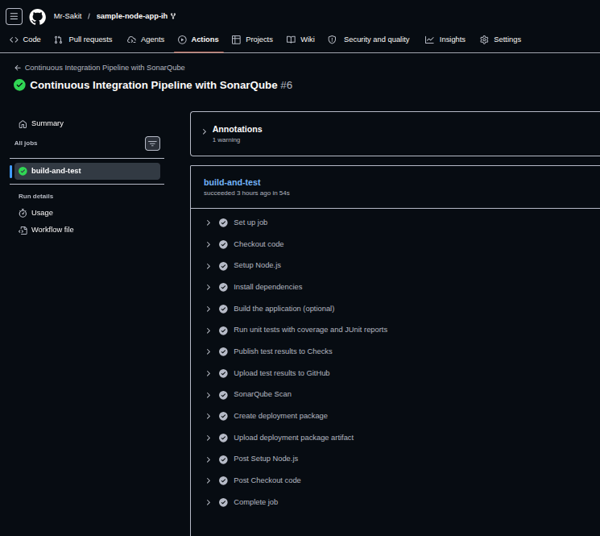

All steps passed:
- ✅ Set up job
- ✅ Checkout code
- ✅ Setup Node.js
- ✅ Install dependencies
- ✅ Build the application (optional)
- ✅ Run unit tests with coverage and JUnit reports
- ✅ Publish test results to Checks
- ✅ Upload test results to GitHub
- ✅ SonarQube Scan
- ✅ Create deployment package
- ✅ Upload deployment package artifact
- ✅ Complete job

---

### Step 5: Analyze the SonarQube Report

Navigate to the SonarQube server → **Projects** to view the analysis report:

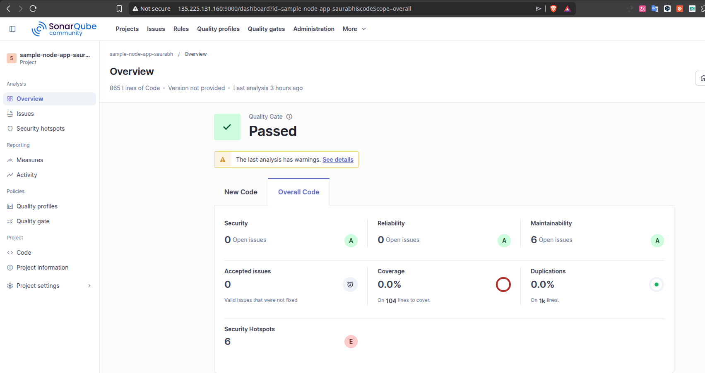

**SonarQube Quality Gate: ✅ Passed**

| Metric | Result | Rating |
|---|---|---|
| **Security** | 0 Open Issues | A |
| **Reliability** | 0 Open Issues | A |
| **Maintainability** | 6 Open Issues | A |
| **Coverage** | 0.0% | — |
| **Duplications** | 0.0% | ● |
| **Security Hotspots** | 6 | E |
| **Lines of Code** | 865 | — |

> [!TIP]
> Navigate through the SonarQube dashboard sections (Issues, Security Hotspots, Measures, Code) to explore detailed insights about the project's code quality.

---

## 🏗️ CI Pipeline Architecture

```
┌────────────────────────────────────────────────────────────────┐
│     Continuous Integration Pipeline with SonarQube             │
│                                                                │
│  Trigger: workflow_dispatch (Manual)                           │
│  Environment: dev (with SONAR_TOKEN + SONAR_HOST_URL secrets)  │
│                                                                │
│  ┌──────────────────────────────────────────────────────┐      │
│  │            build-and-test (ubuntu-latest)             │      │
│  │                                                      │      │
│  │  1. Checkout code                                    │      │
│  │  2. Setup Node.js 18.x                               │      │
│  │  3. npm ci (Install dependencies)                    │      │
│  │  4. Build (optional)                                 │      │
│  │  5. Run unit tests (Jest + JUnit XML)                │      │
│  │  6. Publish test results → GitHub Checks             │      │
│  │  7. Upload test results artifact                     │      │
│  │  8. SonarQube Scan ──────────────────┐               │      │
│  │  9. Create deployment package (ZIP)  │               │      │
│  │  10. Upload deployment artifact      │               │      │
│  └──────────────────────────────────────┼───────────────┘      │
│                                         │                      │
│                                         ▼                      │
│                               ┌─────────────────┐             │
│                               │  SonarQube       │             │
│                               │  Server          │             │
│                               │  (Azure VM)      │             │
│                               │  :9000           │             │
│                               └─────────────────┘             │
│                                                                │
│  Artifacts: test-results + deployment-package (ZIP)            │
│  Report: SonarQube Quality Gate (Security, Reliability, etc.)  │
└────────────────────────────────────────────────────────────────┘
```

---

## 📊 Summary

| Task | Command / Action | Status |
|---|---|---|
| Fork sample Node.js app | GitHub UI → Fork `sample-node-app-ih` | ✅ |
| Clone repository | `git clone ...sample-node-app-ih` | ✅ |
| Create CI workflow | `.github/workflows/ci-sonar.yml` | ✅ |
| Create `dev` environment | Settings → Environments → New → `dev` | ✅ |
| Generate SonarQube token | My Account → Security → Generate Token | ✅ |
| Add `SONAR_HOST_URL` secret | Settings → Environments → dev → Add secret | ✅ |
| Add `SONAR_TOKEN` secret | Settings → Environments → dev → Add secret | ✅ |
| Fix missing `test:ci` script | Added to `package.json` + `jest-junit` dep | ✅ |
| Fix `JEST_JUNIT_OUTPUT` deprecation | Replaced with `OUTPUT_DIR` + `OUTPUT_NAME` | ✅ |
| Fix SonarQube secrets configuration | Moved token/URL from args to env block | ✅ |
| Pipeline execution (attempt #6) | All steps green ✅ | ✅ |
| SonarQube Quality Gate | Passed (Security A, Reliability A) | ✅ |

---

## 💡 Key Takeaways

1. **SonarQube** is a powerful code scanning tool for identifying security vulnerabilities, code smells, and quality issues in your codebase
2. **GitHub Environment Secrets** (`SONAR_TOKEN`, `SONAR_HOST_URL`) keep sensitive credentials secure and scoped to specific environments (e.g., `dev`)
3. **Self-hosted SonarQube** (on Azure VM) requires the full URL with protocol and port (e.g., `http://<IP>:9000`) — do **not** use `-Dsonar.organization` which is only for SonarCloud
4. **`jest-junit` v6+** deprecated `JEST_JUNIT_OUTPUT` — use `JEST_JUNIT_OUTPUT_DIR` and `JEST_JUNIT_OUTPUT_NAME` instead
5. **Missing npm scripts** (like `test:ci`) must be added to `package.json` before the pipeline can use them — always check that your scripts exist
6. **Troubleshooting is a core DevOps skill** — this lab required 6 pipeline iterations to resolve all issues, which reflects real-world CI/CD experience
7. **SonarQube Quality Reports** provide insights across multiple dimensions: Security, Reliability, Maintainability, Coverage, Duplications, and Security Hotspots
8. Always pass SonarQube credentials through **environment variables** (`env` block), not through command-line arguments, for security and reliability
