# Lab 1: Deploy a Node.js Application on Azure Container Apps (using GitHub Actions)

## 📋 Overview

This lab demonstrates building a complete **CI/CD pipeline** with **GitHub Actions** to deploy a **Node.js** application to **Azure Container Apps (ACA)**. The workflow includes building and testing the application, building a Docker image, pushing it to **Docker Hub**, and deploying the container to Azure Container Apps — all triggered via a manual `workflow_dispatch` from the GitHub Actions tab.

> [!NOTE]
> During the lab, the initial GitHub Actions run failed at the **Azure Login** step due to an OIDC/federated identity misconfiguration. The fix involved downgrading `azure/login` from `v2` to `v1` and switching from individual credential fields to a single `creds` JSON object. This issue is documented in the [Troubleshooting](#-troubleshooting) section.

---

## 🎯 Objectives

- Provision Azure Container Apps infrastructure using Azure CLI
- Fork and clone a sample Node.js application repository
- Create a multi-stage Dockerfile for the Node.js app
- Write a GitHub Actions CI/CD workflow (`ci.yml`)
- Configure Azure Service Principal for GitHub Actions authentication
- Set up Docker Hub Personal Access Token for image registry
- Store secrets securely in GitHub repository settings
- Troubleshoot and fix Azure login issues in the CI/CD pipeline
- Verify successful deployment to Azure Container Apps

---

## 🔧 Prerequisites

| Requirement | Details |
|---|---|
| **Azure Subscription** | Active subscription with contributor access |
| **Azure CLI** | Installed locally or using Azure Cloud Shell |
| **GitHub Account** | With a forked copy of the sample Node.js repo |
| **Docker Hub Account** | For pushing container images |
| **Git** | Installed on the local machine |

> [!IMPORTANT]
> You need sufficient permissions in your Azure subscription to create Resource Groups, Container App Environments, Container Apps, and Service Principals with RBAC role assignments.

---

## 📝 Lab Steps

### Step 1: Provision Azure Infrastructure with CLI

Set up environment variables and create the Azure resources:

```bash
RG=container-labs-rg-sakit
LOC=swedencentral
ENV_NAME=aca-env-sakit
APP_NAME=frontendapp
PLACEHOLDER_IMAGE=nginx:alpine
```

#### 1.1 — Create the Resource Group

```bash
az group create -n $RG -l $LOC
```

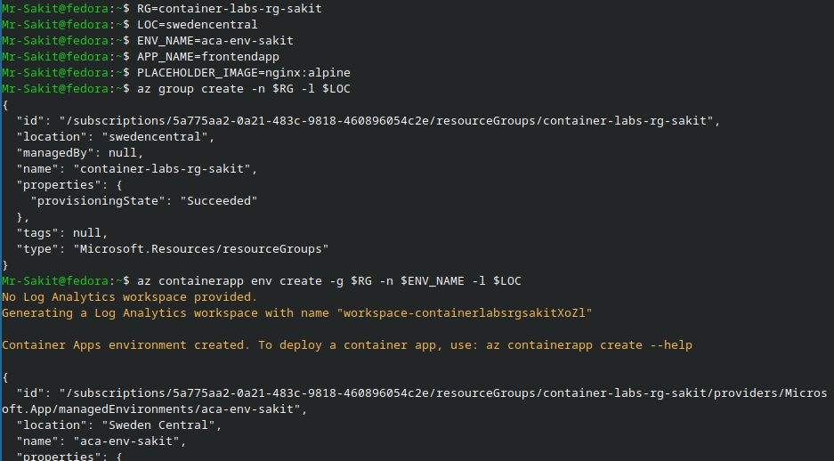

#### 1.2 — Create the Container Apps Environment

```bash
az containerapp env create -g $RG -n $ENV_NAME -l $LOC
```

A **Log Analytics workspace** is automatically generated alongside the environment.

#### 1.3 — Create the Container App (with placeholder image)

```bash
az containerapp create -g $RG -n $APP_NAME \
  --environment $ENV_NAME \
  --image $PLACEHOLDER_IMAGE \
  --ingress external --target-port 3000 \
  --query properties.configuration.ingress.fqdn -o tsv
```

The Container App is created with a placeholder `nginx:alpine` image. The output provides the FQDN URL:

```
frontendapp.ambitiousglacier-d495ca5b.swedencentral.azurecontainerapps.io
```

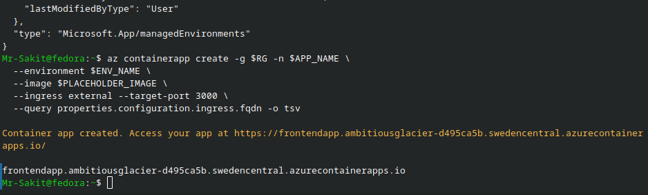

| Resource | Type | Details |
|---|---|---|
| `container-labs-rg-sakit` | Resource Group | Sweden Central region |
| `aca-env-sakit` | Container Apps Environment | With auto-generated Log Analytics workspace |
| `frontendapp` | Container App | External ingress, port 3000, placeholder nginx:alpine |

---

### Step 2: Fork and Clone the Sample Node.js Repository

Fork the repository `saurabhd2106/sample-node-app-ci-lab-ih` on GitHub (click the **Fork** button):

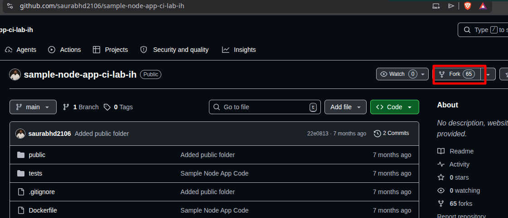

Then clone your forked repository locally:

```bash
git clone https://github.com/Mr-Sakit/sample-node-app-ci-lab-ih
cd sample-node-app-ci-lab-ih/
ls
```

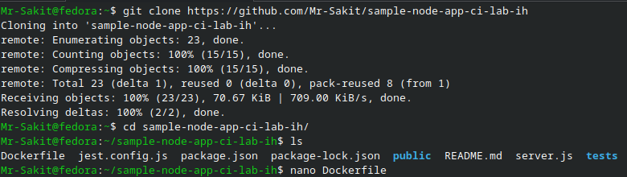

The repository contains:
```
Dockerfile  jest.config.js  package-lock.json  package.json  public/  README.md  server.js  tests/
```

---

### Step 3: Create the Multi-Stage Dockerfile

Edit the `Dockerfile` with a multi-stage build configuration:

```bash
nano Dockerfile
```

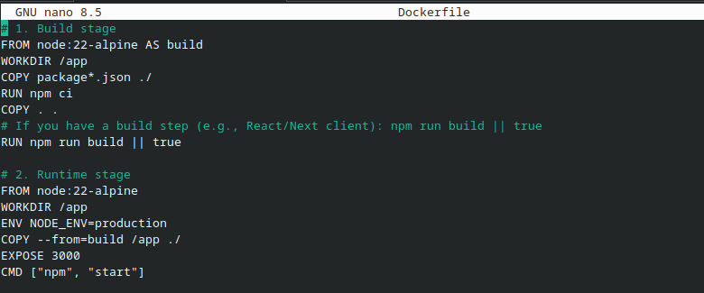

```dockerfile
# 1. Build stage
FROM node:22-alpine AS build
WORKDIR /app
COPY package*.json ./
RUN npm ci
COPY . .
# If you have a build step (e.g., React/Next client): npm run build || true
RUN npm run build || true

# 2. Runtime stage
FROM node:22-alpine
WORKDIR /app
ENV NODE_ENV=production
COPY --from=build /app ./
EXPOSE 3000
CMD ["npm", "start"]
```

> [!TIP]
> The multi-stage build separates the **build** and **runtime** stages, resulting in a smaller final image. The `npm run build || true` ensures the build step doesn't fail if there's no build script defined.

---

### Step 4: Create the GitHub Actions CI/CD Workflow

Create the workflow directory and file:

```bash
mkdir -p .github/workflows
nano .github/workflows/ci.yml
```

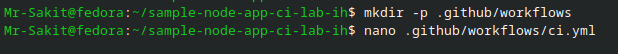

The workflow file `ci.yml`:

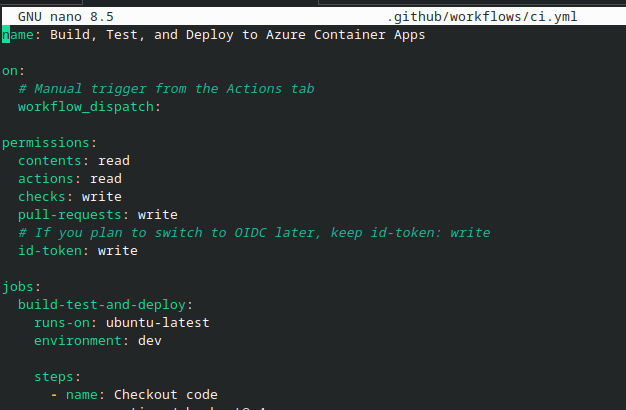

```yaml
name: Build, Test, and Deploy to Azure Container Apps

on:
  # Manual trigger from the Actions tab
  workflow_dispatch:

permissions:
  contents: read
  actions: read
  checks: write
  pull-requests: write
  # If you plan to switch to OIDC later, keep id-token: write
  id-token: write

jobs:
  build-test-and-deploy:
    runs-on: ubuntu-latest
    environment: dev

    steps:
      - name: Checkout code
        uses: actions/checkout@v4

      - name: Setup Node.js
        uses: actions/setup-node@v4
        with:
          node-version: '22'

      - name: Install dependencies
        run: npm ci

      - name: Run unit tests (if present)
        run: npm test || true

      - name: Build the application (optional)
        run: npm run build || true

      - name: Azure Login (Service Principal)
        # If you adopt OIDC later, switch to federated creds and drop client-secret
        uses: azure/login@v1
        with:
          creds: '{"clientId":"${{ secrets.AZURE_CLIENT_ID }}","clientSecret":"${{ secrets.AZURE_CLIENT_SECRET }}","subscriptionId":"${{ secrets.AZURE_SUBSCRIPTION_ID }}","tenantId":"${{ secrets.AZURE_TENANT_ID }}"}'

      - name: Build, push image to Docker Hub and deploy to ACA
        uses: azure/container-apps-deploy-action@v2
        with:
          appSourcePath: ${{ github.workspace }}
          acrName: docker.io
          acrUsername: ${{ secrets.DOCKERHUB_USERNAME }}
          acrPassword: ${{ secrets.DOCKERHUB_TOKEN }}
          containerAppName: frontendapp
          containerAppEnvironment: aca-env-sakit
          resourceGroup: container-labs-rg-sakit
          imageToBuild: docker.io/${{ secrets.DOCKERHUB_USERNAME }}/sample-node-app:${{ github.sha }}
          imageToDeploy: docker.io/${{ secrets.DOCKERHUB_USERNAME }}/sample-node-app:${{ github.sha }}
```

---

### Step 5: Create an Azure Service Principal

From **Azure Cloud Shell** (or local Azure CLI), get your subscription ID and create a Service Principal:

```bash
az account show --query id --output tsv
```

```bash
az ad sp create-for-rbac --name "GitHub-Actions-SP" --role contributor \
  --scopes /subscriptions/<SUBSCRIPTION_ID> \
  --sdk-auth
```

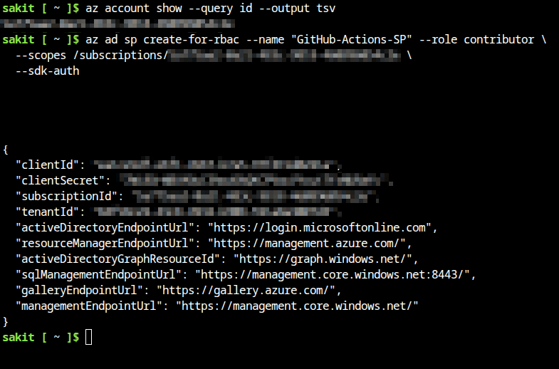

The output provides a JSON object containing `clientId`, `clientSecret`, `subscriptionId`, `tenantId`, and endpoint URLs.

> [!WARNING]
> Save the `clientSecret` immediately — it is only displayed once and cannot be retrieved later.

---

### Step 6: Create a Docker Hub Personal Access Token

Go to **Docker Hub** → **Account Settings** → **Personal access tokens** → **New access token**:

| Field | Value |
|---|---|
| **Access token description** | `Ci` |
| **Expiration date** | `None` |
| **Access permissions** | `Read, Write, Delete` |

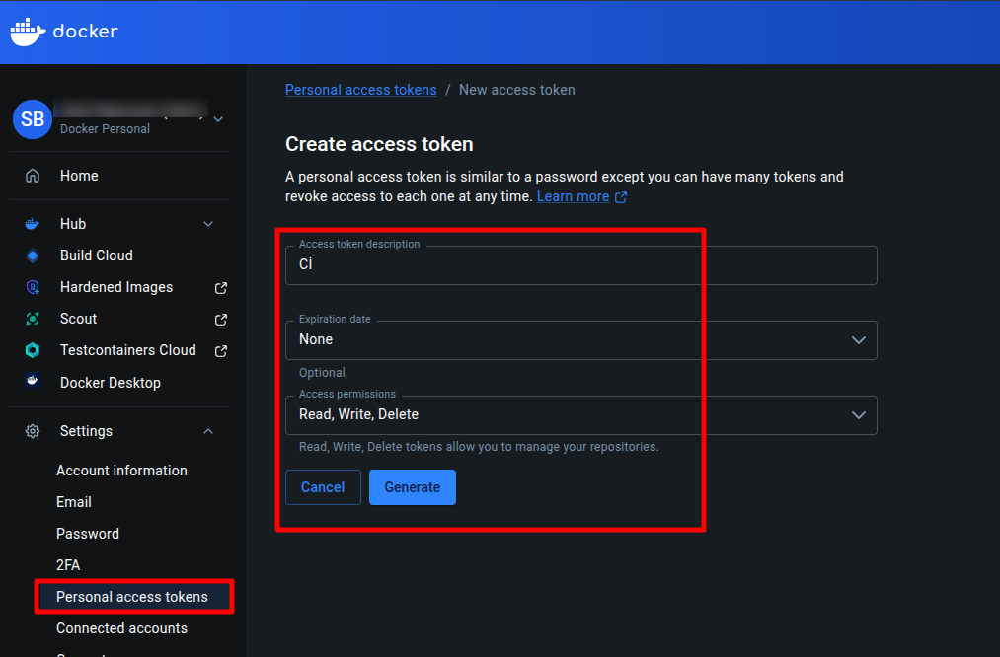

Copy the generated token:

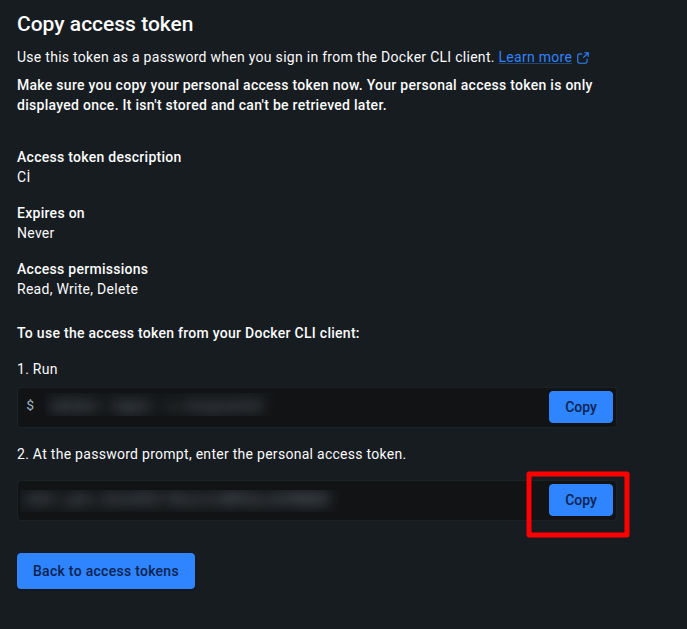

> [!WARNING]
> Copy and save the Docker Hub personal access token immediately. It is only displayed once and cannot be retrieved later.

---

### Step 7: Configure GitHub Repository Secrets

Navigate to your forked repo → **Settings** → **Secrets and variables** → **Actions** → **New repository secret**:

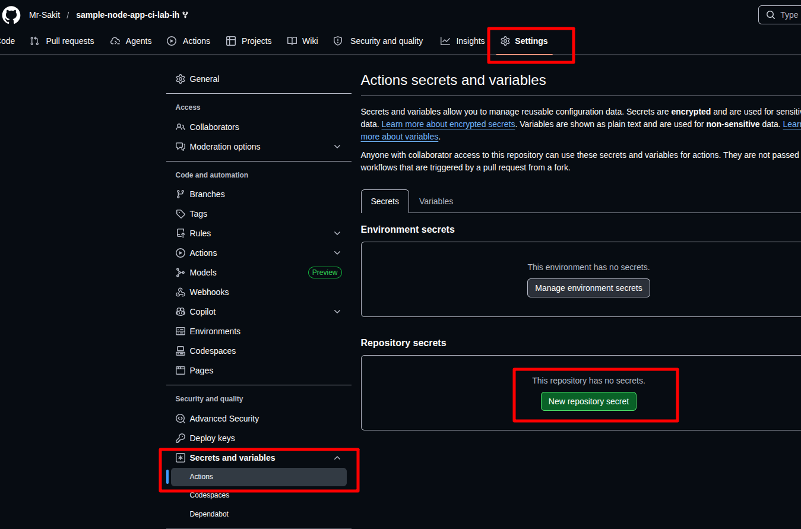

Add the following 6 secrets:

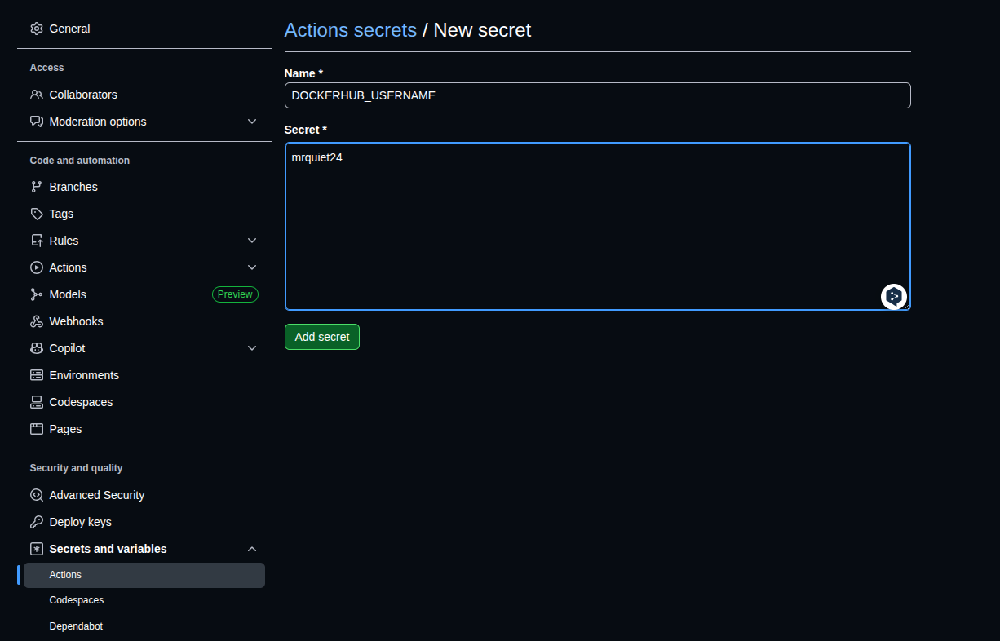

| Secret Name | Value Source |
|---|---|
| `AZURE_CLIENT_ID` | From Service Principal JSON (`clientId`) |
| `AZURE_CLIENT_SECRET` | From Service Principal JSON (`clientSecret`) |
| `AZURE_SUBSCRIPTION_ID` | From Service Principal JSON (`subscriptionId`) |
| `AZURE_TENANT_ID` | From Service Principal JSON (`tenantId`) |
| `DOCKERHUB_USERNAME` | Your Docker Hub username |
| `DOCKERHUB_TOKEN` | Docker Hub Personal Access Token |

All 6 secrets configured:

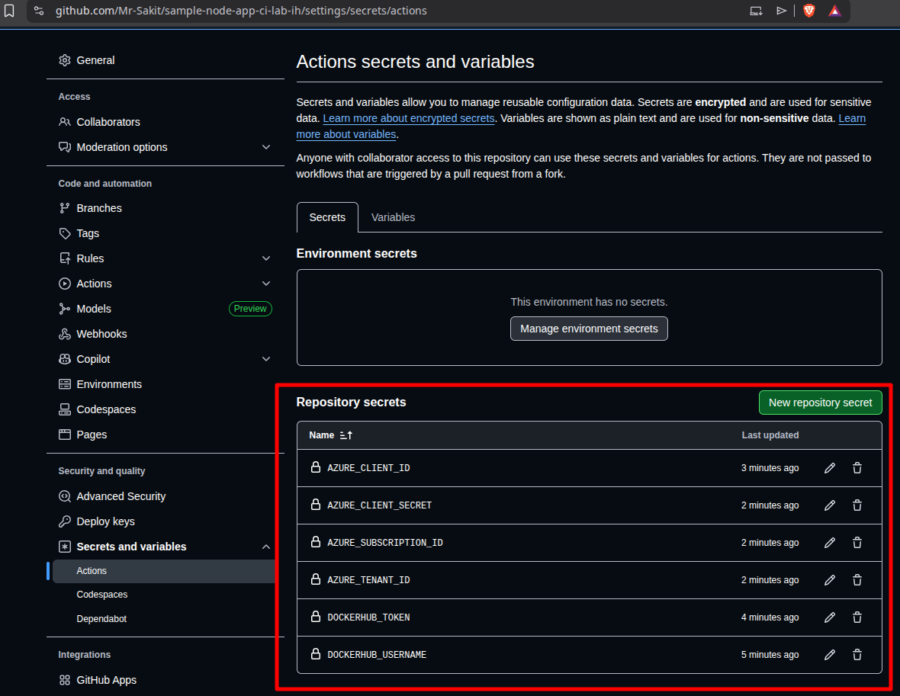

---

### Step 8: Push the Workflow to GitHub

Commit and push the changes to trigger the workflow:

```bash
git add .
git commit -m "ci.yml added"
git remote set-url origin git@github.com:Mr-Sakit/sample-node-app-ci-lab-ih.git
git push origin main
```

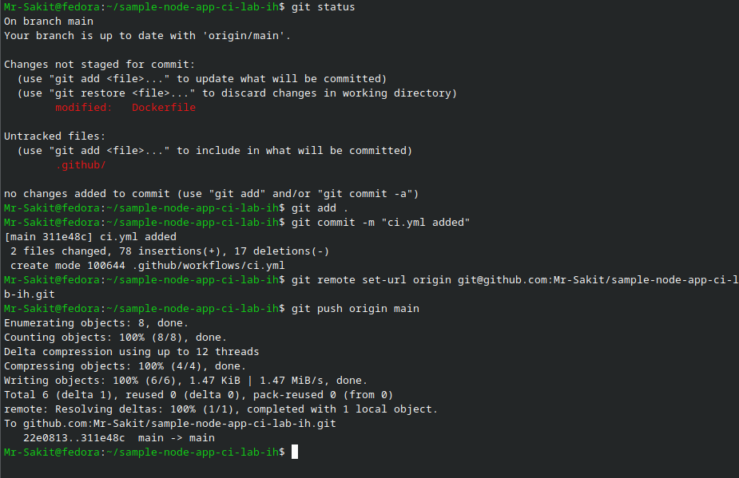

---

## 🔥 Troubleshooting

### ❌ Problem: Azure Login Fails with OIDC / Federated Identity Error

The first workflow run (#1) failed at the **Azure Login (Service Principal)** step:

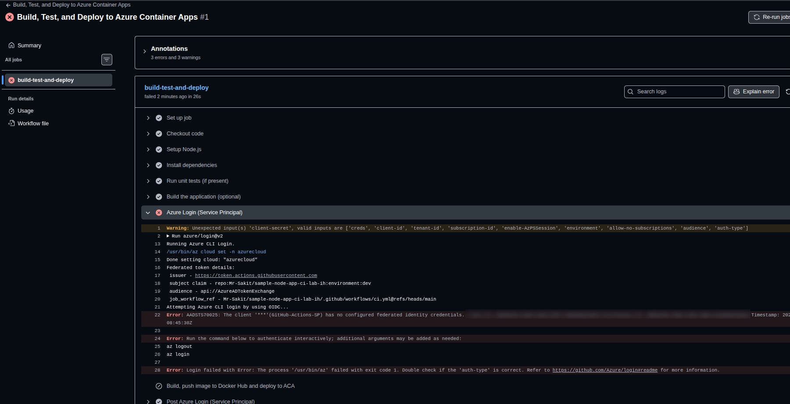

**Error Messages:**
```
Warning: Unexpected input(s) 'client-secret', valid inputs are ['creds', 'client-id', 'tenant-id', 
'subscription-id', 'enable-AzPSSession', 'environment', 'allow-no-subscriptions', 'audience', 'auth-type']

Error: AADSTS70025: The client '***'(GitHub-Actions-SP) has no configured federated identity credentials.
```

**Root Cause:** The workflow used `azure/login@v2` with individual credential fields (`client-id`, `client-secret`, `subscription-id`, `tenant-id`), but `v2` expects OIDC federated identity credentials by default. Since the Service Principal was created with a client secret (not federated), the authentication method was incompatible.

**Solution:** Two changes were made in the `ci.yml`:

1. Downgraded `azure/login@v2` → `azure/login@v1`
2. Replaced individual credential fields with a single `creds` JSON object
3. Commented out `id-token: write` permission (not needed for SP auth)

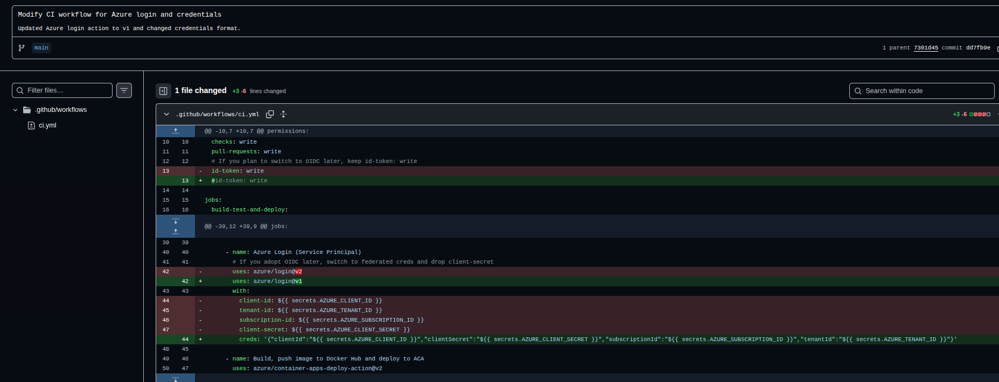

Additionally, the Service Principal needed a proper **role assignment**. From Azure Cloud Shell:

```bash
az ad sp create --id <CLIENT_ID>
```

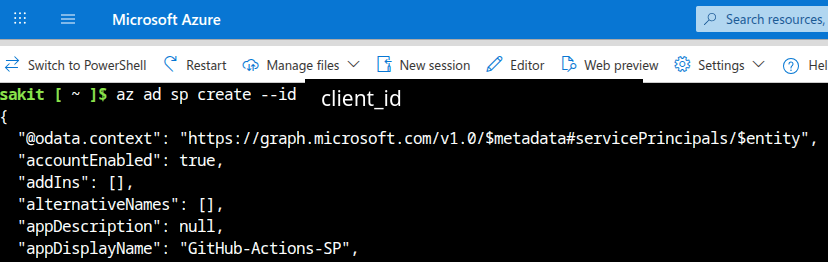

```bash
az role assignment create <CLIENT_ID> \
  --role contributor \
  --scope /subscriptions/<SUBSCRIPTION_ID>
```

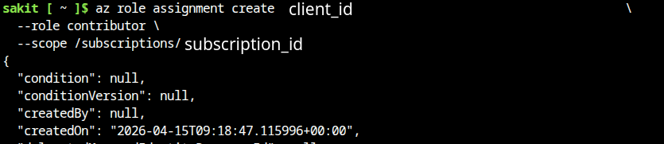

After pushing the fixes, the workflow passed successfully on run #6.

> [NOTE]
> If you get an error during the "**Build, push image to Docker Hub and deploy to ACA**" stage, open the "**/.github/workflows/ci.yml**" file and make sure that the "**resourceGroup**" line contains your resource group.

---

### Step 9: Verify Successful Deployment

After the fix, the GitHub Actions workflow completed successfully:

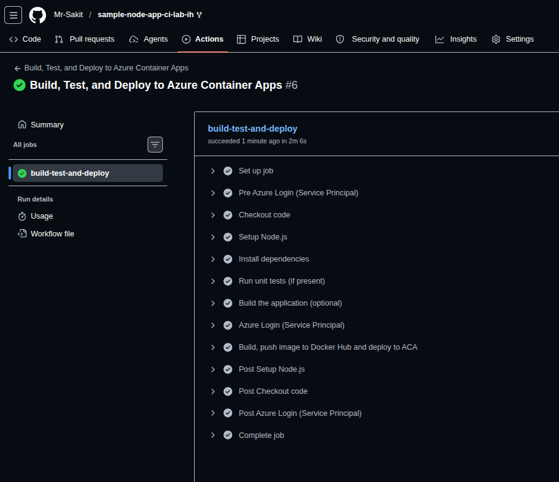

**Workflow Steps (all ✅ passed):**

| Step | Status |
|---|---|
| Set up job | ✅ |
| Pre Azure Login (Service Principal) | ✅ |
| Checkout code | ✅ |
| Setup Node.js | ✅ |
| Install dependencies | ✅ |
| Run unit tests (if present) | ✅ |
| Build the application (optional) | ✅ |
| Azure Login (Service Principal) | ✅ |
| Build, push image to Docker Hub and deploy to ACA | ✅ |
| Post Setup Node.js | ✅ |
| Post Checkout code | ✅ |
| Post Azure Login (Service Principal) | ✅ |
| Complete job | ✅ |

---

### Step 10: Verify the Deployed Application

Verify the Container App FQDN and test the deployed application:

```bash
az containerapp show -g container-labs-rg-sakit -n frontendapp \
  --query properties.configuration.ingress.fqdn -o tsv
```

```
frontendapp.ambitiousglacier-d495ca5b.swedencentral.azurecontainerapps.io
```

Test with `curl`:

```bash
curl https://frontendapp.ambitiousglacier-d495ca5b.swedencentral.azurecontainerapps.io
```

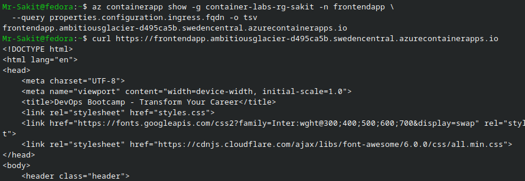

The response returns the HTML of the deployed Node.js application (**DevOps Bootcamp - Transform Your Career**), confirming the deployment was successful.

---

## 🏗️ Architecture

```
┌─────────────────────────────────────────────────────────────────────────┐
│                        GitHub Repository                                │
│                  (sample-node-app-ci-lab-ih)                            │
│                                                                         │
│  ┌─────────────────────────────────────────────────┐                   │
│  │  .github/workflows/ci.yml                        │                   │
│  │  Trigger: workflow_dispatch (manual)              │                   │
│  └──────────────────────┬──────────────────────────┘                   │
└─────────────────────────┼───────────────────────────────────────────────┘
                          │
                          ▼
┌─────────────────────────────────────────────────────────────────────────┐
│                    GitHub Actions Runner                                 │
│                     (ubuntu-latest)                                      │
│                                                                         │
│  1. Checkout code                                                       │
│  2. Setup Node.js 22                                                    │
│  3. npm ci → npm test → npm run build                                   │
│  4. Azure Login (Service Principal - v1)                                │
│  5. Build Docker image → Push to Docker Hub                             │
│  6. Deploy to Azure Container Apps                                      │
└───────────┬─────────────────────────────┬───────────────────────────────┘
            │                             │
            ▼                             ▼
┌───────────────────────┐   ┌─────────────────────────────────────┐
│      Docker Hub       │   │        Azure Container Apps          │
│                       │   │                                     │
│  mrquiet24/           │   │  Resource Group: container-labs-rg  │
│  sample-node-app:sha  │──►│  Environment:   aca-env-sakit       │
│                       │   │  App:           frontendapp         │
│                       │   │  Ingress:       external :3000      │
│                       │   │  FQDN: frontendapp.ambitious...     │
└───────────────────────┘   └─────────────────────────────────────┘
```

---

## 📊 Summary

| Task | Command / Action | Status |
|---|---|---|
| Create Resource Group | `az group create -n $RG -l $LOC` | ✅ |
| Create Container Apps Environment | `az containerapp env create -g $RG -n $ENV_NAME -l $LOC` | ✅ |
| Create Container App (placeholder) | `az containerapp create ... --image nginx:alpine` | ✅ |
| Fork sample Node.js repo | GitHub Fork button | ✅ |
| Clone repository locally | `git clone .../sample-node-app-ci-lab-ih` | ✅ |
| Create multi-stage Dockerfile | `nano Dockerfile` | ✅ |
| Create GitHub Actions workflow | `.github/workflows/ci.yml` | ✅ |
| Create Azure Service Principal | `az ad sp create-for-rbac --name "GitHub-Actions-SP"` | ✅ |
| Create Docker Hub PAT | Docker Hub → Personal access tokens | ✅ |
| Configure 6 GitHub secrets | Settings → Secrets and variables → Actions | ✅ |
| Fix Azure Login (v2 → v1 + creds) | Troubleshooting OIDC error | ✅ |
| Assign contributor role to SP | `az role assignment create` | ✅ |
| Successful CI/CD pipeline (Run #6) | GitHub Actions → workflow_dispatch | ✅ |
| Verify deployed application | `curl` to FQDN returns HTML | ✅ |

---

## 💡 Key Takeaways

1. **Azure Container Apps** provides a serverless container platform that eliminates infrastructure management while supporting auto-scaling, ingress, and environment-based deployments
2. **GitHub Actions `workflow_dispatch`** allows manual triggering of CI/CD pipelines from the Actions tab, useful for controlled deployments
3. **Multi-stage Docker builds** separate build and runtime stages, producing lean production images with only necessary runtime dependencies
4. **Azure Service Principal** with `--sdk-auth` generates a JSON credentials object for non-interactive authentication from CI/CD systems
5. **`azure/login@v1`** uses the classic `creds` JSON approach, while **`azure/login@v2`** defaults to OIDC federated identity — mixing them causes authentication failures
6. **Docker Hub Personal Access Tokens** provide scoped, revocable access for CI/CD pipelines instead of using your Docker Hub password directly
7. **GitHub Repository Secrets** securely store sensitive credentials (Azure SP, Docker Hub token) and inject them into workflows via `${{ secrets.NAME }}`
8. **`azure/container-apps-deploy-action@v2`** combines Docker build, push, and Azure Container Apps deployment into a single step, simplifying the workflow
9. Always **verify the deployed application** with `curl` or browser after a successful pipeline run to confirm end-to-end deployment
