# Lab 2: Deploy a Node.js Application on Azure Web App / App Services (using GitHub Actions)

## 📋 Overview

This lab demonstrates building a **CI/CD pipeline** with **GitHub Actions** to deploy a **Node.js** application to **Azure Web App (App Services)** as a Docker container. The workflow includes building and testing the application, building a Docker image, pushing it to **Docker Hub**, and deploying the container to an Azure Web App — all triggered via a manual `workflow_dispatch` from the GitHub Actions tab.

> [!NOTE]
> This lab follows the same sample Node.js application and GitHub repository used in [Lab 1 (Azure Container Apps)](https://github.com/Mr-Sakit/DevOpsFirstStep/tree/main/week8/day3/lab1-Deploy%20a%20%20Nodejs%20Application%20on%20a%20Azure%20Container%20Apps%20(using%20Github%20Actions)). The key difference is the **deployment target**: Lab 1 uses **Azure Container Apps** while this lab uses **Azure Web App (App Services)**. Credentials such as the Azure Service Principal, Docker Hub PAT, and GitHub Secrets were already configured during Lab 1 — refer to that lab's README for detailed steps on how they were obtained.

---

## 🎯 Objectives

- Provision Azure Web App infrastructure (Resource Group, App Service Plan, Web App) using Azure CLI
- Fork and clone the sample Node.js application repository
- Create a multi-stage Dockerfile for the Node.js app
- Write a GitHub Actions CI/CD workflow (`ci.yml`) tailored for Azure Web App deployment
- Reuse existing Azure Service Principal and Docker Hub credentials from Lab 1
- Configure GitHub repository secrets for the new forked repo
- Deploy the containerized application to Azure Web App
- Verify successful deployment via browser and CLI

---

## 🔧 Prerequisites

| Requirement | Details |
|---|---|
| **Azure Subscription** | Active subscription with contributor access |
| **Azure CLI** | Installed locally or using Azure Cloud Shell |
| **GitHub Account** | With a forked copy of the sample Node.js repo |
| **Docker Hub Account** | For pushing container images |
| **Git** | Installed on the local machine |
| **Lab 1 Completed** | Azure Service Principal and Docker Hub PAT already created |

> [!IMPORTANT]
> This lab assumes you have already created the **Azure Service Principal** (`GitHub-Actions-SP`) and **Docker Hub Personal Access Token** during [Lab 1](https://github.com/Mr-Sakit/DevOpsFirstStep/tree/main/week8/day3/lab1-Deploy%20a%20%20Nodejs%20Application%20on%20a%20Azure%20Container%20Apps%20(using%20Github%20Actions)). If not, refer to Lab 1 Steps 5–6 for detailed instructions.

---

## 🔄 Differences from Lab 1 (Azure Container Apps)

| Aspect | Lab 1 — Container Apps | Lab 2 — Web App (App Services) |
|---|---|---|
| **Azure Service** | Azure Container Apps (ACA) | Azure Web App (App Services) |
| **Infrastructure** | Container Apps Environment | App Service Plan (P1v2 Linux) |
| **Provisioning** | `az containerapp env create` + `az containerapp create` | `az appservice plan create` + `az webapp create` |
| **Deployment Action** | `azure/container-apps-deploy-action@v2` | `az webapp config container set` + `az webapp restart` |
| **Docker Login** | Handled by the deploy action | Separate `docker/login-action@v3` step |
| **Image Push** | Handled by the deploy action | Separate `docker/build-push-action@v6` step |
| **Port Config** | `--target-port 3000` at creation | `WEBSITES_PORT` app setting |
| **URL Format** | `*.azurecontainerapps.io` | `*.azurewebsites.net` |

---

## 📝 Lab Steps

### Step 1: Provision Azure Web App Infrastructure with CLI

Set up environment variables and create the Azure resources:

```bash
RG=web-labs-rg-sakit
LOC=swedencentral
PLAN=web-labs-plan-sakit
WEBAPP=frontendapp-web
DOCKER_IMAGE=nginx:alpine
APP_PORT=3000
```

#### 1.1 — Create the Resource Group

```bash
az group create -n $RG -l $LOC
```

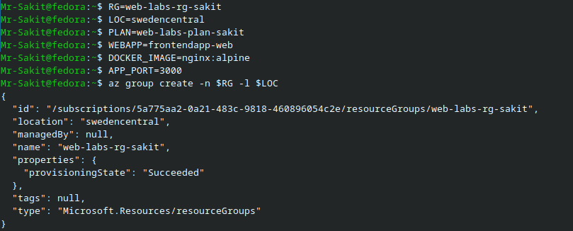

#### 1.2 — Create the App Service Plan

```bash
az appservice plan create -g $RG -n $PLAN --sku P1v2 --is-linux
```

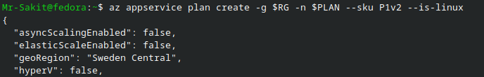

> [!TIP]
> The `P1v2` SKU is a **Premium v2** tier that supports Linux containers. For production workloads, consider scaling the plan based on traffic requirements.

#### 1.3 — Create the Web App (with placeholder image)

```bash
az webapp create -g $RG -p $PLAN -n $WEBAPP \
  --deployment-container-image-name $DOCKER_IMAGE
```

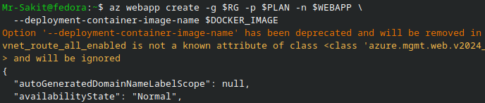

> [!NOTE]
> The `--deployment-container-image-name` option has been deprecated and will be removed in future Azure CLI versions. The placeholder `nginx:alpine` image will be replaced by the CI/CD pipeline.

#### 1.4 — Configure the Port and Get the Web App URL

```bash
az webapp config appsettings set -g $RG -n $WEBAPP \
  --settings WEBSITES_PORT=$APP_PORT

az webapp show -g $RG -n $WEBAPP --query defaultHostName -o tsv
```

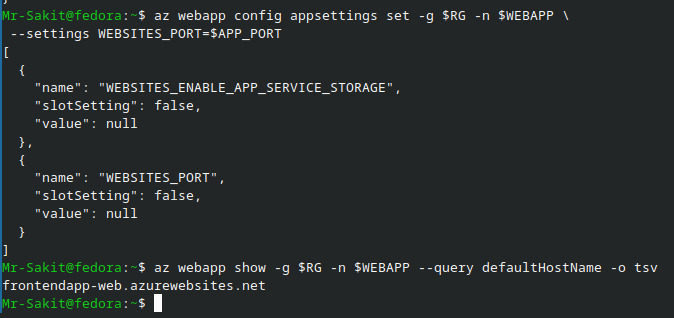

The Web App URL:
```
frontendapp-web.azurewebsites.net
```

| Resource | Type | Details |
|---|---|---|
| `web-labs-rg-sakit` | Resource Group | Sweden Central region |
| `web-labs-plan-sakit` | App Service Plan | P1v2 Linux |
| `frontendapp-web` | Web App | Container-based, port 3000, placeholder nginx:alpine |

---

### Step 2: Fork and Clone the Sample Node.js Repository

Fork the repository `saurabhd2106/sample-node-app-ci-lab-ih` on GitHub (click the **Fork** button):

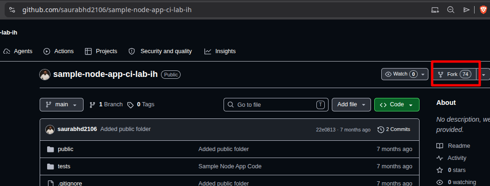

Then clone your forked repository locally:

```bash
git clone https://github.com/Mr-Sakit/sample-node-app-ci-lab-ih
cd sample-node-app-ci-lab-ih/
```

---

### Step 3: Create the Multi-Stage Dockerfile

Edit the `Dockerfile` with a multi-stage build configuration:

```bash
nano Dockerfile
```

```dockerfile
# 1) Build stage
FROM node:22-alpine AS build
WORKDIR /app
COPY package*.json ./
RUN npm ci
COPY . .
RUN npm run build || true

# 2) Runtime stage
FROM node:22-alpine
WORKDIR /app
ENV NODE_ENV=production
COPY --from=build /app ./
EXPOSE 3000
CMD ["npm", "start"]
```

> [!TIP]
> This Dockerfile is identical to Lab 1. The multi-stage build separates the **build** and **runtime** stages for a smaller final image.

---

### Step 4: Create the GitHub Actions CI/CD Workflow

Create the workflow directory and file:

```bash
mkdir -p .github/workflows
nano .github/workflows/ci.yml
```

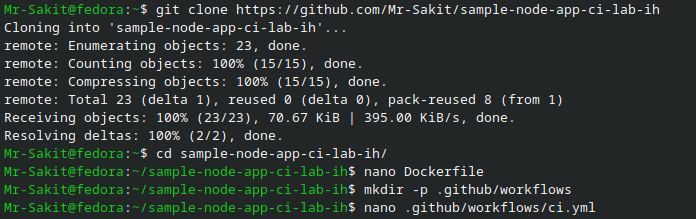

```yaml
name: Build, Test, and Deploy to Azure Web App (Container)

on:
 workflow_dispatch:

permissions:
 contents: read
 actions: read
 checks: write
 pull-requests: write
 # Keep if you plan to switch to OIDC (federated credentials)
 #id-token: write

env:
 APP_PORT: 3000
 IMAGE_NAME: ${{ secrets.DOCKERHUB_USERNAME }}/frontendapp-node
 AZURE_RESOURCE_GROUP: web-labs-rg-sakit
 AZURE_WEBAPP_NAME: frontendapp-web

jobs:
 build-test-and-deploy:
   runs-on: ubuntu-latest
   environment: dev

   steps:
     - name: Checkout code
       uses: actions/checkout@v4

     - name: Setup Node.js
       uses: actions/setup-node@v4
       with:
         node-version: 22.x
         cache: npm
         cache-dependency-path: package-lock.json

     - name: Install dependencies
       run: npm ci

     - name: Run unit tests (if present)
       run: npm test --if-present

     - name: Build (optional)
       run: npm run build 2>/dev/null || echo "No build step; continuing."

     - name: Azure Login (Service Principal)
       # If you adopt OIDC later, drop client-secret and configure federated creds
       uses: azure/login@v1
       with:
         creds: '{"clientId":"${{ secrets.AZURE_CLIENT_ID }}","clientSecret":"${{ secrets.AZURE_CLIENT_SECRET }}","subscriptionId":"${{ secrets.AZURE_SUBSCRIPTION_ID }}","tenantId":"${{ secrets.AZURE_TENANT_ID }}"}'

     - name: Login to Docker Hub
       uses: docker/login-action@v3
       with:
        username: ${{ secrets.DOCKERHUB_USERNAME }}
        password: ${{ secrets.DOCKERHUB_TOKEN }}

     - name: Build and push Docker image to Docker Hub
       uses: docker/build-push-action@v6
       with:
         context: .
         file: ./Dockerfile
         push: true
         tags: |
           ${{ env.IMAGE_NAME }}:${{ github.sha }}
           ${{ env.IMAGE_NAME }}:latest

     - name: Configure Web App to use the new image
       run: |
         az webapp config appsettings set \
           -g "${{ env.AZURE_RESOURCE_GROUP }}" \
           -n "${{ env.AZURE_WEBAPP_NAME }}" \
           --settings WEBSITES_PORT=${{ env.APP_PORT }} \
                      DOCKER_REGISTRY_SERVER_URL=https://index.docker.io/v1/

         # If your Docker Hub repo is PRIVATE, also set:
         # az webapp config appsettings set \
         #   -g "${{ env.AZURE_RESOURCE_GROUP }}" \
         #   -n "${{ env.AZURE_WEBAPP_NAME }}" \
         #   --settings DOCKER_REGISTRY_SERVER_USERNAME=${{ secrets.DOCKERHUB_USERNAME }} \
         #              DOCKER_REGISTRY_SERVER_PASSWORD=${{ secrets.DOCKERHUB_TOKEN }}

         az webapp config container set \
           -g "${{ env.AZURE_RESOURCE_GROUP }}" \
           -n "${{ env.AZURE_WEBAPP_NAME }}" \
           --container-image-name "${{ env.IMAGE_NAME }}:${{ github.sha }}" \
           --container-registry-url "https://index.docker.io"

         # Restart to pull the new image immediately
         az webapp restart -g "${{ env.AZURE_RESOURCE_GROUP }}" -n "${{ env.AZURE_WEBAPP_NAME }}"
```

#### Key Differences from Lab 1 Workflow

| Feature | Lab 1 (`ci.yml`) | Lab 2 (`ci.yml`) |
|---|---|---|
| **Docker Login** | Handled by `azure/container-apps-deploy-action` | Separate `docker/login-action@v3` step |
| **Image Build & Push** | Handled by `azure/container-apps-deploy-action` | Separate `docker/build-push-action@v6` step |
| **Image Tags** | Single tag (`github.sha`) | Two tags (`github.sha` + `latest`) |
| **Deploy Step** | `azure/container-apps-deploy-action@v2` | `az webapp config container set` + `az webapp restart` |
| **Port Config** | Set at Container App creation | `WEBSITES_PORT` app setting via `az webapp config` |
| **Environment Variables** | Inline in step | Global `env:` block at workflow level |
| **npm cache** | Not configured | `cache: npm` in `setup-node` |

---

### Step 5: Configure GitHub Repository Secrets

Navigate to your forked repo → **Settings** → **Secrets and variables** → **Actions** and add the same 6 secrets used in Lab 1:

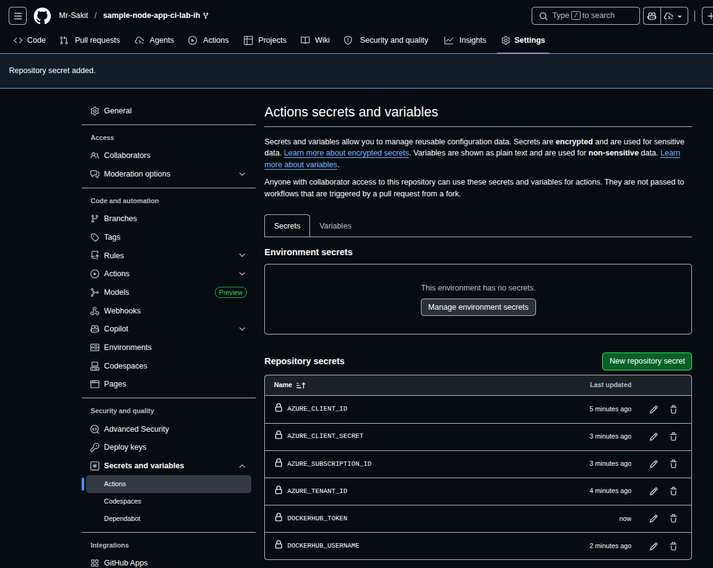

| Secret Name | Value Source |
|---|---|
| `AZURE_CLIENT_ID` | From Service Principal JSON (`clientId`) — [see Lab 1 Step 5](https://github.com/Mr-Sakit/DevOpsFirstStep/tree/main/week8/day3/lab1-Deploy%20a%20%20Nodejs%20Application%20on%20a%20Azure%20Container%20Apps%20(using%20Github%20Actions)#step-5-create-an-azure-service-principal) |
| `AZURE_CLIENT_SECRET` | From Service Principal JSON (`clientSecret`) — [see Lab 1 Step 5](https://github.com/Mr-Sakit/DevOpsFirstStep/tree/main/week8/day3/lab1-Deploy%20a%20%20Nodejs%20Application%20on%20a%20Azure%20Container%20Apps%20(using%20Github%20Actions)#step-5-create-an-azure-service-principal) |
| `AZURE_SUBSCRIPTION_ID` | From Service Principal JSON (`subscriptionId`) — [see Lab 1 Step 5](https://github.com/Mr-Sakit/DevOpsFirstStep/tree/main/week8/day3/lab1-Deploy%20a%20%20Nodejs%20Application%20on%20a%20Azure%20Container%20Apps%20(using%20Github%20Actions)#step-5-create-an-azure-service-principal) |
| `AZURE_TENANT_ID` | From Service Principal JSON (`tenantId`) — [see Lab 1 Step 5](https://github.com/Mr-Sakit/DevOpsFirstStep/tree/main/week8/day3/lab1-Deploy%20a%20%20Nodejs%20Application%20on%20a%20Azure%20Container%20Apps%20(using%20Github%20Actions)#step-5-create-an-azure-service-principal) |
| `DOCKERHUB_USERNAME` | Your Docker Hub username — [see Lab 1 Step 6](https://github.com/Mr-Sakit/DevOpsFirstStep/tree/main/week8/day3/lab1-Deploy%20a%20%20Nodejs%20Application%20on%20a%20Azure%20Container%20Apps%20(using%20Github%20Actions)#step-6-create-a-docker-hub-personal-access-token) |
| `DOCKERHUB_TOKEN` | Docker Hub Personal Access Token — [see Lab 1 Step 6](https://github.com/Mr-Sakit/DevOpsFirstStep/tree/main/week8/day3/lab1-Deploy%20a%20%20Nodejs%20Application%20on%20a%20Azure%20Container%20Apps%20(using%20Github%20Actions)#step-6-create-a-docker-hub-personal-access-token) |

> [!NOTE]
> The Azure Service Principal (`GitHub-Actions-SP`) and Docker Hub PAT were already created during Lab 1. The same credential values are reused here. Refer to [Lab 1 README](https://github.com/Mr-Sakit/DevOpsFirstStep/tree/main/week8/day3/lab1-Deploy%20a%20%20Nodejs%20Application%20on%20a%20Azure%20Container%20Apps%20(using%20Github%20Actions)) for the full step-by-step on how these credentials were generated.

---

### Step 6: Push the Workflow to GitHub

Commit and push the changes to trigger the workflow:

```bash
git remote set-url origin git@github.com:Mr-Sakit/sample-node-app-ci-lab-ih.git
git status
git add .
git commit -m "ym added"
git push origin main
```

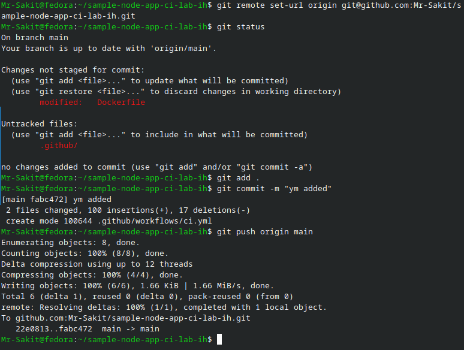

---

### Step 7: Run and Verify the GitHub Actions Workflow

Navigate to the **Actions** tab and manually trigger the workflow via **Run workflow**. The workflow completed successfully on the first run:

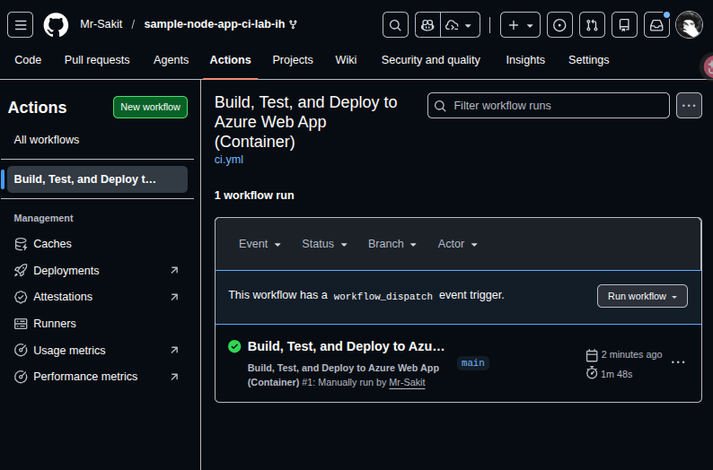

**Workflow:** `Build, Test, and Deploy to Azure Web App (Container)` — Run #1 ✅ (1m 48s)

---

### Step 8: Verify the Deployed Application

#### 8.1 — Verify via CLI

```bash
az webapp show -g web-labs-rg-sakit -n frontendapp-web --query defaultHostName -o tsv
```

```
frontendapp-web.azurewebsites.net
```

```bash
curl https://frontendapp-web.azurewebsites.net
```

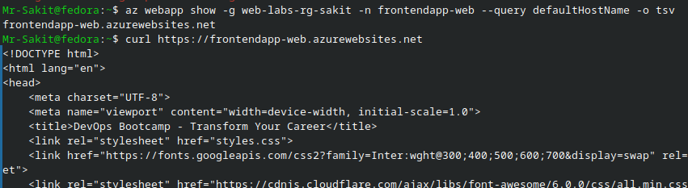

The response returns the HTML of the deployed Node.js application (**DevOps Bootcamp - Transform Your Career**).

#### 8.2 — Verify via Browser

Open `https://frontendapp-web.azurewebsites.net` in a browser:

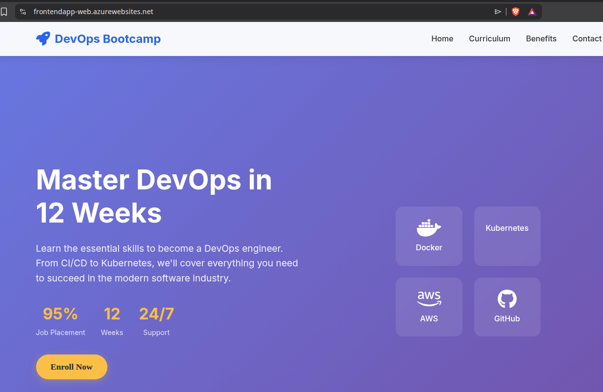

The **DevOps Bootcamp** application is live and accessible on Azure Web App.

#### 8.3 — Check Application Logs

Stream the Web App container logs to verify the application startup:

```bash
az webapp log tail -g web-labs-rg-sakit -n frontendapp-web
```

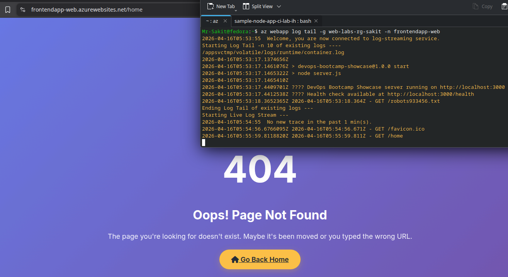

**Log Output:**
```
devops-bootcamp-showcase@1.0.0 start
node server.js
DevOps Bootcamp Showcase server running on http://localhost:3000
Health check available at http://localhost:3000/health
```

> [!NOTE]
> The `/home` route returns a **404 Page Not Found** because the Node.js application serves the main page at `/` (root). This is expected behavior — the custom 404 page with "Go Back Home" button is part of the application's error handling.

---

## 🏗️ Architecture

```
┌─────────────────────────────────────────────────────────────────────────┐
│                        GitHub Repository                                │
│                  (sample-node-app-ci-lab-ih)                            │
│                                                                         │
│  ┌─────────────────────────────────────────────────┐                   │
│  │  .github/workflows/ci.yml                        │                   │
│  │  Trigger: workflow_dispatch (manual)              │                   │
│  └──────────────────────┬──────────────────────────┘                   │
└─────────────────────────┼───────────────────────────────────────────────┘
                          │
                          ▼
┌─────────────────────────────────────────────────────────────────────────┐
│                    GitHub Actions Runner                                 │
│                     (ubuntu-latest)                                      │
│                                                                         │
│  1. Checkout code                                                       │
│  2. Setup Node.js 22 (with npm cache)                                   │
│  3. npm ci → npm test → npm run build                                   │
│  4. Azure Login (Service Principal - v1)                                │
│  5. Docker Login (docker/login-action@v3)                               │
│  6. Build & Push image (docker/build-push-action@v6)                    │
│  7. az webapp config container set → az webapp restart                  │
└───────────┬─────────────────────────────┬───────────────────────────────┘
            │                             │
            ▼                             ▼
┌───────────────────────┐   ┌─────────────────────────────────────┐
│      Docker Hub       │   │     Azure Web App (App Services)    │
│                       │   │                                     │
│  mrquiet24/           │   │  Resource Group: web-labs-rg-sakit  │
│  frontendapp-node:sha │──►│  Plan:           web-labs-plan-sakit│
│  frontendapp-node:    │   │  Web App:        frontendapp-web    │
│    latest             │   │  WEBSITES_PORT:  3000               │
│                       │   │  URL: frontendapp-web               │
│                       │   │       .azurewebsites.net            │
└───────────────────────┘   └─────────────────────────────────────┘
```

---

## 📊 Summary

| Task | Command / Action | Status |
|---|---|---|
| Create Resource Group | `az group create -n web-labs-rg-sakit -l swedencentral` | ✅ |
| Create App Service Plan | `az appservice plan create -g $RG -n $PLAN --sku P1v2 --is-linux` | ✅ |
| Create Web App (placeholder) | `az webapp create ... --deployment-container-image-name nginx:alpine` | ✅ |
| Configure `WEBSITES_PORT` | `az webapp config appsettings set ... WEBSITES_PORT=3000` | ✅ |
| Fork sample Node.js repo | GitHub Fork button | ✅ |
| Clone repository locally | `git clone .../sample-node-app-ci-lab-ih` | ✅ |
| Create multi-stage Dockerfile | `nano Dockerfile` | ✅ |
| Create GitHub Actions workflow | `.github/workflows/ci.yml` | ✅ |
| Reuse Azure SP credentials | From Lab 1 — `GitHub-Actions-SP` | ✅ |
| Reuse Docker Hub PAT | From Lab 1 — Docker Hub token | ✅ |
| Configure 6 GitHub secrets | Settings → Secrets and variables → Actions | ✅ |
| Push and trigger workflow | `git push origin main` + Run workflow | ✅ |
| Successful CI/CD pipeline (Run #1) | GitHub Actions → workflow_dispatch | ✅ |
| Verify via `curl` | Returns HTML of Node.js app | ✅ |
| Verify via browser | `frontendapp-web.azurewebsites.net` — app is live | ✅ |
| Check application logs | `az webapp log tail` — server running on :3000 | ✅ |

---

## 💡 Key Takeaways

1. **Azure Web App (App Services)** supports running custom Docker containers via the `--deployment-container-image-name` flag, providing a traditional PaaS model with built-in scaling, SSL, and monitoring
2. **App Service Plan** defines the compute resources (SKU, OS). The `P1v2` Linux plan supports container-based deployments with enough resources for production workloads
3. **`WEBSITES_PORT`** app setting is critical — it tells Azure which port your container listens on internally. Without it, Azure defaults to port 80/8080 and the app will not respond
4. **`docker/login-action@v3`** and **`docker/build-push-action@v6`** provide explicit control over Docker image building and pushing, unlike the all-in-one `container-apps-deploy-action` used in Lab 1
5. **`az webapp config container set`** updates the Web App to pull a new container image, and **`az webapp restart`** forces the app to pull and run the new image immediately
6. **Dual image tagging** (`github.sha` + `latest`) enables both immutable versioning (SHA-based) and easy rollback/reference (latest tag)
7. **Credential reuse** across labs demonstrates a real-world practice — the same Service Principal and Docker Hub token can be shared across multiple CI/CD pipelines within an organization
8. **`az webapp log tail`** provides real-time log streaming for debugging container startup issues, health checks, and request routing
9. The key architectural decision between **Container Apps** (Lab 1) and **Web App** (Lab 2) depends on use case: Container Apps offers serverless scaling and microservice orchestration, while Web App provides a simpler PaaS model with more built-in features (deployment slots, SSL, authentication)
