# Assignment: Deploy a Three-Tier Application on Azure Cloud

## 📋 Overview

This lab demonstrates deploying a **three-tier Notes Application** on an **Azure Virtual Machine** using **Docker Compose** and automating the deployment with a **GitHub Actions CI/CD pipeline** that connects to the VM via **SSH**. The application consists of a **React** frontend served by **Nginx**, a **Node.js/Express** backend API, and a **PostgreSQL** database — all orchestrated as Docker containers.

> [!NOTE]
> During the initial deployment, the application encountered a **CORS (Cross-Origin Resource Sharing)** error that prevented the frontend from communicating with the backend. The fix involved simplifying the CORS middleware configuration in `backend/server.js` to allow all origins. This issue is documented in the [Troubleshooting](#-troubleshooting) section.

---

## 🎯 Objectives

- Fork and clone the sample Notes Application repository
- Create Dockerfiles for the frontend (multi-stage with Nginx) and backend (Node.js)
- Write a `docker-compose.yml` to orchestrate all three tiers (database, backend, frontend)
- Deploy the application on an Azure VM using Docker Compose
- Create a GitHub Actions workflow (`deploy.yml`) for automated deployment via SSH
- Configure GitHub repository secrets for SSH-based deployment
- Troubleshoot and fix CORS issues between frontend and backend
- Verify the full-stack application is working end-to-end

---

## 🔧 Prerequisites

| Requirement | Details |
|---|---|
| **Azure VM** | A Linux virtual machine with a public IP address |
| **Docker** | Docker Engine installed and running on the VM |
| **Docker Compose** | Docker Compose installed on the VM |
| **GitHub Account** | SSH key configured and connected to the VM |
| **Ports 3000, 3001** | Open in the Azure VM's Network Security Group (NSG) |

> [!IMPORTANT]
> Before starting the lab steps, ensure the following are ready on your Azure VM:
> - **Docker** and **Docker Compose** are installed and running
> - Your **GitHub account's SSH key** is configured on the VM for authentication
> - **Ports 3000** (frontend) and **3001** (backend) are allowed in the VM's NSG inbound rules

---

## 📝 Lab Steps

### Step 1: Fork the Repository

Fork the repository `saurabhd2106/docker-assignment-ih` on GitHub (click the **Fork** button):

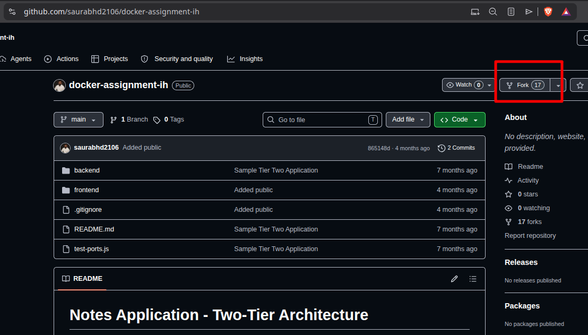

The repository contains the **Notes Application** with a two-tier structure:

| Directory / File | Description |
|---|---|
| `backend/` | Node.js/Express API server |
| `frontend/` | React application |
| `.gitignore` | Git ignore rules |
| `README.md` | Project documentation |
| `test-ports.js` | Port testing utility |

---

### Step 2: Clone the Repository and Create Dockerfiles

SSH into your Azure VM and clone the forked repository:

```bash
git clone https://github.com/Mr-Sakit/docker-assignment-ih
cd docker-assignment-ih/
ls
```

Create the Dockerfiles for both frontend and backend:

```bash
nano frontend/Dockerfile
nano backend/Dockerfile
```

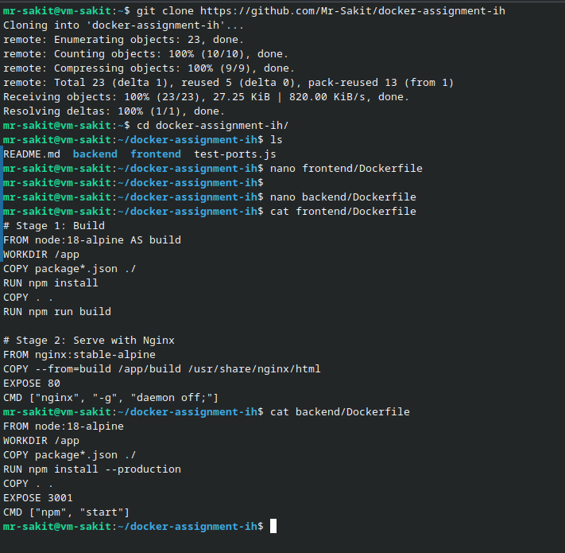

#### Frontend Dockerfile (`frontend/Dockerfile`)

A multi-stage build that compiles the React app and serves it with Nginx:

```dockerfile
# Stage 1: Build
FROM node:18-alpine AS build
WORKDIR /app

ARG REACT_APP_API_URL
ENV REACT_APP_API_URL=$REACT_APP_API_URL

COPY package*.json ./
RUN npm install
COPY . .
RUN npm run build

# Stage 2: Serve with Nginx
FROM nginx:stable-alpine
COPY --from=build /app/build /usr/share/nginx/html
EXPOSE 80
CMD ["nginx", "-g", "daemon off;"]
```

> [!TIP]
> The `REACT_APP_API_URL` is passed as a **build argument** (`ARG`) because React embeds environment variables at build time. This ensures the frontend knows the backend API URL at compile time, not runtime.

#### Backend Dockerfile (`backend/Dockerfile`)

A simple single-stage build for the Node.js API:

```dockerfile
FROM node:18-alpine
WORKDIR /app
COPY package*.json ./
RUN npm install --production
COPY . .
EXPOSE 3001
CMD ["npm", "start"]
```

---

### Step 3: Create the Docker Compose File

Create `docker-compose.yml` in the project root to orchestrate all three services:

```bash
nano docker-compose.yml
```

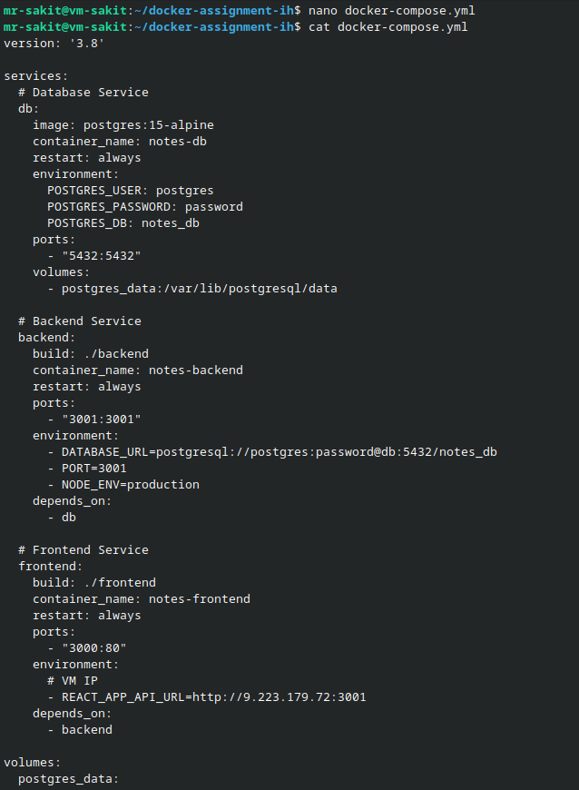

```yaml
version: '3.8'

services:
  # Database Service
  db:
    image: postgres:15-alpine
    container_name: notes-db
    restart: always
    environment:
      POSTGRES_USER: postgres
      POSTGRES_PASSWORD: password
      POSTGRES_DB: notes_db
    ports:
      - "5432:5432"
    volumes:
      - postgres_data:/var/lib/postgresql/data

  # Backend Service
  backend:
    build: ./backend
    container_name: notes-backend
    restart: always
    ports:
      - "3001:3001"
    environment:
      - DATABASE_URL=postgresql://postgres:password@db:5432/notes_db
      - PORT=3001
      - NODE_ENV=production
    depends_on:
      - db

  # Frontend Service
  frontend:
    build:
      context: ./frontend
      args:
        - REACT_APP_API_URL=http://<VM-PUBLIC-IP>:3001
    container_name: notes-frontend
    restart: always
    ports:
      - "3000:80"
    environment:
      # VM IP
      - REACT_APP_API_URL=http://<VM-PUBLIC-IP>:3001
    depends_on:
      - backend

volumes:
  postgres_data:
```

> [!WARNING]
> Replace `<VM-PUBLIC-IP>` with your actual Azure VM public IP address. The `REACT_APP_API_URL` must point to the VM's public IP (not `localhost`), since the browser on the client machine needs to reach the backend directly.

#### Three-Tier Service Architecture

| Service | Image | Container Name | Port Mapping | Depends On |
|---|---|---|---|---|
| **Database** | `postgres:15-alpine` | `notes-db` | `5432:5432` | — |
| **Backend** | Built from `./backend` | `notes-backend` | `3001:3001` | `db` |
| **Frontend** | Built from `./frontend` | `notes-frontend` | `3000:80` | `backend` |

---

### Step 4: Create the GitHub Actions Deployment Workflow

Create the workflow file for automated SSH-based deployment:

```bash
mkdir -p .github/workflows
nano .github/workflows/deploy.yml
```

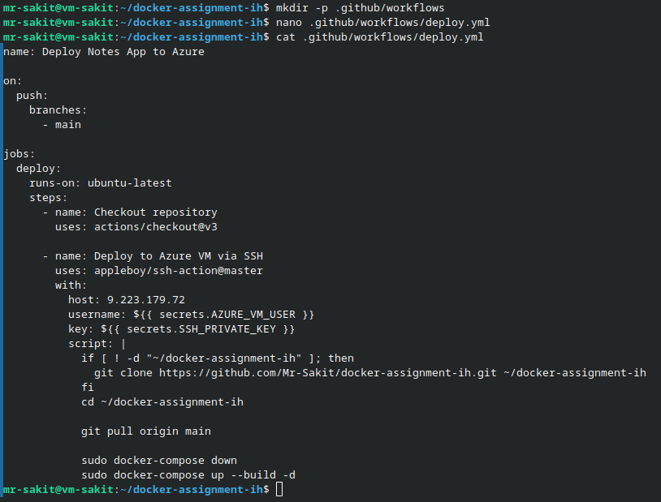

```yaml
name: Deploy Notes App to Azure

on:
  push:
    branches:
      - main

jobs:
  deploy:
    runs-on: ubuntu-latest
    steps:
      - name: Checkout repository
        uses: actions/checkout@v3

      - name: Deploy to Azure VM via SSH
        uses: appleboy/ssh-action@master
        with:
          host: 9.223.179.72
          username: ${{ secrets.AZURE_VM_USER }}
          key: ${{ secrets.SSH_PRIVATE_KEY }}
          script: |
            if [ ! -d "~/docker-assignment-ih" ]; then
              git clone https://github.com/Mr-Sakit/docker-assignment-ih.git ~/docker-assignment-ih
            fi
            cd ~/docker-assignment-ih

            git pull origin main

            sudo docker-compose down
            sudo docker-compose up --build -d
```

#### How It Works

1. **Trigger:** The workflow runs automatically on every `push` to the `main` branch
2. **SSH Action:** Uses `appleboy/ssh-action@master` to connect to the Azure VM via SSH
3. **Clone or Pull:** Checks if the repo exists on the VM; clones if not, pulls latest changes if yes
4. **Rebuild & Deploy:** Tears down existing containers and rebuilds them with the latest code

---

### Step 5: Configure GitHub Repository Secrets

Navigate to your forked repo → **Settings** → **Secrets and variables** → **Actions** and add 2 secrets:

#### 5.1 — Add the SSH Private Key

Copy the VM's private key from your local machine:

```bash
cat vm-sakit_key.pem
```

Add it as the `SSH_PRIVATE_KEY` secret:

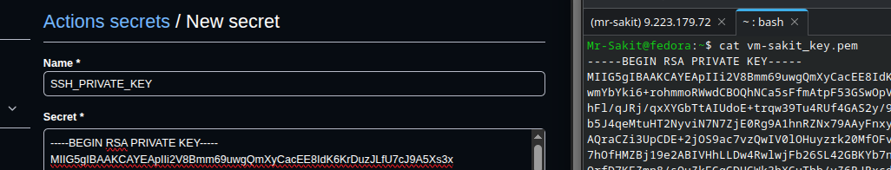

#### 5.2 — All Secrets Configured

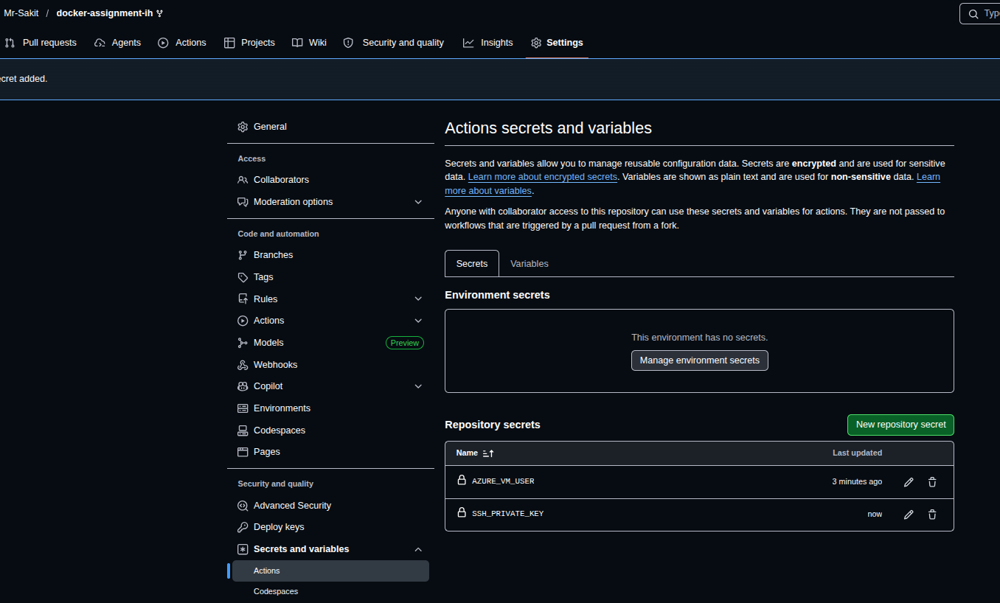

| Secret Name | Value Source |
|---|---|
| `AZURE_VM_USER` | The SSH username for the Azure VM (e.g., `mr-sakit`) |
| `SSH_PRIVATE_KEY` | The full contents of the VM's `.pem` private key file |

---

### Step 6: Push and Trigger the Deployment

Commit and push all the changes to trigger the GitHub Actions workflow:

```bash
git add .
git commit -m "Add Dockerfiles, docker-compose, and deploy workflow"
git push origin main
```

The workflow is triggered automatically on push to `main`. After the deployment pipeline completes successfully:

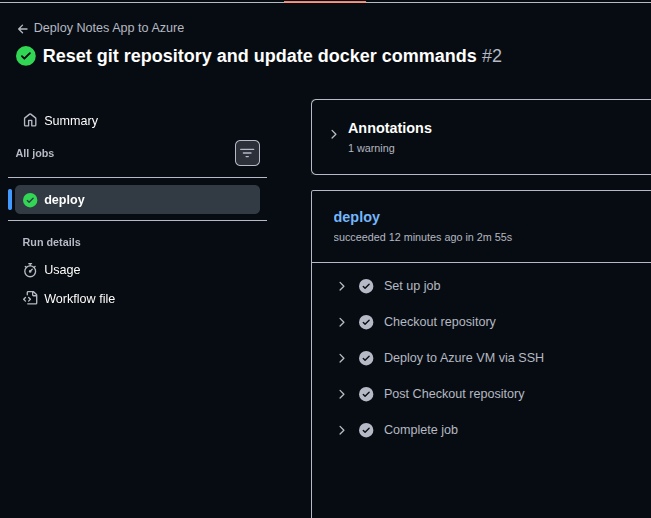

**Workflow:** `Deploy Notes App to Azure` — Run #2 ✅ (2m 55s)

**Steps (all ✅ passed):**

| Step | Status |
|---|---|
| Set up job | ✅ |
| Checkout repository | ✅ |
| Deploy to Azure VM via SSH | ✅ |
| Post Checkout repository | ✅ |
| Complete job | ✅ |

---

## 🔥 Troubleshooting

### ❌ Problem: CORS Error — Frontend Cannot Communicate with Backend

After the initial deployment, the Notes App frontend loaded correctly but could not fetch or create notes. The browser console showed **CORS errors**:

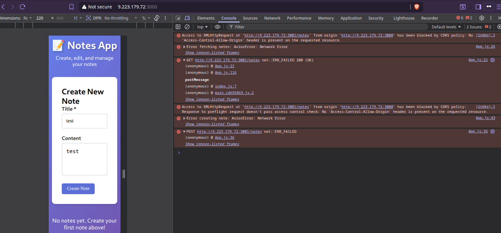

**Error Messages:**
```
Access to XMLHttpRequest at 'http://9.223.179.72:3001/notes' from origin 'http://9.223.179.72:3000'
has been blocked by CORS policy: No 'Access-Control-Allow-Origin' header is present on the requested resource.

Error fetching notes: AxiosError: Network Error
Error creating note: AxiosError: Network Error
```

**Root Cause:** The backend's `server.js` had a restrictive CORS configuration that only allowed specific origins (`http://localhost:3000`, `http://frontend:3000`, `http://172.22.0.4:3000`), but the frontend was being accessed via the VM's public IP (`http://9.223.179.72:3000`), which was not in the allowed list.

**Solution:** Simplified the CORS middleware to allow all origins:

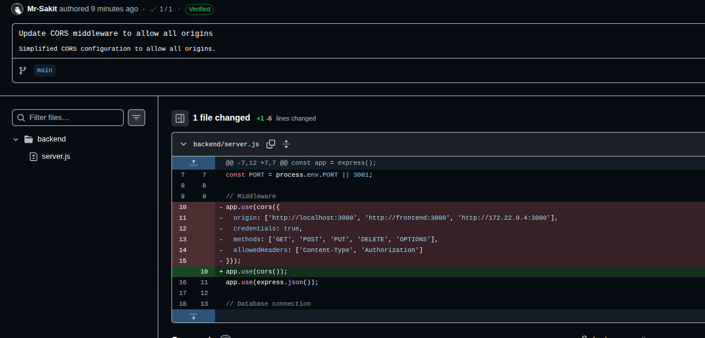

```diff
  // Middleware
- app.use(cors({
-   origin: ['http://localhost:3000', 'http://frontend:3000', 'http://172.22.0.4:3000'],
-   credentials: true,
-   methods: ['GET', 'POST', 'PUT', 'DELETE', 'OPTIONS'],
-   allowedHeaders: ['Content-Type', 'Authorization']
- }));
+ app.use(cors());
```

After pushing the CORS fix, the GitHub Actions workflow automatically redeployed the application.

---

### Step 7: Verify the Deployed Application

#### 7.1 — Create a Note

Open `http://9.223.179.72:3000` in a browser and create a test note:

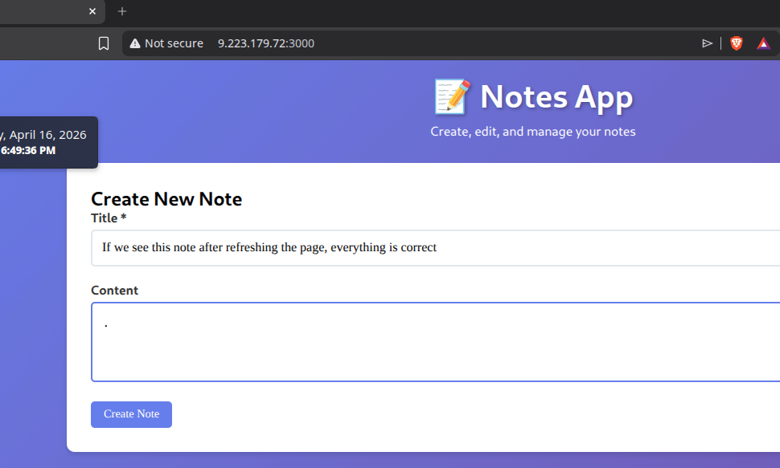

The note is created successfully with the title *"If we see this note after refreshing the page, everything is correct"*.

#### 7.2 — Verify Data Persistence

After refreshing the page, the note persists — confirming the full three-tier flow is working:

**Frontend (React)** → **Backend (Express API)** → **Database (PostgreSQL)** ✅

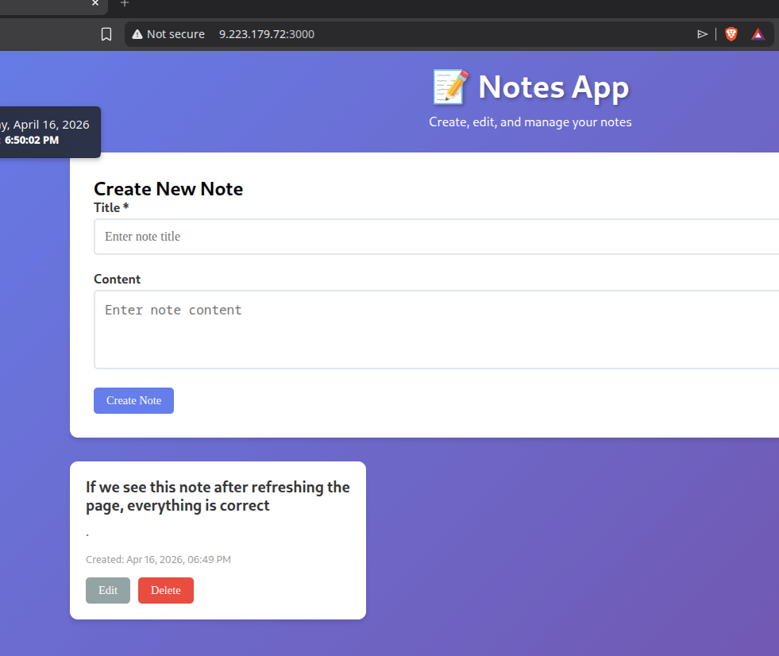

The saved note appears with **Edit** and **Delete** buttons, proving:
- ✅ Frontend renders the UI and communicates with the backend
- ✅ Backend API handles CRUD requests and connects to the database
- ✅ PostgreSQL stores and retrieves data persistently via Docker volume

---

## 🏗️ Architecture

```
┌─────────────────────────────────────────────────────────────────────────┐
│                        GitHub Repository                                │
│                  (docker-assignment-ih)                                  │
│                                                                         │
│  ┌─────────────────────────────────────────────────┐                   │
│  │  .github/workflows/deploy.yml                    │                   │
│  │  Trigger: push to main branch                    │                   │
│  └──────────────────────┬──────────────────────────┘                   │
└─────────────────────────┼───────────────────────────────────────────────┘
                          │
                          ▼
┌─────────────────────────────────────────────────────────────────────────┐
│                    GitHub Actions Runner                                 │
│                     (ubuntu-latest)                                      │
│                                                                         │
│  1. Checkout repository                                                 │
│  2. SSH into Azure VM (appleboy/ssh-action)                             │
│     └─ git pull → docker-compose down → docker-compose up --build -d   │
└─────────────────────────┬───────────────────────────────────────────────┘
                          │ SSH
                          ▼
┌─────────────────────────────────────────────────────────────────────────┐
│                    Azure Virtual Machine                                 │
│                  (9.223.179.72)                                          │
│                                                                         │
│  ┌──────────────────── Docker Compose ────────────────────────┐        │
│  │                                                            │        │
│  │  ┌──────────────┐  ┌──────────────┐  ┌──────────────────┐ │        │
│  │  │   Frontend   │  │   Backend    │  │    Database       │ │        │
│  │  │  (React +    │  │  (Node.js +  │  │  (PostgreSQL     │ │        │
│  │  │   Nginx)     │─►│   Express)   │─►│   15-alpine)     │ │        │
│  │  │  :3000→:80   │  │  :3001→:3001 │  │  :5432→:5432     │ │        │
│  │  └──────────────┘  └──────────────┘  └──────────────────┘ │        │
│  │                                            │               │        │
│  │                                    ┌───────┴──────┐       │        │
│  │                                    │ postgres_data│       │        │
│  │                                    │   (volume)   │       │        │
│  │                                    └──────────────┘       │        │
│  └────────────────────────────────────────────────────────────┘        │
│                                                                         │
│  Browser: http://9.223.179.72:3000                                      │
└─────────────────────────────────────────────────────────────────────────┘
```

---

## 📊 Summary

| Task | Command / Action | Status |
|---|---|---|
| Fork the Notes App repo | GitHub Fork button | ✅ |
| Clone repository on Azure VM | `git clone .../docker-assignment-ih` | ✅ |
| Create Frontend Dockerfile | Multi-stage: Node.js build → Nginx serve | ✅ |
| Create Backend Dockerfile | Single-stage: Node.js with `npm install --production` | ✅ |
| Create `docker-compose.yml` | 3 services: db, backend, frontend + volume | ✅ |
| Create GitHub Actions workflow | `.github/workflows/deploy.yml` (SSH deploy) | ✅ |
| Configure `AZURE_VM_USER` secret | GitHub → Settings → Secrets | ✅ |
| Configure `SSH_PRIVATE_KEY` secret | GitHub → Settings → Secrets | ✅ |
| Push and trigger deployment | `git push origin main` → auto-deploy | ✅ |
| Fix CORS issue | `app.use(cors())` — allow all origins | ✅ |
| Verify note creation | Browser → Create Note → Success | ✅ |
| Verify data persistence | Refresh page → Note persists in PostgreSQL | ✅ |

---

## 💡 Key Takeaways

1. **Three-tier architecture** separates presentation (React/Nginx), business logic (Node.js/Express), and data (PostgreSQL) into independent, containerized services
2. **Multi-stage Docker builds** for the frontend compile React into static assets and serve them with Nginx, resulting in a much smaller production image (~40MB vs ~1GB)
3. **`REACT_APP_API_URL` must be a build argument (`ARG`)** because React embeds environment variables at compile time — runtime `ENV` variables are not available in the browser
4. **Docker Compose `depends_on`** ensures correct startup order (db → backend → frontend), but does not wait for readiness — for production, use health checks
5. **`appleboy/ssh-action`** enables GitHub Actions to deploy directly to a remote VM via SSH, making it a simple alternative to cloud-native deployment services
6. **CORS configuration** must include the exact origin URL the browser uses. Using `cors()` without restrictions is convenient for development but should be locked down in production
7. **Docker volumes** (`postgres_data`) ensure database data persists across container restarts and redeployments
8. The **`restart: always`** policy in Docker Compose ensures containers automatically restart after VM reboots or crashes
9. Using **`docker-compose down` followed by `docker-compose up --build -d`** in the deploy pipeline ensures clean rebuilds with the latest code changes on every push
