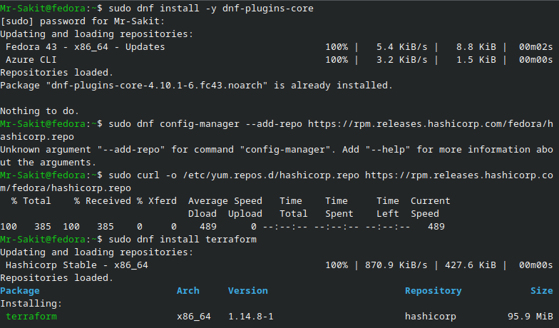
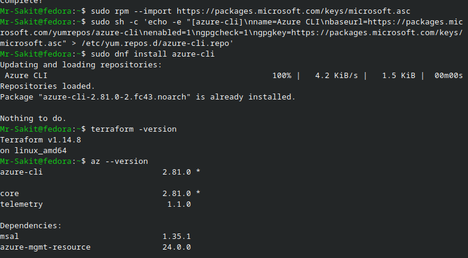
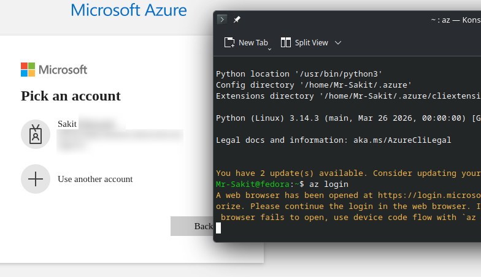
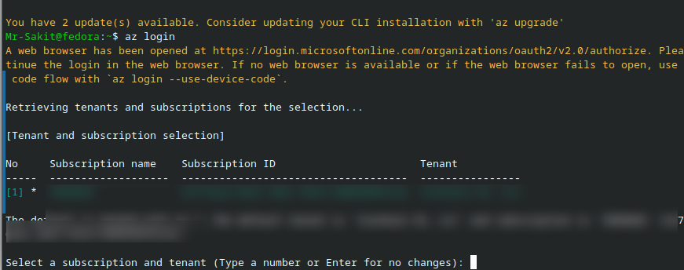
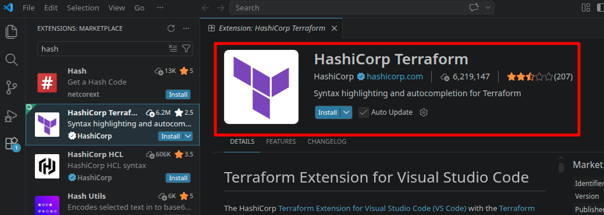
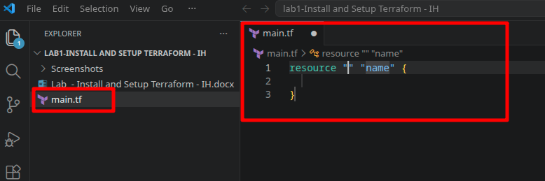

# Install and Setup Terraform

## 📋 Overview

This lab walks through installing and configuring the essential toolchain needed to work with **Terraform** — an Infrastructure-as-Code (IaC) tool — on a **Fedora Linux** workstation. The setup includes installing **Terraform** itself, the **Azure CLI** for cloud authentication, and the **HashiCorp Terraform extension** for Visual Studio Code to enable syntax highlighting and IntelliSense.

> [!NOTE]
> Before you can declaratively define infrastructure, you need a proper local development environment. This lab establishes that foundation — without these tools installed and configured, none of the subsequent Terraform labs will work. The specific installation steps here are for **Fedora Linux** using `dnf`; other operating systems (macOS, Ubuntu, Windows) use different package managers but follow the same logical flow.

---

## 🎯 Objectives

- Install Terraform on Fedora Linux via the HashiCorp RPM repository
- Install the Azure CLI for authenticating Terraform with Azure Cloud
- Verify both tools are correctly installed and accessible from the terminal
- Authenticate to Azure using `az login`
- Install the HashiCorp Terraform extension in Visual Studio Code
- Confirm the development environment is ready for writing Terraform code

---

## 🔧 Prerequisites

| Requirement | Details |
|---|---|
| **Operating System** | Fedora Linux (or any RPM-based distribution) |
| **Code Editor** | Visual Studio Code installed |
| **Azure Account** | A user account on Azure Cloud with an active subscription |
| **Internet Access** | Required for downloading packages and authenticating |

---

## 📝 Lab Steps

### Step 1: Install Terraform

Terraform is distributed as a standalone binary. On Fedora, we install it from the official **HashiCorp RPM repository** to ensure we get verified, up-to-date releases and can manage updates through the system package manager.

#### 1.1 — Install Repository Management Tools

First, install `dnf-plugins-core` which provides the `config-manager` command for managing repositories:

```bash
sudo dnf install -y dnf-plugins-core
```

#### 1.2 — Add the HashiCorp Repository

Add the official HashiCorp RPM repository. This ensures Terraform packages are signed and verified by HashiCorp's GPG key:

```bash
sudo curl -o /etc/yum.repos.d/hashicorp.repo https://rpm.releases.hashicorp.com/fedora/hashicorp.repo
```

> [!TIP]
> We use the official HashiCorp repository rather than downloading the binary manually because it integrates with `dnf` for seamless version management — future upgrades are as simple as `sudo dnf update terraform`.

#### 1.3 — Install Terraform

```bash
sudo dnf install terraform
```



The package manager resolves dependencies and installs **Terraform v1.14.8** from the HashiCorp Stable repository.

---

### Step 2: Install Azure CLI

The Azure CLI is required because Terraform uses it to **authenticate** with Azure. When you run `az login`, the CLI stores credentials locally that Terraform's AzureRM provider reads automatically — this is the simplest authentication method for local development.

#### 2.1 — Add the Microsoft Repository and Install

Import Microsoft's GPG signing key and add the Azure CLI repository:

```bash
sudo rpm --import https://packages.microsoft.com/keys/microsoft.asc
sudo sh -c 'echo -e "[azure-cli]\nname=Azure CLI\nbaseurl=https://packages.microsoft.com/yumrepos/azure-cli\nenabled=1\ngpgcheck=1\ngpgkey=https://packages.microsoft.com/keys/microsoft.asc" > /etc/yum.repos.d/azure-cli.repo'
sudo dnf install azure-cli
```

#### 2.2 — Verify Both Installations

Confirm that both Terraform and Azure CLI are properly installed:

```bash
terraform -version
az --version
```



**Installed versions:**

| Tool | Version |
|---|---|
| **Terraform** | v1.14.8 on linux_amd64 |
| **Azure CLI** | 2.81.0 |

---

### Step 3: Authenticate with Azure

Run the Azure login command, which opens a browser window for interactive authentication:

```bash
az login
```



The browser opens the Microsoft login page where you select your Azure account. After successful authentication, the CLI retrieves your available tenants and subscriptions:



> [!IMPORTANT]
> If you have multiple Azure subscriptions, select the correct one here. Terraform will use whichever subscription is currently set as default in the Azure CLI. You can also explicitly set the `subscription_id` in the Terraform provider configuration to avoid ambiguity.

---

### Step 4: Install the Terraform Extension for VS Code

The HashiCorp Terraform extension adds **syntax highlighting**, **auto-completion**, **code navigation**, and **format-on-save** for `.tf` files — making it significantly easier to write correct Terraform code.

Open VS Code → Extensions tab → Search for **"HashiCorp Terraform"** → Click **Install**:



#### Verify the Extension Works

Create a test `main.tf` file and confirm that VS Code recognizes the Terraform syntax with proper highlighting and the Terraform icon:



The Terraform icon (🟣) appears next to `.tf` files in the explorer, and the editor provides syntax highlighting for HCL (HashiCorp Configuration Language) — confirming the extension is active.

---

## 📊 Summary

| Task | Command / Tool | Status |
|---|---|---|
| Install `dnf-plugins-core` | `sudo dnf install -y dnf-plugins-core` | ✅ |
| Add HashiCorp RPM repository | `sudo curl -o ... hashicorp.repo` | ✅ |
| Install Terraform | `sudo dnf install terraform` | ✅ |
| Add Microsoft RPM repository | `sudo rpm --import ...` + repo file | ✅ |
| Install Azure CLI | `sudo dnf install azure-cli` | ✅ |
| Verify Terraform version | `terraform -version` → v1.14.8 | ✅ |
| Verify Azure CLI version | `az --version` → 2.81.0 | ✅ |
| Authenticate with Azure | `az login` → browser-based login | ✅ |
| Install VS Code Terraform extension | HashiCorp Terraform extension | ✅ |
| Verify syntax highlighting | Created test `main.tf` file | ✅ |

---

## 💡 Key Takeaways

1. **Infrastructure-as-Code requires a proper toolchain** — Terraform alone is not enough; you also need a cloud provider CLI (Azure CLI) for authentication and an IDE extension for productivity
2. **Using official package repositories** (HashiCorp RPM repo, Microsoft RPM repo) is preferred over manual binary downloads because it integrates with the system package manager for secure, version-managed updates
3. **`az login` is the simplest authentication method** for local Terraform development — it stores OAuth tokens locally that the AzureRM provider automatically discovers. For CI/CD pipelines, you would use Service Principals or Managed Identities instead
4. **The Terraform VS Code extension** provides more than just syntax highlighting — it validates your HCL syntax in real-time, offers auto-completion for resource types and attributes, and can format code on save using `terraform fmt` conventions
5. **Verifying installations immediately** (`terraform -version`, `az --version`) catches PATH and permission issues early, before you encounter cryptic errors during `terraform init`
