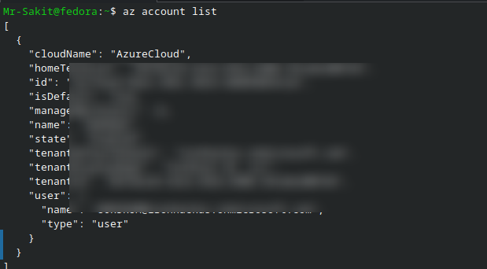
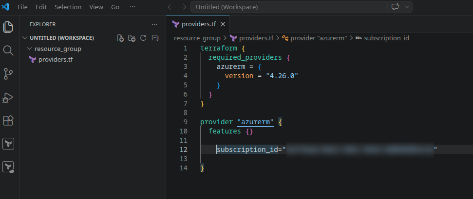
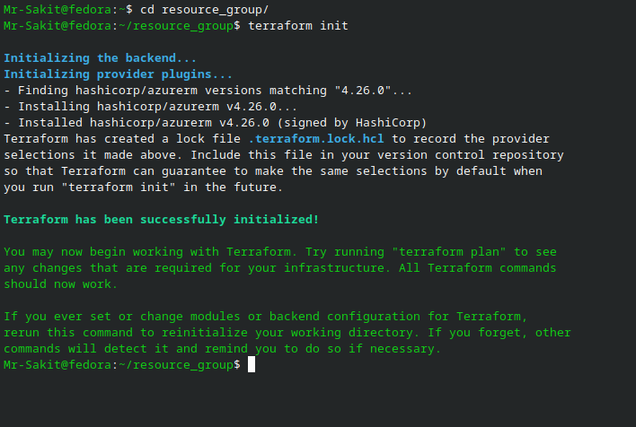
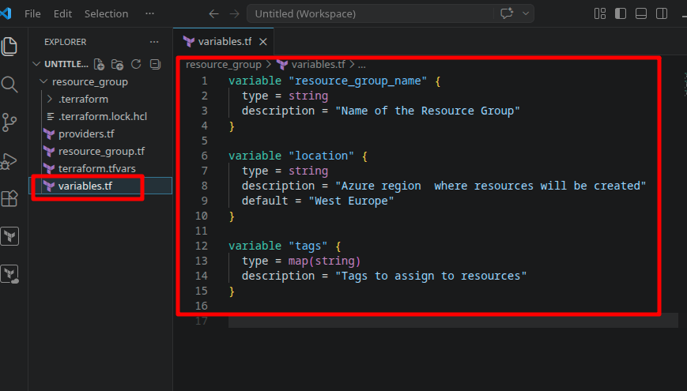
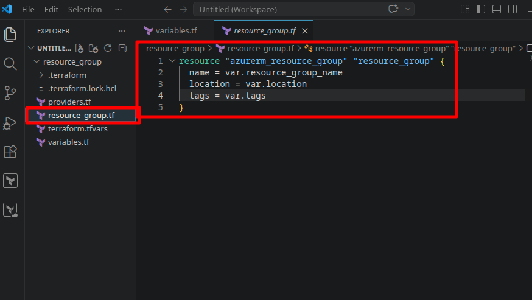
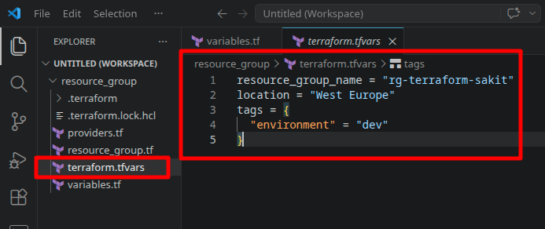
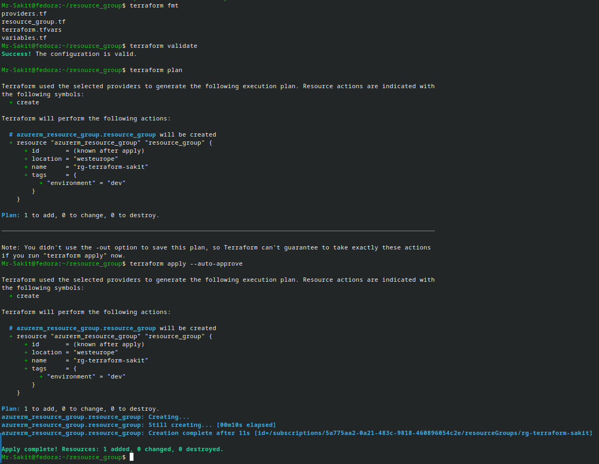
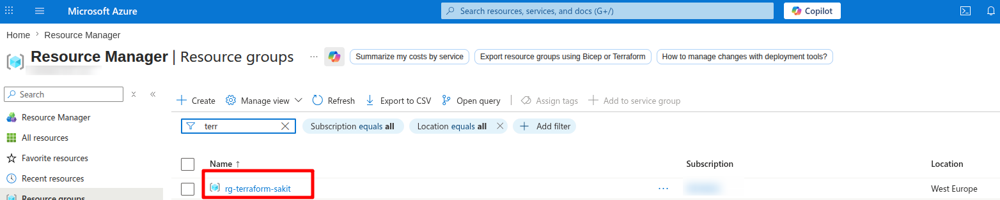
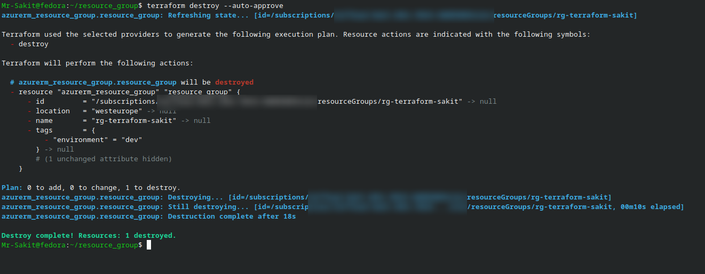
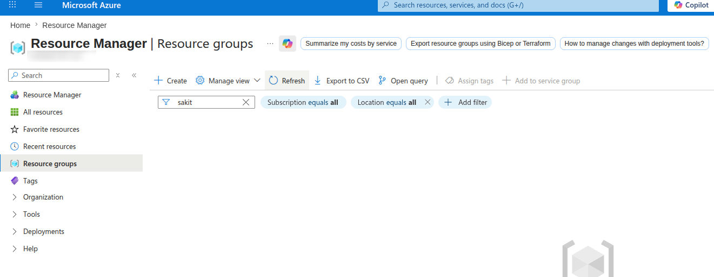

# Provision Your First Infrastructure Using Terraform

## 📋 Overview

This lab demonstrates provisioning an **Azure Resource Group** using Terraform — covering the complete IaC workflow from writing configuration files to creating real cloud resources and cleaning them up. It introduces the core Terraform concepts: **providers**, **resources**, **variables**, and the fundamental command cycle (`init → plan → apply → destroy`).

> [!NOTE]
> A Resource Group is the simplest Azure resource and the logical starting point for Terraform. Every Azure resource must belong to a Resource Group, so learning to create one programmatically lays the foundation for all future infrastructure provisioning. This lab also demonstrates **why** we use variables and `.tfvars` files instead of hardcoding values — it makes configurations reusable across environments.

---

## 🎯 Objectives

- Authenticate Terraform with Azure using the Azure CLI method
- Create a structured Terraform project with separate files for providers, variables, resources, and values
- Understand the purpose of each Terraform configuration file
- Execute the core Terraform workflow: `init` → `fmt` → `validate` → `plan` → `apply`
- Verify the provisioned resource in the Azure Portal
- Destroy the resource to avoid unnecessary costs

---

## 🔧 Prerequisites

| Requirement | Details |
|---|---|
| **Azure Account** | Valid account with an active subscription |
| **Terraform** | Installed locally (see previous lab) |
| **Azure CLI** | Installed and authenticated via `az login` |
| **VS Code** | With the HashiCorp Terraform extension installed |

> [!IMPORTANT]
> If you haven't completed the previous lab (Install and Setup Terraform), please do so first. This lab assumes Terraform, Azure CLI, and the VS Code extension are already installed and configured.

---

## 📝 Lab Steps

### Step 1: Authenticate with Azure

Terraform needs to authenticate with Azure to create resources. In this lab, we use the **Azure CLI method** — the simplest approach for local development.

#### 1.1 — Login to Azure

```bash
az login
```

This opens a browser for interactive authentication. After login, the CLI displays your subscription details.

#### 1.2 — Get Your Subscription ID

List your Azure accounts to find the subscription ID:

```bash
az account list
```



> [!TIP]
> Copy the `id` field from the output — you'll need it in the `providers.tf` file. If you have multiple subscriptions, you can set the active one with `az account set --subscription "<subscription-id>"`.

---

### Step 2: Create Terraform Configuration Files

Create a project folder called `resource_group` — this becomes your **Terraform root module** (the directory from which you run Terraform commands).

#### 2.1 — Configure the Provider (`providers.tf`)

The provider configuration tells Terraform **which cloud platform** to interact with and **how to authenticate**:

```hcl
terraform {
  required_providers {
    azurerm = {
      version = "4.26.0"
    }
  }
}

provider "azurerm" {
  features {}

  subscription_id = "<your-subscription-id>"
}
```



**Why these blocks matter:**

| Block | Purpose |
|---|---|
| `terraform.required_providers` | Pins the AzureRM provider to a specific version, ensuring reproducible builds across team members |
| `provider "azurerm"` | Configures the Azure provider with authentication details |
| `features {}` | Required by the AzureRM provider — controls optional provider behaviors (empty means defaults) |
| `subscription_id` | Explicitly tells Terraform which Azure subscription to deploy into, avoiding ambiguity |

#### 2.2 — Initialize Terraform

```bash
cd resource_group/
terraform init
```



`terraform init` downloads the specified AzureRM provider plugin (v4.26.0) from the HashiCorp registry and creates:
- `.terraform/` directory — stores downloaded provider binaries
- `.terraform.lock.hcl` — locks exact provider versions for reproducibility

> [!IMPORTANT]
> You must run `terraform init` whenever you add new providers, change provider versions, or configure a new backend. It's safe to re-run — it's idempotent.

#### 2.3 — Define Variables (`variables.tf`)

Variables allow us to parameterize the configuration so the same code can be reused across environments (dev, staging, production) simply by changing variable values:

```hcl
variable "resource_group_name" {
  type        = string
  description = "Name of the Resource Group"
}

variable "location" {
  type        = string
  description = "Azure region where resources will be created"
  default     = "West Europe"
}

variable "tags" {
  type        = map(string)
  description = "Tags to assign to resources"
}
```



**Why variables instead of hardcoding?** If a value might change between environments, teams, or deployments, it should be a variable. The `location` variable includes a `default` value, making it optional — the others are required.

#### 2.4 — Define the Resource (`resource_group.tf`)

This file declares the actual infrastructure Terraform will create:

```hcl
resource "azurerm_resource_group" "resource_group" {
  name     = var.resource_group_name
  location = var.location
  tags     = var.tags
}
```



The resource block reads: *"Create an Azure Resource Group, identified internally as `resource_group`, using the values from our variables."*

#### 2.5 — Set Variable Values (`terraform.tfvars`)

This file provides the actual values for the variables we defined. Terraform automatically loads files named `terraform.tfvars`:

```hcl
resource_group_name = "rg-terraform-sakit"
location            = "West Europe"
tags = {
  "environment" = "dev"
}
```



> [!TIP]
> Separating variable definitions (`variables.tf`) from variable values (`terraform.tfvars`) is a Terraform best practice. The definitions describe *what* inputs the module accepts; the values specify *what* to use for this particular deployment. You can have multiple `.tfvars` files for different environments (e.g., `dev.tfvars`, `prod.tfvars`).

#### Project Structure

```
resource_group/
├── .terraform/            # Downloaded provider plugins (auto-generated)
├── .terraform.lock.hcl    # Provider version lock file (auto-generated)
├── providers.tf           # Provider configuration and version constraints
├── resource_group.tf      # Resource definitions (what to create)
├── variables.tf           # Variable declarations (input interface)
└── terraform.tfvars       # Variable values (environment-specific)
```

---

### Step 3: Run Terraform Commands

Execute the core Terraform workflow — each command has a specific purpose in the deployment pipeline:

```bash
# Format all .tf files to canonical style
terraform fmt

# Validate syntax and configuration correctness
terraform validate

# Preview what Terraform will create (dry run)
terraform plan

# Actually create the resources in Azure
terraform apply --auto-approve
```



**Command-by-command breakdown:**

| Command | Purpose | Why it matters |
|---|---|---|
| `terraform fmt` | Auto-formats `.tf` files to HCL conventions | Ensures consistent code style across the team |
| `terraform validate` | Checks syntax and internal consistency | Catches errors *before* making API calls to Azure |
| `terraform plan` | Shows a preview of changes (adds/changes/destroys) | Lets you review exactly what will happen before committing |
| `terraform apply` | Executes the plan and creates/modifies resources | The `--auto-approve` flag skips the interactive confirmation |

**Result:** `Apply complete! Resources: 1 added, 0 changed, 0 destroyed.`

The Resource Group `rg-terraform-sakit` was created in **West Europe** in approximately 11 seconds.

---

### Step 4: Verify in Azure Portal

Navigate to **Azure Portal → Resource Groups** and confirm the Resource Group was created:



The `rg-terraform-sakit` Resource Group is visible in the **West Europe** region — matching exactly what we defined in our Terraform configuration.

---

### Step 5: Clean Up (Destroy Resources)

To avoid unnecessary Azure costs, destroy the provisioned resources:

```bash
terraform destroy --auto-approve
```



**Result:** `Destroy complete! Resources: 1 destroyed.`

Terraform reads the state file to identify what it previously created, plans the destruction, and removes the Resource Group from Azure.

#### Verify Destruction

Back in the Azure Portal, the Resource Group no longer exists:



---

## 🏗️ Terraform Workflow

```
┌──────────────┐    ┌──────────────┐    ┌──────────────┐    ┌──────────────┐
│  terraform   │    │  terraform   │    │  terraform   │    │  terraform   │
│    init      │───►│  fmt + val.  │───►│    plan      │───►│    apply     │
│              │    │              │    │              │    │              │
│ Downloads    │    │ Formats code │    │ Dry run —    │    │ Creates real │
│ provider     │    │ & validates  │    │ shows what   │    │ resources in │
│ plugins      │    │ syntax       │    │ will change  │    │ Azure        │
└──────────────┘    └──────────────┘    └──────────────┘    └──────┬───────┘
                                                                   │
                                                                   ▼
                                                          ┌──────────────┐
                                                          │  terraform   │
                                                          │   destroy    │
                                                          │              │
                                                          │ Removes all  │
                                                          │ resources    │
                                                          └──────────────┘
```

---

## 📊 Summary

| Task | Command / Action | Status |
|---|---|---|
| Authenticate with Azure | `az login` + `az account list` | ✅ |
| Create `providers.tf` | AzureRM provider v4.26.0 with subscription ID | ✅ |
| Initialize Terraform | `terraform init` → downloads provider | ✅ |
| Define variables | `variables.tf` with name, location, tags | ✅ |
| Define resource | `resource_group.tf` with azurerm_resource_group | ✅ |
| Set variable values | `terraform.tfvars` with rg-terraform-sakit | ✅ |
| Format and validate | `terraform fmt` + `terraform validate` | ✅ |
| Preview changes | `terraform plan` → 1 to add | ✅ |
| Apply configuration | `terraform apply --auto-approve` → 1 added | ✅ |
| Verify in Azure Portal | Resource Group visible in West Europe | ✅ |
| Destroy resources | `terraform destroy --auto-approve` → 1 destroyed | ✅ |
| Verify destruction | Resource Group removed from Azure Portal | ✅ |

---

## 💡 Key Takeaways

1. **Terraform follows a declarative model** — you describe *what* you want (a Resource Group named X in region Y), and Terraform figures out *how* to create it. This is fundamentally different from imperative scripts where you specify each step
2. **The four-file project structure** (`providers.tf`, `variables.tf`, `resource.tf`, `terraform.tfvars`) separates concerns: provider config, input interface, resource definitions, and environment-specific values. This separation makes Terraform projects maintainable and reusable
3. **`terraform plan` is your safety net** — always review the plan before applying. In production, teams typically require plan output to be reviewed and approved before `apply` is allowed (via CI/CD pipelines)
4. **The state file (`terraform.tfstate`)** is how Terraform tracks what it has created. When you run `destroy`, Terraform reads this file to know exactly which resources to remove. Never manually edit or delete the state file
5. **`--auto-approve` skips confirmation** — useful for automation and labs, but in production you should omit this flag to get one final chance to review changes before they are applied
6. **Tags (`environment = "dev"`)** are metadata labels attached to Azure resources. They are critical for cost tracking, access control, and operational management in real-world deployments — always tag your resources
7. **Variable defaults** (like `location = "West Europe"`) make inputs optional. This is useful when a value is the same across most deployments but occasionally needs to be overridden
