# Store Terraform State in Remote Storage (Azure Storage Account)

## 📋 Overview

This lab demonstrates configuring Terraform to store its **state file remotely** in an **Azure Storage Account** instead of the default local file system. Remote state storage is a critical practice for real-world Terraform usage because it enables **team collaboration**, **automatic state locking** (preventing concurrent modifications), and **reliable persistence** (no risk of losing state if a local machine fails).

> [!NOTE]
> By default, Terraform stores state in a local `terraform.tfstate` file. This works fine for individual learning, but breaks down in team environments — if two engineers run `terraform apply` simultaneously against the same local state, they can corrupt it or create duplicate resources. Remote backends solve this by centralizing state storage and introducing locking mechanisms. This lab uses **Azure Blob Storage** as the backend, but Terraform also supports S3, GCS, Terraform Cloud, and others.

---

## 🎯 Objectives

- Understand why local Terraform state is problematic for teams
- Create an Azure Storage Account and Blob Container to host the remote state file
- Configure the Terraform `backend "azurerm"` block to use remote storage
- Observe automatic state locking during `plan` and `apply` operations
- Verify the state file exists in Azure Blob Storage
- Inspect state using `terraform state list` and `terraform state show`
- Clean up all resources after the lab

---

## 🔧 Prerequisites

| Requirement | Details |
|---|---|
| **Azure Subscription** | Active subscription with permissions to create Storage Accounts |
| **Terraform** | Installed locally |
| **Azure CLI** | Installed and authenticated (`az login`) |
| **Previous Labs** | Completed Lab 1 (setup) and Lab 2 (basic provisioning) |

> [!IMPORTANT]
> The Azure Storage Account used for remote state is **infrastructure that supports your Terraform workflow** — it is created *outside* of Terraform (using Azure CLI) so that Terraform can use it as its backend. This avoids a chicken-and-egg problem: Terraform can't store its state in a resource it hasn't created yet.

---

## 📝 Lab Steps

### Step 1: Set Up Azure Storage for Terraform State

Before configuring Terraform, we need to create the storage infrastructure using Azure CLI. This is intentionally done outside of Terraform because the backend must exist *before* `terraform init` runs.

#### 1.1 — Create a Resource Group

```bash
az group create --name rg-storage-sakit --location swedencentral
```

#### 1.2 — Create a Storage Account

```bash
az storage account create --name storagesakit --resource-group rg-storage-sakit --location swedencentral --sku Standard_LRS
```

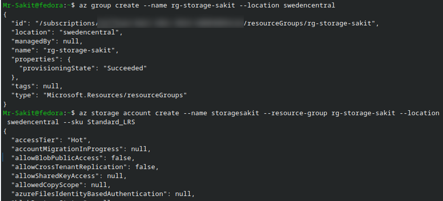

**Why these settings?**

| Parameter | Value | Reason |
|---|---|---|
| `--sku Standard_LRS` | Locally Redundant Storage | Cheapest option — sufficient for state files since they're small and can be regenerated |
| `--location swedencentral` | Sweden Central region | Choose a region close to your team for lower latency |
| Storage Account name | `storagesakit` | Must be globally unique across all Azure, 3–24 characters, lowercase only |

#### 1.3 — Create a Blob Container

```bash
az storage container create --name terraformstate --account-name storagesakit
```

#### 1.4 — Get the Storage Account Key

```bash
az storage account keys list --resource-group rg-storage-sakit --account-name storagesakit --query "[0].value" --output tsv
```

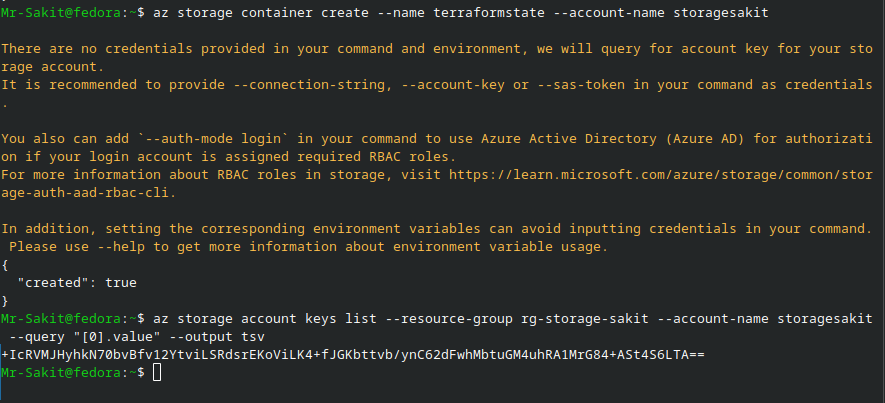

> [!TIP]
> The storage account key is used by Terraform to authenticate with the blob container. In production environments, you would use **Azure AD authentication** or **Managed Identities** instead of storage keys for better security. The key can also be passed via the `ARM_ACCESS_KEY` environment variable to avoid storing it in configuration files.

---

### Step 2: Configure Terraform with Remote Backend

Now that the storage infrastructure exists, configure Terraform to use it.

#### 2.1 — Create `providers.tf` with Backend Configuration

The `backend` block inside the `terraform` block tells Terraform **where to store and retrieve state**:

```hcl
terraform {
  backend "azurerm" {
    resource_group_name  = "rg-storage-sakit"
    storage_account_name = "storagesakit"
    container_name       = "terraformstate"
    key                  = "terraform.tfstate"
  }
  required_providers {
    azurerm = {
      source  = "hashicorp/azurerm"
      version = "4.26.0"
    }
  }
}

provider "azurerm" {
  features {}
  subscription_id = "<your-subscription-id>"
}
```

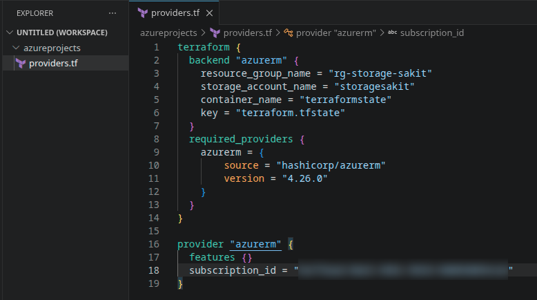

**Backend block explained:**

| Field | Value | Purpose |
|---|---|---|
| `resource_group_name` | `rg-storage-sakit` | Where the Storage Account lives |
| `storage_account_name` | `storagesakit` | The Storage Account holding the state |
| `container_name` | `terraformstate` | The Blob Container within the Storage Account |
| `key` | `terraform.tfstate` | The blob name (filename) for the state file |

> [!WARNING]
> The `backend` block **cannot use variables** — all values must be hardcoded or passed via `-backend-config` flags during `terraform init`. This is a Terraform limitation because the backend must be configured before variables are loaded.

#### 2.2 — Define Variables (`variables.tf`)

```hcl
variable "resource_group_name" {
  type        = string
  description = "Name of the resource group"
}

variable "location" {
  type        = string
  description = "Azure location"
  default     = "West Europe"
}

variable "tags" {
  type        = any
  description = "Tags to be applied to all resources"
}
```

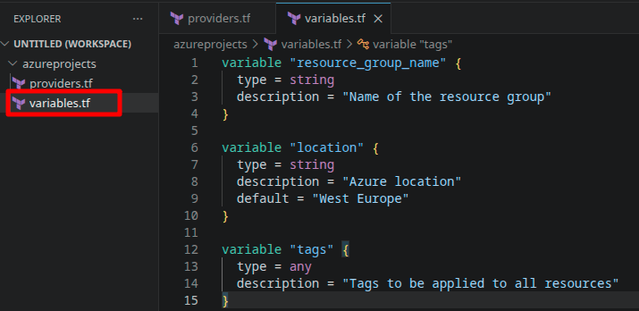

#### 2.3 — Define the Resource (`resource_group.tf`)

```hcl
resource "azurerm_resource_group" "resource_group" {
  name     = var.resource_group_name
  location = var.location
  tags     = var.tags
}
```

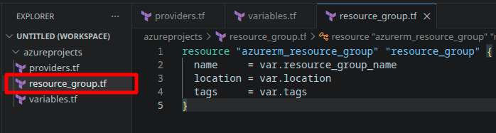

#### 2.4 — Set Variable Values (`terraform.tfvars`)

```hcl
resource_group_name = "rg-storage-sakit"
location            = "West Europe"
tags = {
  Environment = "test"
}
```

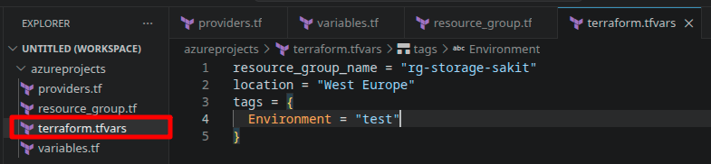

#### Project Structure

```
azureprojects/
├── providers.tf           # Provider + backend configuration
├── resource_group.tf      # Resource definitions
├── variables.tf           # Variable declarations
└── terraform.tfvars       # Variable values
```

---

### Step 3: Run Terraform Commands

#### 3.1 — Initialize with Remote Backend

```bash
terraform init
```

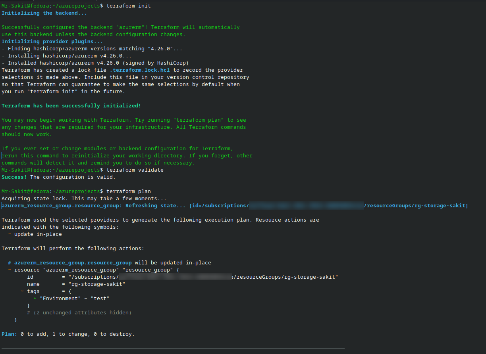

Notice the key difference from local state: **"Successfully configured the backend 'azurerm'!"** — Terraform is now connected to the Azure Storage Account.

#### 3.2 — Validate and Plan

```bash
terraform validate
terraform plan
```

**Observe the state locking behavior** — when Terraform runs `plan`, it first displays:

```
Acquiring state lock. This may take a few moments...
```

This is the remote backend's **locking mechanism** in action. Terraform creates a lease on the blob to prevent other team members from modifying state simultaneously. Once the operation completes, it releases the lock.

The plan shows: `Plan: 0 to add, 1 to change, 0 to destroy.` — indicating the resource group already exists (from the CLI) but the tags need updating.

#### 3.3 — Apply Changes

```bash
terraform apply -auto-approve
```

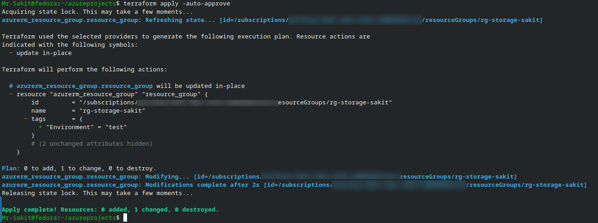

**Key observations:**
- `Acquiring state lock...` — lock acquired before modifying state
- `Modifications complete after 2s` — the resource was updated in-place
- `Releasing state lock...` — lock released after state is saved
- `Apply complete! Resources: 0 added, 1 changed, 0 destroyed.`

---

### Step 4: Verify Remote State in Azure

Confirm that the state file exists in the Azure Blob Container:

```bash
az storage blob list \
  --container-name terraformstate \
  --account-name storagesakit \
  --output table
```

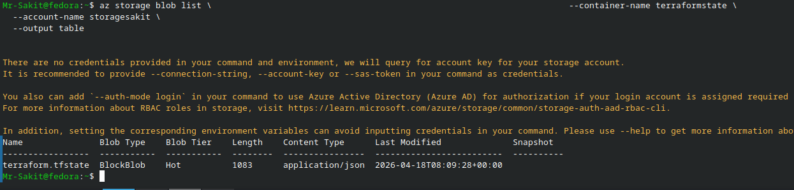

The output shows `terraform.tfstate` as a **BlockBlob** with `Content Type: application/json` — confirming the state is stored remotely.

| Property | Value |
|---|---|
| **Name** | terraform.tfstate |
| **Blob Type** | BlockBlob |
| **Blob Tier** | Hot |
| **Length** | 1083 bytes |
| **Content Type** | application/json |

---

### Step 5: Explore the State File

Terraform provides commands to inspect the state without directly reading the JSON file:

```bash
# List all resources tracked in state
terraform state list

# Show detailed attributes of a specific resource
terraform state show azurerm_resource_group.resource_group
```

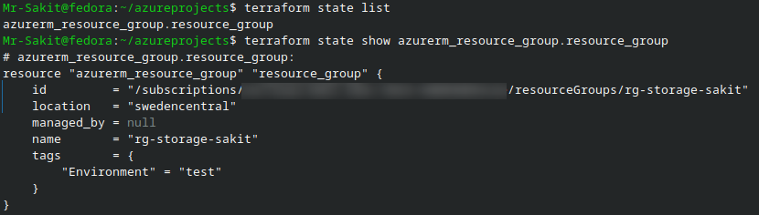

The `state show` command reveals the full resource attributes as Terraform sees them, including the Azure resource ID, location, name, tags, and managed_by status.

---

### Step 6: Clean Up Resources

Destroy the Terraform-managed resources:

```bash
terraform destroy --auto-approve
```

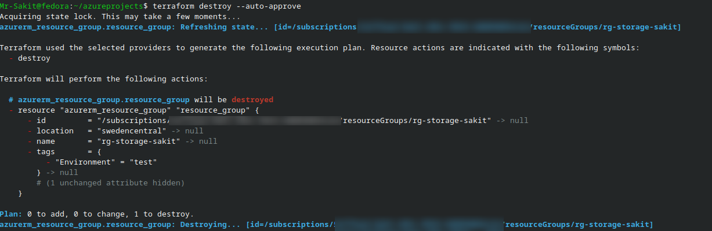

Notice the state locking behavior again:
1. `Acquiring state lock...` — prevents concurrent modifications
2. `Refreshing state...` — reads current state from Azure Storage
3. `Destroying...` — removes the resource from Azure
4. Lock is released automatically

> [!CAUTION]
> `terraform destroy` only removes the resources defined in your Terraform configuration (in this case, `rg-storage-sakit` the resource group created via Terraform). It does **not** remove the backend infrastructure (the Storage Account and its Resource Group). You must clean those up separately with Azure CLI if no longer needed:
> ```bash
> az group delete --name rg-storage-sakit --yes --no-wait
> ```

---

## 🏗️ Architecture

```
┌─────────────────────────────────────────────────────────┐
│                  Developer Workstation                    │
│                                                         │
│  ┌─────────────────────────────────────────────────┐    │
│  │  Terraform CLI                                   │    │
│  │                                                  │    │
│  │  providers.tf ─── backend "azurerm" ────────┐    │    │
│  │  resource_group.tf                          │    │    │
│  │  variables.tf                               │    │    │
│  │  terraform.tfvars                           │    │    │
│  └─────────────────────────────────────────────┼────┘    │
└────────────────────────────────────────────────┼─────────┘
                                                 │
                          ┌──────────────────────┼──────────────────────┐
                          │                      ▼                      │
                          │           Azure Storage Account             │
                          │          (storagesakit)                     │
                          │                                             │
                          │  ┌─────────────────────────────────────┐   │
                          │  │  Container: terraformstate           │   │
                          │  │                                      │   │
                          │  │  ┌──────────────────────────────┐   │   │
                          │  │  │  terraform.tfstate            │   │   │
                          │  │  │                               │   │   │
                          │  │  │  • Resource tracking          │   │   │
                          │  │  │  • Blob lease = state lock    │   │   │
                          │  │  │  • Shared across team         │   │   │
                          │  │  └──────────────────────────────┘   │   │
                          │  └─────────────────────────────────────┘   │
                          │                                             │
                          └─────────────────────────────────────────────┘
```

---

## 📊 Summary

| Task | Command / Action | Status |
|---|---|---|
| Create Resource Group for storage | `az group create --name rg-storage-sakit` | ✅ |
| Create Storage Account | `az storage account create --name storagesakit` | ✅ |
| Create Blob Container | `az storage container create --name terraformstate` | ✅ |
| Get Storage Account key | `az storage account keys list ...` | ✅ |
| Configure backend in `providers.tf` | `backend "azurerm" { ... }` | ✅ |
| Initialize with remote backend | `terraform init` → backend "azurerm" configured | ✅ |
| Observe state locking | `Acquiring state lock...` during plan/apply | ✅ |
| Apply configuration | `terraform apply` → 1 changed | ✅ |
| Verify state in Azure Storage | `az storage blob list` → terraform.tfstate exists | ✅ |
| Inspect state | `terraform state list` + `terraform state show` | ✅ |
| Destroy resources | `terraform destroy --auto-approve` | ✅ |

---

## 💡 Key Takeaways

1. **Local state is a single point of failure** — if the `terraform.tfstate` file is lost, deleted, or corrupted, Terraform loses all knowledge of what it has provisioned. Remote backends solve this by storing state in durable, highly-available cloud storage
2. **State locking prevents race conditions** — when two team members run `terraform apply` at the same time, the remote backend ensures only one can hold the lock. The second operation waits or fails, preventing conflicting changes to infrastructure
3. **The backend is bootstrapped outside of Terraform** — the Storage Account must be created with Azure CLI (or manually) before Terraform can use it. This is an intentional design decision to avoid circular dependencies
4. **Backend configuration cannot use variables** — all values in the `backend` block must be literal strings or passed via `-backend-config` flags. This is because Terraform processes the backend before loading variables
5. **`terraform state list` and `terraform state show`** are essential debugging tools — they let you inspect exactly what Terraform tracks without reading raw JSON, helping diagnose drift between real infrastructure and Terraform's view of it
6. **State files contain sensitive data** — they include resource IDs, IP addresses, and potentially secrets. Azure Storage encryption-at-rest protects the blob, but you should also restrict access to the Storage Account using RBAC or network rules
7. **Different projects should use different state files** — the `key` parameter (`terraform.tfstate`) names the blob. Multiple Terraform projects can share the same Storage Account but should use unique keys to keep their states isolated
