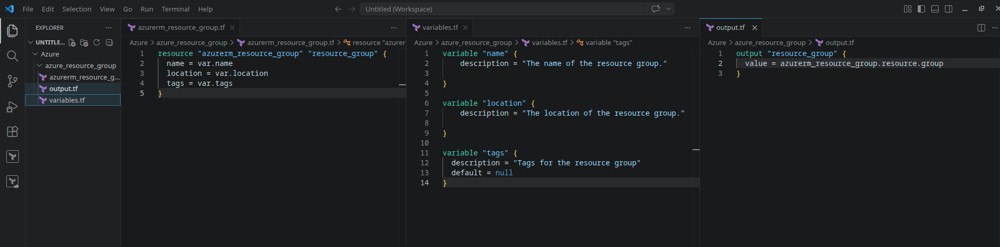
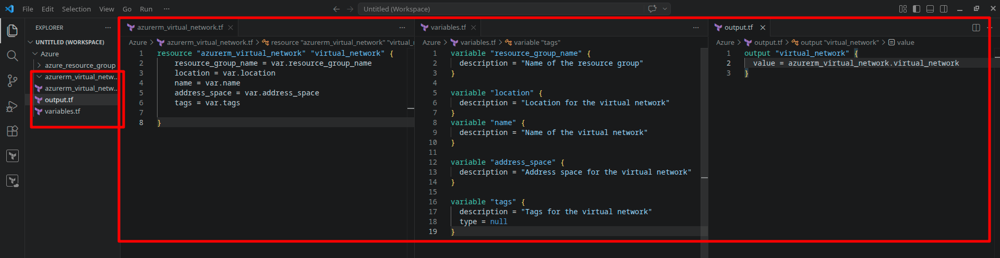
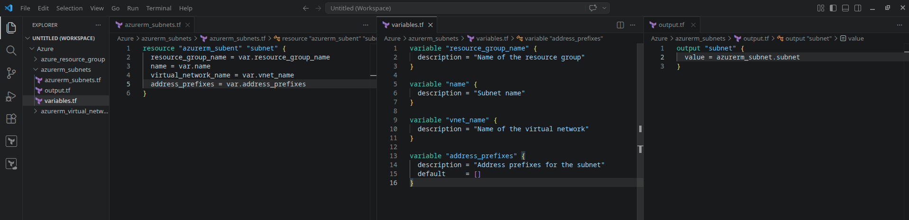
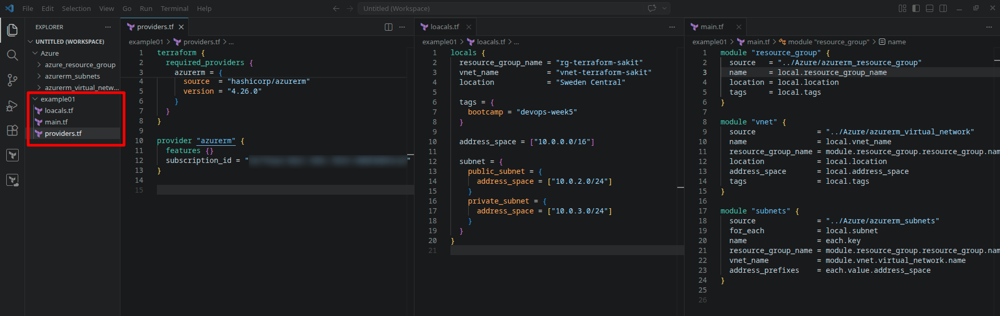
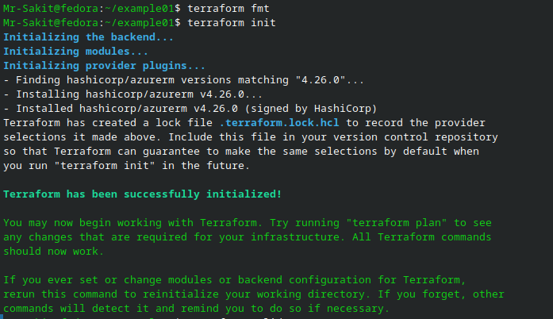
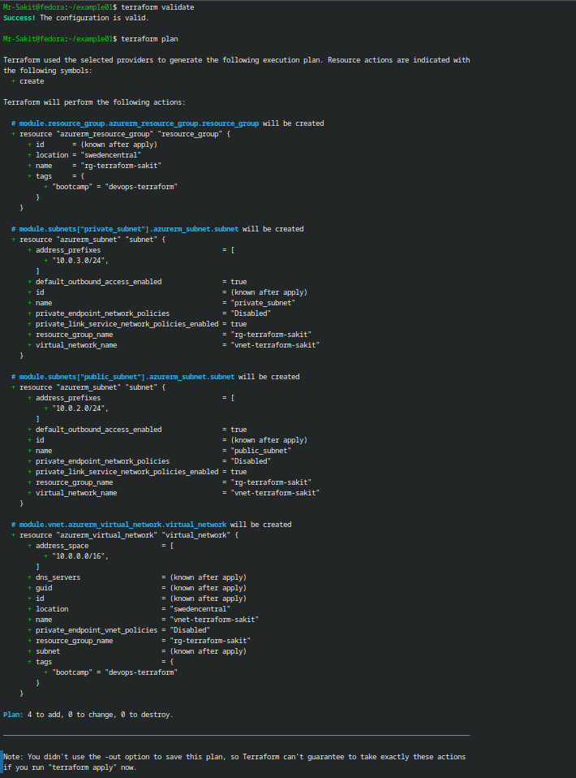
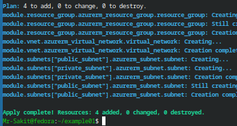
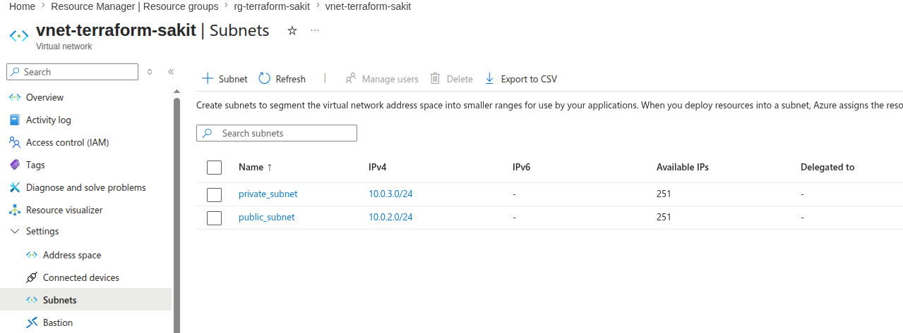
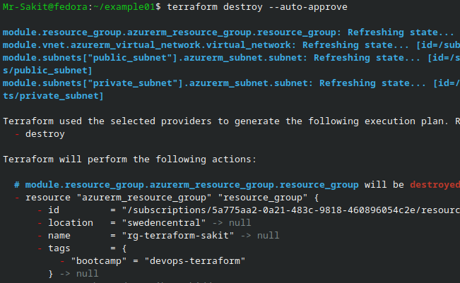

# Provision Infrastructure Using Reusable Terraform Modules

## 📋 Overview

This lab demonstrates how to structure Terraform code into **reusable modules** and compose them together to provision an Azure **Resource Group**, a **Virtual Network**, and two **Subnets** (public and private). Instead of writing all resources in a single flat directory, we break the infrastructure into self-contained modules — each with its own inputs, outputs, and resource definitions — then consume them from a root module.

> [!NOTE]
> In previous labs, all Terraform code lived in a single directory (the root module). This works for small projects, but as infrastructure grows, it leads to massive, hard-to-maintain files. **Modules** solve this by encapsulating related resources into reusable packages — similar to functions in programming. A module for creating a Virtual Network can be reused across dev, staging, and production environments without duplicating code. This lab introduces that pattern.

---

## 🎯 Objectives

- Understand why Terraform modules exist and what problems they solve
- Create three reusable modules: Resource Group, Virtual Network, and Subnet
- Structure each module with proper inputs (`variables.tf`), resources, and outputs (`output.tf`)
- Build a root module that composes these child modules into a complete infrastructure
- Use `for_each` to dynamically create multiple subnets from a single module
- Use `locals` to centralize configuration values
- Provision and verify the infrastructure in Azure
- Destroy all resources after the lab

---

## 🔧 Prerequisites

| Requirement | Details |
|---|---|
| **Terraform** | Installed on your system |
| **Azure CLI** | Installed and authenticated (`az login`) |
| **Azure Credentials** | Valid subscription with permissions to create VNets |
| **Previous Labs** | Completed Labs 1–3 (setup, provisioning, remote state) |

---

## 📝 Lab Steps

### Step 1: Create the Modules

We create three modules, each inside its own directory under a parent `Azure/` folder. Every module follows the same three-file pattern:

| File | Purpose |
|---|---|
| `<resource>.tf` | The resource definition — what the module creates |
| `variables.tf` | The module's input interface — what the caller must provide |
| `output.tf` | The module's output values — what it exposes to the caller |

> [!TIP]
> This three-file pattern (`resource.tf`, `variables.tf`, `output.tf`) is the standard convention for Terraform modules. Outputs are especially important because they allow modules to **pass data to each other** — for example, the Resource Group module outputs its name so the VNet module can reference it.

---

#### Module 1: Resource Group

**Directory:** `Azure/azure_resource_group/`

This module encapsulates the creation of an Azure Resource Group with configurable name, location, and tags.

**`azurerm_resource_group.tf`:**
```hcl
resource "azurerm_resource_group" "resource_group" {
  name     = var.name
  location = var.location
  tags     = var.tags
}
```

**`variables.tf`:**
```hcl
variable "name" {
  description = "The name of the resource group."
}

variable "location" {
  description = "The location of the resource group."
}

variable "tags" {
  description = "Tags for the resource group"
  default     = null
}
```

**`output.tf`:**
```hcl
output "resource_group" {
  value = azurerm_resource_group.resource_group
}
```



**Why output the entire resource object?** By outputting the full `azurerm_resource_group` object (not just the name), the caller can access *any* attribute — `.name`, `.location`, `.id` — without us needing to create separate outputs for each.

---

#### Module 2: Virtual Network

**Directory:** `Azure/azurerm_virtual_network/`

This module creates a Virtual Network within a specified Resource Group.

**`azurerm_virtual_network.tf`:**
```hcl
resource "azurerm_virtual_network" "virtual_network" {
  resource_group_name = var.resource_group_name
  location            = var.location
  name                = var.name
  address_space       = var.address_space
  tags                = var.tags
}
```

**`variables.tf`:**
```hcl
variable "resource_group_name" {
  description = "Name of the resource group"
}

variable "location" {
  description = "Location for the virtual network"
}

variable "name" {
  description = "Name of the virtual network"
}

variable "address_space" {
  description = "Address space for the virtual network"
}

variable "tags" {
  description = "Tags for the virtual network"
  type        = null
}
```

**`output.tf`:**
```hcl
output "virtual_network" {
  value = azurerm_virtual_network.virtual_network
}
```



---

#### Module 3: Subnet

**Directory:** `Azure/azurerm_subnets/`

This module creates a Subnet within a specified Virtual Network. It's designed to be called multiple times (via `for_each`) to create both public and private subnets.

**`azurerm_subnets.tf`:**
```hcl
resource "azurerm_subnet" "subnet" {
  resource_group_name  = var.resource_group_name
  name                 = var.name
  virtual_network_name = var.vnet_name
  address_prefixes     = var.address_prefixes
}
```

**`variables.tf`:**
```hcl
variable "resource_group_name" {
  description = "Name of the resource group"
}

variable "name" {
  description = "Subnet name"
}

variable "vnet_name" {
  description = "Name of the virtual network"
}

variable "address_prefixes" {
  description = "Address prefixes for the subnet"
  default     = []
}
```

**`output.tf`:**
```hcl
output "subnet" {
  value = azurerm_subnet.subnet
}
```



---

### Step 2: Create the Root Module

The **root module** is the directory where you run `terraform` commands. It **consumes** the child modules, wiring them together to build the complete infrastructure.

**Directory:** `example01/`

#### 2.1 — Provider Configuration (`providers.tf`)

```hcl
terraform {
  required_providers {
    azurerm = {
      source  = "hashicorp/azurerm"
      version = "4.26.0"
    }
  }
}

provider "azurerm" {
  features {}
  subscription_id = "<your-subscription-id>"
}
```

#### 2.2 — Local Values (`locals.tf`)

Locals centralize configuration values that are used across multiple module calls, reducing duplication and making changes easier:

```hcl
locals {
  resource_group_name = "rg-terraform-sakit"
  vnet_name           = "vnet-terraform-sakit"
  location            = "Sweden Central"

  tags = {
    bootcamp = "devops-terraform"
  }

  address_space = ["10.0.0.0/16"]

  subnet = {
    public_subnet = {
      address_space = ["10.0.2.0/24"]
    }
    private_subnet = {
      address_space = ["10.0.3.0/24"]
    }
  }
}
```

**Why `locals` instead of `variables`?** Locals are for values that are computed or fixed within the module — they cannot be overridden by the caller. Since this root module is not itself called by another module, locals are simpler than variables for hardcoded environment-specific values.

#### 2.3 — Main Configuration (`main.tf`)

This is where the modules are **called** and **wired together**:

```hcl
module "resource_group" {
  source   = "../Azure/azure_resource_group"
  name     = local.resource_group_name
  location = local.location
  tags     = local.tags
}

module "vnet" {
  source              = "../Azure/azurerm_virtual_network"
  name                = local.vnet_name
  resource_group_name = module.resource_group.resource_group.name
  location            = local.location
  address_space       = local.address_space
  tags                = local.tags
}

module "subnets" {
  source              = "../Azure/azurerm_subnets"
  for_each            = local.subnet
  name                = each.key
  resource_group_name = module.resource_group.resource_group.name
  vnet_name           = module.vnet.virtual_network.name
  address_prefixes    = each.value.address_space
}
```



**How module composition works:**

```
module.resource_group ──► outputs resource_group.name ──┐
                                                         ├──► module.vnet (needs RG name)
                                                         │
module.vnet ──► outputs virtual_network.name ────────────┤
                                                         ├──► module.subnets (needs RG + VNet name)
module.resource_group ──► outputs resource_group.name ──┘
```

> [!IMPORTANT]
> The `for_each = local.subnet` on the `module "subnets"` block is what makes this dynamic. Instead of writing two separate module blocks for public and private subnets, we define a map of subnets in locals and iterate over it. `each.key` becomes the subnet name (`public_subnet`, `private_subnet`) and `each.value.address_space` provides the CIDR range. Adding a new subnet is as simple as adding an entry to the map — no new module blocks needed.

#### Project Structure

```
├── Azure/                              # Reusable module library
│   ├── azure_resource_group/           # Module: Resource Group
│   │   ├── azurerm_resource_group.tf
│   │   ├── variables.tf
│   │   └── output.tf
│   ├── azurerm_virtual_network/        # Module: Virtual Network
│   │   ├── azurerm_virtual_network.tf
│   │   ├── variables.tf
│   │   └── output.tf
│   └── azurerm_subnets/                # Module: Subnet
│       ├── azurerm_subnets.tf
│       ├── variables.tf
│       └── output.tf
│
└── example01/                          # Root module (entry point)
    ├── providers.tf                    # Provider configuration
    ├── locals.tf                       # Centralized configuration values
    └── main.tf                         # Module composition
```

---

### Step 3: Provision the Infrastructure

Run the Terraform workflow from the `example01/` directory:

#### 3.1 — Format and Initialize

```bash
terraform fmt
terraform init
```



Notice the additional line: **"Initializing modules..."** — Terraform discovers and loads the referenced child modules before downloading providers.

#### 3.2 — Validate and Plan

```bash
terraform validate
terraform plan
```



The plan shows **4 resources to create**:

| Resource | Module Path | Details |
|---|---|---|
| Resource Group | `module.resource_group` | `rg-terraform-sakit` in Sweden Central |
| Virtual Network | `module.vnet` | `vnet-terraform-sakit` with `10.0.0.0/16` |
| Public Subnet | `module.subnets["public_subnet"]` | `10.0.2.0/24` |
| Private Subnet | `module.subnets["private_subnet"]` | `10.0.3.0/24` |

Notice how the resource addresses include the module path (e.g., `module.subnets["private_subnet"].azurerm_subnet.subnet`) — this shows the hierarchical relationship between the root module and child modules.

#### 3.3 — Apply

```bash
terraform apply --auto-approve
```



**Result:** `Apply complete! Resources: 4 added, 0 changed, 0 destroyed.`

All four resources were created in the correct dependency order:
1. Resource Group (created first — everything depends on it)
2. Virtual Network (depends on Resource Group)
3. Public Subnet + Private Subnet (depend on both RG and VNet, created in parallel)

---

### Step 4: Verify in Azure Portal

Navigate to **Azure Portal → Resource Groups → rg-terraform-sakit → vnet-terraform-sakit → Subnets**:



Both subnets are visible with their correct CIDR ranges:

| Subnet Name | IPv4 | Available IPs |
|---|---|---|
| `private_subnet` | 10.0.3.0/24 | 251 |
| `public_subnet` | 10.0.2.0/24 | 251 |

> [!NOTE]
> Azure reserves 5 IP addresses in every subnet (network address, default gateway, 2 DNS-mapped IPs, and broadcast), which is why a /24 subnet (256 addresses) shows 251 available IPs.

---

### Step 5: Clean Up Resources

```bash
terraform destroy --auto-approve
```



Terraform destroys resources in the **reverse dependency order**: subnets first, then the VNet, and finally the Resource Group.

---

## 🏗️ Architecture

```
┌──────────────────────────────────────────────────────────────────┐
│                    Root Module (example01/)                        │
│                                                                   │
│  locals.tf ─── Centralized configuration                         │
│  main.tf ───── Module composition                                │
│                                                                   │
│  ┌─────────────────────┐                                         │
│  │  module "rg"         │─── source: ../Azure/azure_resource_group│
│  │  rg-terraform-sakit  │                                         │
│  └─────────┬───────────┘                                         │
│            │ .name                                                │
│            ▼                                                      │
│  ┌─────────────────────┐                                         │
│  │  module "vnet"       │─── source: ../Azure/azurerm_virtual_net │
│  │  vnet-terraform-sakit│                                         │
│  │  10.0.0.0/16         │                                         │
│  └─────────┬───────────┘                                         │
│            │ .name                                                │
│            ▼                                                      │
│  ┌─────────────────────────────────────────┐                     │
│  │  module "subnets" (for_each)             │                     │
│  │                                          │                     │
│  │  ┌──────────────┐  ┌──────────────────┐ │                     │
│  │  │public_subnet │  │ private_subnet   │ │                     │
│  │  │10.0.2.0/24   │  │ 10.0.3.0/24     │ │                     │
│  │  └──────────────┘  └──────────────────┘ │                     │
│  └──────────────────────────────────────────┘                     │
└───────────────────────────────────────────────────────────────────┘
```

---

## 📊 Summary

| Task | Command / Action | Status |
|---|---|---|
| Create Resource Group module | `Azure/azure_resource_group/` with 3 files | ✅ |
| Create Virtual Network module | `Azure/azurerm_virtual_network/` with 3 files | ✅ |
| Create Subnet module | `Azure/azurerm_subnets/` with 3 files | ✅ |
| Create root module with locals | `example01/` with providers, locals, main | ✅ |
| Use `for_each` for dynamic subnets | `local.subnet` map with public + private | ✅ |
| Format and initialize | `terraform fmt` + `terraform init` (with modules) | ✅ |
| Validate and plan | `terraform validate` + `terraform plan` → 4 to add | ✅ |
| Apply configuration | `terraform apply --auto-approve` → 4 added | ✅ |
| Verify in Azure Portal | RG, VNet, and 2 subnets created correctly | ✅ |
| Destroy resources | `terraform destroy --auto-approve` → 4 destroyed | ✅ |

---

## 💡 Key Takeaways

1. **Modules are Terraform's abstraction mechanism** — just as functions encapsulate logic in programming, modules encapsulate infrastructure. A well-designed module hides complexity and exposes a clean input/output interface
2. **The three-file convention** (`resource.tf`, `variables.tf`, `output.tf`) makes modules self-documenting — anyone can look at `variables.tf` to understand what inputs are required and `output.tf` to see what data is exposed
3. **Outputs enable module composition** — without outputs, modules would be isolated black boxes. The Resource Group module outputs its name so the VNet module can reference it; the VNet module outputs its name so the Subnet module can reference it. This creates a clear dependency chain
4. **`for_each` eliminates code duplication** — instead of writing separate module blocks for each subnet, we iterate over a map. Adding a new subnet requires only adding an entry to the `locals` map, not writing new Terraform code
5. **`locals` vs `variables`** — use `locals` for values that are internal to the module and don't need to be overridden; use `variables` for values the caller should provide. In a root module that isn't called by anything else, locals are often simpler
6. **Module sources can be local paths, Git repos, or registries** — in this lab we use relative paths (`../Azure/...`), but in real projects, modules are often stored in Git repositories or the Terraform Registry for version control and sharing across teams
7. **Terraform resolves dependencies automatically** — when `module.vnet` references `module.resource_group.resource_group.name`, Terraform knows to create the Resource Group before the VNet. You don't need to specify the order explicitly
8. **Reusable modules standardize infrastructure** — once a module is tested and approved, all teams use the same module to create VNets, ensuring consistent naming, tagging, and configuration across the organization. This is a key governance benefit of IaC
