# Provision an Azure Linux Virtual Machine Using Terraform

## 📋 Overview

This lab walks through provisioning a complete Azure Linux Virtual Machine (VM) environment using Terraform. Rather than creating resources through the Azure Portal, we define **every component as code** — from the Resource Group and Virtual Network all the way to the VM itself — and deploy them with a single `terraform apply`. By the end, you'll have a running Ubuntu VM accessible via SSH.

> [!NOTE]
> This lab takes a **flat-file approach**: all resources live in the same directory (the root module), each in its own `.tf` file. This makes the relationship between resources explicit and easy to follow for a first-time deployment. The next lab ([Building Reusable Components in Terraform](../../day2/lab1-Building%20Reusable%20Components%20in%20Terraform/)) refactors this setup to use `for_each` and `dynamic` blocks for greater flexibility.

---

## 🎯 Objectives

- Set up Terraform with the AzureRM provider and authenticate via Azure CLI
- Define all infrastructure variables in a single `variables.tf` with sensible defaults
- Provision a full networking stack: Virtual Network, Subnet, NSG (with SSH + HTTP rules), Public IP, and NIC
- Create a Storage Account for VM boot diagnostics using the `random` provider
- Generate SSH keys automatically using the `tls` provider
- Deploy an Ubuntu Linux VM with SSH key-based authentication
- Connect to the deployed VM via SSH
- Tear down all resources with `terraform destroy`

---

## 🔧 Prerequisites

| Requirement | Details |
|---|---|
| **Terraform** | Installed on your system |
| **Azure CLI** | Installed and authenticated (`az login`) |
| **Azure Subscription** | Valid subscription with permissions to create VMs |
| **Code Editor** | VS Code or similar |

---

## 📝 Lab Steps

### Step 1: Project Setup and Authentication

Create a new folder named `virtual_machine` in your workspace and authenticate to Azure:

```bash
az login
```

If you have multiple subscriptions, set the one you want to use:

```bash
az account set --subscription "<your-subscription-id>"
```

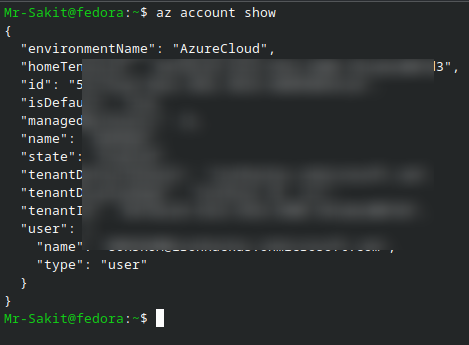

---

### Step 2: Define the Provider (`providers.tf`)

Create `providers.tf` with the AzureRM provider:

```hcl
terraform {
  required_providers {
    azurerm = {
      source  = "hashicorp/azurerm"
      version = "4.26.0"
    }
  }
}

provider "azurerm" {
  features {}
  subscription_id = "<your-subscription-id>"
}
```

Initialize the project to download provider plugins:

```bash
terraform init
```

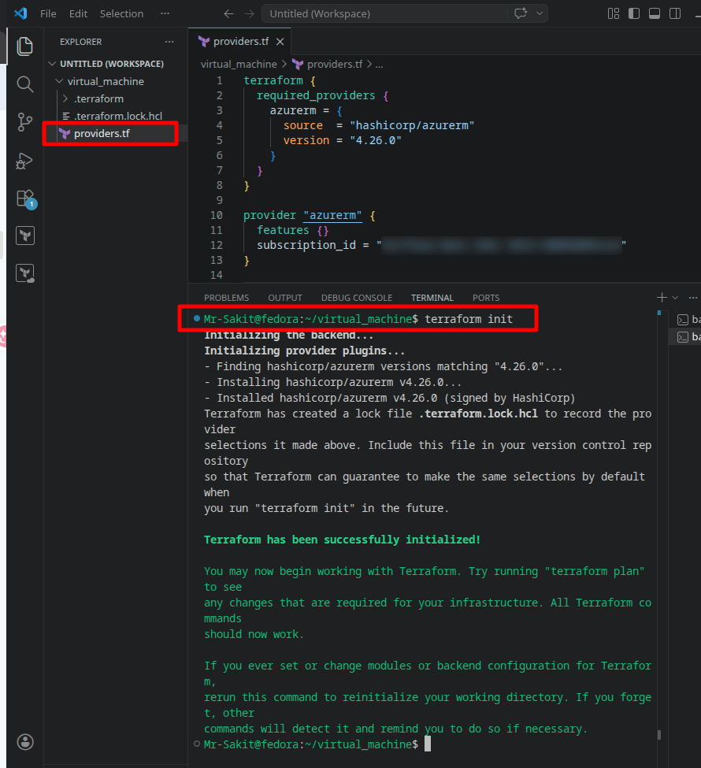

---

### Step 3: Define Variables (`variables.tf`)

Create `variables.tf` with all the required input variables. Defaults are provided for values that rarely change (VM size, image reference, disk settings), while environment-specific values (names, locations) are left without defaults so they must be set in `terraform.tfvars`:

```hcl
variable "resource_group_name" { type = string }
variable "location"            { type = string }
variable "tags"                { type = map(any) }
variable "vnet_name"           { type = string }
variable "cidr_block"          { type = list(string)  default = ["10.0.0.0/16"] }
variable "subnet_cidr_block"   { type = list(string)  default = ["10.0.2.0/24"] }
variable "subnet_name"         { type = string }
variable "public_ip_address"   { type = string }
variable "virtual_machine_name" { type = string }
variable "disksize"            { type = string  default = "Standard_DS1_v2" }
variable "nic_name"            { type = string }
variable "nsg_name"            { type = string }
variable "ip_allocation_method" { type = string  default = "Static" }
variable "ip_configuration_name" { type = string }
variable "account_replication_type" { type = string  default = "LRS" }
variable "account_tier"        { type = string  default = "Standard" }
variable "os_disk_name"        { type = string }
variable "os_disk_caching"     { type = string  default = "ReadWrite" }
variable "os_disk_storage_account_type" { type = string  default = "Premium_LRS" }
variable "source_image_reference_publisher" { type = string  default = "Canonical" }
variable "source_image_reference_offer"     { type = string  default = "UbuntuServer" }
variable "source_image_reference_sku"       { type = string  default = "18.04-LTS" }
variable "source_image_reference_version"   { type = string  default = "latest" }
variable "vm_admin_username"   { type = string  default = "azureuser" }
variable "vm_disable_password_authentication" { type = bool  default = true }
```

> [!TIP]
> Setting `vm_disable_password_authentication = true` forces SSH key-only access. This is a security best practice — password authentication on public-facing VMs is a common attack vector.

---

### Step 4: Provide Variable Values (`terraform.tfvars`)

Create `terraform.tfvars` to set the environment-specific values:

```hcl
resource_group_name   = "rg-sakit"
location              = "Sweden Central"
tags                  = { "env" : "production" }
vnet_name             = "devops-vnet"
cidr_block            = ["10.0.0.0/16"]
subnet_cidr_block     = ["10.0.2.0/24"]
subnet_name           = "sakit-subnet"
public_ip_address     = "sakit-public-ip"
disksize              = "Standard_D2s_v3"
nic_name              = "sakit-public-ip"
nsg_name              = "sakit-nsg"
virtual_machine_name  = "sakit-virtual-machine"
ip_configuration_name = "sakit-ipconfiguration"
os_disk_name          = "sakit-os-disk"
```

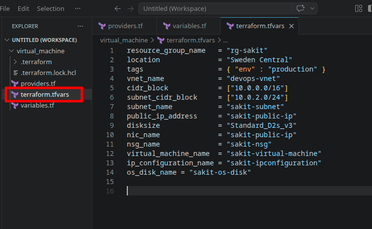

---

### Step 5: Define Azure Resources

Each resource is placed in its own `.tf` file for clarity. Here is what each file creates and why it's needed:

#### 5.1 — Resource Group (`resource_group.tf`)

The logical container for all Azure resources in this lab:

```hcl
resource "azurerm_resource_group" "resource_group" {
  name     = var.resource_group_name
  location = var.location
  tags     = var.tags
}
```

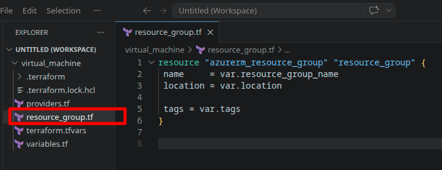

#### 5.2 — Virtual Network (`vnet.tf`)

The isolated network environment where the VM will live:

```hcl
resource "azurerm_virtual_network" "virtual_network" {
  name                = var.vnet_name
  address_space       = var.cidr_block
  location            = var.location
  resource_group_name = azurerm_resource_group.resource_group.name
  tags                = var.tags
}
```

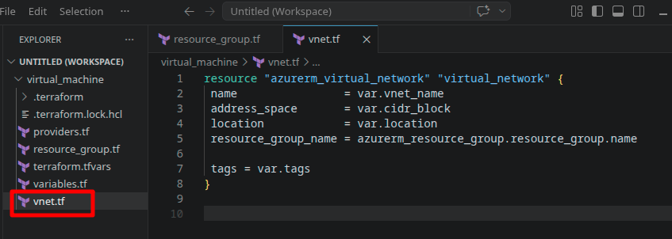

#### 5.3 — Subnet (`subnet.tf`)

A subnet within the VNet to assign to the VM's NIC:

```hcl
resource "azurerm_subnet" "subnet" {
  name                 = var.subnet_name
  resource_group_name  = azurerm_resource_group.resource_group.name
  virtual_network_name = azurerm_virtual_network.virtual_network.name
  address_prefixes     = var.subnet_cidr_block
}
```

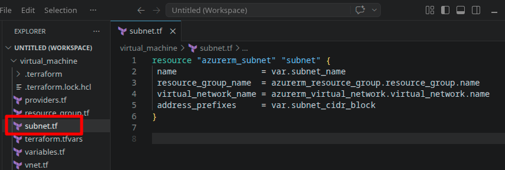

#### 5.4 — Network Security Group (`nsg.tf`)

Controls inbound/outbound traffic. Two rules are defined — **SSH (port 22)** for remote access and **HTTP (port 80)** for web traffic:

```hcl
resource "azurerm_network_security_group" "network_security_group" {
  name                = var.nsg_name
  location            = var.location
  resource_group_name = azurerm_resource_group.resource_group.name

  security_rule {
    name                       = "allow_ssh"
    priority                   = 1001
    direction                  = "Inbound"
    access                     = "Allow"
    protocol                   = "Tcp"
    source_port_range          = "*"
    destination_port_range     = "22"
    source_address_prefix      = "*"
    destination_address_prefix = "*"
  }

  security_rule {
    name                       = "allow_http"
    priority                   = 1002
    direction                  = "Inbound"
    access                     = "Allow"
    protocol                   = "Tcp"
    source_port_range          = "*"
    destination_port_range     = "80"
    source_address_prefix      = "*"
    destination_address_prefix = "*"
  }

  tags = var.tags
}
```

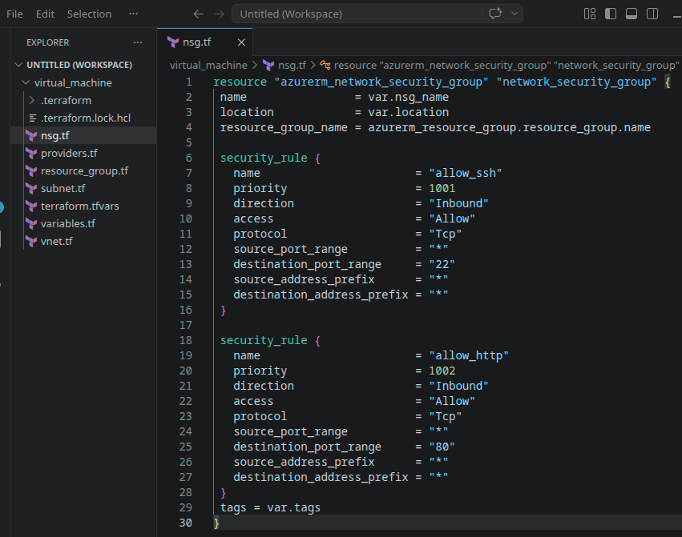

> [!WARNING]
> The `source_address_prefix = "*"` allows SSH from **any IP address**. In production environments, restrict this to your IP or a specific CIDR range to reduce the attack surface.

#### 5.5 — Public IP (`public_ip_address.tf`)

A static public IP to make the VM reachable from the internet:

```hcl
resource "azurerm_public_ip" "public_ip" {
  name                = var.public_ip_address
  location            = var.location
  resource_group_name = azurerm_resource_group.resource_group.name
  allocation_method   = var.ip_allocation_method
  tags                = var.tags
}
```

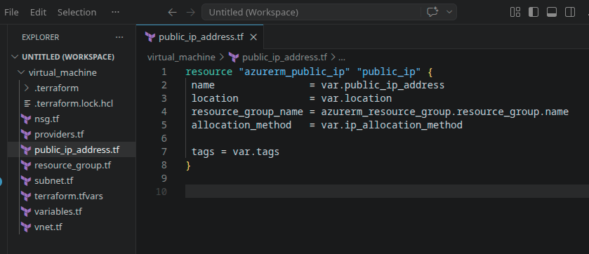

#### 5.6 — Network Interface Card (`nic.tf`)

The NIC connects the VM to the subnet and associates it with the NSG and Public IP:

```hcl
resource "azurerm_network_interface" "network_interface_card" {
  name                = var.nic_name
  location            = var.location
  resource_group_name = azurerm_resource_group.resource_group.name

  ip_configuration {
    name                          = var.ip_configuration_name
    subnet_id                     = azurerm_subnet.subnet.id
    private_ip_address_allocation = "Dynamic"
    public_ip_address_id          = azurerm_public_ip.public_ip.id
  }

  tags = var.tags
}

# Connect the security group to the network interface
resource "azurerm_network_interface_security_group_association" "example" {
  network_interface_id      = azurerm_network_interface.network_interface_card.id
  network_security_group_id = azurerm_network_security_group.network_security_group.id
}
```

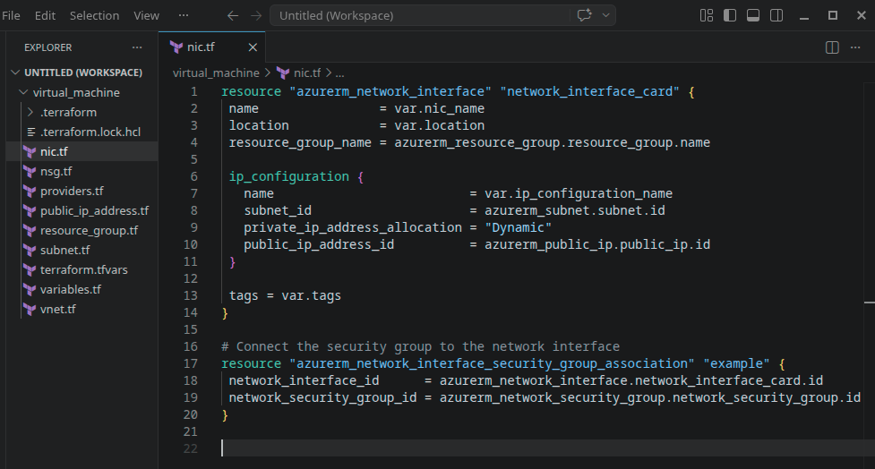

**Why a separate association resource?** Azure decouples the NSG from the NIC. The `azurerm_network_interface_security_group_association` resource creates this binding explicitly, making it visible in the Terraform state and easy to modify independently.

#### 5.7 — Storage Account (`storage_account.tf`)

A Storage Account for VM boot diagnostics. The `random_id` resource ensures the storage account name is globally unique:

```hcl
resource "random_id" "random_id" {
  keepers = {
    resource_group = azurerm_resource_group.resource_group.name
  }
  byte_length = 8
}

resource "azurerm_storage_account" "mystorageaccount" {
  name                     = "diag${random_id.random_id.hex}"
  resource_group_name      = azurerm_resource_group.resource_group.name
  location                 = var.location
  account_replication_type = var.account_replication_type
  account_tier             = var.account_tier
  tags                     = var.tags
}
```

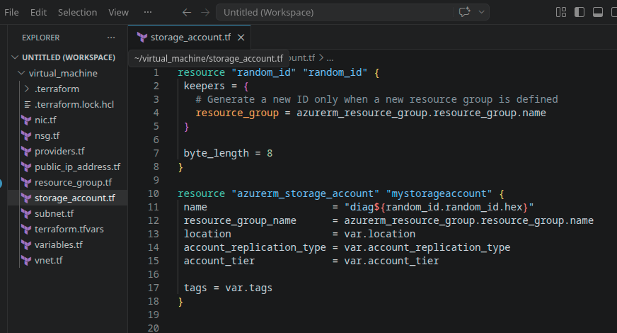

#### 5.8 — SSH Key Generation (`secure_tls_key.tf`)

The `tls` provider generates a 4096-bit RSA key pair. The public key is injected into the VM; the private key is exposed as a sensitive output:

```hcl
resource "tls_private_key" "ssh_key" {
  algorithm = "RSA"
  rsa_bits  = 4096
}

output "tls_private_key" {
  value     = tls_private_key.ssh_key.private_key_pem
  sensitive = true
}
```

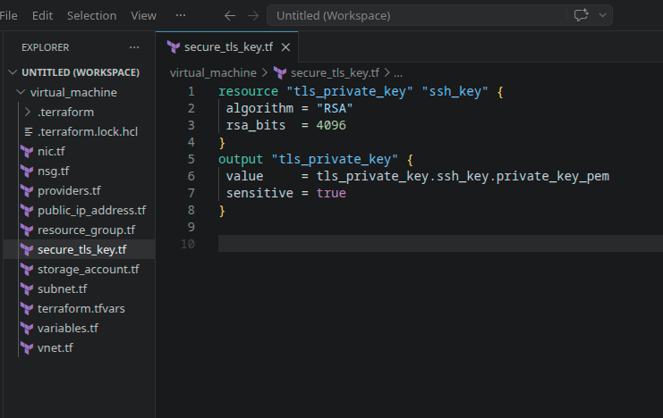

> [!NOTE]
> Generating SSH keys within Terraform is convenient for labs and demos. In production, you would typically use pre-existing key pairs managed by your organization's key management system, since Terraform stores the private key in state.

#### 5.9 — Linux Virtual Machine (`virtual_machine.tf`)

The main resource — an Ubuntu Linux VM that references all the previously created components:

```hcl
resource "azurerm_linux_virtual_machine" "virtual_machine" {
  name                  = var.virtual_machine_name
  location              = var.location
  resource_group_name   = azurerm_resource_group.resource_group.name
  network_interface_ids = [azurerm_network_interface.network_interface_card.id]
  size                  = var.disksize

  os_disk {
    name                 = var.os_disk_name
    caching              = var.os_disk_caching
    storage_account_type = var.os_disk_storage_account_type
  }

  source_image_reference {
    publisher = var.source_image_reference_publisher
    offer     = var.source_image_reference_offer
    sku       = var.source_image_reference_sku
    version   = var.source_image_reference_version
  }

  computer_name                   = var.virtual_machine_name
  admin_username                  = var.vm_admin_username
  disable_password_authentication = var.vm_disable_password_authentication

  admin_ssh_key {
    username   = var.vm_admin_username
    public_key = tls_private_key.ssh_key.public_key_openssh
  }

  boot_diagnostics {
    storage_account_uri = azurerm_storage_account.mystorageaccount.primary_blob_endpoint
  }

  tags = var.tags
}
```

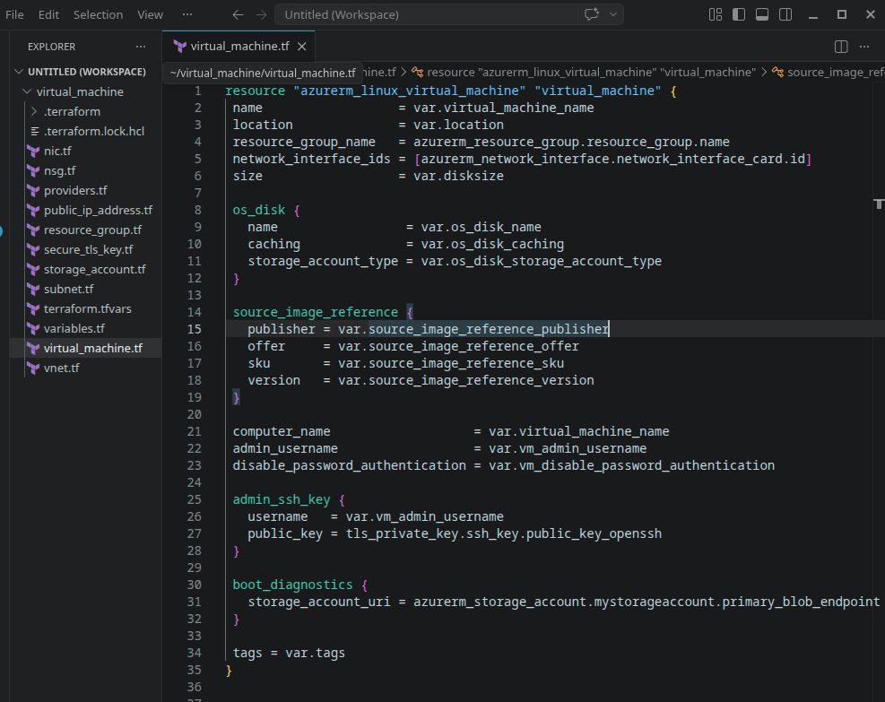

#### 5.10 — Output (`output.tf`)

Exposes the VM's public IP address after deployment:

```hcl
output "public_ip_address" {
  value = azurerm_linux_virtual_machine.virtual_machine.public_ip_address
}
```

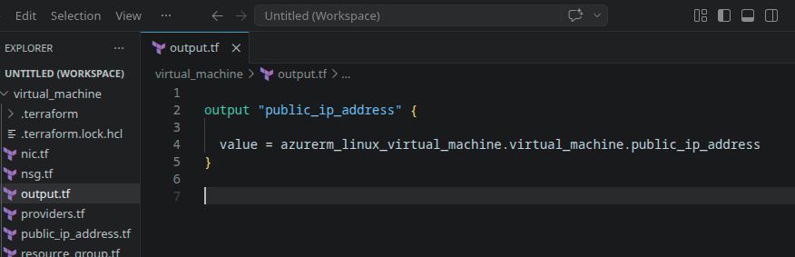

---

### Step 6: Update Providers for Additional Dependencies

Since we use `random_id` and `tls_private_key`, update `providers.tf` to include the `random` and `tls` providers:

```hcl
terraform {
  required_providers {
    azurerm = {
      source  = "hashicorp/azurerm"
      version = "4.26.0"
    }
    random = {
      source  = "hashicorp/random"
      version = "3.7.1"
    }
    tls = {
      source  = "hashicorp/tls"
      version = "4.0.6"
    }
  }
}

provider "azurerm" {
  features {}
  subscription_id = "<your-subscription-id>"
}

provider "random" {}
provider "tls" {}
```

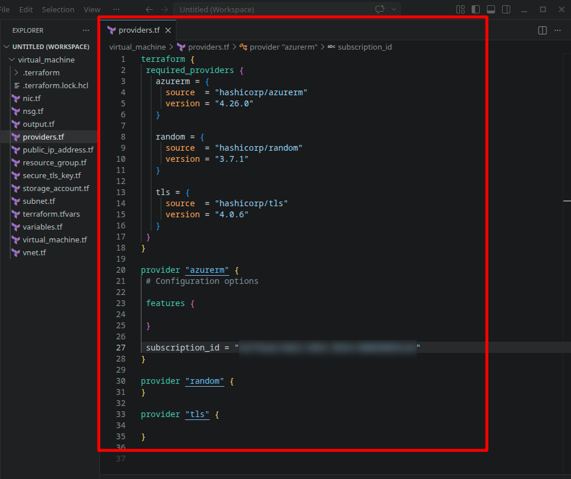

Re-initialize to download the new providers:

```bash
terraform init
```

---

### Step 7: Deploy the Infrastructure

Run the full Terraform workflow:

```bash
terraform fmt
terraform validate
terraform plan
```

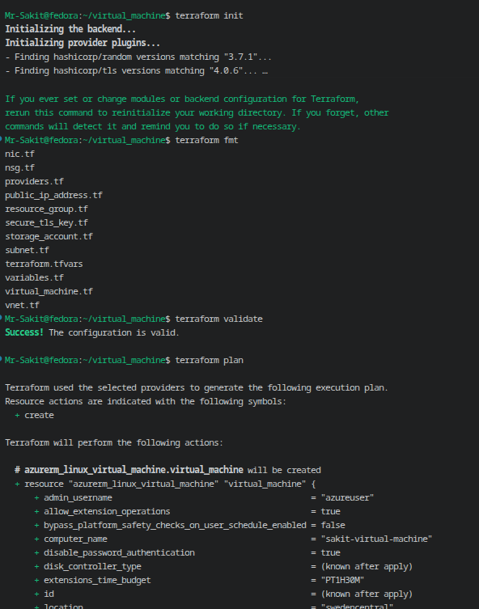

Apply the configuration:

```bash
terraform apply --auto-approve
```

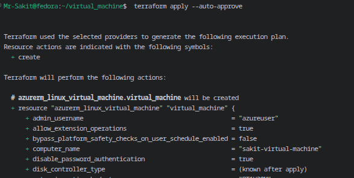

---

### Step 8: Connect to the VM

After a successful apply, the outputs show the VM's public IP. Save the generated private key and SSH into the VM:

```bash
terraform output tls_private_key >> key.pem
chmod 400 key.pem
ssh -i ./key.pem azureuser@<public-ip>
```

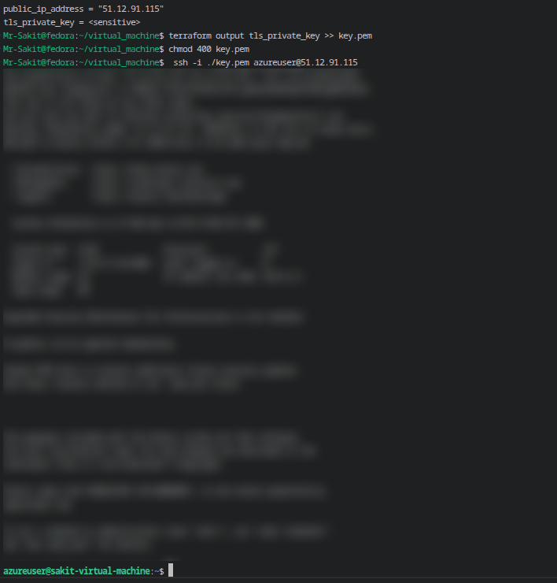

The prompt `azureuser@sakit-virtual-machine:~$` confirms a successful connection to the Ubuntu VM running in Azure.

---

### Step 9: Clean Up Resources

Destroy everything created by this lab:

```bash
terraform destroy --auto-approve
```

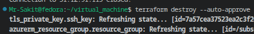

---

## 🏗️ Architecture

```
┌─────────────────────────────────────────────────────────────────┐
│                     Azure Resource Group                        │
│                       (rg-sakit)                                │
│                                                                 │
│  ┌───────────────────────────────────────────────┐              │
│  │         Virtual Network (devops-vnet)          │              │
│  │            10.0.0.0/16                         │              │
│  │                                                │              │
│  │  ┌──────────────────────────────────────┐      │              │
│  │  │     Subnet (sakit-subnet)            │      │              │
│  │  │       10.0.2.0/24                    │      │              │
│  │  │                                      │      │              │
│  │  │   ┌──────────────────────────────┐   │      │              │
│  │  │   │  NIC (sakit-public-ip)       │   │      │              │
│  │  │   │    ├── Private IP (Dynamic)  │   │      │              │
│  │  │   │    └── Public IP (Static)    │   │      │              │
│  │  │   └──────────┬───────────────────┘   │      │              │
│  │  │              │                        │      │              │
│  │  │   ┌──────────▼───────────────────┐   │      │              │
│  │  │   │  Linux VM                    │   │      │              │
│  │  │   │  (sakit-virtual-machine)     │   │      │              │
│  │  │   │  Ubuntu 18.04-LTS           │   │      │              │
│  │  │   │  SSH Key Auth               │   │      │              │
│  │  │   └──────────────────────────────┘   │      │              │
│  │  └──────────────────────────────────────┘      │              │
│  └────────────────────────────────────────────────┘              │
│                                                                 │
│  ┌─────────────────────┐  ┌───────────────────────────────────┐ │
│  │  NSG (sakit-nsg)    │  │  Storage Account (diag<random>)   │ │
│  │  ├─ allow_ssh  :22  │  │  Boot diagnostics                │ │
│  │  └─ allow_http :80  │  └───────────────────────────────────┘ │
│  └─────────────────────┘                                        │
└─────────────────────────────────────────────────────────────────┘
```

---

## 📁 Project Structure

```
virtual_machine/
├── providers.tf           # AzureRM, random, and tls providers
├── variables.tf           # All input variables with defaults
├── terraform.tfvars       # Environment-specific values
├── resource_group.tf      # Azure Resource Group
├── vnet.tf                # Virtual Network
├── subnet.tf              # Subnet
├── nsg.tf                 # Network Security Group (SSH + HTTP)
├── public_ip_address.tf   # Static Public IP
├── nic.tf                 # NIC + NSG association
├── storage_account.tf     # Storage Account + random ID
├── secure_tls_key.tf      # TLS SSH key generation
├── virtual_machine.tf     # Linux VM definition
└── output.tf              # Public IP output
```

---

## 📊 Summary

| Task | Command / Action | Status |
|---|---|---|
| Project setup & Azure auth | `az login` + create `virtual_machine/` folder | ✅ |
| Provider configuration | `providers.tf` with azurerm, random, tls | ✅ |
| Define variables | `variables.tf` — 22 variables with sensible defaults | ✅ |
| Set variable values | `terraform.tfvars` — environment-specific naming | ✅ |
| Resource Group | `resource_group.tf` | ✅ |
| Virtual Network | `vnet.tf` — `10.0.0.0/16` | ✅ |
| Subnet | `subnet.tf` — `10.0.2.0/24` | ✅ |
| NSG with rules | `nsg.tf` — SSH (22) + HTTP (80) | ✅ |
| Public IP | `public_ip_address.tf` — Static allocation | ✅ |
| NIC + NSG association | `nic.tf` — binds NIC to subnet, public IP, and NSG | ✅ |
| Storage Account | `storage_account.tf` — random unique name for diagnostics | ✅ |
| SSH key generation | `secure_tls_key.tf` — RSA 4096-bit via tls provider | ✅ |
| Linux VM | `virtual_machine.tf` — Ubuntu 18.04-LTS with SSH | ✅ |
| Deploy infrastructure | `terraform apply --auto-approve` | ✅ |
| SSH into VM | `ssh -i ./key.pem azureuser@<public-ip>` | ✅ |
| Destroy resources | `terraform destroy --auto-approve` | ✅ |

---

## 💡 Key Takeaways

1. **One file per resource** makes the project navigable — you can find and modify any component without scrolling through a monolithic file. Each `.tf` file has a single responsibility
2. **Variables with defaults** strike a balance between flexibility and convenience — image references, disk settings, and authentication defaults rarely change, while names and locations are environment-specific
3. **The `random` provider** solves the global uniqueness requirement for Azure Storage Account names — the `keepers` map ensures a new random ID is generated only when the resource group changes
4. **The `tls` provider** lets Terraform generate SSH keys in-flight, eliminating the need to manually create and manage key pairs for lab environments
5. **Resource dependencies are implicit** — Terraform automatically determines the creation order from resource references (e.g., the VM depends on the NIC, which depends on the subnet, which depends on the VNet)
6. **NSG association is a separate resource** in the AzureRM provider. This is an Azure design choice — NSGs can be associated with either subnets or NICs, so the binding is modeled as its own resource
7. **Boot diagnostics** via a Storage Account enable troubleshooting VM startup issues through the Azure Portal — this is especially valuable when the VM fails to boot and SSH is unavailable
8. **This flat-file approach** works well for small, single-environment deployments. The next lab builds on this foundation by introducing `for_each` and `dynamic` blocks to make the configuration more scalable
