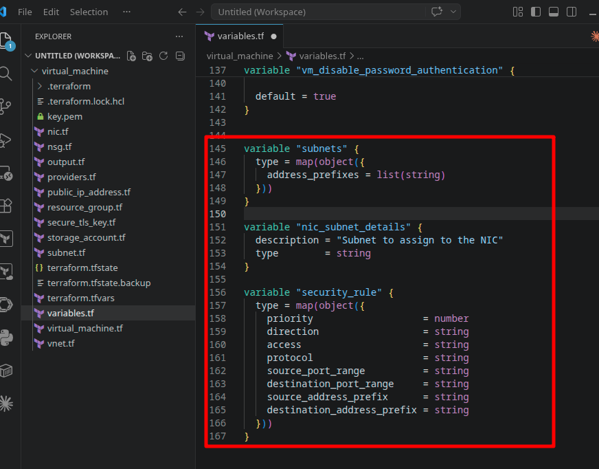
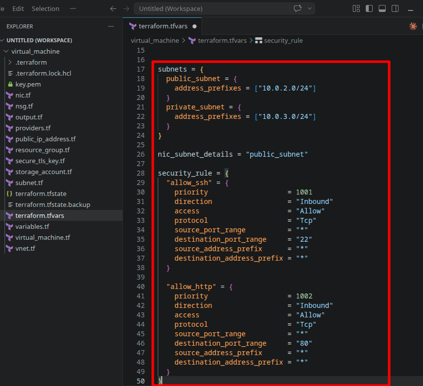
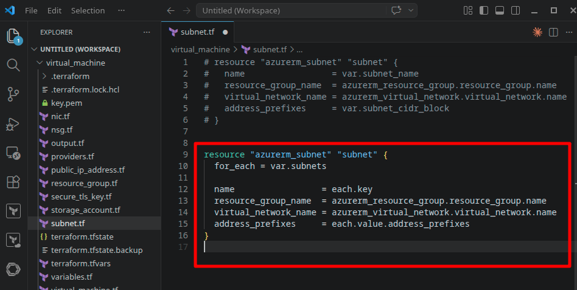
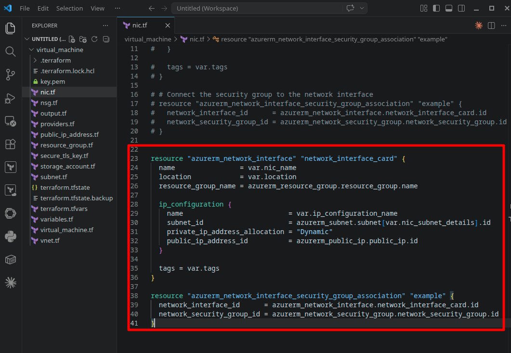
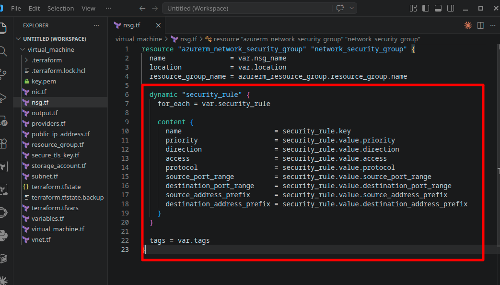
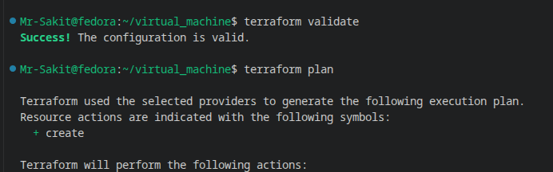
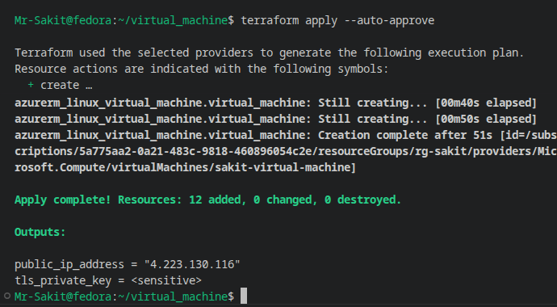
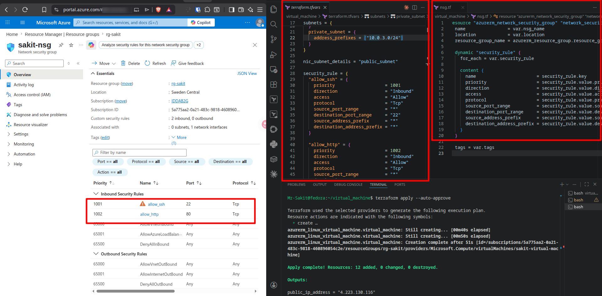
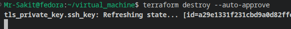

# Building Reusable Components in Terraform

## 📋 Overview

This lab extends the Azure Linux VM infrastructure from the [previous lab](../../day1/labExtra1-Provision%20an%20Azure%20Linux%20Virtual%20Machine%20-%20IH/) by introducing two powerful Terraform features: **`for_each`** for dynamic resource creation and **`dynamic` blocks** for repeatable nested configurations. Instead of duplicating resource blocks for every subnet or security rule, we refactor the code to iterate over maps — making the configuration scalable, maintainable, and DRY.

> [!NOTE]
> In the previous lab, we had one hardcoded subnet and two hardcoded NSG rules. This works, but adding a third subnet would mean copying an entire resource block, and adding a fifth security rule would mean adding another `security_rule` block inside the NSG. With `for_each` and `dynamic`, adding resources is as simple as adding an entry to a variable map — no new Terraform code needed.

---

## 🎯 Objectives

- Understand why `for_each` and `dynamic` blocks exist and what problems they solve
- Refactor the subnet resource to use `for_each` for creating multiple subnets dynamically
- Update the NIC to reference a specific subnet from the `for_each` map
- Refactor the NSG to use a `dynamic` block for generating multiple security rules
- Define complex variable types (`map(object({...}))`) for structured input data
- Deploy and verify the refactored infrastructure in Azure

---

## 🔧 Prerequisites

| Requirement | Details |
|---|---|
| **Terraform** | Installed on your system |
| **Azure CLI** | Installed and authenticated (`az login`) |
| **Azure Subscription** | Valid subscription with permissions to create VMs |
| **Previous Lab** | Completed [Provision an Azure Linux Virtual Machine](../../day1/labExtra1-Provision%20an%20Azure%20Linux%20Virtual%20Machine%20-%20IH/) |

> [!IMPORTANT]
> This lab builds directly on the `virtual_machine/` project from the previous lab. You will modify existing files (`subnet.tf`, `nsg.tf`, `nic.tf`, `variables.tf`, `terraform.tfvars`) rather than creating a new project from scratch.

---

## 📝 Lab Steps

### Starting Point

From the previous lab, the subnet and NSG looked like this — one hardcoded subnet and two hardcoded security rules:

```hcl
# subnet.tf (before)
resource "azurerm_subnet" "subnet" {
  name                 = var.subnet_name
  resource_group_name  = azurerm_resource_group.resource_group.name
  virtual_network_name = azurerm_virtual_network.virtual_network.name
  address_prefixes     = var.subnet_cidr_block
}

# nsg.tf (before)
resource "azurerm_network_security_group" "network_security_group" {
  name                = var.nsg_name
  location            = var.location
  resource_group_name = azurerm_resource_group.resource_group.name

  security_rule {
    name                       = "allow_ssh"
    priority                   = 1001
    direction                  = "Inbound"
    access                     = "Allow"
    protocol                   = "Tcp"
    source_port_range          = "*"
    destination_port_range     = "22"
    source_address_prefix      = "*"
    destination_address_prefix = "*"
  }

  tags = var.tags
}
```

---

### Task 1: Provision Multiple Subnets with `for_each`

#### Step 1 — Define a Variable for Subnets

Add a new variable in `variables.tf` that accepts a **map of objects**, where each key is a subnet name and each value contains the address prefixes:

```hcl
variable "subnets" {
  type = map(object({
    address_prefixes = list(string)
  }))
}
```



**Why `map(object(...))`?** A map lets us iterate with `for_each` where each key becomes the subnet name. The object type ensures each entry has the required `address_prefixes` field — Terraform will catch missing fields at validation time, not at apply time.

#### Step 2 — Pass Subnet Values in `terraform.tfvars`

```hcl
subnets = {
  public_subnet = {
    address_prefixes = ["10.0.2.0/24"]
  }
  private_subnet = {
    address_prefixes = ["10.0.3.0/24"]
  }
}
```



#### Step 3 — Update `subnet.tf` with `for_each`

Replace the single subnet resource with a dynamic version:

```hcl
resource "azurerm_subnet" "subnet" {
  for_each = var.subnets

  name                 = each.key
  resource_group_name  = azurerm_resource_group.resource_group.name
  virtual_network_name = azurerm_virtual_network.virtual_network.name
  address_prefixes     = each.value.address_prefixes
}
```



**How `for_each` works here:**
- `for_each = var.subnets` iterates over each entry in the subnets map
- `each.key` → the map key (`public_subnet`, `private_subnet`) — used as the subnet name
- `each.value.address_prefixes` → the value's `address_prefixes` field

This creates `azurerm_subnet.subnet["public_subnet"]` and `azurerm_subnet.subnet["private_subnet"]` — two distinct resource instances from a single resource block.

#### Step 4 — Fix NIC Configuration

With multiple subnets, `azurerm_subnet.subnet.id` is ambiguous — Terraform doesn't know which subnet you mean. Add a variable to specify which subnet the NIC should use:

In `variables.tf`:
```hcl
variable "nic_subnet_details" {
  description = "Subnet to assign to the NIC"
  type        = string
}
```

In `terraform.tfvars`:
```hcl
nic_subnet_details = "public_subnet"
```

Update `nic.tf` to reference the specific subnet by key:

```hcl
resource "azurerm_network_interface" "network_interface_card" {
  name                = var.nic_name
  location            = var.location
  resource_group_name = azurerm_resource_group.resource_group.name

  ip_configuration {
    name                          = var.ip_configuration_name
    subnet_id                     = azurerm_subnet.subnet[var.nic_subnet_details].id
    private_ip_address_allocation = "Dynamic"
    public_ip_address_id          = azurerm_public_ip.public_ip.id
  }

  tags = var.tags
}

resource "azurerm_network_interface_security_group_association" "example" {
  network_interface_id      = azurerm_network_interface.network_interface_card.id
  network_security_group_id = azurerm_network_security_group.network_security_group.id
}
```



> [!TIP]
> The syntax `azurerm_subnet.subnet[var.nic_subnet_details].id` uses the map key to select a specific instance from the `for_each` resource. This is how you reference one specific resource when `for_each` creates multiple instances.

Validate the changes:

```bash
terraform validate
```

---

### Task 2: Provision an NSG with Multiple Rules Using `dynamic`

#### Step 1 — Define a Variable for Security Rules

Add a variable in `variables.tf` that accepts a **map of objects**, where each key is a rule name and each value contains all the rule attributes:

```hcl
variable "security_rule" {
  type = map(object({
    priority                   = number
    direction                  = string
    access                     = string
    protocol                   = string
    source_port_range          = string
    destination_port_range     = string
    source_address_prefix      = string
    destination_address_prefix = string
  }))
}
```

#### Step 2 — Pass Security Rule Values in `terraform.tfvars`

```hcl
security_rule = {
  "allow_ssh" = {
    priority                   = 1001
    direction                  = "Inbound"
    access                     = "Allow"
    protocol                   = "Tcp"
    source_port_range          = "*"
    destination_port_range     = "22"
    source_address_prefix      = "*"
    destination_address_prefix = "*"
  }
  "allow_http" = {
    priority                   = 1002
    direction                  = "Inbound"
    access                     = "Allow"
    protocol                   = "Tcp"
    source_port_range          = "*"
    destination_port_range     = "80"
    source_address_prefix      = "*"
    destination_address_prefix = "*"
  }
}
```

#### Step 3 — Update `nsg.tf` with a `dynamic` Block

Replace the hardcoded `security_rule` blocks with a `dynamic` block:

```hcl
resource "azurerm_network_security_group" "network_security_group" {
  name                = var.nsg_name
  location            = var.location
  resource_group_name = azurerm_resource_group.resource_group.name

  dynamic "security_rule" {
    for_each = var.security_rule

    content {
      name                       = security_rule.key
      priority                   = security_rule.value.priority
      direction                  = security_rule.value.direction
      access                     = security_rule.value.access
      protocol                   = security_rule.value.protocol
      source_port_range          = security_rule.value.source_port_range
      destination_port_range     = security_rule.value.destination_port_range
      source_address_prefix      = security_rule.value.source_address_prefix
      destination_address_prefix = security_rule.value.destination_address_prefix
    }
  }

  tags = var.tags
}
```



**How `dynamic` differs from `for_each`:**

| Feature | `for_each` | `dynamic` |
|---|---|---|
| **Scope** | Creates multiple **resource instances** | Creates multiple **nested blocks** within a single resource |
| **Use case** | Multiple subnets, VMs, NICs | Multiple security rules, ingress rules, tags |
| **Reference syntax** | `each.key` / `each.value` | `<label>.key` / `<label>.value` |

> [!NOTE]
> Inside a `dynamic` block, you reference the iterator using the **block label** (here `security_rule`), not `each`. So it's `security_rule.key` and `security_rule.value`, not `each.key`. This is because `dynamic` blocks can be nested, and each level needs its own distinct iterator name.

---

### Step 4: Deploy and Verify

Run the Terraform workflow:

```bash
terraform validate
terraform plan
```



Apply the changes:

```bash
terraform apply --auto-approve
```



**Result:** `Apply complete! Resources: 12 added, 0 changed, 0 destroyed.`

#### Verify in Azure Portal

Navigate to **Azure Portal → Resource Groups → rg-sakit → sakit-nsg**:



The NSG shows **2 inbound custom security rules** — `allow_ssh` (priority 1001, port 22) and `allow_http` (priority 1002, port 80) — both generated dynamically from the `security_rule` variable map.

---

### Step 5: Clean Up Resources

```bash
terraform destroy --auto-approve
```



---

## 🏗️ Architecture

```
┌─────────────────────────────────────────────────────────────────┐
│                     Azure Resource Group                        │
│                       (rg-sakit)                                │
│                                                                 │
│  ┌───────────────────────────────────────────────┐              │
│  │         Virtual Network (devops-vnet)          │              │
│  │            10.0.0.0/16                         │              │
│  │                                                │              │
│  │  ┌──────────────────┐  ┌──────────────────┐   │              │
│  │  │  public_subnet   │  │  private_subnet  │   │              │
│  │  │  10.0.2.0/24     │  │  10.0.3.0/24     │   │              │
│  │  │                  │  │                  │   │              │
│  │  │  ┌────────────┐  │  │                  │   │              │
│  │  │  │ NIC ───► VM │  │  │  (available for  │   │              │
│  │  │  └────────────┘  │  │   future VMs)    │   │              │
│  │  └──────────────────┘  └──────────────────┘   │              │
│  └────────────────────────────────────────────────┘              │
│                                                                 │
│  ┌──────────────────────────────────┐                           │
│  │  NSG (sakit-nsg)                 │                           │
│  │  ┌─ dynamic "security_rule" ──┐  │                           │
│  │  │  allow_ssh   :22  (1001)   │  │                           │
│  │  │  allow_http  :80  (1002)   │  │                           │
│  │  │  + add more by extending   │  │                           │
│  │  │    the variable map        │  │                           │
│  │  └────────────────────────────┘  │                           │
│  └──────────────────────────────────┘                           │
└─────────────────────────────────────────────────────────────────┘

  for_each creates:                    dynamic creates:
  ┌────────────────────┐               ┌────────────────────┐
  │ Multiple RESOURCES │               │ Multiple BLOCKS    │
  │ (separate subnets) │               │ (within one NSG)   │
  └────────────────────┘               └────────────────────┘
```

---

## 📁 What Changed from the Previous Lab

| File | Change | Why |
|---|---|---|
| `variables.tf` | Added `subnets` (map of objects) | Enable `for_each` iteration for subnets |
| `variables.tf` | Added `nic_subnet_details` (string) | Specify which subnet the NIC should use |
| `variables.tf` | Added `security_rule` (map of objects) | Enable `dynamic` block iteration for NSG rules |
| `terraform.tfvars` | Added subnet map, NIC detail, security rule map | Provide values for the new variables |
| `subnet.tf` | Replaced single resource with `for_each` | Create multiple subnets from one block |
| `nic.tf` | Changed `subnet_id` to use map key lookup | Reference specific subnet instance |
| `nsg.tf` | Replaced hardcoded rules with `dynamic` block | Generate rules from variable map |

---

## 📊 Summary

| Task | Command / Action | Status |
|---|---|---|
| Define `subnets` variable | `map(object({...}))` in `variables.tf` | ✅ |
| Add subnet values | Public + private subnets in `terraform.tfvars` | ✅ |
| Refactor `subnet.tf` | `for_each = var.subnets` | ✅ |
| Add NIC subnet selector | `nic_subnet_details` variable → `public_subnet` | ✅ |
| Fix NIC subnet reference | `azurerm_subnet.subnet[var.nic_subnet_details].id` | ✅ |
| Define `security_rule` variable | `map(object({...}))` with 8 attributes | ✅ |
| Add security rule values | SSH + HTTP rules in `terraform.tfvars` | ✅ |
| Refactor `nsg.tf` | `dynamic "security_rule"` block | ✅ |
| Validate configuration | `terraform validate` → Success | ✅ |
| Deploy infrastructure | `terraform apply --auto-approve` → 12 added | ✅ |
| Verify in Azure Portal | NSG shows 2 dynamic rules, 2 subnets created | ✅ |
| Destroy resources | `terraform destroy --auto-approve` | ✅ |

---

## 💡 Key Takeaways

1. **`for_each` creates multiple resource instances** from a single resource block — each instance is addressed by its map key (e.g., `azurerm_subnet.subnet["public_subnet"]`). Adding a new subnet means adding one entry to the map, not duplicating Terraform code
2. **`dynamic` blocks create multiple nested blocks** within a single resource — they solve the same "don't repeat yourself" problem, but at the block level rather than the resource level. An NSG with 10 rules still has one resource block
3. **`map(object({...}))` is the right variable type** for both patterns — it enforces a consistent schema for each entry and provides meaningful keys for referencing specific instances
4. **When `for_each` creates multiple instances, references become ambiguous** — you can't use `azurerm_subnet.subnet.id` anymore because there are multiple subnets. You must specify which one: `azurerm_subnet.subnet["public_subnet"].id`
5. **`dynamic` uses the block label as the iterator name**, not `each` — inside `dynamic "security_rule"`, you use `security_rule.key` and `security_rule.value`. This is deliberate: it allows nested dynamics with distinct iterators
6. **These patterns make infrastructure configuration data-driven** — the Terraform code defines the *shape* of resources, while variables define the *content*. Adding a new subnet or security rule becomes a data change, not a code change
7. **`for_each` and `dynamic` serve different scopes** — use `for_each` when you need multiple separate resources (subnets, VMs, disks) and `dynamic` when you need multiple blocks inside one resource (rules, tags, ingress)
8. **This refactoring is backward-compatible** — the infrastructure created is functionally identical to the previous lab, but the code is now ready to scale without duplication
