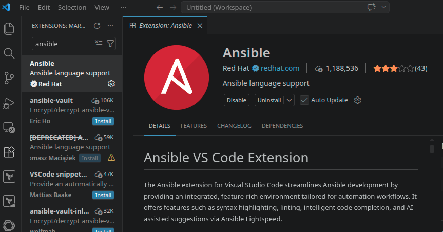

# Installing and Setting Up Ansible

## 📋 Overview

This lab walks through installing Ansible — an agentless automation tool — on different operating systems and setting up the development environment. Ansible runs from a single host called the **control node** and connects to remote machines over SSH, requiring no agent software on the target servers.

> [!NOTE]
> Ansible is agentless — it only needs to be installed on the **control node**. Managed nodes (the servers you automate) only need SSH and Python. This is one of Ansible's biggest advantages over tools like Puppet or Chef, which require agents on every managed machine.

---

## 🎯 Objectives

- Install Ansible on macOS, Ubuntu, or via Python pip
- Verify the Ansible installation with `ansible --version`
- Understand platform limitations (Windows cannot be a control node)
- Install the Ansible VS Code extension for improved development experience

---

## 🔧 Prerequisites

| Requirement | Details |
|---|---|
| **Operating System** | macOS, Ubuntu/Debian Linux, or any system with Python 3 |
| **SSH Access** | Ability to connect to remote VMs |
| **Python 3** | Required for pip-based installation |

---

## 📝 Lab Steps

### Option 1: Installing Ansible on macOS

Install Ansible using Homebrew:

```bash
brew install ansible
```

Verify the installation:

```bash
ansible --version
```

---

### Option 2: Installing Ansible on Ubuntu

Connect to your Ubuntu VM via SSH, then run the following commands:

```bash
# Update package list and install prerequisites
sudo apt update
sudo apt install software-properties-common

# Add the official Ansible PPA
sudo add-apt-repository --yes --update ppa:ansible/ansible

# Install Ansible
sudo apt install ansible --yes

# Verify installation
ansible --version
```

---

### Option 3: Installing Ansible with pip (Python)

Since Ansible is written in Python, it can be installed using pip on any platform.

**Step 1 — Verify Python installation:**

```bash
python3 --version
```

If Python is not installed, download and install it from [python.org](https://www.python.org/downloads/).

**Step 2 — Verify pip availability:**

```bash
python3 -m pip -V
```

If pip is not available, install it:

```bash
curl https://bootstrap.pypa.io/get-pip.py -o get-pip.py
python3 get-pip.py --user
```

**Step 3 — Install Ansible:**

```bash
python3 -m pip install --user ansible
```

If you see PATH warnings, update your shell profile:

```bash
export PATH="$PATH:/home/<your-username>/.local/bin"
source ~/.bashrc
```

Verify the installation:

```bash
ansible --version
```

> [!TIP]
> The pip method works on any OS with Python 3 and gives you the most control over versioning. It's especially useful when you need a specific Ansible version or want to install it in a virtual environment.

---

### Option 4: Ansible on Fedora/RHEL

In this lab, Ansible was installed on a Fedora control node using `dnf`:

```bash
sudo dnf install ansible -y
```

![Ansible installation on Fedora via dnf and version verification — ansible [core 2.18.12]](Screenshots/Screenshot_20260427_145600.png)

The output confirms **Ansible core 2.18.12** is installed along with its dependencies (ansible-core, python3-jinja2, python3-markupsafe, python3-resolvelib), running on **Python 3.14.4**.

---

### Windows Users

> [!IMPORTANT]
> Windows **cannot** serve as an Ansible control node. If you're on Windows, provision a Linux VM (e.g., on Azure) as your control node. You can write playbooks locally, push them to Git, and pull/clone them on your Linux control node to execute.

---

### Setting Up the Ansible VS Code Extension

To improve the development experience when writing Ansible playbooks:

1. Open **VS Code**
2. Go to **Extensions** (Ctrl+Shift+X)
3. Search for **Ansible**
4. Install the official **Ansible** extension by **Red Hat**



The extension provides:
- **Syntax highlighting** for YAML playbooks
- **Linting** to catch errors before execution
- **Intelligent code completion** for modules and parameters
- **AI-assisted suggestions** via Ansible Lightspeed

---

## 🏗️ Architecture

```
┌─────────────────────────────────────────────────────────────┐
│                     Control Node                             │
│              (Fedora / Ubuntu / macOS)                        │
│                                                              │
│  ┌──────────────┐  ┌──────────────┐  ┌──────────────────┐   │
│  │   Ansible     │  │   Python 3   │  │  VS Code +       │   │
│  │   Core        │  │   Runtime    │  │  Ansible Ext.    │   │
│  └──────┬───────┘  └──────────────┘  └──────────────────┘   │
│         │                                                    │
│         │  SSH (no agents needed)                            │
│         │                                                    │
├─────────┼────────────────────────────────────────────────────┤
│         ▼                                                    │
│  ┌──────────────┐  ┌──────────────┐  ┌──────────────────┐   │
│  │ Managed Node │  │ Managed Node │  │ Managed Node     │   │
│  │   (VM 1)     │  │   (VM 2)     │  │   (VM N)         │   │
│  │  SSH + Python │  │  SSH + Python │  │  SSH + Python    │   │
│  └──────────────┘  └──────────────┘  └──────────────────┘   │
│                     Managed Nodes                            │
└─────────────────────────────────────────────────────────────┘
```

---

## 📊 Summary

| Task | Command / Action | Status |
|---|---|---|
| Install Ansible (Fedora) | `sudo dnf install ansible -y` | ✅ |
| Verify installation | `ansible --version` → core 2.18.12 | ✅ |
| Install VS Code extension | Ansible extension by Red Hat | ✅ |
| Confirm Python runtime | Python 3.14.4 | ✅ |

---

## 💡 Key Takeaways

1. **Ansible is agentless** — it only needs to be installed on the control node. Managed nodes only need SSH and Python, making setup significantly simpler than agent-based tools
2. **Multiple installation methods exist** — Homebrew (macOS), APT with PPA (Ubuntu), DNF (Fedora/RHEL), or pip (any platform with Python 3). Choose based on your OS and version requirements
3. **Windows cannot be a control node** — use a Linux VM instead. You can still write playbooks on Windows and execute them from a Linux control node
4. **The VS Code Ansible extension is highly recommended** — it provides syntax highlighting, linting, and intelligent code completion that dramatically reduce errors when writing YAML playbooks
5. **Verifying installation with `ansible --version`** confirms not just the Ansible version but also the Python interpreter, config file location, and module paths — useful for debugging later
