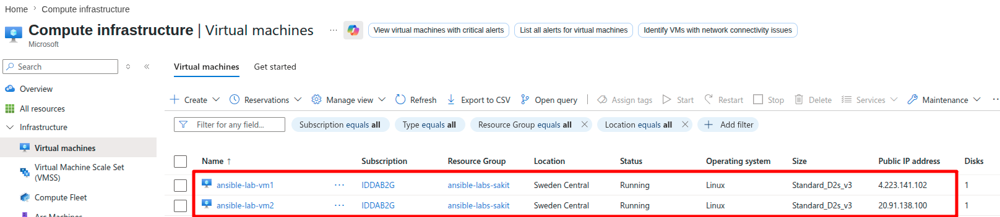
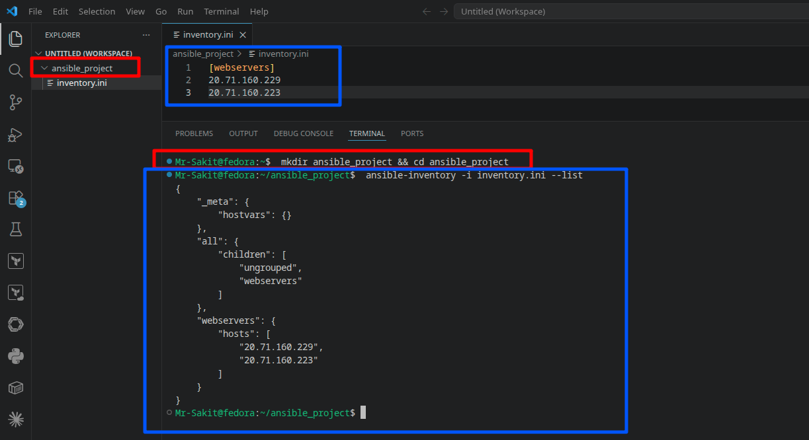
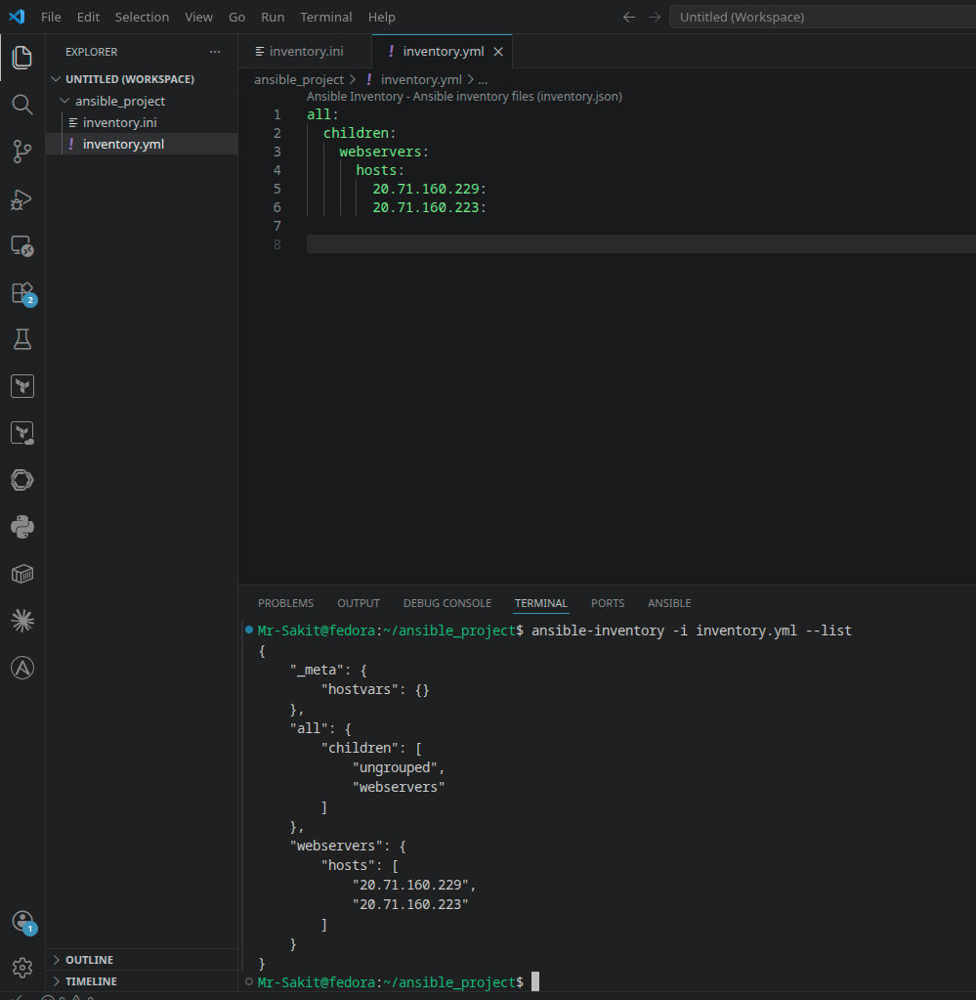
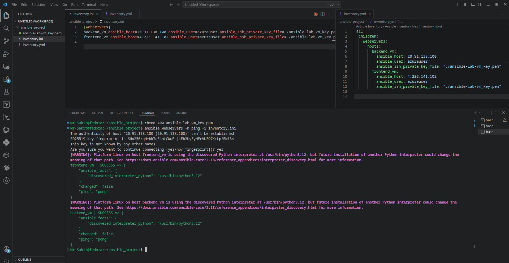
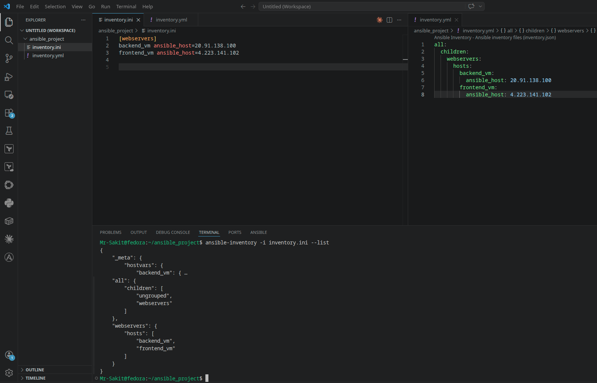
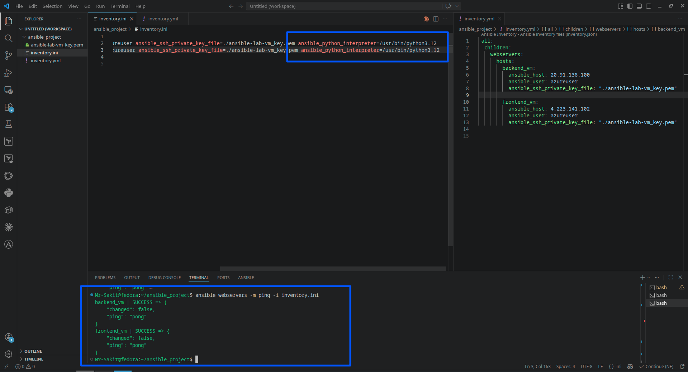

# Ansible Inventory File

## 📋 Overview

This lab covers how to create and use Ansible **inventory files** — the configuration that tells Ansible which servers to manage and how to connect to them. The lab progresses from basic IP-only inventories to production-ready configurations with aliases, SSH key authentication, and Python interpreter settings.

> [!NOTE]
> An inventory file is the first thing you create in any Ansible project. It answers three questions: **what** machines to manage, **how** to group them, and **how** to connect to them (SSH user, key, port, etc.).

---

## 🎯 Objectives

- Create inventory files in both **INI** and **YAML** formats
- Understand inventory syntax and host grouping
- Add **host aliases** for readability
- Configure **SSH key-based** and **password-based** authentication
- Verify inventory files and test connectivity with `ansible -m ping`

---

## 🔧 Prerequisites

| Requirement | Details |
|---|---|
| **Ansible** | Installed on a control node ([Lab 1](../lab1-Installing%20and%20Setting%20Up%20Ansible/)) |
| **Managed Nodes** | At least two Linux VMs with SSH enabled |
| **SSH Access** | Verified SSH connectivity from control node to managed nodes |

> [!IMPORTANT]
> Before running any Ansible commands, **manually SSH into each managed node at least once** from the control node. This adds the hosts to `~/.ssh/known_hosts` and prevents Ansible from hanging on the host key confirmation prompt.

---

## 📝 Lab Steps

### Environment Setup

Two Azure VMs were provisioned as managed nodes:



| VM | Public IP | OS | Size |
|---|---|---|---|
| ansible-lab-vm1 | 4.223.141.102 | Linux (Ubuntu) | Standard_D2s_v3 |
| ansible-lab-vm2 | 20.91.138.100 | Linux (Ubuntu) | Standard_D2s_v3 |

---

### Step 1: Basic Inventory in INI Format

Create a project folder and inventory file:

```bash
mkdir ansible_project && cd ansible_project
```

Create `inventory.ini` with IP addresses under a group:

```ini
[webservers]
20.71.160.229
20.71.160.223
```

`[webservers]` defines a **host group**. Each line under it is a host identified by IP or FQDN.

Verify the inventory:

```bash
ansible-inventory -i inventory.ini --list
```



---

### Step 2: Basic Inventory in YAML Format

Create `inventory.yml` as an alternative:

```yaml
all:
  children:
    webservers:
      hosts:
        20.71.160.229:
        20.71.160.223:
```

- `all:` — top-level group (every host belongs to `all`)
- `children:` — contains subgroups
- `webservers:` — a subgroup listing target hosts

Verify:

```bash
ansible-inventory -i inventory.yml --list
```



---

### Step 3: Adding Host Aliases

Aliases make inventory files readable and self-documenting.

**INI format:**

```ini
[webservers]
backend_vm ansible_host=20.91.138.100
frontend_vm ansible_host=4.223.141.102
```

**YAML format:**

```yaml
all:
  children:
    webservers:
      hosts:
        backend_vm:
          ansible_host: 20.91.138.100
        frontend_vm:
          ansible_host: 4.223.141.102
```



> [!TIP]
> Always use aliases in production inventories. Names like `web-prod-01` are far more useful than raw IPs in playbook output and logs.

---

### Step 4: Adding SSH Key Authentication

Copy your private key into the project folder and secure it:

```bash
chmod 400 ansible-lab-vm_key.pem
```

Update `inventory.ini`:

```ini
[webservers]
backend_vm ansible_host=20.91.138.100 ansible_user=azureuser ansible_ssh_private_key_file=./ansible-lab-vm_key.pem
frontend_vm ansible_host=4.223.141.102 ansible_user=azureuser ansible_ssh_private_key_file=./ansible-lab-vm_key.pem
```

Update `inventory.yml`:

```yaml
all:
  children:
    webservers:
      hosts:
        backend_vm:
          ansible_host: 20.91.138.100
          ansible_user: azureuser
          ansible_ssh_private_key_file: "./ansible-lab-vm_key.pem"
        frontend_vm:
          ansible_host: 4.223.141.102
          ansible_user: azureuser
          ansible_ssh_private_key_file: "./ansible-lab-vm_key.pem"
```

Test SSH connectivity:

```bash
ansible webservers -m ping -i inventory.ini
```



Both `frontend_vm` and `backend_vm` return `SUCCESS` with `"ping": "pong"`.

---

### Step 5: Fixing Python Interpreter Warnings

Add `ansible_python_interpreter` to suppress discovery warnings:

```ini
backend_vm ansible_host=20.91.138.100 ansible_user=azureuser ansible_ssh_private_key_file=./ansible-lab-vm_key.pem ansible_python_interpreter=/usr/bin/python3.12
```



---

### Alternative: Password-Based Authentication

```ini
[webservers]
backend_vm ansible_host=20.71.160.229 ansible_user=azureuser ansible_ssh_pass=yourpassword
frontend_vm ansible_host=20.71.160.223 ansible_user=azureuser ansible_ssh_pass=yourpassword
```

> [!WARNING]
> Storing passwords in plain text is a security risk. Use **Ansible Vault** for encryption or prefer SSH key-based authentication.

---

## 🏗️ Architecture

```
┌──────────────────────────────────────────────────────────────┐
│                   Control Node (Fedora)                       │
│                                                               │
│  ansible_project/                                            │
│  ├── inventory.ini          ← INI format                     │
│  ├── inventory.yml          ← YAML format                    │
│  └── ansible-lab-vm_key.pem ← SSH key (chmod 400)           │
│                          │                                    │
│              ┌───────────┴───────────┐                       │
│              ▼                       ▼                       │
│  ┌───────────────────┐  ┌───────────────────┐               │
│  │   backend_vm       │  │   frontend_vm      │               │
│  │  20.91.138.100     │  │  4.223.141.102     │               │
│  │  "ping": "pong" ✅ │  │  "ping": "pong" ✅ │               │
│  └───────────────────┘  └───────────────────┘               │
└──────────────────────────────────────────────────────────────┘
```

---

## 📊 Summary

| Task | Command / Action | Status |
|---|---|---|
| Create INI inventory | `[webservers]` group with IPs | ✅ |
| Create YAML inventory | `all: children: webservers:` structure | ✅ |
| Add host aliases | `backend_vm`, `frontend_vm` with `ansible_host` | ✅ |
| Configure SSH key auth | `ansible_user` + `ansible_ssh_private_key_file` | ✅ |
| Fix Python warnings | `ansible_python_interpreter=/usr/bin/python3.12` | ✅ |
| Test connectivity | `ansible webservers -m ping` → SUCCESS | ✅ |

---

## 💡 Key Takeaways

1. **Inventory files are mandatory** — they define the "who" in Ansible automation
2. **INI and YAML are interchangeable** — INI is simpler for small inventories; YAML scales better for complex setups
3. **Host aliases improve readability** — `backend_vm` is more meaningful than `20.91.138.100` in logs and output
4. **SSH key authentication is preferred** — more secure than storing passwords in plain text
5. **`ansible_python_interpreter`** prevents version discovery warnings and ensures correct Python usage on managed nodes
6. **Always verify before running playbooks** — `ansible-inventory --list` shows what Ansible sees, `ansible -m ping` confirms connectivity
7. **`chmod 400` on private keys is mandatory** — SSH refuses keys with overly permissive permissions
