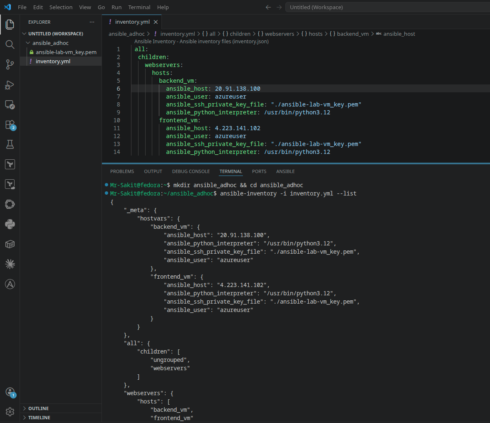
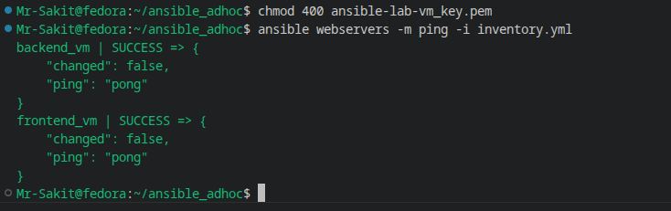
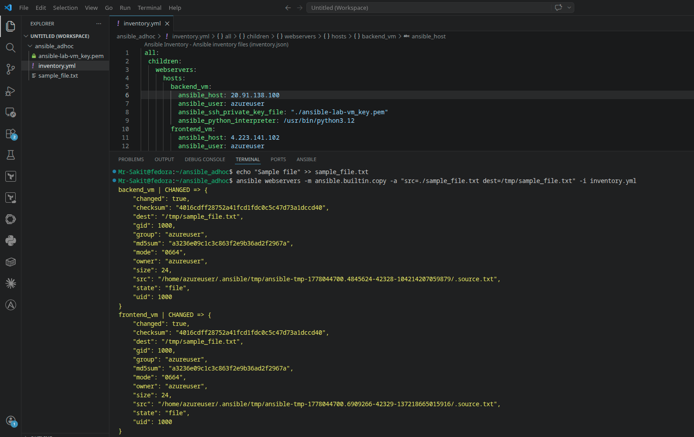
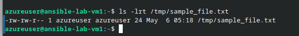
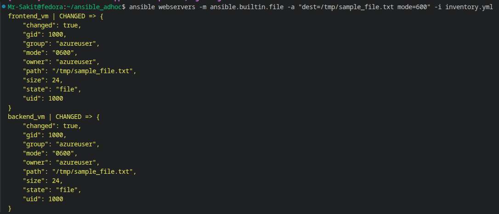
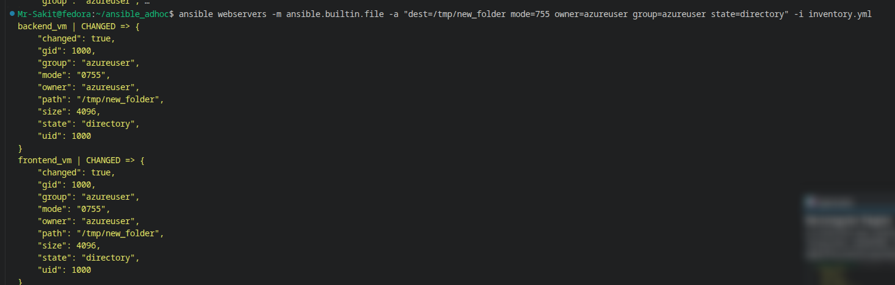
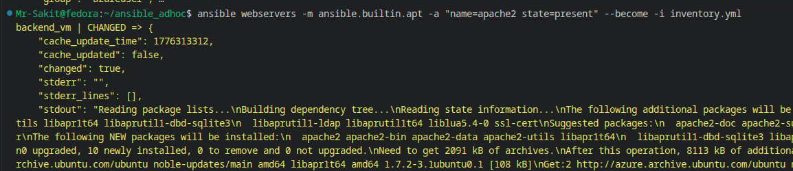
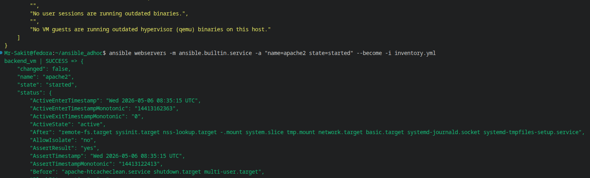
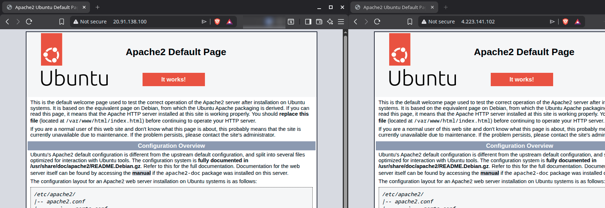
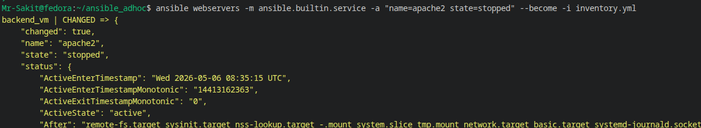

# Learning Ad hoc Commands in Ansible

## 📋 Overview

This lab introduces Ansible **ad hoc commands** — single-use commands executed directly from the terminal to perform quick tasks on remote servers. While not reusable like playbooks, ad hoc commands demonstrate how simple and powerful Ansible modules are. Every concept practiced here (modules, patterns, arguments) carries over directly when writing playbooks.

> [!NOTE]
> Think of ad hoc commands as the "one-liners" of Ansible. They're perfect for quick checks (`ping`), one-time file transfers (`copy`), or emergency fixes (`service restart`). For repeatable automation, you'll use playbooks — but ad hoc commands are invaluable for day-to-day sysadmin tasks.

---

## 🎯 Objectives

- Understand ad hoc command syntax and when to use them
- Use modules: `ping`, `copy`, `file`, `apt`, and `service`
- Transfer files to remote servers
- Change file permissions and create directories
- Install packages and manage services remotely

---

## 🔧 Prerequisites

| Requirement | Details |
|---|---|
| **Ansible** | Installed on a control node ([Lab 1](../lab1-Installing%20and%20Setting%20Up%20Ansible/)) |
| **Inventory File** | Configured with managed nodes ([Lab 2](../lab2-Ansible%20Inventory%20File/)) |
| **Managed Nodes** | At least two Linux VMs with SSH enabled |
| **SSH Access** | Working SSH from control node to managed nodes |

---

## 📝 Lab Steps

### Ad hoc Command Syntax

```
ansible [pattern] -m [module] -a "[module options]" -i [inventory]
```

| Component | Description |
|---|---|
| `[pattern]` | Group or host from inventory (e.g., `webservers`, `all`) |
| `-m [module]` | Ansible module to execute |
| `-a "[options]"` | Arguments for the module |
| `--become` | Run with elevated privileges (sudo) |

---

### Step 1: Set Up the Working Directory

```bash
mkdir ansible_adhoc && cd ansible_adhoc
```

Copy the SSH key and set permissions:

```bash
chmod 400 ansible-lab-vm_key.pem
```

Create `inventory.yml`:

```yaml
all:
  children:
    webservers:
      hosts:
        backend_vm:
          ansible_host: 20.91.138.100
          ansible_user: azureuser
          ansible_ssh_private_key_file: "./ansible-lab-vm_key.pem"
          ansible_python_interpreter: /usr/bin/python3.12
        frontend_vm:
          ansible_host: 4.223.141.102
          ansible_user: azureuser
          ansible_ssh_private_key_file: "./ansible-lab-vm_key.pem"
          ansible_python_interpreter: /usr/bin/python3.12
```



---

### Step 2: Test SSH Connectivity

```bash
ansible webservers -m ping -i inventory.yml
```



Both servers return `SUCCESS` — Ansible can reach and authenticate with the managed nodes.

---

### Step 3: Transferring Files with `copy`

Create a sample file and copy it to all servers:

```bash
echo "Sample file" >> sample_file.txt

ansible webservers -m ansible.builtin.copy \
  -a "src=./sample_file.txt dest=/tmp/sample_file.txt" \
  -i inventory.yml
```



Both servers show `CHANGED` — the file was successfully transferred to `/tmp/sample_file.txt`.

**Verify on a managed node:**

```bash
ssh -i ansible-lab-vm_key.pem azureuser@<IP>
ls -lrt /tmp/sample_file.txt
```



---

### Step 4: Changing File Permissions with `file`

```bash
ansible webservers -m ansible.builtin.file \
  -a "dest=/tmp/sample_file.txt mode=600" \
  -i inventory.yml
```



The `mode` field changed from `0664` to `0600` — now only the owner can read/write the file.

---

### Step 5: Creating Directories with `file`

```bash
ansible webservers -m ansible.builtin.file \
  -a "dest=/tmp/new_folder mode=755 owner=azureuser group=azureuser state=directory" \
  -i inventory.yml
```



The `state=directory` parameter tells Ansible to create a directory rather than a file.

---

### Step 6: Installing Packages with `apt`

Install Apache2 on all webservers:

```bash
ansible webservers -m ansible.builtin.apt \
  -a "name=apache2 state=present" \
  --become -i inventory.yml
```



- `state=present` ensures Apache2 is installed (idempotent — won't reinstall if already present)
- `--become` runs the command with root privileges (required for package management)

---

### Step 7: Managing Services with `service`

**Start Apache:**

```bash
ansible webservers -m ansible.builtin.service \
  -a "name=apache2 state=started" \
  --become -i inventory.yml
```



**Verify in browser** (ensure port 80 is open on both VMs):



Both VMs show the **Apache2 Ubuntu Default Page** — confirming the web server is running and accessible.

**Stop Apache:**

```bash
ansible webservers -m ansible.builtin.service \
  -a "name=apache2 state=stopped" \
  --become -i inventory.yml
```



---

## 🏗️ Architecture

```
┌──────────────────────────────────────────────────────────┐
│                Control Node (Fedora)                      │
│                                                           │
│  ansible_adhoc/                                          │
│  ├── inventory.yml                                       │
│  ├── ansible-lab-vm_key.pem                              │
│  └── sample_file.txt                                     │
│                     │                                     │
│    ansible webservers -m <module> -a "<args>"             │
│                     │                                     │
│         ┌───────────┴───────────┐                        │
│         ▼                       ▼                        │
│  ┌─────────────┐        ┌─────────────┐                 │
│  │ backend_vm  │        │ frontend_vm │                  │
│  │             │        │             │                  │
│  │ ✅ ping     │        │ ✅ ping     │                  │
│  │ ✅ copy     │        │ ✅ copy     │                  │
│  │ ✅ file     │        │ ✅ file     │                  │
│  │ ✅ apt      │        │ ✅ apt      │                  │
│  │ ✅ service  │        │ ✅ service  │                  │
│  └─────────────┘        └─────────────┘                 │
└──────────────────────────────────────────────────────────┘
```

---

## 📊 Summary

| Task | Command | Status |
|---|---|---|
| Test connectivity | `ansible webservers -m ping` | ✅ |
| Transfer files | `copy` module → `/tmp/sample_file.txt` | ✅ |
| Change permissions | `file` module → `mode=600` | ✅ |
| Create directories | `file` module → `state=directory` | ✅ |
| Install Apache2 | `apt` module → `state=present --become` | ✅ |
| Start Apache2 | `service` module → `state=started` | ✅ |
| Verify in browser | Apache2 default page on both IPs | ✅ |
| Stop Apache2 | `service` module → `state=stopped` | ✅ |

---

## 💡 Key Takeaways

1. **Ad hoc commands are for quick, one-off tasks** — use them for file transfers, service restarts, or package installs when a full playbook would be overkill
2. **Modules are the building blocks** — `copy`, `file`, `apt`, `service` are the same modules used in playbooks. Learning them here makes playbook writing easier
3. **`--become` is required for privileged operations** — package installation and service management need root access
4. **Ansible is idempotent** — running `apt state=present` twice won't reinstall the package; running `service state=started` on a running service shows `SUCCESS` not `CHANGED`
5. **The `file` module is versatile** — it handles permissions, ownership, and directory creation with the `state` parameter
6. **Ad hoc commands use the same inventory** — the same `inventory.yml` from Lab 2 works here, and the same patterns (`webservers`, `all`) target the same hosts
