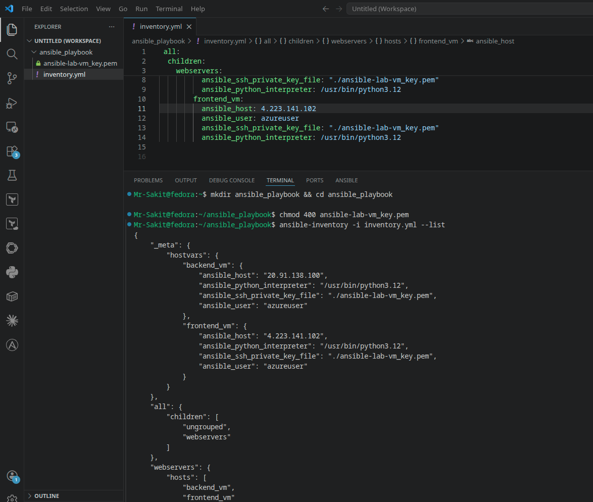
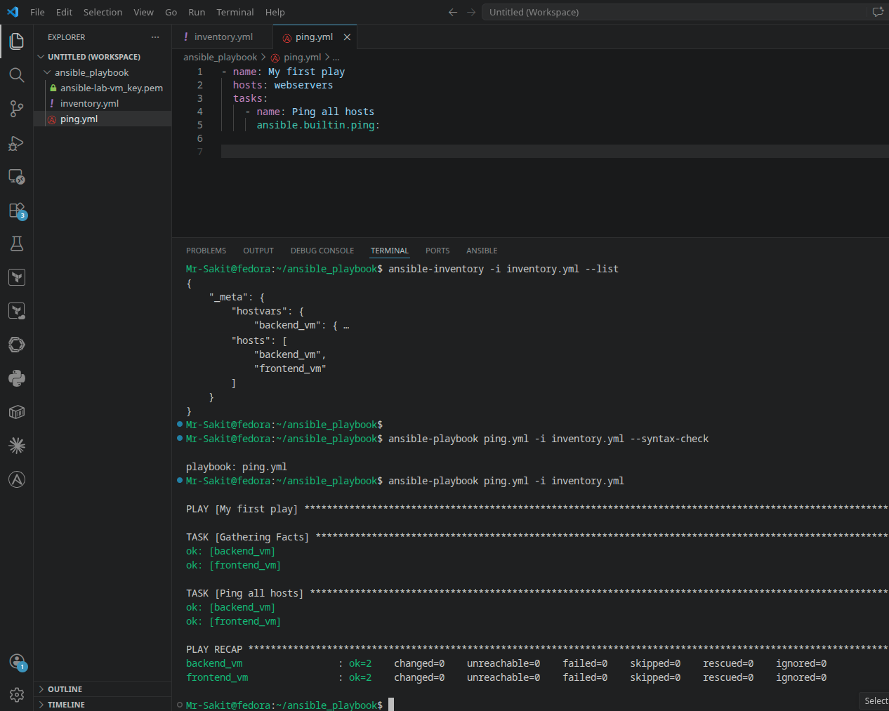

# Create Your First Ansible Playbook

## 📋 Overview

This lab walks through writing and executing your very first Ansible **playbook**. While ad hoc commands ([Lab 3](../lab3-Learning%20Ad%20hoc%20Commands%20in%20Ansible/)) are great for one-off tasks, playbooks are **reusable, version-controllable YAML files** that define a series of tasks to run on remote servers. This lab uses a simple `ping` playbook to introduce playbook structure, syntax checking, execution, and output interpretation.

> [!NOTE]
> A playbook is the difference between typing commands manually and having a script that anyone on your team can run to get the same result. Even this simple ping playbook demonstrates the core structure: **plays** contain **tasks**, tasks use **modules**, and the inventory defines the **targets**.

---

## 🎯 Objectives

- Understand the syntax and structure of an Ansible playbook
- Write a simple playbook using the `ping` module
- Check playbook syntax before execution
- Execute playbooks on remote servers and interpret the output
- Understand Gathering Facts, task status, and Play Recap

---

## 🔧 Prerequisites

| Requirement | Details |
|---|---|
| **Ansible** | Installed on a control node ([Lab 1](../lab1-Installing%20and%20Setting%20Up%20Ansible/)) |
| **Inventory File** | Configured with managed nodes ([Lab 2](../lab2-Ansible%20Inventory%20File/)) |
| **Managed Nodes** | Two VMs with SSH enabled |
| **SSH Access** | Verified connectivity from control node |

---

## 📝 Lab Steps

### Step 1: Create an Inventory File

Create a new working directory:

```bash
mkdir ansible_playbook && cd ansible_playbook
```

Copy your SSH key and set permissions:

```bash
chmod 400 ansible-lab-vm_key.pem
```

Create `inventory.yml`:

```yaml
all:
  children:
    webservers:
      hosts:
        backend_vm:
          ansible_host: 20.91.138.100
          ansible_user: azureuser
          ansible_ssh_private_key_file: "./ansible-lab-vm_key.pem"
          ansible_python_interpreter: /usr/bin/python3.12
        frontend_vm:
          ansible_host: 4.223.141.102
          ansible_user: azureuser
          ansible_ssh_private_key_file: "./ansible-lab-vm_key.pem"
          ansible_python_interpreter: /usr/bin/python3.12
```

Verify the inventory:

```bash
ansible-inventory -i inventory.yml --list
```



---

### Step 2: Create Your First Playbook

Create a new file called `ping.yml`:

```yaml
- name: My first play
  hosts: webservers
  tasks:
    - name: Ping all hosts
      ansible.builtin.ping:
```

**Playbook anatomy:**

| Element | Purpose |
|---|---|
| `name:` | Describes the play — printed in output for clarity |
| `hosts:` | Specifies the target group from the inventory |
| `tasks:` | List of actions Ansible should perform |
| `ansible.builtin.ping:` | The module to execute (tests connectivity) |

> [!TIP]
> Always use clear, descriptive names for plays and tasks. These names appear in the execution output and make debugging much easier — especially when playbooks grow to dozens of tasks.

---

### Step 3: Check the Playbook Syntax

Before executing, always validate for syntax errors:

```bash
ansible-playbook ping.yml -i inventory.yml --syntax-check
```

If the syntax is correct, Ansible prints:

```
playbook: ping.yml
```

---

### Step 4: Run the Playbook

Execute the playbook:

```bash
ansible-playbook ping.yml -i inventory.yml
```



---

### Step 5: Understand the Output

The playbook output has several sections:

**1. PLAY** — shows the play name:
```
PLAY [My first play] ****************************************************
```

**2. TASK [Gathering Facts]** — Ansible automatically collects system details from each host before running tasks:
```
TASK [Gathering Facts] ***************************************************
ok: [backend_vm]
ok: [frontend_vm]
```

**3. TASK [Ping all hosts]** — the actual task execution:
```
TASK [Ping all hosts] ****************************************************
ok: [backend_vm]
ok: [frontend_vm]
```

**4. PLAY RECAP** — summarizes results per host:
```
backend_vm   : ok=2    changed=0    unreachable=0    failed=0    skipped=0
frontend_vm  : ok=2    changed=0    unreachable=0    failed=0    skipped=0
```

| Status | Meaning |
|---|---|
| `ok=2` | Two tasks ran successfully (Gathering Facts + Ping) |
| `changed=0` | No changes were made to the servers |
| `unreachable=0` | No connection failures |
| `failed=0` | No task failures |

---

## 🏗️ Architecture

```
┌──────────────────────────────────────────────────────────┐
│                Control Node (Fedora)                      │
│                                                           │
│  ansible_playbook/                                       │
│  ├── inventory.yml      ← Target hosts                   │
│  ├── ping.yml           ← Playbook                       │
│  └── ansible-lab-vm_key.pem                              │
│                     │                                     │
│  ansible-playbook ping.yml -i inventory.yml              │
│                     │                                     │
│         ┌───────────┴───────────┐                        │
│         ▼                       ▼                        │
│  ┌─────────────┐        ┌─────────────┐                 │
│  │ backend_vm  │        │ frontend_vm │                  │
│  │ ok=2 ✅     │        │ ok=2 ✅     │                  │
│  └─────────────┘        └─────────────┘                 │
└──────────────────────────────────────────────────────────┘
```

---

## 📁 Files Created

| File | Purpose |
|---|---|
| `inventory.yml` | YAML inventory with two managed nodes |
| `ping.yml` | First Ansible playbook using the ping module |
| `ansible-lab-vm_key.pem` | SSH private key (mode 400) |

---

## 📊 Summary

| Task | Command / Action | Status |
|---|---|---|
| Create inventory | `inventory.yml` with backend_vm + frontend_vm | ✅ |
| Write playbook | `ping.yml` targeting `webservers` group | ✅ |
| Syntax check | `ansible-playbook --syntax-check` → passed | ✅ |
| Execute playbook | `ansible-playbook ping.yml -i inventory.yml` | ✅ |
| Review output | `ok=2, changed=0, failed=0` on both hosts | ✅ |

---

## 💡 Key Takeaways

1. **Playbooks are YAML files** that define plays → tasks → modules in a declarative structure. They're reusable, version-controllable, and shareable
2. **Always syntax-check before running** — `--syntax-check` catches YAML errors (indentation, missing colons) before they hit production
3. **Gathering Facts is automatic** — Ansible collects system information (OS, IP, memory) from each host before running tasks. This adds a task to the count (`ok=2` for one explicit task)
4. **Play Recap is your dashboard** — it shows at a glance whether everything succeeded. `failed=0` and `unreachable=0` is what you want
5. **Playbooks scale where ad hoc commands don't** — a single playbook can contain multiple plays, each targeting different host groups with different tasks
6. **The `hosts` field links playbooks to inventory** — `hosts: webservers` tells Ansible to run this play only on hosts in the `webservers` group
