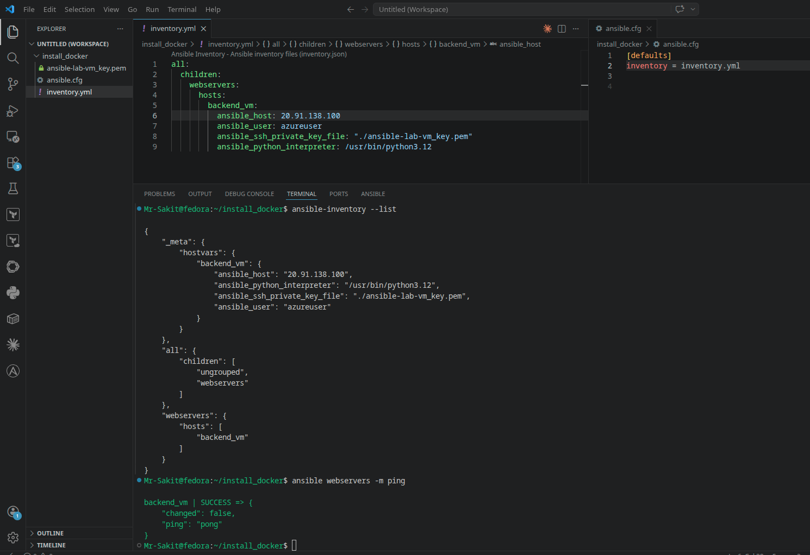
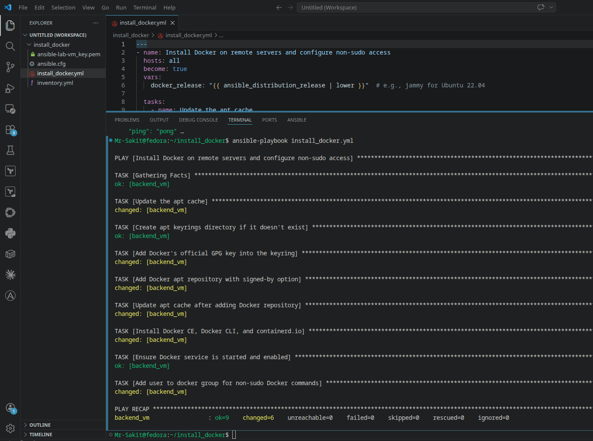
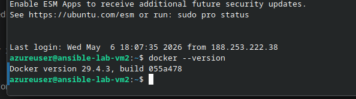

# Create an Ansible Playbook to Install Docker on Remote Servers

## 📋 Overview

This lab builds on the playbook fundamentals from [Lab 4](../lab4-Create%20Your%20First%20Ansible%20Playbook/) by writing a **real-world, multi-step playbook** that installs Docker on a remote server. Instead of a simple ping test, this playbook chains 8 tasks together — from updating packages to configuring non-sudo Docker access — demonstrating how Ansible automates complex, multi-step installations in a consistent and repeatable way.

> [!NOTE]
> Installing Docker manually requires running 8+ commands in the correct order, handling GPG keys, adding repositories, and configuring user groups. One missed step or wrong order breaks the install. This playbook encodes all those steps into a single file that can be run on any number of servers simultaneously.

---

## 🎯 Objectives

- Write a multi-task Ansible playbook for a real-world use case
- Install Docker CE, Docker CLI, and containerd.io via Ansible automation
- Use `ansible.cfg` to set default inventory
- Understand privilege escalation with `become: true`
- Use Ansible variables and facts (`ansible_distribution_release`)

---

## 🔧 Prerequisites

| Requirement | Details |
|---|---|
| **Ansible** | Installed on a control node ([Lab 1](../lab1-Installing%20and%20Setting%20Up%20Ansible/)) |
| **Managed Node** | At least one Ubuntu VM with SSH enabled |
| **SSH Access** | Verified connectivity from control node |
| **Previous Labs** | Familiarity with inventory files and playbook basics |

---

## 📝 Lab Steps

### Step 1: Create Inventory and Configuration

Create a working folder:

```bash
mkdir install_docker && cd install_docker
```

Copy the SSH key and set permissions:

```bash
chmod 400 ansible-lab-vm_key.pem
```

Create `inventory.yml`:

```yaml
all:
  children:
    webservers:
      hosts:
        backend_vm:
          ansible_host: 20.91.138.100
          ansible_user: azureuser
          ansible_ssh_private_key_file: "./ansible-lab-vm_key.pem"
          ansible_python_interpreter: /usr/bin/python3.12
```

---

### Step 2: Create an Ansible Configuration File

Instead of passing `-i inventory.yml` every time, create `ansible.cfg`:

```ini
[defaults]
inventory = inventory.yml
```

Verify it works:

```bash
ansible-inventory --list
ansible webservers -m ping
```



Now you can omit `-i inventory.yml` from all commands — Ansible reads the config automatically.

---

### Step 3: Create the Docker Installation Playbook

Create `install_docker.yml`:

```yaml
---
- name: Install Docker on remote servers and configure non-sudo access
  hosts: all
  become: true
  vars:
    docker_release: "{{ ansible_distribution_release | lower }}"  # e.g., jammy for Ubuntu 22.04

  tasks:
    - name: Update the apt cache
      ansible.builtin.apt:
        update_cache: yes
        cache_valid_time: 3600

    - name: Create apt keyrings directory if it doesn't exist
      ansible.builtin.file:
        path: /etc/apt/keyrings
        state: directory
        mode: "0755"

    - name: Add Docker's official GPG key into the keyring
      ansible.builtin.apt_key:
        url: https://download.docker.com/linux/ubuntu/gpg
        state: present
        keyring: /etc/apt/keyrings/docker.gpg

    - name: Add Docker apt repository with signed-by option
      ansible.builtin.apt_repository:
        repo: "deb [arch=amd64 signed-by=/etc/apt/keyrings/docker.gpg] https://download.docker.com/linux/ubuntu {{ docker_release }} stable"
        state: present
        filename: docker

    - name: Update apt cache after adding Docker repository
      ansible.builtin.apt:
        update_cache: yes

    - name: Install Docker CE, Docker CLI, and containerd.io
      ansible.builtin.apt:
        name:
          - docker-ce
          - docker-ce-cli
          - containerd.io
        state: present

    - name: Ensure Docker service is started and enabled
      ansible.builtin.service:
        name: docker
        state: started
        enabled: yes

    - name: Add user to docker group for non-sudo Docker commands
      ansible.builtin.user:
        name: "{{ ansible_user }}"
        groups: docker
        append: yes
```

---

### Step 4: Understand the Playbook

| Task | Module | Purpose |
|---|---|---|
| Update apt cache | `apt` | Ensures system knows latest package versions |
| Create keyrings directory | `file` | Prepares secure location for Docker's GPG key |
| Add Docker GPG key | `apt_key` | Verifies authenticity of Docker's repository |
| Add Docker repository | `apt_repository` | Points APT to Docker's official packages |
| Update apt cache again | `apt` | Fetches package info from the new repository |
| Install Docker packages | `apt` | Installs Docker CE, CLI, and containerd.io |
| Start Docker service | `service` | Ensures Docker starts now and on reboot |
| Add user to docker group | `user` | Allows running Docker commands without `sudo` |

**Key playbook features:**
- `become: true` — runs all tasks with root privileges (required for package management)
- `vars:` — defines the `docker_release` variable using Ansible facts
- `{{ ansible_distribution_release | lower }}` — dynamically resolves to the Ubuntu codename (e.g., `jammy`, `noble`)

---

### Step 5: Run the Playbook

```bash
ansible-playbook install_docker.yml
```



**Result:** `ok=9  changed=6  failed=0` — all tasks executed successfully. 6 tasks made changes to the server (package installation, user group modification), while 3 were already in the desired state.

---

### Step 6: Verify the Installation

SSH into the managed node and check Docker:

```bash
ssh -i ansible-lab-vm_key.pem azureuser@20.91.138.100
docker --version
```



**Docker version 29.4.3** is successfully installed and running.

---

## 🏗️ Architecture

```
┌──────────────────────────────────────────────────────────┐
│                Control Node (Fedora)                      │
│                                                           │
│  install_docker/                                         │
│  ├── ansible.cfg            ← Default inventory config   │
│  ├── inventory.yml          ← Target hosts               │
│  ├── install_docker.yml     ← Docker playbook            │
│  └── ansible-lab-vm_key.pem                              │
│                     │                                     │
│  ansible-playbook install_docker.yml                     │
│                     │                                     │
│                     ▼                                     │
│          ┌──────────────────┐                             │
│          │   backend_vm      │                             │
│          │  20.91.138.100    │                             │
│          │                   │                             │
│          │  ✅ apt updated   │                             │
│          │  ✅ GPG key added │                             │
│          │  ✅ repo added    │                             │
│          │  ✅ docker-ce     │                             │
│          │  ✅ docker-cli    │                             │
│          │  ✅ containerd.io │                             │
│          │  ✅ service start │                             │
│          │  ✅ user group    │                             │
│          │                   │                             │
│          │  Docker 29.4.3 🐳 │                             │
│          └──────────────────┘                             │
└──────────────────────────────────────────────────────────┘
```

---

## 📁 Files Created

| File | Purpose |
|---|---|
| `ansible.cfg` | Ansible configuration — sets default inventory file |
| `inventory.yml` | YAML inventory with managed node |
| `install_docker.yml` | Multi-task playbook to install and configure Docker |
| `ansible-lab-vm_key.pem` | SSH private key (mode 400) |

---

## 📊 Summary

| Task | Command / Action | Status |
|---|---|---|
| Create inventory | `inventory.yml` with backend_vm | ✅ |
| Create ansible.cfg | Default inventory configuration | ✅ |
| Write Docker playbook | 8 tasks across apt, file, service, user modules | ✅ |
| Execute playbook | `ansible-playbook install_docker.yml` → ok=9 changed=6 | ✅ |
| Verify Docker | `docker --version` → 29.4.3 | ✅ |

---

## 💡 Key Takeaways

1. **Real-world playbooks chain multiple tasks** — installing Docker requires 8 ordered steps. A playbook ensures they run in the correct sequence every time
2. **`become: true` enables privilege escalation** — package installation, service management, and user modifications require root access
3. **`ansible.cfg` simplifies command-line usage** — setting `inventory = inventory.yml` eliminates the need for `-i` on every command
4. **Ansible facts provide dynamic values** — `ansible_distribution_release` automatically resolves to the OS codename, making playbooks portable across Ubuntu versions
5. **Idempotency matters** — running this playbook a second time won't break anything. Tasks that already completed (`ok`) won't re-execute, and only new changes show as `changed`
6. **This is how configuration management works** — instead of documenting a 15-step manual process, you encode it in a playbook that runs identically on 1 or 100 servers
